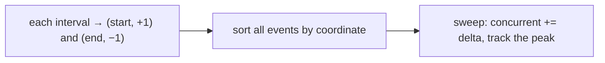

# Pattern: Maximum Overlap

## Why It Exists

Interval merging asked "which intervals join up?" This pattern asks a sharper question: "at the busiest moment, **how many** intervals are active at once?" That's *minimum meeting rooms* (peak simultaneous meetings), *peak server load*, *maximum staff needed* — all the same shape.

You could, for every interval, count how many others overlap it — `O(n²)`. But you don't care about pairs; you care about a *running total* as time advances. So stop thinking in intervals and start thinking in **events**: each interval contributes a `+1` when it starts and a `−1` when it ends. Sort those events by time, sweep left to right adding the deltas, and the running count *is* the number of intervals open right now. Its highest point is the answer.

## See It Work

Four meetings; how many rooms do you need at the peak? Turn each into a start/end event, sort, sweep. Run it.

```python run viz=array
intervals = [[1, 4], [2, 5], [7, 9], [3, 6]]
events = []
for start, end in intervals:
    events.append((start, +1))    # a meeting begins
    events.append((end, -1))      # a meeting ends
events.sort()                      # by time; at a tie an end (−1) sorts before a start (+1)
concurrent = best = 0
for _, delta in events:
    concurrent += delta            # how many meetings are active right now
    best = max(best, concurrent)
print(best)                        # 3
```

## How It Works

This is the **sweep line**: imagine a vertical line walking left to right across the timeline. Every interval is invisible except for two moments — where the line *enters* it (`+1`) and *leaves* it (`−1`). So:

1. Explode each `[start, end]` into events `(start, +1)` and `(end, −1)`.
2. **Sort** the events by coordinate.
3. **Sweep**: keep a running `concurrent` total; each event adds its delta. The line's height *is* the overlap count at that point; track its peak.



<p align="center"><strong>turn each interval into a <code>+1</code> start and a <code>−1</code> end, sort by position, then sweep: the running sum is how many intervals overlap right now, and its peak is the answer.</strong></p>

The whole thing is **`O(n log n)`** (the sort) plus an `O(n)` sweep, `O(n)` space for the events.

One subtlety decides correctness at the boundaries: **how ties sort.** If a meeting ends at `4` and another starts at `4`, do they overlap? For half-open intervals (a room freed at `4` is reusable at `4`), the **end must process before the start** — so the `−1` should sort before the `+1` at the same coordinate. The tuple sort `(coord, delta)` gives exactly that, since `−1 < +1`. Flip that and touching intervals would falsely count as overlapping.

### Key Takeaway

Replace intervals with `+1`/`−1` events, sort by time, and sweep a running count; its peak is the maximum overlap — and the end-before-start tie-break is what keeps touching intervals from double-counting.

## Trace It

Events for `[[1,4], [2,5], [7,9], [3,6]]`, sorted, swept:

| event | delta | concurrent | peak |
|---|---|---|---|
| `1` start | +1 | 1 | 1 |
| `2` start | +1 | 2 | 2 |
| `3` start | +1 | **3** | **3** |
| `4` end | −1 | 2 | 3 |
| `5` end | −1 | 1 | 3 |
| `6` end | −1 | 0 | 3 |
| `7` start | +1 | 1 | 3 |

Before you read on: the peak of `3` happened at time `3`. Which three meetings were simultaneously open then?

`[1,4]`, `[2,5]`, and `[3,6]` — all had started by `3` and none had ended. `[7,9]` hadn't begun. The sweep never *names* those three; it just counts that three `+1`s arrived before any `−1` — which is exactly "three rooms in use." That count-don't-enumerate move is the power of the sweep line.

## Your Turn

The reusable peak-overlap (a.k.a. minimum meeting rooms):

```python run viz=array
def max_overlap(intervals):
    events = []
    for start, end in intervals:
        events.append((start, +1))
        events.append((end, -1))
    events.sort()                  # ties: end (−1) before start (+1)
    concurrent = best = 0
    for _, delta in events:
        concurrent += delta
        best = max(best, concurrent)
    return best

print(max_overlap([[1, 4], [2, 5], [7, 9], [3, 6]]))   # 3
```

```java run viz=array
import java.util.*;

public class Main {
  static int maxOverlap(int[][] intervals) {
    List<int[]> events = new ArrayList<>();
    for (int[] iv : intervals) { events.add(new int[]{iv[0], +1}); events.add(new int[]{iv[1], -1}); }
    events.sort((a, b) -> a[0] != b[0] ? a[0] - b[0] : a[1] - b[1]);   // end (−1) before start (+1) at a tie
    int concurrent = 0, best = 0;
    for (int[] e : events) { concurrent += e[1]; best = Math.max(best, concurrent); }
    return best;
  }
  public static void main(String[] args) {
    System.out.println(maxOverlap(new int[][]{{1, 4}, {2, 5}, {7, 9}, {3, 6}}));   // 3
  }
}
```

Drill the family in **Practice** — [Minimum Meeting Rooms](/cortex/data-structures-and-algorithms/linear-structures-arrays-pattern-maximum-overlap-problems-minimum-meeting-rooms) and [Peak Resource Requirement](/cortex/data-structures-and-algorithms/linear-structures-arrays-pattern-maximum-overlap-problems-peak-resource-requirement).

## Reflect & Connect

The sweep line generalizes far past counting:

- **Peak concurrency** — meeting rooms, server connections, staffing, bandwidth: any "most-at-once" question over time ranges.
- **Same machinery, richer events** — the *skyline* problem, range-stabbing queries, and computational-geometry sweeps all process sorted events with a running structure (sometimes a heap or balanced tree instead of a counter).
- **Contrast with interval merging** — merging keeps the *last* interval and joins overlaps into bigger ones; max-overlap throws away identity and just *counts* how many stack up. Same sort-first instinct, different state.

This closes the array pattern family — scans, two-pointer variants, sliding windows, and now the interval/sweep techniques. Together they're the toolkit for nearly every linear-array problem.

**Prerequisites:** [Interval Merging](/cortex/data-structures-and-algorithms/linear-structures-arrays-pattern-interval-merging-pattern).

## Recall

> **Mnemonic:** *Intervals → `+1` start / `−1` end events, sort by time, sweep a running count. The peak is the max overlap; end sorts before start at a tie.*

| | |
|---|---|
| Event per interval | `(start, +1)` and `(end, −1)` |
| Sort | by coordinate; tie → `−1` before `+1` (half-open) |
| Sweep | `concurrent += delta`; track the max |
| Cost | `O(n log n)` (sort) + `O(n)` sweep, `O(n)` space |

<details>
<summary><strong>Q:</strong> How does max-overlap avoid the `O(n²)` all-pairs check?</summary>

**A:** It counts a running total over sorted `+1`/`−1` events in one `O(n)` sweep instead of comparing every pair.

</details>
<details>
<summary><strong>Q:</strong> What does the running `concurrent` count represent mid-sweep?</summary>

**A:** How many intervals are active at the sweep line's current position.

</details>
<details>
<summary><strong>Q:</strong> Why must an end sort before a start at the same coordinate?</summary>

**A:** For half-open intervals, a slot freed at `t` is reusable at `t` — processing the `−1` first stops touching intervals from double-counting.

</details>
<details>
<summary><strong>Q:</strong> Max-overlap vs interval-merging?</summary>

**A:** Merging joins overlaps into larger intervals (keeps the last); max-overlap discards identity and just counts how many stack up.

</details>

## Sources & Verify

- **cp-algorithms.com**, "Sweep line" — the event-sorting technique and its applications (overlap counting, skyline).
- **Sedgewick & Wayne**, *Algorithms*, 4th ed., §1.2 / interval search — the sweep-line approach to interval problems.
- "Minimum meeting rooms = maximum overlap" is the standard framing; both runnable blocks are verified by running (output `3`).
