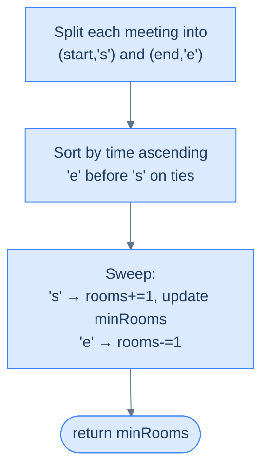

# Minimum Meeting Rooms

## The Problem

Given an array of **meetings** consisting of start and end times `[[s1, e1], [s2, e2], ...] (si < ei)` of meetings, find and return the **minimum number of meeting rooms** required so that all meetings can take place.

Two intervals `[s1, e1]` and `[s2, e2]` are considered overlapping if `e1 > s2`. If `e1 == s2`, the intervals are **not** considered overlapping.

---

## Examples

**Example 1**
```
Input:  meetings = [[1, 20], [10, 30], [30, 40], [1, 5]]
Output: 2
Explanation: We need at least two meeting rooms for all meetings. The
             first two rooms are used for the meetings [1, 5] and
             [1, 20]. When the first room is free, it will be used for
             the [10, 30] meeting, and when the second room is free, it
             will be used for the meeting between [30, 40].
```

**Example 2**
```
Input:  meetings = [[1, 10], [1, 10], [1, 10]]
Output: 3
Explanation: We need at least three meeting rooms so that all meetings
             can take place.
```

**Example 3**
```
Input:  meetings = [[1, 15], [15, 17], [17, 18]]
Output: 1
Explanation: One meeting room is enough for all the meetings to take
             place (the touching ends never compete for the room).
```

<details>
<summary><h2>Intuition</h2></summary>


The input is a flat list of meeting windows on one shared time axis — the only thing that determines how many rooms you need is how many of those windows are open at the same instant. The structural property is concurrency at a single point in time, not total volume or pairwise overlap counts.

Each meeting is a `+1` event at its start and a `−1` event at its end. Placing those tagged events on a timeline, the room demand at any instant is exactly the running sum of all events before it. Tagging the points and sweeping left to right turns the geometric question ("how many windows cover this instant?") into a counter question that updates in O(1) per event.

The naive approach of pairing every meeting with every other to detect conflicts costs O(N²) comparisons and *still* doesn't answer the right question — pairwise overlap counts the number of *conflicting pairs*, not the *peak depth* of concurrent meetings. Three meetings on top of each other contribute three pairs but only require three rooms. The sweep skips pair-counting entirely and reads the depth directly.

</details>
<details>
<summary><h2>What Does "Minimum Rooms" Mean?</h2></summary>


The minimum number of rooms is exactly the maximum number of meetings running at any single instant. Not "most meetings in a day" (that could be hundreds spread over time) — the **peak concurrency**. Think of rooms as a pool: a room is in use while its meeting runs and is returned the moment the meeting ends. The question is: during the busiest instant of the day, how deep does the pool have to be?

```d2
direction: right

day: "Day with 4 meetings" {
  grid-columns: 4
  grid-gap: 16
  a: "[1,5]" {style.fill: "#fde68a"; style.stroke: "#d97706"}
  b: "[2,6]" {style.fill: "#fde68a"; style.stroke: "#d97706"}
  c: "[3,7]" {style.fill: "#fde68a"; style.stroke: "#d97706"}
  d: "[9,10]"
}

peak: |md
  At t=3 through t=5, meetings A, B, C all active → 3 rooms

  D is alone later → reuses room, doesn't increase peak
|

ans: "minRooms = 3" {style.fill: "#fde68a"; style.stroke: "#d97706"}

day -> peak
peak -> ans
```

<p align="center"><strong>Only the <em>simultaneous</em> meetings matter. A room freed up can be handed to the next meeting — the peak concurrency is the bottleneck.</strong></p>

</details>
<details>
<summary><h2>Applying the Diagnostic Questions</h2></summary>


| Question | Answer |
|---|---|
| **Q1.** Can we rephrase the problem as "find the maximum overlap"? | **Yes** — minimum rooms = peak concurrency |
| **Q2.** Are touching meetings (e.g. `[1, 5]` and `[5, 10]`) treated as non-overlapping? | **Yes** — back-to-back meetings can share a room |
| **Q3.** Does a single meeting count, or must there be ≥ 2 for the answer to be non-zero? | **Counts** — a single meeting still needs a room |
| **Q4.** Which variant of the sweep applies? | **Plain `±1` counter** — no weights, no time ranges |

### Q1 — Why "maximum overlap"?

**Mental model:** imagine rooms as a stack of keys. You hand out a key each time a meeting starts and get one back each time a meeting ends. The tallest the handed-out pile ever grows is the number of keys you must have originally had.

**Concrete numbers:** for `[[1,20],[10,30],[30,40],[1,5]]` the pile grows to 1 at `t=1` (`[1,20]` takes a key), to 2 at the next `t=1` (`[1,5]` joins), drops to 1 at `t=5`, stays at 2 from `t=10` to `t=20`, drops to 1 at `t=20`, then 0 at `t=30`, then 1 at `t=30` for `[30,40]`, and back to 0 at `t=40`. Tallest value: 2 — the answer.

**What breaks otherwise:** if you answered with "total number of meetings" (4) you'd over-provision. If you answered with "number of overlapping pairs" you'd *under*-provision. The right quantity is concurrency at the busiest instant.

### Q2 — Why "touching is non-overlapping"?

**Mental model:** a room is released the *instant* the previous meeting ends. The next meeting's start-bell rings immediately after, in the same room.

**Concrete numbers:** for `[[1, 5], [5, 10]]`, at `x = 5` the first meeting just finished. If we process the end event first, `rooms` drops to 0, then the new start raises it back to 1 — peak is 1, answer is 1 room.

**What breaks otherwise:** processing the start event first would temporarily push `rooms` to 2 at `x = 5`, demanding a second room for a microsecond gap that doesn't actually exist. You'd systematically over-provision every back-to-back schedule — silently wasteful. The `'e' < 's'` tie-breaker is the whole reason touching meetings work correctly.

### Q3 — Why "single meeting counts"?

**Mental model:** a single meeting is still an active reservation — you need *some* room for it.

**Concrete numbers:** for `[[9, 10]]` the sweep sees `rooms = 1` at `x = 9` and 0 at `x = 10`. `minRooms = 1`. We return 1.

**What breaks otherwise:** if we applied the generic "maxOverlap < 2 → 0" collapse from the previous section, we'd tell the manager "you need 0 rooms for 1 meeting" — absurd. That collapse rule applies only to problems asking "are two or more things *overlapping*?" (a strict-mathematical overlap), not "are any things *active*?". Minimum Meeting Rooms wants the latter.

### Q4 — Why "plain `±1` counter"?

**Mental model:** every meeting is identical in resource footprint — one room, no more, no less. All opens add 1; all closes subtract 1.

**Concrete numbers:** no weights anywhere. `rooms` only moves by ±1.

**What breaks otherwise:** if some meetings required *two* rooms (say a split boardroom), you'd need the weighted variant we'll see in Peak Resource Requirement. Here, every increment is uniform — so the plain counter suffices.

</details>
<details>
<summary><h2>The Sweep Strategy (Visualised)</h2></summary>




<p align="center"><strong>Four steps — split, sort, sweep, return. Textbook maximum-overlap application.</strong></p>

</details>
<details>
<summary><h2>Approach</h2></summary>


1. Build `times = []`. For each meeting `[s, e]`, append `(s, 's')` and `(e, 'e')`.
2. Sort `times` ascending by coordinate, and `'e'` before `'s'` on ties so back-to-back meetings share a room.
3. Initialise `rooms = 0` and `minRooms = 0`.
4. Walk `times` in order. On `'s'`: `rooms += 1`, then `minRooms = max(minRooms, rooms)`. On `'e'`: `rooms -= 1`.
5. Return `minRooms` directly — a single meeting still needs one room, so no `< 2` collapse.

</details>
<details>
<summary><h2>Solution &amp; Analysis</h2></summary>

### The Solution

```python run viz=array viz-root=meetings
from typing import List

# Define a class to store the time and type ('s' or 'e')
class TimePoint:
    def __init__(self, time: int, type_: str):
        self.time = time
        self.type = type_

    def __lt__(self, other):

        # Sort the times array, end times come before start times
        # as 'e' < 's'
        if self.time == other.time:
            return self.type < other.type
        return self.time < other.time

class Solution:
    def minimum_meeting_rooms(self, meetings: List[List[int]]) -> int:

        # Create a dynamic array to store start and end times
        times: List[TimePoint] = []

        for interval in meetings:

            # Add start and end times to the times array
            times.append(TimePoint(interval[0], "s"))
            times.append(TimePoint(interval[1], "e"))

        # Sort the times array using the custom compare function
        times.sort()

        # Initialize 'rooms' and 'minRooms' to 0
        rooms = 0
        min_rooms = 0

        for point in times:

            # Increment rooms if we encounter a start point
            if point.type == "s":
                rooms += 1
                min_rooms = max(min_rooms, rooms)

            # Decrement rooms if we encounter an end point
            else:
                rooms -= 1

        # For an overlap we need at least 2 intervals
        return min_rooms


# Examples from the problem statement
print(Solution().minimum_meeting_rooms([[1, 20], [10, 30], [30, 40], [1, 5]]))   # 2
print(Solution().minimum_meeting_rooms([[1, 10], [1, 10], [1, 10]]))             # 3
print(Solution().minimum_meeting_rooms([[1, 15], [15, 17], [17, 18]]))           # 1

# Edge cases
print(Solution().minimum_meeting_rooms([[1, 2]]))                                 # 1  — single meeting
print(Solution().minimum_meeting_rooms([[1, 5], [6, 10]]))                        # 1  — sequential meetings
print(Solution().minimum_meeting_rooms([[1, 5], [2, 6], [3, 7]]))                # 3  — all overlapping
print(Solution().minimum_meeting_rooms([[1, 3], [3, 5], [5, 7]]))                # 1  — touching endpoints
print(Solution().minimum_meeting_rooms([[1, 4], [2, 3], [5, 6]]))                # 2  — partial overlap
```

```java run viz=array viz-root=meetings
import java.util.*;

public class Main {
    // Define a class to store the time and type ('s' or 'e')
    static class TimePoint {

        int time;
        char type;

        TimePoint(int time, char type) {
            this.time = time;
            this.type = type;
        }
    }

    // Comparator for TimePoint
    static class Compare implements Comparator<TimePoint> {
        public int compare(TimePoint a, TimePoint b) {

            // Sort the times array, end times come before start times
            // as 'e' < 's'
            if (a.time == b.time) {
                return Character.compare(a.type, b.type);
            }

            return Integer.compare(a.time, b.time);
        }
    }

    static class Solution {
        public int minimumMeetingRooms(int[][] meetings) {

            // Create a dynamic array to store start and end times
            List<TimePoint> times = new ArrayList<>();

            for (int[] interval : meetings) {

                // Add start and end times to the times array
                times.add(new TimePoint(interval[0], 's'));
                times.add(new TimePoint(interval[1], 'e'));
            }

            // Sort the times array using the custom compare function
            times.sort(new Compare());

            // Initialize 'rooms' and 'minRooms' to 0
            int rooms = 0, minRooms = 0;

            for (TimePoint point : times) {

                // Increment rooms if we encounter a start point
                if (point.type == 's') {
                    rooms++;
                    minRooms = Math.max(rooms, minRooms);
                }

                // Decrement rooms if we encounter an end point
                else {
                    rooms--;
                }
            }

            // For an overlap we need at least 2 intervals
            return minRooms;
        }
    }

    public static void main(String[] args) {
        // Examples from the problem statement
        System.out.println(new Solution().minimumMeetingRooms(new int[][]{{1, 20}, {10, 30}, {30, 40}, {1, 5}}));   // 2
        System.out.println(new Solution().minimumMeetingRooms(new int[][]{{1, 10}, {1, 10}, {1, 10}}));             // 3
        System.out.println(new Solution().minimumMeetingRooms(new int[][]{{1, 15}, {15, 17}, {17, 18}}));           // 1

        // Edge cases
        System.out.println(new Solution().minimumMeetingRooms(new int[][]{{1, 2}}));                                 // 1  — single meeting
        System.out.println(new Solution().minimumMeetingRooms(new int[][]{{1, 5}, {6, 10}}));                        // 1  — sequential meetings
        System.out.println(new Solution().minimumMeetingRooms(new int[][]{{1, 5}, {2, 6}, {3, 7}}));                // 3  — all overlapping
        System.out.println(new Solution().minimumMeetingRooms(new int[][]{{1, 3}, {3, 5}, {5, 7}}));                // 1  — touching endpoints
        System.out.println(new Solution().minimumMeetingRooms(new int[][]{{1, 4}, {2, 3}, {5, 6}}));                // 2  — partial overlap
    }
}
```


<details>
<summary><strong>Trace — meetings = [[1, 20], [10, 30], [30, 40], [1, 5]]</strong></summary>

```
Tagged + sorted (end before start on ties):
[(1,'s'), (1,'s'), (5,'e'), (10,'s'), (20,'e'), (30,'e'), (30,'s'), (40,'e')]

Step 1 │ (1,'s')  │ rooms 0 → 1 │ minRooms = 1
Step 2 │ (1,'s')  │ rooms 1 → 2 │ minRooms = 2 ★
Step 3 │ (5,'e')  │ rooms 2 → 1 │ minRooms = 2
Step 4 │ (10,'s') │ rooms 1 → 2 │ minRooms = 2
Step 5 │ (20,'e') │ rooms 2 → 1 │ minRooms = 2
Step 6 │ (30,'e') │ rooms 1 → 0 │ minRooms = 2  ← end first on tie
Step 7 │ (30,'s') │ rooms 0 → 1 │ minRooms = 2  ← reuses freed room
Step 8 │ (40,'e') │ rooms 1 → 0 │ minRooms = 2

Result: 2 ✓   Peak was reached at t=1 (two simultaneous opens).
```

</details>
<details>
<summary><strong>Trace — meetings = [[1, 15], [15, 17], [17, 18]] (touching case)</strong></summary>

```
Tagged + sorted: [(1,'s'), (15,'e'), (15,'s'), (17,'e'), (17,'s'), (18,'e')]
                          ^^^^^^^^^^^^^^^^^^^  end BEFORE start at t=15
                                              ^^^^^^^^^^^^^^^^^^^  also at t=17

Step 1 │ (1,'s')  │ rooms 0 → 1 │ minRooms = 1
Step 2 │ (15,'e') │ rooms 1 → 0 │ minRooms = 1   ← first meeting freed its room
Step 3 │ (15,'s') │ rooms 0 → 1 │ minRooms = 1   ← second meeting takes the same room
Step 4 │ (17,'e') │ rooms 1 → 0 │ minRooms = 1
Step 5 │ (17,'s') │ rooms 0 → 1 │ minRooms = 1
Step 6 │ (18,'e') │ rooms 1 → 0 │ minRooms = 1

Result: 1 ✓   Back-to-back meetings share a single room — exactly what we want.
```

</details>

### Complexity Analysis

| | Complexity | Reasoning |
|---|---|---|
| **Time** | O(N log N) | Sorting 2N tagged points dominates; sweep is O(N) |
| **Space** | O(N) | The `times` array has 2N entries |

### Edge Cases

| Case | Example | Expected | Reasoning |
|---|---|---|---|
| Empty schedule | `[]` | 0 | No meetings, no rooms |
| Single meeting | `[[9, 10]]` | 1 | Even one meeting needs a room — we DON'T collapse 1 → 0 here |
| Back-to-back | `[[1, 5], [5, 10]]` | 1 | `'e'` processed before `'s'` at time 5 → same room reused |
| All identical | `[[1, 5], [1, 5], [1, 5]]` | 3 | Three meetings run at the same time → three rooms |
| Fully contained | `[[1, 100], [2, 3]]` | 2 | Small meeting overlaps the big one → two rooms |
| Sparse and large | `[[1, 2], [1000000, 1000001]]` | 1 | Huge gap doesn't matter — coordinates are just keys |

</details>
<details>
<summary><h2>Key Takeaway</h2></summary>


Minimum Meeting Rooms is the canonical maximum-overlap problem: split, sort with `'e'` before `'s'` on ties, sweep with a `±1` counter, and return the peak — no `< 2` collapse, because a single meeting still needs one room.

> **Transfer Challenge:** Change the problem. Instead of "minimum rooms", return a **list of original meeting indices** assigned to each room, under the constraint that we use exactly `minRooms` rooms. How would you modify the sweep to track room assignments?
>
> <details><summary><strong>Solution hint</strong></summary>
>
> Keep a min-heap of `(end_time, room_id)` pairs indexed by room. When a meeting starts, pop the earliest-ending room if its end is ≤ start (reuse); otherwise create a new room. Record the assignment. Complexity stays O(N log N) — now dominated by the heap instead of the sort.
>
> </details>

</details>
