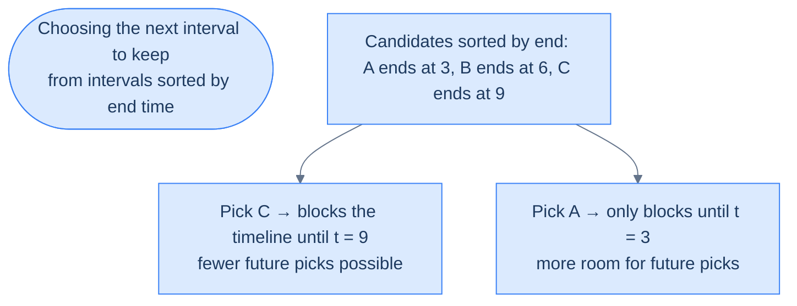
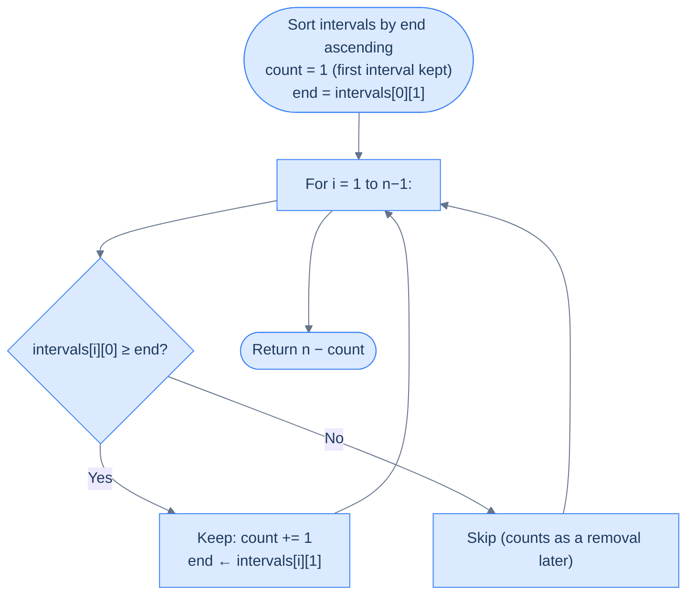

# Remove Intervals

## The Problem

Given an array of `intervals` where `intervals[i] = [si, ei]`, find and return the **minimum number of intervals you need to remove** so that the rest of the intervals are non-overlapping.

Two intervals `[s1, e1]` and `[s2, e2]` are considered overlapping if `e1 > s2`. If `e1 == s2`, the intervals are **not** considered overlapping.

```
intervals = [[1, 2], [2, 3], [3, 4], [1, 3]]   →  1
intervals = [[1, 5], [1, 5], [1, 5]]            →  2
intervals = [[1, 5], [5, 7], [7, 8]]            →  0
```

---

## Examples

**Example 1**
```
Input:  intervals = [[1, 2], [2, 3], [3, 4], [1, 3]]
Output: 1
Explanation: The interval [1, 3] can be removed, and the rest of the
             intervals do not overlap.
```

**Example 2**
```
Input:  intervals = [[1, 5], [1, 5], [1, 5]]
Output: 2
Explanation: We need to remove two [1, 5] intervals to make the rest of
             the intervals non-overlapping.
```

**Example 3**
```
Input:  intervals = [[1, 5], [5, 7], [7, 8]]
Output: 0
Explanation: We don't need to remove any of the intervals since they are
             already non-overlapping (touching counts as non-overlapping).
```

```quiz
{
  "prompt": "Now your turn!",
  "input": "intervals = [[1, 4], [1, 2], [2, 3], [3, 4]]",
  "options": ["0", "1", "2", "3"],
  "answer": "1"
}
```

## Constraints

- `0 ≤ intervals.length ≤ 10^4`
- `intervals[i] = [start, end]` with `0 ≤ start < end ≤ 10^9`
- Touching intervals (`e1 == s2`) do not count as overlapping

```python run viz=grid viz-root=intervals
import ast
from typing import List

class Solution:
    def remove_intervals(self, intervals: List[List[int]]) -> int:
        # Your code goes here — sort by end time, greedily keep every
        # interval whose start is at or after the last kept end, and
        # return total minus kept.
        return 0


intervals = ast.literal_eval(input())    # the test case's intervals
print(Solution().remove_intervals(intervals))
```

```java run viz=grid viz-root=intervals
import java.util.*;

public class Main {
    static class Solution {
        public int removeIntervals(int[][] intervals) {
            // Your code goes here — sort by end time, greedily keep every
            // interval whose start is at or after the last kept end, and
            // return total minus kept.
            return 0;
        }
    }

    public static void main(String[] args) {
        int[][] intervals = parseIntMatrix(new Scanner(System.in).nextLine());
        System.out.println(new Solution().removeIntervals(intervals));
    }

    // "[[1, 4], [2, 5]]" → {{1, 4}, {2, 5}} — reads the test case's intervals
    static int[][] parseIntMatrix(String line) {
        String inner = line.trim().replaceAll("^\\[|\\]$", "").trim();
        if (inner.isEmpty()) return new int[0][];
        String[] rows = inner.split("\\]\\s*,\\s*\\[");
        int[][] out = new int[rows.length][];
        for (int i = 0; i < rows.length; i++) {
            String r = rows[i].replaceAll("[\\[\\]\\s]", "");
            if (r.isEmpty()) { out[i] = new int[0]; continue; }
            String[] parts = r.split(",");
            int[] pair = new int[parts.length];
            for (int j = 0; j < parts.length; j++) pair[j] = Integer.parseInt(parts[j]);
            out[i] = pair;
        }
        return out;
    }
}
```

```testcases
{
  "args": [
    { "id": "intervals", "label": "intervals", "type": "int[][]", "placeholder": "[[1, 2], [2, 3], [3, 4], [1, 3]]" }
  ],
  "cases": [
    { "args": { "intervals": "[[1, 2], [2, 3], [3, 4], [1, 3]]" }, "expected": "1" },
    { "args": { "intervals": "[[1, 5], [1, 5], [1, 5]]" }, "expected": "2" },
    { "args": { "intervals": "[[1, 5], [5, 7], [7, 8]]" }, "expected": "0" },
    { "args": { "intervals": "[[1, 4], [1, 2], [2, 3], [3, 4]]" }, "expected": "1" },
    { "args": { "intervals": "[[1, 20], [2, 3], [4, 5]]" }, "expected": "1" },
    { "args": { "intervals": "[]" }, "expected": "0" }
  ]
}
```

<details>
<summary><h2>Intuition</h2></summary>


The input is a flat list of intervals on a single time axis, and every conflict between them is a pair of windows whose overlap is non-empty. The structural property is not concurrency depth — it is whether a chosen subset of intervals is pairwise disjoint. Minimising removals is the same as maximising the kept subset.

Sorting by end time ascending places each interval in the order it frees the timeline. Walking that order and keeping any interval whose start is at or after the running `end` is a one-pass greedy: each kept interval extends the kept set's right edge by the smallest amount possible, leaving the most room for future picks. The state is a single coordinate (`end`) and a single counter (`count`).

The naive approach — peak-concurrency framing — answers a different question. Peak overlap tells you the minimum number of *parallel rooms* needed; it does not tell you the minimum number of intervals to drop. Three intervals all pairwise overlapping have peak concurrency `3` but you only need to drop `2` of them to make the rest non-overlapping. The greedy-by-end framing reads off the answer directly without ever computing concurrency.

</details>
<details>
<summary><h2>What Does "Minimum Removals for Non-Overlap" Mean?</h2></summary>


Imagine you have a stack of meeting requests that **all want the same single room**. Some clash with others; some don't. You want to **honour as many as possible**, which is the same as **cancelling as few as possible**. The answer is: total intervals minus the largest subset of mutually non-overlapping ones.

```d2
direction: right

before: "Before: 4 intervals, [1,3] clashes" {
  grid-columns: 4
  grid-gap: 16
  b1: "[1,2]" {style.fill: "#dcfce7"; style.stroke: "#16a34a"}
  b2: "[2,3]" {style.fill: "#dcfce7"; style.stroke: "#16a34a"}
  b3: "[3,4]" {style.fill: "#dcfce7"; style.stroke: "#16a34a"}
  b4: "[1,3]" {style.fill: "#fecaca"; style.stroke: "#dc2626"}
}

cap: |md
  Remove **1** interval (`[1,3]`)
  to leave the rest non-overlapping
|

after: "After: 3 non-overlapping intervals kept" {
  grid-columns: 3
  grid-gap: 16
  a1: "[1,2]" {style.fill: "#dcfce7"; style.stroke: "#16a34a"}
  a2: "[2,3]" {style.fill: "#dcfce7"; style.stroke: "#16a34a"}
  a3: "[3,4]" {style.fill: "#dcfce7"; style.stroke: "#16a34a"}
}

before -> cap
cap -> after
```

<p align="center"><strong>Removing the fewest intervals so the survivors are pairwise non-overlapping is equivalent to keeping the largest non-overlapping subset. The answer is <code>n − count(largest subset)</code>.</strong></p>

</details>
<details>
<summary><h2>The Greedy Insight — Always Keep the Interval That Ends Earliest</h2></summary>


Among intervals that compete for a slot, the one that **ends earliest** leaves the most room afterwards for future picks. Anything that ends later would block more of the future timeline for no extra benefit.



<p align="center"><strong>Sorting by end time turns the problem into a one-pass greedy: always extend the kept set with the next interval whose start is at or after the last kept end.</strong></p>

This is a classic **exchange argument**: in any optimal subset, you can swap its "first by end" for the globally earliest-ending interval without losing any compatibility — the swap can only *help* future picks. By induction, the earliest-ending choice at every step is optimal.

</details>
<details>
<summary><h2>Applying the Diagnostic Questions</h2></summary>


| Question | Answer |
|---|---|
| **Q1.** Is this still a maximum-overlap problem? | **Indirectly** — the overlap is the cause of the conflict, but the answer is computed by a different framing |
| **Q2.** Do we need to identify *which* intervals to remove, or just count? | **Just count** — and `n − count(kept)` is the answer |
| **Q3.** What ordering makes the greedy work? | **Sort by end time ascending** |
| **Q4.** What state do we keep during the sweep? | The **end time of the last kept interval** and a **running count** of kept intervals |

### Q1 — Why "indirectly" maximum overlap?

**Mental model:** the overlap creates the conflict, but the greedy doesn't *count* overlap. It walks intervals in end-time order and accepts each one whose start is past the last kept end.

**Concrete numbers:** for `[[1,2],[2,3],[3,4],[1,3]]`, all four overlap pairwise via the `[1,3]` joiner. But the greedy keeps three (`[1,2], [2,3], [3,4]`) and drops just one.

**What breaks otherwise:** trying to "count peak overlap" gives you the *minimum number of rooms*, not the minimum number of removals. They are different problems with different answers.

### Q2 — Why "just count"?

**Mental model:** the problem asks for a single integer — the number of intervals to remove. Identities don't matter for the return value.

**Concrete numbers:** the answer for example 1 is `1`. We compute it as `n − count = 4 − 3 = 1`. We never write down which interval to remove.

**What breaks otherwise:** nothing — but tracking identities adds complexity for no benefit. Counts are cheap and exact.

### Q3 — Why "sort by end time ascending"?

**Mental model:** sorting by start works for many interval problems, but here it ties together two unrelated questions: "which starts first?" vs "which is compatible with future picks?". Sorting by end answers the second directly.

**Concrete numbers:** consider `[[1,100], [2,3], [4,5]]`. Sorted by start, you'd be tempted to keep `[1,100]` first and then nothing else fits. Sorted by end → `[2,3], [4,5], [1,100]`; greedy keeps `[2,3]` and `[4,5]`, drops `[1,100]`. Answer 1 vs answer 2.

**What breaks otherwise:** sorting by start can force a single "long" interval to dominate the kept set, throwing away many short compatible ones.

### Q4 — Why "track only the last kept end"?

**Mental model:** since intervals are sorted by end time ascending, every previously-kept interval has end ≤ current candidate's end. The only constraint on the next candidate is "start ≥ end of the last kept one".

**Concrete numbers:** after keeping `[1,2]`, the next candidate `[2,3]` has `start=2 ≥ 2` → keep it; the running `end` updates to 3. Next `[1,3]` has `start=1 < 3` → skip (it's a removal). Next `[3,4]` has `start=3 ≥ 3` → keep, `end` becomes 4.

**What breaks otherwise:** tracking all kept ends is wasteful — only the latest one matters because it dominates all earlier kept ends.

</details>
<details>
<summary><h2>The Greedy Sweep (Visualised)</h2></summary>




<p align="center"><strong>Sort by end ascending; greedily keep every interval whose start is at or after the last kept end; the answer is total minus kept.</strong></p>

</details>
<details>
<summary><h2>Approach</h2></summary>


1. If `intervals` is empty, return `0`.
2. Sort `intervals` ascending by end coordinate.
3. Initialise `count = 1` and `end = intervals[0][1]` — the first interval is always kept.
4. For each subsequent interval `i = 1 … n − 1`: if `intervals[i][0] ≥ end`, keep it — increment `count` and update `end = intervals[i][1]`; otherwise skip it.
5. Return `n − count` — the number of intervals that had to be removed.

</details>
<details>
<summary><h2>Solution &amp; Analysis</h2></summary>

### The Solution

The greedy is one short pass after a sort: keep the first interval (by end time), then walk the rest accepting any whose start is at or after the last kept end. The answer is `n − count(kept)`.


```python solution time=O(N log N) space=O(1)
import ast
from typing import List

class Solution:
    def remove_intervals(self, intervals: List[List[int]]) -> int:

        # if intervals list is empty return 0
        if not intervals:
            return 0

        # sort the intervals in ascending order of their end times
        intervals.sort(key=lambda x: x[1])
        n = len(intervals)

        # keep track of the non-overlapping intervals, start with 1
        count = 1

        # end time of the first interval
        end = intervals[0][1]

        for i in range(1, n):

            # if current interval's start time is greater or equal to the
            # end time of previous interval means it does not overlap
            # with previous interval so we increase the count and update
            # the end time to current interval's end time
            if intervals[i][0] >= end:
                count += 1
                end = intervals[i][1]

        # return the number of intervals to be removed, i.e.,
        # difference between total intervals and non-overlapping
        # intervals
        return n - count


intervals = ast.literal_eval(input())    # the test case's intervals
print(Solution().remove_intervals(intervals))
```

```java solution
import java.util.*;

public class Main {
    static class Solution {
        public int removeIntervals(int[][] intervals) {

            // if intervals list is empty return 0
            if (intervals.length == 0) {
                return 0;
            }

            // sort the intervals in ascending order of their end times
            Arrays.sort(intervals, (a, b) -> a[1] - b[1]);

            int n = intervals.length;

            // keep track of the non-overlapping intervals, start with 1
            int count = 1;

            // end time of the first interval
            int end = intervals[0][1];

            for (int i = 1; i < n; i++) {

                // if current interval's start time is greater or equal to
                // the end time of previous interval means it does not
                // overlap with previous interval so we increase the count
                // and update the end time to current interval's end time
                if (intervals[i][0] >= end) {
                    count++;
                    end = intervals[i][1];
                }
            }

            // return the number of intervals to be removed, i.e.,
            // difference between total intervals and non-overlapping
            // intervals
            return n - count;
        }
    }

    public static void main(String[] args) {
        int[][] intervals = parseIntMatrix(new Scanner(System.in).nextLine());
        System.out.println(new Solution().removeIntervals(intervals));
    }

    // "[[1, 4], [2, 5]]" → {{1, 4}, {2, 5}} — reads the test case's intervals
    static int[][] parseIntMatrix(String line) {
        String inner = line.trim().replaceAll("^\\[|\\]$", "").trim();
        if (inner.isEmpty()) return new int[0][];
        String[] rows = inner.split("\\]\\s*,\\s*\\[");
        int[][] out = new int[rows.length][];
        for (int i = 0; i < rows.length; i++) {
            String r = rows[i].replaceAll("[\\[\\]\\s]", "");
            if (r.isEmpty()) { out[i] = new int[0]; continue; }
            String[] parts = r.split(",");
            int[] pair = new int[parts.length];
            for (int j = 0; j < parts.length; j++) pair[j] = Integer.parseInt(parts[j]);
            out[i] = pair;
        }
        return out;
    }
}
```


<details>
<summary><strong>Trace — intervals = [[1, 2], [2, 3], [3, 4], [1, 3]]</strong></summary>

```
Sorted by end:   [[1,2], [2,3], [1,3], [3,4]]
count = 1   end = 2   (first interval kept)

Step │ i=1 iv=[2,3] │ start 2 ≥ end 2 → keep │ count=2 end=3
Step │ i=2 iv=[1,3] │ start 1 <  end 3 → skip │ count=2 end=3
Step │ i=3 iv=[3,4] │ start 3 ≥ end 3 → keep │ count=3 end=4

Kept 3 of 4 → answer = 4 − 3 = 1 ✓

The skipped [1,3] is the one to remove.
```

</details>
<details>
<summary><strong>Trace — intervals = [[1, 5], [1, 5], [1, 5]]</strong></summary>

```
Sorted by end:   [[1,5], [1,5], [1,5]]
count = 1   end = 5

Step │ i=1 iv=[1,5] │ start 1 < end 5 → skip │ count=1 end=5
Step │ i=2 iv=[1,5] │ start 1 < end 5 → skip │ count=1 end=5

Kept 1 of 3 → answer = 3 − 1 = 2 ✓
```

</details>

### Complexity Analysis

| | Complexity | Reasoning |
|---|---|---|
| **Time** | O(N log N) | Sort by end is O(N log N); the greedy sweep is O(N) |
| **Space** | O(1) | Aside from input + sort scratch, only `count` and `end` are kept |

### Edge Cases

| Case | Example | Expected | Reasoning |
|---|---|---|---|
| Empty input | `[]` | 0 | Nothing to remove |
| Singleton | `[[1, 5]]` | 0 | One interval is trivially non-overlapping |
| All identical | `[[1, 5], [1, 5], [1, 5]]` | 2 | Only one can survive |
| Touching only | `[[1, 5], [5, 7], [7, 8]]` | 0 | `e1 == s2` is not an overlap |
| Nested cover | `[[1, 20], [2, 3], [4, 5]]` | 1 | Keep `[2,3]` and `[4,5]`; drop `[1,20]` |
| All disjoint | `[[1, 2], [3, 4], [5, 6]]` | 0 | Already non-overlapping |
| Chained clashes | `[[1, 2], [2, 3], [3, 4], [1, 3]]` | 1 | `[1,3]` is the lone troublemaker |

</details>
<details>
<summary><h2>Key Takeaway</h2></summary>


Remove Intervals is classic activity selection — sort by end ascending, greedily keep any interval whose start is at or after the last kept end, and return `n − count(kept)`. The peak-overlap framing creates the conflict but does not compute the answer.

> **Transfer Challenge:** Modify the function to return the **list of original indices** of the removed intervals, not just the count. Order doesn't matter.
>
> <details><summary><strong>Solution hint</strong></summary>
>
> Pair each interval with its original index before sorting. After the sweep, the removed indices are exactly the ones the greedy *skipped*. Track the kept indices in a set; return the complement.
>
> </details>

</details>
