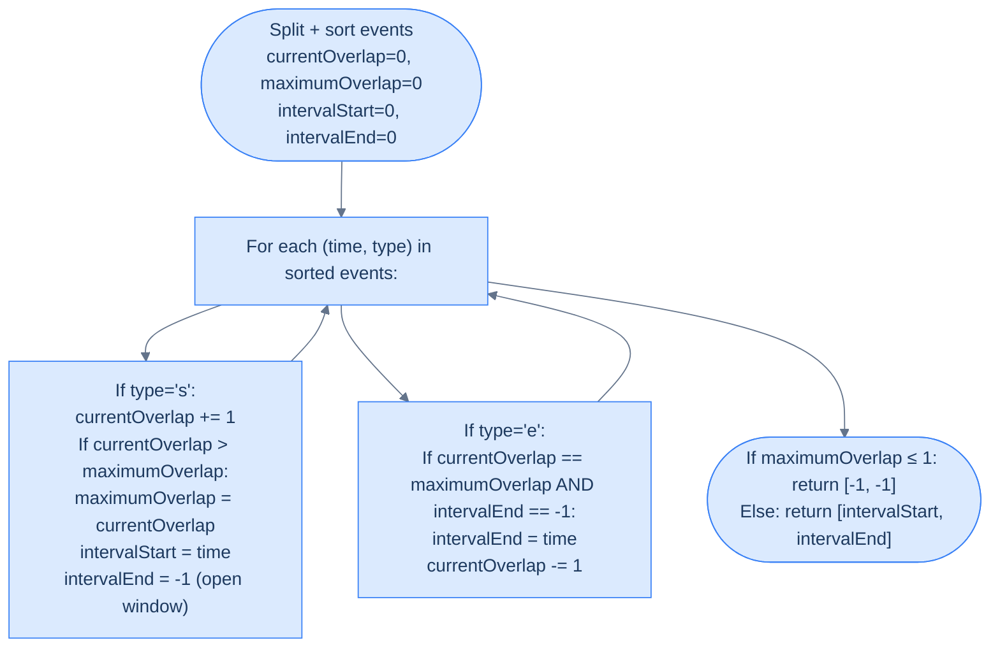

# Busiest Interval

## The Problem

Given an array of **meetings** consisting of start and end times `[[s1, e1], [s2, e2], ...] (si < ei)` of meetings, find and return the **busiest interval** — the time interval during which the maximum number of meetings overlap.

Two intervals `[s1, e1]` and `[s2, e2]` are considered overlapping if `e1 > s2`. If `e1 == s2`, the intervals are **not** considered overlapping.

> You must abide by the following constraints:
>
> - If multiple intervals tie for the maximum overlap, return the **first** such interval.
> - The output should be in the form `[intervalStart, intervalEnd]`.
> - If there are no overlapping intervals, return `[-1, -1]`.

---

## Examples

**Example 1**
```
Input:  meetings = [[1, 3], [2, 4], [5, 6]]
Output: [2, 3]
Explanation: The interval [2, 3] is the busiest because it is the period
             during which the highest number of meetings (2) overlap.
```

**Example 2**
```
Input:  meetings = [[1, 8], [4, 5], [6, 7], [7, 8]]
Output: [4, 5]
Explanation: The intervals [4, 5], [6, 7], and [7, 8] all have the
             maximum number of overlapping meetings. Since [4, 5]
             occurs first, it is returned as the busiest interval.
```

**Example 3**
```
Input:  meetings = [[1, 5], [5, 10], [10, 15]]
Output: [-1, -1]
Explanation: Meetings only touch at endpoints so there are no
             overlapping meetings.
```

<details>
<summary><h2>Intuition</h2></summary>


The input is a flat list of meetings sharing one time axis — the question is not how *high* concurrency reaches but *where* on the axis it first reaches its maximum. The structural property is the running concurrency counter plus the two coordinates that bound the first peak window.

The same `±1` counter from Minimum Meeting Rooms drives the answer, but with two extra pieces of state riding alongside it: `intervalStart` is set to the event coordinate whenever the counter *strictly exceeds* the running max (a new peak begins), and `intervalEnd` is set to the first `'e'` coordinate that fires while the counter still equals the max (the peak ends). Strict `>` on the start update is what enforces "first window wins" on ties.

Pairwise intersection — "find the time range common to all overlapping meetings" — is O(N²) and combinatorially awkward: with `K` simultaneously active meetings you'd intersect `K` intervals to find the surviving window. The sweep finds the same window in O(N log N) by reading the counter and remembering the first coordinate at which it climbed to peak. The naive approach would also struggle to enforce the "first window wins" tiebreaker without a second pass.

</details>
<details>
<summary><h2>What Does "Busiest Interval" Mean?</h2></summary>


Not a single *instant* — a continuous **time range** during which concurrency stays at its peak. Between events, concurrency is constant (nothing changes until the next start or end). So the busiest interval is always bounded by **two consecutive event coordinates**: it begins at the moment concurrency hits its peak and ends at the next event that changes the count.

```d2
direction: right

timeline: "Three intervals" {
  grid-columns: 3
  grid-gap: 16
  a1: "[1,4]"
  a2: "[2,6]"
  a3: "[3,5]"
}

events: "Event timeline + live count between events" {
  grid-columns: 6
  grid-gap: 0
  e1: |md
    `t=1 s`

    count=1
  | {style.fill: "#dcfce7"; style.stroke: "#16a34a"}
  e2: |md
    `t=2 s`

    count=2
  | {style.fill: "#dcfce7"; style.stroke: "#16a34a"}
  e3: |md
    `t=3 s`

    count=3 ★
  | {style.fill: "#fde68a"; style.stroke: "#d97706"}
  e4: |md
    `t=4 e`

    count=2
  |
  e5: |md
    `t=5 e`

    count=1
  |
  e6: |md
    `t=6 e`

    count=0
  |
}

busiest: |md
  Between `t=3` and `t=4`, count = 3 (peak) → busiest = `[3, 4]`
| {style.fill: "#fde68a"; style.stroke: "#d97706"}

timeline -> events
events -> busiest
```

<p align="center"><strong>Count stays constant between consecutive events. The busiest interval spans the first event that pushes the counter to its peak and the very next event.</strong></p>

</details>
<details>
<summary><h2>Applying the Diagnostic Questions</h2></summary>


| Question | Answer |
|---|---|
| **Q1.** Is this a maximum-overlap problem? | **Yes** — we track the same counter, just output more |
| **Q2.** Do we need the peak *value* or the peak *location*? | **Location (a time range)** — the value is a byproduct |
| **Q3.** What do we track at each event? | **Count before + count after + coordinate** to detect when a new peak begins |
| **Q4.** What tie-breaking rule for "earliest window"? | **First time the counter reaches the max** — never update the window if the count ties the existing max |

### Q1 — Why "maximum overlap"?

**Mental model:** the counter is the same. The only change is *what we record* when it reaches a new high.

**Concrete numbers:** for `[[1,3],[2,4],[5,6]]`, the counter sequence over the sorted events `[(1,'s'),(2,'s'),(3,'e'),(4,'e'),(5,'s'),(6,'e')]` is `1, 2, 1, 0, 1, 0`. The peak `2` happens between `t = 2` and the next end event at `t = 3`. That's our window.

**What breaks otherwise:** if you skip the overlap framing and try a pairwise intersection hunt ("find the interval common to all"), you'd write O(N²) code with a complicated intersection formula — and still get the same answer.

### Q2 — Why "location, not just the value"?

**Mental model:** the question is "when is it busiest?", not "how busy is the busiest moment?". The peak value drops out of the algorithm for free; the range is the main output.

**Concrete numbers:** the peak is `2` (value), attained during `[2, 3]` (range). The caller wants `[2, 3]`. Returning `2` alone would miss half the answer.

**What breaks otherwise:** a value-only algorithm would return `2` for both `[[1,3],[2,4],[5,6]]` and `[[10,11],[10,12]]`. The two problems have the same peak but different busiest ranges — you'd be throwing away the information that distinguishes them.

### Q3 — Why "coordinate + count"?

**Mental model:** imagine a cursor pointing at the current event. When the counter goes *up* and beats the current max, the cursor's coordinate is the left edge of a new candidate window. The first event after that which keeps the counter at the same max marks the right edge.

**Concrete numbers:** at `t = 2`, the counter reaches `2` — a new max. We set `start = 2`, `end = −1` (window open). At `t = 3` an end event fires while `count == max == 2`, so we set `end = 3`. Window: `[2, 3]`.

**What breaks otherwise:** tracking only the max value loses the coordinate of where it happened. You'd have no way to build the window.

### Q4 — Why "first to reach max wins"?

**Mental model:** we update `intervalStart` *strictly* when the count exceeds the stored max — not when it ties. Ties preserve the earlier window. And once `intervalEnd` is set (no longer `−1`), later end events don't overwrite it.

**Concrete numbers:** for `[[1,8],[4,5],[6,7],[7,8]]`, the events are `(1,'s'),(4,'s'),(5,'e'),(6,'s'),(7,'e'),(7,'s'),(8,'e'),(8,'e')`. Counter peaks at 2 multiple times — first at `t = 4`. We lock `start = 4, end = 5` and never overwrite, even though count returns to 2 at `t = 6` and again at `t = 7`.

**What breaks otherwise:** using `≥` would always return the *last* tied window — which answers a different question. The tiebreaker is part of the contract.

</details>
<details>
<summary><h2>The Sweep Strategy (Visualised)</h2></summary>


The sweep needs two pieces of state beyond the usual counter: **`intervalStart`** (set when a `'s'` event pushes count above the running max) and **`intervalEnd`** (set on an `'e'` event when count momentarily equals the running max *and* end is still flagged as open with `−1`). Once `intervalEnd` is set, it stays set — that's how "first window wins" is enforced.



<p align="center"><strong>Standard sweep plus two pieces of state: <code>intervalStart</code> set on a peak-breaking <code>'s'</code>, <code>intervalEnd</code> set on the first <code>'e'</code> that fires while the count is still at peak.</strong></p>

The final guard `maximumOverlap ≤ 1` returns `[-1, -1]` — a single interval alone doesn't count as "overlap" by the problem's definition.

</details>
<details>
<summary><h2>Approach</h2></summary>


1. Build `times = []`. For each meeting `[s, e]`, append `(s, 's')` and `(e, 'e')`.
2. Sort `times` ascending, `'e'` before `'s'` on ties so touching meetings are treated as non-overlapping.
3. Initialise `currentOverlap = 0`, `maximumOverlap = 0`, `intervalStart = 0`, `intervalEnd = 0`.
4. Walk `times`. On `'s'`: `currentOverlap += 1`; if it strictly exceeds `maximumOverlap`, set `maximumOverlap = currentOverlap`, `intervalStart = point.time`, `intervalEnd = -1` (window open). On `'e'`: if `currentOverlap == maximumOverlap` and `intervalEnd == -1`, set `intervalEnd = point.time` (closes the window); then `currentOverlap -= 1`.
5. If `maximumOverlap ≤ 1`, return `[-1, -1]`; otherwise return `[intervalStart, intervalEnd]`.

</details>
<details>
<summary><h2>Solution &amp; Analysis</h2></summary>

### The Solution

```python run viz=array viz-root=meetings
from typing import List, Tuple

# Define a class to store the time and type ('s' or 'e')
class TimePoint:
    def __init__(self, time: int, type_: str):
        self.time = time
        self.type = type_

    def __lt__(self, other):

        # Sort the times array, end times come before start times
        # as 'e' < 's'
        if self.time == other.time:
            return self.type < other.type
        return self.time < other.time

class Solution:
    def busiest_interval(
        self, meetings: List[List[int]]
    ) -> Tuple[int, int]:

        # Create a dynamic array to store start and end times
        times: List[TimePoint] = []

        for interval in meetings:

            # Add start and end times to the times array
            times.append(TimePoint(interval[0], "s"))
            times.append(TimePoint(interval[1], "e"))

        # Sort the times array using the custom compare function
        times.sort()

        # Currently overlapping intervals
        current_overlap = 0

        # Maximum overlap count
        maximum_overlap = 0

        # Start of the interval with maximum overlap
        interval_start = 0

        # End of the interval with maximum overlap
        interval_end = 0

        for point in times:
            if point.type == "s":

                # If we are at the start of a new maximum overlap
                # interval
                current_overlap += 1

                # If the current overlap exceeds the maximum overlap
                # update the maximum overlap and start of the interval
                # with maximum overlap
                if current_overlap > maximum_overlap:
                    maximum_overlap = current_overlap
                    interval_start = point.time

                    # Reset the end of the interval with maximum overlap
                    interval_end = -1

            # 'e' - end of interval
            else:

                # If we are at the end of an interval with maximum
                # overlap and the current overlap is equal to the
                # maximum overlap then update the end of the interval
                # with maximum overlap
                if (
                    current_overlap == maximum_overlap
                    and interval_end == -1
                ):
                    interval_end = point.time

                # Decrement the current overlap count
                current_overlap -= 1

        # If maximum_overlap <= 1, return (-1, -1) indicating no overlap
        if maximum_overlap <= 1:
            return -1, -1

        return interval_start, interval_end


# Examples from the problem statement
print(Solution().busiest_interval([[1, 3], [2, 4], [5, 6]]))           # (2, 3)
print(Solution().busiest_interval([[1, 8], [4, 5], [6, 7], [7, 8]]))   # (4, 5)
print(Solution().busiest_interval([[1, 5], [5, 10], [10, 15]]))        # (-1, -1)

# Edge cases
print(Solution().busiest_interval([[1, 2]]))                            # (-1, -1)  — single meeting
print(Solution().busiest_interval([[1, 3], [2, 4]]))                    # (2, 3)   — two overlapping
print(Solution().busiest_interval([[1, 2], [3, 4]]))                    # (-1, -1)  — no overlap
print(Solution().busiest_interval([[1, 5], [2, 4], [3, 4]]))           # (3, 4)   — three overlapping
```

```java run viz=array viz-root=meetings
import java.util.*;

public class Main {
    // Define a class to store the time and type ('s' or 'e')
    static class TimePoint {

        int time;
        char type;

        TimePoint(int time, char type) {
            this.time = time;
            this.type = type;
        }
    }

    // Comparator for TimePoint
    static class Compare implements Comparator<TimePoint> {
        public int compare(TimePoint a, TimePoint b) {

            // Sort the times array, end times come before start times
            // as 'e' < 's'
            if (a.time == b.time) {
                return Character.compare(a.type, b.type);
            }

            return Integer.compare(a.time, b.time);
        }
    }

    static class Solution {
        public int[] busiestInterval(int[][] meetings) {

            // Create a dynamic array to store start and end times
            List<TimePoint> times = new ArrayList<>();

            for (int[] interval : meetings) {

                // Add start and end times to the times array
                times.add(new TimePoint(interval[0], 's'));
                times.add(new TimePoint(interval[1], 'e'));
            }

            // Sort the times array using the custom compare function
            times.sort(new Compare());

            // Currently overlapping intervals
            int currentOverlap = 0;

            // Maximum overlap count
            int maximumOverlap = 0;

            // Start of the interval with maximum overlap
            int intervalStart = 0;

            // End of the interval with maximum overlap
            int intervalEnd = 0;

            for (TimePoint point : times) {
                if (point.type == 's') {

                    // If we are at the start of a new maximum overlap
                    // interval
                    currentOverlap++;

                    // If the current overlap exceeds the maximum overlap
                    // update the maximum overlap and start of the interval
                    // with maximum overlap
                    if (currentOverlap > maximumOverlap) {
                        maximumOverlap = currentOverlap;
                        intervalStart = point.time;

                        // Reset the end of the interval with maximum overlap
                        intervalEnd = -1;
                    }
                }

                // 'e' - end of interval
                else {

                    // If we are at the end of an interval with maximum
                    // overlap and the current overlap is equal to the
                    // maximum overlap then update the end of the interval
                    // with maximum overlap
                    if (
                        currentOverlap == maximumOverlap && intervalEnd == -1
                    ) {
                        intervalEnd = point.time;
                    }

                    // Decrement the current overlap count
                    currentOverlap--;
                }
            }

            // If maximumOverlap <= 1, return {-1, -1} indicating no overlap
            if (maximumOverlap <= 1) {
                return new int[] { -1, -1 };
            }

            return new int[] { intervalStart, intervalEnd };
        }
    }

    public static void main(String[] args) {
        // Examples from the problem statement
        System.out.println(Arrays.toString(new Solution().busiestInterval(new int[][]{{1, 3}, {2, 4}, {5, 6}})));           // [2, 3]
        System.out.println(Arrays.toString(new Solution().busiestInterval(new int[][]{{1, 8}, {4, 5}, {6, 7}, {7, 8}})));   // [4, 5]
        System.out.println(Arrays.toString(new Solution().busiestInterval(new int[][]{{1, 5}, {5, 10}, {10, 15}})));        // [-1, -1]

        // Edge cases
        System.out.println(Arrays.toString(new Solution().busiestInterval(new int[][]{{1, 2}})));                            // [-1, -1]  — single meeting
        System.out.println(Arrays.toString(new Solution().busiestInterval(new int[][]{{1, 3}, {2, 4}})));                    // [2, 3]   — two overlapping
        System.out.println(Arrays.toString(new Solution().busiestInterval(new int[][]{{1, 2}, {3, 4}})));                    // [-1, -1]  — no overlap
        System.out.println(Arrays.toString(new Solution().busiestInterval(new int[][]{{1, 5}, {2, 4}, {3, 4}})));           // [3, 4]   — three overlapping
    }
}
```


<details>
<summary><strong>Trace — meetings = [[1, 3], [2, 4], [5, 6]]</strong></summary>

```
Sorted events: [(1,'s'), (2,'s'), (3,'e'), (4,'e'), (5,'s'), (6,'e')]

(1,'s') │ overlap 0→1 │ 1 > 0 → max=1, start=1, end=-1
(2,'s') │ overlap 1→2 │ 2 > 1 → max=2, start=2, end=-1
(3,'e') │ overlap == max AND end==-1 → end=3 │ overlap 2→1
(4,'e') │ overlap (1) != max (2) → no update │ overlap 1→0
(5,'s') │ overlap 0→1 │ 1 > 2 FALSE → no peak
(6,'e') │ no update                          │ overlap 1→0

max overlap = 2 > 1 → result: [2, 3] ✓
```

</details>
<details>
<summary><strong>Trace — meetings = [[1, 8], [4, 5], [6, 7], [7, 8]] (tie case)</strong></summary>

```
Sorted events: [(1,'s'), (4,'s'), (5,'e'), (6,'s'), (7,'e'), (7,'s'), (8,'e'), (8,'e')]

(1,'s') │ overlap 0→1 │ 1 > 0 → max=1, start=1, end=-1
(4,'s') │ overlap 1→2 │ 2 > 1 → max=2, start=4, end=-1 ★
(5,'e') │ overlap == max AND end==-1 → end=5 │ overlap 2→1
(6,'s') │ overlap 1→2 │ 2 > 2 FALSE → window stays [4,5]
(7,'e') │ overlap (2) == max (2) but end != -1 → no update │ overlap 2→1
(7,'s') │ overlap 1→2 │ 2 > 2 FALSE → no update
(8,'e') │ end != -1 → no update │ overlap 2→1
(8,'e') │ no update             │ overlap 1→0

max overlap = 2 > 1 → result: [4, 5] ✓  (earliest of three tied windows)
```

</details>
<details>
<summary><strong>Trace — meetings = [[1, 5], [5, 10], [10, 15]] (no overlap)</strong></summary>

```
Sorted events: [(1,'s'), (5,'e'), (5,'s'), (10,'e'), (10,'s'), (15,'e')]
                       ^^^^^^^^^^^^^^^^^^^  end before start on ties

(1,'s')  │ overlap 0→1 │ 1 > 0 → max=1, start=1, end=-1
(5,'e')  │ end=5       │ overlap 1→0
(5,'s')  │ overlap 0→1 │ 1 > 1 FALSE → no update
(10,'e') │ end != -1 → no update │ overlap 1→0
(10,'s') │ overlap 0→1 │ 1 > 1 FALSE → no update
(15,'e') │ no update            │ overlap 1→0

max overlap = 1 ≤ 1 → result: [-1, -1] ✓
```

</details>

### Complexity Analysis

| | Complexity | Reasoning |
|---|---|---|
| **Time** | O(N log N) | Sort dominates; sweep is O(N) with O(1) per step |
| **Space** | O(N) | 2N tagged points stored in an auxiliary array |

### Edge Cases

| Case | Example | Expected | Reasoning |
|---|---|---|---|
| Empty input | `[]` | `[-1, -1]` | No intervals → no overlap |
| Single interval | `[[1, 10]]` | `[-1, -1]` | max overlap = 1; not an overlap |
| Disjoint | `[[1, 2], [3, 4]]` | `[-1, -1]` | Peak = 1 only — no overlap |
| Touching | `[[1, 3], [3, 5]]` | `[-1, -1]` | `'e'` processed before `'s'` at `3` → peak = 1 |
| Triple tie | `[[1, 5], [2, 6], [3, 7]]` | `[3, 5]` | Peak = 3 first attained at `t = 3`; first end fires at `5` |
| Nested | `[[1, 100], [50, 51]]` | `[50, 51]` | Inner interval triggers the peak of 2 |

</details>
<details>
<summary><h2>Key Takeaway</h2></summary>


Busiest Interval extends the maximum-overlap sweep with two extra fields — `intervalStart` (set on strict-`>` peak breaks) and `intervalEnd` (set on the first `'e'` while still at peak) — to return a *range* instead of a *value*; the `maximumOverlap ≤ 1` guard collapses the no-real-overlap case to `[-1, -1]`.

> **Transfer Challenge:** Return **all** disjoint windows during which the peak is sustained (not just the earliest). For `[[1,8],[4,5],[6,7],[7,8]]` the output should be `[[4,5], [6,7], [7,8]]` because all three windows have count = 2 = max.
>
> <details><summary><strong>Solution hint</strong></summary>
>
> Sweep twice. Pass 1 finds `maximumOverlap`. Pass 2 collects every window where `currentOverlap == maximumOverlap` for a contiguous run of events, emitting each run as `[start, end]`. Stays O(N log N).
>
> </details>

</details>
