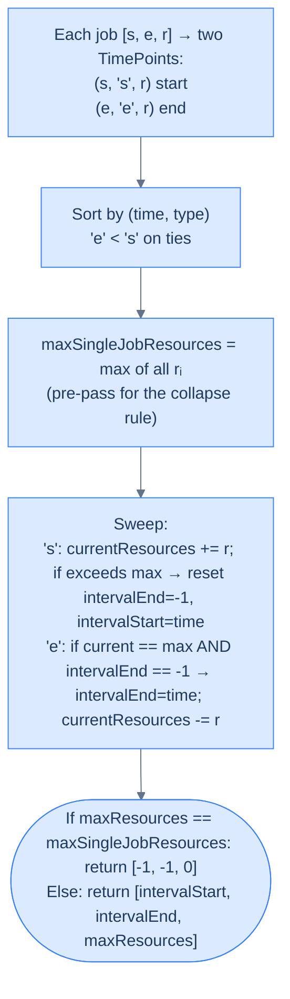

# Peak Resource Requirement

## The Problem

Given an array of **jobs**, consisting of start time, end time, and required resources `[[s1, e1, r1], [s2, e2, r2], ...] (si < ei)`, find and return the **busiest interval** formed by overlapping jobs.

The busiest interval is the period during which the **total resources required** across all overlapping jobs are maximised. Your function should return both this interval and the corresponding maximum resources needed during that time.

Two intervals `[s1, e1]` and `[s2, e2]` are considered overlapping if `e1 > s2`. If `e1 == s2`, the intervals are **not** considered overlapping.

> You must abide by the following constraints:
>
> - If multiple intervals tie for the maximum resources, return the **first** such interval.
> - The output should be in the form `[intervalStart, intervalEnd, maxResources]`.
> - If there are no overlapping intervals, return `[-1, -1, 0]`.

---

## Examples

**Example 1**
```
Input:  jobs = [[1, 5, 2], [2, 6, 3], [4, 7, 4]]
Output: [4, 5, 9]
Explanation: At interval [4, 5], all three jobs overlap, requiring
             2 + 3 + 4 = 9 resources, which is the maximum.
```

**Example 2**
```
Input:  jobs = [[1, 3, 1], [2, 4, 5], [5, 6, 4]]
Output: [2, 3, 6]
Explanation: At t = 2 the first two jobs overlap, requiring 1 + 5 = 6
             resources — the maximum. The next event (an end at t = 3)
             closes the first peak window, so the result is [2, 3, 6].
```

**Example 3**
```
Input:  jobs = [[1, 5, 2], [5, 10, 3], [10, 15, 5]]
Output: [-1, -1, 0]
Explanation: Jobs only touch at endpoints, so there are no
             overlapping jobs.
```

<details>
<summary><h2>Intuition</h2></summary>


The input is a flat list of jobs sharing one time axis, but each job carries an extra coordinate beyond start and end: the `resources` it consumes while active. The structural property is the running *weighted* sum of active jobs at each instant — not the unweighted count that drives Minimum Meeting Rooms.

Each start event contributes `+resources` to a running sum; each end event contributes `−resources`. The peak of the running sum is the answer's third component; `intervalStart` and `intervalEnd` are placed exactly as in Busiest Interval — strict-`>` peak break sets the start, first `'e'` while still at peak sets the end. The only structural difference from Busiest Interval is that the counter increments by a variable amount instead of `±1`, which also changes how "no overlap" is detected.

The naive approach — try every pair of overlapping jobs and sum their resources — is O(N²) and still misses cases where three or more jobs co-occur (the peak comes from the *cluster*, not any single pair). A "did concurrency exceed 1?" counter alongside the weighted sweep would work but adds bookkeeping. The cleaner invariant is `maxResources == maxSingleJobResources` — when the peak matches the heaviest lone job, no two jobs were ever active simultaneously, so the result collapses to `[-1, -1, 0]`.

</details>
<details>
<summary><h2>What Does "Peak Resources" Mean?</h2></summary>


Instead of counting **how many** intervals are active (each contributing +1 to the counter), we sum **how much** they contribute — each job adds its own `resources` at its start and removes the same amount at its end. The sweep is identical; the delta is weighted. We also remember the **interval coordinates** of the first peak.

```d2
direction: right

loads: "Three jobs with resources" {
  grid-columns: 3
  grid-gap: 16
  l1: |md
    `[1,5]`

    r=2
  |
  l2: |md
    `[2,6]`

    r=3
  |
  l3: |md
    `[4,7]`

    r=4
  |
}

sweep: "Running total across events" {
  grid-columns: 6
  grid-gap: 0
  e1: |md
    `t=1 +2`

    cur=2
  | {style.fill: "#dcfce7"; style.stroke: "#16a34a"}
  e2: |md
    `t=2 +3`

    cur=5
  | {style.fill: "#dcfce7"; style.stroke: "#16a34a"}
  e3: |md
    `t=4 +4`

    cur=9 ★
  | {style.fill: "#fde68a"; style.stroke: "#d97706"}
  e4: |md
    `t=5 -2`

    cur=7
  |
  e5: |md
    `t=6 -3`

    cur=4
  |
  e6: |md
    `t=7 -4`

    cur=0
  |
}

ans: "result = [4, 5, 9]" {style.fill: "#fde68a"; style.stroke: "#d97706"}

loads -> sweep
sweep -> ans
```

<p align="center"><strong>Each event is a ±resources delta instead of ±1. The peak value of the running sum is the third output; the surrounding event coordinates are the first two.</strong></p>

</details>
<details>
<summary><h2>Applying the Diagnostic Questions</h2></summary>


| Question | Answer |
|---|---|
| **Q1.** Is this a maximum-overlap problem? | **Yes** — with a weighted counter instead of ±1 |
| **Q2.** What does each start/end event contribute? | **+resources at start, −resources at end** |
| **Q3.** Does the tie-breaker rule change? | **No — still end before start on shared coords** |
| **Q4.** When do we collapse to `[-1, -1, 0]`? | **When `maxResources == maxSingleJobResources`** — no two jobs ever overlapped |

### Q1 — Why "maximum overlap"?

**Mental model:** the peak of a weighted counter is structurally the same as the peak of an unweighted counter. We never cared that the increment was `+1` — we only cared that it tracked "what's active right now". Changing the increment to `+resources` tracks "how much resource is active right now" with zero extra machinery.

**Concrete numbers:** for `[[1,5,2],[2,6,3],[4,7,4]]`, the running totals across sorted events `[(1,'s'),(2,'s'),(4,'s'),(5,'e'),(6,'e'),(7,'e')]` are `2, 5, 9, 7, 4, 0`. Peak = 9 at `t = 4`.

**What breaks otherwise:** if you tried to count "peak number of jobs active" (the unweighted version), you'd return `3` for example 1 — missing the fact that each job has a different cost.

### Q2 — Why "+resources at start, −resources at end"?

**Mental model:** a job's resource use is paid continuously from start to end. The cumulative change in "resource in use" crossing the start boundary is `+resources`; crossing the end boundary is `−resources`. Same symmetry as ±1, scaled.

**Concrete numbers:** for `[2, 6, 3]`, crossing `t=2` adds 3 to total resources; crossing `t=6` subtracts 3.

**What breaks otherwise:** forgetting the sign flip at the end would create a monotonically-increasing counter — load would only ever grow, giving the wrong answer.

### Q3 — Why "same tie-breaker"?

**Mental model:** the convention that touching jobs are non-overlapping still holds. When one job ends exactly as another starts, the end delta should fire first so the first job's resources are released before the second job's resources are added.

**Concrete numbers:** for `[[1,5,2],[5,10,3]]` at `t=5`, processing end-first gives `2 → 0 → 3`. Processing start-first would give `2 → 5 → 3` — a phantom spike of 5 that doesn't represent real simultaneity.

**What breaks otherwise:** flipping the order invents peaks that never actually happened. In capacity-planning contexts, that translates directly to over-provisioning.

### Q4 — Why collapse on `maxResources == maxSingleJobResources`?

**Mental model:** "no overlap" means no two jobs were ever active at the same instant. The peak resource value in that case is just the largest single job's resources. So if `maxResources` equals the largest single-job resources, the algorithm never observed any actual overlap — return `[-1, -1, 0]`.

**Concrete numbers:** for `[[1,5,2],[5,10,3],[10,15,5]]`, `maxSingleJobResources = 5` (the third job). The sweep also reports `maxResources = 5`, matched only when the lone third job is active. → return `[-1, -1, 0]`.

**What breaks otherwise:** a naive `peak <= 0` check would only catch the empty-input case. A "did we ever have count > 1?" check would require an extra counter alongside the weighted sweep. The single-job comparison is a cleaner invariant.

</details>
<details>
<summary><h2>The Sweep Strategy (Visualised)</h2></summary>




<p align="center"><strong>Same four-step skeleton as Busiest Interval — but each event carries a <code>resources</code> contribution, and the collapse rule uses the largest single-job resources as the no-overlap sentinel.</strong></p>

</details>
<details>
<summary><h2>Approach</h2></summary>


1. Build `times = []`. For each job `[s, e, r]`, append `(s, 's', r)` and `(e, 'e', r)`.
2. Sort `times` ascending, `'e'` before `'s'` on ties.
3. Pre-scan `jobs` to find `maxSingleJobResources` — the largest `r` across all jobs. This sets the no-overlap sentinel.
4. Initialise `currentResources = 0`, `maxResources = 0`, `intervalStart = 0`, `intervalEnd = 0`.
5. Walk `times`. On `'s'`: `currentResources += point.resources`; if it strictly exceeds `maxResources`, set `maxResources = currentResources`, `intervalStart = point.time`, `intervalEnd = -1`. On `'e'`: if `currentResources == maxResources` and `intervalEnd == -1`, set `intervalEnd = point.time`; then `currentResources -= point.resources`.
6. If `maxResources == maxSingleJobResources`, return `[-1, -1, 0]` — no two jobs ever overlapped. Otherwise return `[intervalStart, intervalEnd, maxResources]`.

</details>
<details>
<summary><h2>Solution &amp; Analysis</h2></summary>

### The Solution

```python run viz=array viz-root=jobs
from typing import List, Tuple

# Define a class to store the time and type ('s' or 'e')
class TimePoint:
    def __init__(self, time: int, type_: str, resources: int):
        self.time = time
        self.type = type_
        self.resources = resources

    def __lt__(self, other):

        # Sort the times array, end times come before start times
        # as 'e' < 's'
        if self.time == other.time:
            return self.type < other.type
        return self.time < other.time

class Solution:
    def peak_resource_requirement(
        self, jobs: List[List[int]]
    ) -> Tuple[int, int, int]:

        # Create a dynamic array to store start and end times
        times: List[TimePoint] = []

        for job in jobs:

            # Add start and end times to the times array
            times.append(TimePoint(job[0], "s", job[2]))
            times.append(TimePoint(job[1], "e", job[2]))

        # Sort the times array using the custom compare function
        times.sort()

        # Currently required resources
        current_resources = 0

        # Maximum resources count
        maximum_resources = 0

        # Start of the interval with maximum resources
        interval_start = 0

        # End of the interval with maximum resources
        interval_end = 0

        # Maximum resources required by a single job
        max_single_job_resources = 0

        # Find the maximum resources required by a single job
        for job in jobs:
            max_single_job_resources = max(
                max_single_job_resources, job[2]
            )

        for point in times:
            if point.type == "s":

                # If we are at the start of a new maximum resources
                # interval
                current_resources += point.resources

                # If the current resources exceed the maximum resources
                # update the maximum resources and start of the interval
                # with maximum resources
                if current_resources > maximum_resources:
                    maximum_resources = current_resources
                    interval_start = point.time

                    # Reset the end of the interval with maximum
                    # resources
                    interval_end = -1

            # 'e' - end of interval
            else:

                # If we are at the end of an interval with maximum
                # resources and the current resources are equal to the
                # maximum resources then update the end of the interval
                # with maximum resources
                if (
                    current_resources == maximum_resources
                    and interval_end == -1
                ):
                    interval_end = point.time

                # Decrement the current resources count
                current_resources -= point.resources

        # If the maximum resources is equal to the maximum resources
        # required by a single job, return {-1, -1, 0} as there is no
        # interval with overlapping jobs
        if maximum_resources == max_single_job_resources:
            return -1, -1, 0

        return interval_start, interval_end, maximum_resources


# Examples from the problem statement
print(Solution().peak_resource_requirement([[1, 5, 2], [2, 6, 3], [4, 7, 4]]))   # (4, 5, 9)
print(Solution().peak_resource_requirement([[1, 3, 1], [2, 4, 5], [5, 6, 4]]))   # (2, 3, 6)
print(Solution().peak_resource_requirement([[1, 5, 2], [5, 10, 3], [10, 15, 5]]))# (-1, -1, 0)

# Edge cases
print(Solution().peak_resource_requirement([[1, 5, 3]]))                           # (-1, -1, 0)  — single job
print(Solution().peak_resource_requirement([[1, 3, 2], [2, 4, 2]]))               # (2, 3, 4)  — two overlapping
print(Solution().peak_resource_requirement([[1, 2, 5], [3, 4, 5]]))               # (-1, -1, 0)  — no overlap
print(Solution().peak_resource_requirement([[1, 4, 1], [2, 5, 2], [3, 6, 3]]))   # (3, 4, 6)  — peak at last overlap
```

```java run viz=array viz-root=jobs
import java.util.*;

public class Main {
    // Define a struct to store the time, type ('s' or 'e') and resources
    static class TimePoint {

        int time;
        char type;
        int resources;

        TimePoint(int time, char type, int resources) {
            this.time = time;
            this.type = type;
            this.resources = resources;
        }
    }

    // Comparator for TimePoint
    static class Compare implements Comparator<TimePoint> {
        public int compare(TimePoint a, TimePoint b) {

            // Sort the times array, end times come before start times
            // as 'e' < 's'
            if (a.time == b.time) {
                return Character.compare(a.type, b.type);
            }

            return Integer.compare(a.time, b.time);
        }
    }

    static class Solution {
        public int[] peakResourceRequirement(int[][] jobs) {

            // Create a dynamic array to store start and end times
            List<TimePoint> times = new ArrayList<>();

            for (int[] job : jobs) {

                // Add start and end times to the times array
                times.add(new TimePoint(job[0], 's', job[2]));
                times.add(new TimePoint(job[1], 'e', job[2]));
            }

            // Sort the times array using the custom compare function
            times.sort(new Compare());

            // Currently required resources
            int currentResources = 0;

            // Maximum resources required at any time
            int maxResources = 0;

            // Start of the interval with maximum resources
            int intervalStart = -1;

            // End of the interval with maximum resources
            int intervalEnd = -1;

            // Maximum resources required by a single job
            int maxSingleJobResources = 0;

            // Find the maximum resources required by a single job
            for (int[] job : jobs) {
                maxSingleJobResources = Math.max(
                    maxSingleJobResources,
                    job[2]
                );
            }

            for (TimePoint point : times) {
                if (point.type == 's') {

                    // Add the resources of the current job
                    currentResources += point.resources;

                    // If the current resources exceed the maximum resources
                    // update the maximum resources and start of the interval
                    // with maximum resources
                    if (currentResources > maxResources) {
                        maxResources = currentResources;
                        intervalStart = point.time;

                        // Reset the end of the interval with maximum
                        // resources
                        intervalEnd = -1;
                    }
                }

                // 'e' - end of interval
                else {

                    // If we are at the end of an interval with maximum
                    // overlap and the current overlap is equal to the
                    // maximum resources then update the end of the interval
                    // with maximum resources
                    if (
                        currentResources == maxResources && intervalEnd == -1
                    ) {
                        intervalEnd = point.time;
                    }

                    // Decrement the current resources count
                    currentResources -= point.resources;
                }
            }

            // If the maximum resources is equal to the maximum resources
            // required by a single job, return {-1, -1, 0} as there is no
            // interval with overlapping jobs
            if (maxResources == maxSingleJobResources) {
                return new int[] { -1, -1, 0 };
            }

            return new int[] { intervalStart, intervalEnd, maxResources };
        }
    }

    public static void main(String[] args) {
        // Examples from the problem statement
        System.out.println(Arrays.toString(new Solution().peakResourceRequirement(new int[][]{{1, 5, 2}, {2, 6, 3}, {4, 7, 4}})));   // [4, 5, 9]
        System.out.println(Arrays.toString(new Solution().peakResourceRequirement(new int[][]{{1, 3, 1}, {2, 4, 5}, {5, 6, 4}})));   // [2, 3, 6]
        System.out.println(Arrays.toString(new Solution().peakResourceRequirement(new int[][]{{1, 5, 2}, {5, 10, 3}, {10, 15, 5}}))); // [-1, -1, 0]

        // Edge cases
        System.out.println(Arrays.toString(new Solution().peakResourceRequirement(new int[][]{{1, 5, 3}})));                           // [-1, -1, 0]  — single job
        System.out.println(Arrays.toString(new Solution().peakResourceRequirement(new int[][]{{1, 3, 2}, {2, 4, 2}})));               // [2, 3, 4]  — two overlapping
        System.out.println(Arrays.toString(new Solution().peakResourceRequirement(new int[][]{{1, 2, 5}, {3, 4, 5}})));               // [-1, -1, 0]  — no overlap
        System.out.println(Arrays.toString(new Solution().peakResourceRequirement(new int[][]{{1, 4, 1}, {2, 5, 2}, {3, 6, 3}})));   // [3, 4, 6]  — peak at last overlap
    }
}
```


<details>
<summary><strong>Trace — jobs = [[1, 5, 2], [2, 6, 3], [4, 7, 4]]</strong></summary>

```
maxSingleJobResources = 4 (the third job)

Sorted events: [(1,'s',2), (2,'s',3), (4,'s',4), (5,'e',2), (6,'e',3), (7,'e',4)]

(1,'s',2) │ cur 0→2  │ 2 > 0  → max=2, start=1, end=-1
(2,'s',3) │ cur 2→5  │ 5 > 2  → max=5, start=2, end=-1
(4,'s',4) │ cur 5→9  │ 9 > 5  → max=9, start=4, end=-1 ★
(5,'e',2) │ cur == max AND end==-1 → end=5 │ cur 9→7
(6,'e',3) │ cur(7) != max(9) → no update    │ cur 7→4
(7,'e',4) │ cur(4) != max(9) → no update    │ cur 4→0

maxResources (9) != maxSingleJobResources (4) → result: [4, 5, 9] ✓
```

</details>
<details>
<summary><strong>Trace — jobs = [[1, 5, 2], [5, 10, 3], [10, 15, 5]] (no overlap)</strong></summary>

```
maxSingleJobResources = 5 (the third job)

Sorted events: [(1,'s',2), (5,'e',2), (5,'s',3), (10,'e',3), (10,'s',5), (15,'e',5)]
                          ^^^^^^^^^^^^^^^^^^^^^  end before start on ties
                                                ^^^^^^^^^^^^^^^^^^^^^^  also at t=10

(1,'s',2)  │ cur 0→2 │ 2 > 0 → max=2, start=1, end=-1
(5,'e',2)  │ cur == max AND end==-1 → end=5 │ cur 2→0
(5,'s',3)  │ cur 0→3 │ 3 > 2 → max=3, start=5, end=-1
(10,'e',3) │ cur == max AND end==-1 → end=10 │ cur 3→0
(10,'s',5) │ cur 0→5 │ 5 > 3 → max=5, start=10, end=-1
(15,'e',5) │ cur == max AND end==-1 → end=15 │ cur 5→0

maxResources (5) == maxSingleJobResources (5) → result: [-1, -1, 0] ✓
```

</details>

### Complexity Analysis

| | Complexity | Reasoning |
|---|---|---|
| **Time** | O(N log N) | Sorting 2N TimePoints dominates; sweep is linear |
| **Space** | O(N) | Times array has 2N entries |

### Edge Cases

| Case | Example | Expected | Reasoning |
|---|---|---|---|
| Empty input | `[]` | `[-1, -1, 0]` | No jobs → no overlap, no resources |
| Single job | `[[1, 2, 100]]` | `[-1, -1, 0]` | One job alone is not an overlap; `maxResources == maxSingleJobResources` |
| Uniform resources | `[[1,4,1],[2,5,1],[3,6,1]]` | `[3, 4, 3]` | Reduces to plain meeting-rooms case with `r = 1` |
| Giant job, small peers | `[[1,100,50],[2,3,1]]` | `[2, 3, 51]` | Brief co-occurrence elevates peak from 50 to 51 |
| Touching boundary | `[[1,5,10],[5,9,20]]` | `[-1, -1, 0]` | End before start at `t=5` → no real overlap |
| Three-way tie at the peak | `[[1,8,5],[4,5,5],[6,7,5]]` | `[4, 5, 10]` | Earliest window of peak 10 is `[4, 5]` |

</details>
<details>
<summary><h2>Why the Weighted Sweep Matters</h2></summary>


The jump from ±1 to ±resources looks tiny — but it unlocks a huge class of problems that the plain counter can't touch: **CPU scheduling with variable threads per job**, **memory provisioning for heterogeneous containers**, **airport traffic where larger aircraft occupy more gates**, and **bandwidth peaks in network routers**. The generalisation works because overlap *counting* is just a special case of overlap *weighting* where every weight happens to be 1.

If you ever catch yourself thinking "but my intervals aren't all equal" in a capacity problem, reach for this variant first — chances are it solves your problem in the exact same O(N log N) runtime.

</details>
<details>
<summary><h2>Key Takeaway</h2></summary>


Peak Resource Requirement is the weighted twin of Busiest Interval — each event contributes `±resources` instead of `±1`, and the no-overlap collapse fires when `maxResources == maxSingleJobResources` instead of `maxOverlap ≤ 1`. Same skeleton, weighted counter, smarter sentinel.

> **Transfer Challenge:** Modify the function to also return the **list of job indices** active during the peak interval.
>
> <details><summary><strong>Solution hint</strong></summary>
>
> Tag each TimePoint with its original `jobIndex`. Maintain an `active` set: add on `'s'`, remove on `'e'`. When a new peak is recorded (`currentResources > maxResources`), snapshot `active.toList` into `peakJobs`. Stays O(N log N) for the sort; `O(N)` extra space for the set and the snapshot.
>
> </details>

</details>
