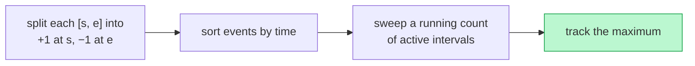

# Memorize: Maximum Overlap

## In a Hurry?

- **One-Line Idea**: Split every interval into a `+1` start and a `−1` end, sort by coordinate (`'e'` before `'s'` on ties), then sweep with a running counter — its peak is the answer.
- **Complexities**: `O(N log N)` time (sort dominates), `O(N)` space (`2N` tagged points), where `N` is the number of input intervals.
- **When to Use**: a problem asks for "peak concurrent X", "minimum resources needed", or "the time window when load is highest" — anything that reduces to *how many intervals are simultaneously active*.

---

## One-Line Mnemonic

**Split, sort, sweep — the counter's peak is the answer.**

---

## Real-World Analogy

A coat check at a busy theatre. Every time a guest hands over a coat (`+1`) and every time a guest picks one up (`−1`), you note it on a tally sheet ordered by clock time. Pickups on the same minute are recorded *before* drop-offs so a coat leaving at 9:00 vacates its hook before the 9:00 arrival claims it. The tallest the running count ever reaches over the night is the minimum number of hooks the cloakroom needed to stock.

---

## Visual Summary



<p align="center"><strong>Turn each interval into a +1 start and a −1 end event, sort by time, and sweep a running counter — its peak is the most intervals active at once (max rooms, peak concurrency).</strong></p>

---

## Pattern Recognition Triggers

Reach for maximum overlap when you see:

- Inputs are intervals or events with `[start, end]` coordinates on a single axis.
- The question asks for **peak concurrency** — "most simultaneous X", "busiest moment", "minimum servers/rooms/lanes".
- The answer is "the maximum of something over time" rather than a pairwise comparison.
- Touching boundaries (`[1, 5]` and `[5, 10]`) need to be treated as **non-overlapping** (most common) — or, less often, as overlapping (flip the tiebreaker).
- Each event contributes a fixed delta — `±1` for counting, `±resources` for weighted variants.

If the question instead asks "merge into non-overlapping ranges" → that is **interval merging** (section 9), not maximum overlap.

---

## Don't Confuse With

| | **Maximum Overlap** | **Interval Merging** |
|---|---|---|
| **Question shape** | How many intervals are simultaneously active? | What is the union of all intervals? |
| **Output type** | A scalar (peak count) or a coordinate range | A list of merged intervals |
| **Sort key** | By coordinate of every tagged event point | By `start` of each interval |
| **Per-event state** | A running counter | A running `(currentStart, currentEnd)` pair |
| **Tiebreaker** | `'e'` before `'s'` on shared coordinate | Inclusive on equal endpoints (`end >= nextStart` merges) |
| **When this goes wrong** | You return a *list of intervals* when the problem asked for *peak concurrency* — symptom: your output type doesn't match the question | You return *a single integer* when the problem asked for *merged ranges* — symptom: you've collapsed the answer to its count |

The two patterns share the "intervals on an axis" input shape but answer fundamentally different questions. Read the *output* the problem demands before choosing.

---

## Template Code

```python
from typing import List, Tuple

def maximum_overlap(intervals: List[List[int]]) -> int:
    # 1. Split each interval into two tagged points.
    points: List[Tuple[int, str]] = []
    for s, e in intervals:
        points.append((s, "s"))
        points.append((e, "e"))

    # 2. Sort ascending; on ties, 'e' < 's' so touching intervals
    #    are treated as non-overlapping.
    points.sort()

    # 3. Sweep: '+1' on start, '-1' on end; track the running peak.
    overlap = 0
    max_overlap = 0
    for _, tag in points:
        if tag == "s":
            overlap += 1
            max_overlap = max(max_overlap, overlap)
        else:
            overlap -= 1

    return max_overlap
```

Three slots to adapt per problem:
- **Increment size** — `+1` for plain counts, `+resources` for weighted variants.
- **Peak-break action** — also record `intervalStart` / `intervalEnd` for "where" questions.
- **Final transform** — return `max_overlap` directly (Minimum Meeting Rooms), collapse `< 2 → 0` (strict overlap), or return `[start, end, peak]` (Busiest Interval, Peak Resource).

---

## Common Mistakes

- **Wrong tiebreaker on shared coordinates**:
  - *What*: Sorting puts `'s'` before `'e'` (or omits the tiebreaker entirely) when two events share a coordinate.
  - *Why*: Back-to-back intervals like `[1, 5]` and `[5, 10]` then briefly read `overlap = 2` at `x = 5`, inventing a phantom overlap that never existed.
  - *Fix*: Sort tuples as `(coord, tag)` — `'e' < 's'` in ASCII drops you onto the correct order for free.

- **Updating the peak on `>=` instead of `>`**:
  - *What*: Busiest-Interval-style problems use `currentOverlap >= maxOverlap` to update `intervalStart`.
  - *Why*: Ties then overwrite the earlier window — you end up returning the *last* peak coordinate, not the *first*, breaking the "earliest window wins" contract.
  - *Fix*: Use strict `>` for the peak-break update; let ties preserve the existing `intervalStart`.

- **Returning the wrong quantity on "no overlap"**:
  - *What*: Returning `0` or `[]` when the problem expects `[-1, -1]` (Busiest Interval) or `[-1, -1, 0]` (Peak Resource).
  - *Why*: The sweep always finishes with *some* peak value because a single interval still raises the counter to `1`; failing to collapse that to the no-overlap sentinel returns a phantom window.
  - *Fix*: Add the explicit collapse at the end — `maximumOverlap <= 1 → [-1, -1]` for counts, `maxResources == maxSingleJobResources → [-1, -1, 0]` for weighted.

- **Confusing peak concurrency with peak removals**:
  - *What*: Applying the maximum-overlap counter to a "remove the fewest intervals to make the rest non-overlapping" problem.
  - *Why*: Peak concurrency tells you how many parallel slots the conflicts demand, not how many intervals to drop — three pairwise-overlapping intervals have peak `3` but only require dropping `2`.
  - *Fix*: For minimum-removal problems, switch to sort-by-end-ascending greedy: keep any interval whose start is at or after the last kept end; answer is `n − count(kept)`.

- **Forgetting the `+r` symmetry on weighted ends**:
  - *What*: Weighted sweep that does `+r` on starts but `-1` (or nothing) on ends.
  - *Why*: The running counter then only ever grows — every job ever started inflates the peak, giving wildly wrong answers.
  - *Fix*: Mirror exactly — `currentResources += r` on `'s'`, `currentResources -= r` on `'e'`. Same magnitude on both sides.

---

## Minimum Viable Example

Run on `intervals = [[1, 4], [2, 6], [3, 5]]`:

```
sorted points: [(1,'s'), (2,'s'), (3,'s'), (4,'e'), (5,'e'), (6,'e')]
overlap path:   1, 2, 3, 2, 1, 0
maxOverlap = 3   (all three active between x = 3 and x = 4)
```

Three intervals, six events, one counter — the entire pattern in four lines.

---

## Quick Recall

**Q: Why split intervals into two tagged points?**
A: Because the active count only changes at start/end coordinates — splitting reduces "geometry of intervals" to "deltas at events", which a sweep handles in one pass.

**Q: Why `'e'` before `'s'` on tied coordinates?**
A: So back-to-back intervals (`[1, 5]` then `[5, 10]`) are treated as non-overlapping — the closing interval frees its slot before the new one opens.

**Q: When do you flip the tiebreaker?**
A: When the problem explicitly *wants* touching to count as overlapping (continuous-coverage checks). Sort `'s'` before `'e'` on ties; everything else stays the same.

**Q: What is the time and space complexity?**
A: `O(N log N)` time (sort dominates), `O(N)` space (the `2N`-element tagged-points array).

**Q: How do you adapt the sweep to return a *range* instead of a count?**
A: Record `intervalStart` whenever the counter strictly exceeds the running max, and `intervalEnd` on the first `'e'` event that fires while the counter still equals the max — then return `[intervalStart, intervalEnd]`.

**Q: What changes for a weighted variant (Peak Resource Requirement)?**
A: Each event's delta is `±r` instead of `±1`, and the no-overlap sentinel becomes `maxResources == maxSingleJobResources` instead of `maxOverlap ≤ 1`.

**Q: How do you tell maximum overlap apart from interval merging at a glance?**
A: Maximum overlap returns a number or a coordinate range; interval merging returns a list of merged intervals. Look at the *output type* the problem demands.
