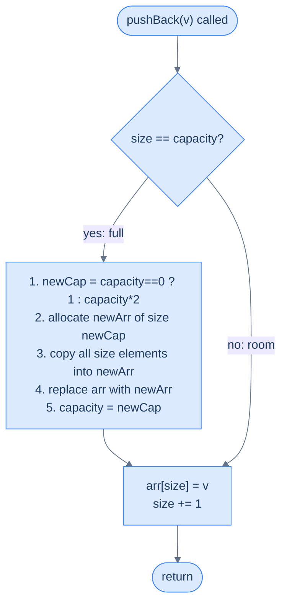

<details>
<summary><h2>The Hook</h2></summary>


You reach for `list` in Python, `ArrayList` in Java, `vector` in C++, or `Array` in JavaScript and push a million values without a thought. The container always has room. Raw arrays do not — allocate `int arr[10]` and the eleventh element has nowhere to live. So what does the "dynamic" container do when the underlying block fills up? And how does `pushBack` still average **O(1)** when every growth step copies every existing element?

The answer is **geometric doubling**: when the array runs out of room, allocate one *twice* the current size and copy across. The trick turns a sequence that looks like it should cost `O(N)` per push into one that averages `O(1)`. Every modern dynamic-array container — `std::vector`, Go slices, Python lists, Rust `Vec`, Java `ArrayList` — runs this same state machine under the hood.

</details>

---

## The Problem

> Complete a `DynamicArray` class that supports the following operations, each with **amortised O(1)** time:
>
> - `DynamicArray()` — construct an empty dynamic array.
> - `pushBack(val)` — append `val` to the end of the array.
> - `get(index)` — return the value at position `index`.
> - `size()` — return the current number of stored elements.

```
Input:
  ops   = [DynamicArray, pushBack, pushBack, get, size, pushBack, size, get]
  args  = [[],           [2],      [3],      [1], [],   [5],      [],   [0]]

Output:
  [null, null, null, 3, 2, null, 3, 2]

Step-by-step:
  DynamicArray()  → arr = []
  pushBack(2)     → arr = [2]
  pushBack(3)     → arr = [2, 3]
  get(1)          → 3
  size()          → 2
  pushBack(5)     → arr = [2, 3, 5]
  size()          → 3
  get(0)          → 2
```

---

<details>
<summary><h2>What Does "Amortised O(1)" Mean?</h2></summary>


**Amortised O(1)** is stronger than "O(1) on average". It is a worst-case guarantee about an entire sequence. For *any* sequence of `N` operations the total cost is `O(N)`, so the per-operation cost averages to `O(1)` — even when one individual call costs `O(N)`.

Two phrasings get conflated and they are not the same:

- **Average-case O(1)** — assumes a probability distribution over inputs and reports the expected cost; an adversary can still make every call worst-case.
- **Amortised O(1)** — assumes nothing about the input; the bound holds across any sequence of `N` calls, no matter how the caller orders them.

To make this concrete: out of the first 8 `pushBack` calls on an empty array, 4 trigger a resize and 4 do not. The cumulative work is `15` units, not `8 × 8 = 64`. The expensive calls are charged ahead by all the cheap calls that follow them. So the key idea is: amortised analysis lets us hide the cost of a rare expensive operation inside the cheap operations it pays back to.

```d2
direction: right

cost: "Cost of each pushBack as capacity doubles" {
  grid-rows: 3
  grid-columns: 8
  grid-gap: 0
  p1: "push 1" {style.fill: "#fde68a"; style.stroke: "#d97706"}
  p2: "push 2" {style.fill: "#fde68a"; style.stroke: "#d97706"}
  p3: "push 3" {style.fill: "#fde68a"; style.stroke: "#d97706"}
  p4: "push 4"
  p5: "push 5" {style.fill: "#fde68a"; style.stroke: "#d97706"}
  p6: "push 6"
  p7: "push 7"
  p8: "push 8"
  c1: "cost = 1"
  c2: "cost = 2"
  c3: "cost = 3"
  c4: "cost = 1"
  c5: "cost = 5"
  c6: "cost = 1"
  c7: "cost = 1"
  c8: "cost = 1"
  cap1: "cap = 1"
  cap2: "cap = 2"
  cap3: "cap = 4"
  cap4: "cap = 4"
  cap5: "cap = 8"
  cap6: "cap = 8"
  cap7: "cap = 8"
  cap8: "cap = 8"
}

total: |md
  8 pushes, total cost = `1+2+3+1+5+1+1+1` = **15** ≤ 2×8.<br/>**Average = 15 / 8 ≈ 1.87 = O(1)**.
| {style.fill: "#dcfce7"; style.stroke: "#16a34a"}

cost -> total: "amortise"
```

<p align="center"><strong>Expensive resizes are rare. Each doubling event pays for itself against the cheap pushes that follow it — the <em>average</em> cost is constant.</strong></p>

</details>
<details>
<summary><h2>The Core Insight — Grow by Doubling</h2></summary>


The naive fix — "when full, grow by one slot" — collapses to `O(N)` per push. Every insertion past the first triggers a fresh copy of every stored element. The total cost of `N` pushes becomes `1 + 2 + 3 + … + N = O(N²)`. The work scales with the *square* of the input size; pushing a million elements does roughly a trillion copies.

The fix is to grow **multiplicatively** instead of additively. When the array is full, allocate a new block of size `capacity × 2` and copy across. The doublings happen at capacities `1, 2, 4, 8, …, N`, which forms a geometric series:

- **Resizes** happen `⌈log₂ N⌉` times — once per power of two.
- **Total copy work** across all resizes: `1 + 2 + 4 + … + N < 2N` — linear in `N`.
- **Cheap pushes** between resizes add another `N` constant-time writes.
- **Total cost** for `N` pushes: under `3N` operations → `O(N)` total → `O(1)` per push on average.

The geometric series is the entire trick: doubling makes each resize twice as expensive as the previous one, but it also makes resizes twice as rare. The two effects cancel exactly, leaving a constant amortised cost.

> *Before reading on — what happens if we grow by a factor of 1.01 instead of 2? Or a factor of 10?*

Any growth factor **strictly greater than 1** gives amortised `O(1)`. The factor only changes the constants:

- **Factor 1.01** — resizes after almost every push, so the constant is huge; correct asymptotically, slow in practice.
- **Factor 10** — resizes are rare, but the array reserves up to `10×` the memory it actually uses.
- **Factor 1.5×–2×** — the practical sweet spot; `std::vector` typically uses `1.5×` or `2×`, Java `ArrayList` uses `1.5×`, Python `list` uses roughly `1.125×` after small sizes.

So the tradeoff is: the larger the factor, the fewer resizes but the more memory wasted. We pick `2×` here for arithmetic that's easy to follow on paper.

</details>
<details>
<summary><h2>Applying the Diagnostic Questions</h2></summary>


| Question | Answer |
|---|---|
| **Q1.** Why can't we just allocate "enough" memory up front? | **Don't know N in advance** — must grow on demand |
| **Q2.** Why geometric growth instead of arithmetic (+1 or +k)? | **Geometric gives amortised O(1); arithmetic gives O(N) per push** |
| **Q3.** Why double-sized reallocation and not linked nodes? | **Arrays need contiguous memory for O(1) random access** |
| **Q4.** What's the trade-off we accept to get amortised O(1)? | **Up to 2× memory overhead** when just-resized |

### Q1 — Why "grow on demand"?

**Mental model:** the caller almost never knows the final size when they start pushing. Reserving 10,000 slots up front wastes memory if only 5 elements arrive; reserving 5 slots fails outright if 5,000 arrive. The dynamic array punts on the decision — start at `capacity = 0` and grow only when an actual push runs out of room.

**Concrete numbers:** a `std::vector<int>` starts empty. Push one element → capacity becomes 1. Push another → capacity 2. Push another → capacity 4. Sizing is decided by observed demand, not by an up-front guess.

**What breaks otherwise:** if the caller has to declare capacity, every function signature gains a "max size" parameter and every callsite has to estimate it. That is the C-style `int arr[N]` regime. Dynamic arrays remove the question from the API surface entirely.

### Q2 — Why "geometric, not arithmetic"?

**Mental model:** each resize is a fixed tax paid in element-copies. Arithmetic growth (add `k` slots) pays the tax every `k` pushes forever, and each successive payment is larger than the last. Geometric growth (multiply by `2×`) makes the tax exponentially **rarer** as the array grows — by the time a resize is expensive, it happens almost never.

**Concrete numbers (arithmetic, `k = 1`):** to reach size `1000`, the array resizes `1000` times, copying `1 + 2 + 3 + … + 999 ≈ 500,000` elements in aggregate → `O(N²)`.

**Concrete numbers (geometric, `×2`):** to reach size `1000`, the array resizes at capacities `1, 2, 4, 8, 16, 32, 64, 128, 256, 512, 1024` — `11` resizes, copying `1 + 2 + 4 + … + 512 = 1023` elements total → `O(N)`.

**What breaks otherwise:** with arithmetic growth, a million pushes do roughly `5 × 10¹¹` copies in aggregate — minutes of CPU time. Geometric growth finishes the same workload in milliseconds.

### Q3 — Why "arrays, not linked nodes"?

**Mental model:** the `get(index)` contract is the constraint. Random access by index in `O(1)` requires contiguous memory — `arr[i]` is one pointer-arithmetic computation. A linked list grows without copying but pays `O(N)` per access, which violates the very thing a dynamic array is supposed to deliver.

**Concrete numbers:** `arr[7]` on a contiguous array is one address computation (`base + 7 × sizeof(int)`) and one memory read. On a linked list, the same lookup walks `7` pointer dereferences and each one may miss the cache.

**What breaks otherwise:** swap to a linked structure and `get()` becomes `O(N)`. The whole design pivots on contiguous memory — that constraint is what forces the resize-and-copy machinery in the first place.

### Q4 — Why "accept 2× memory overhead"?

**Mental model:** right after a doubling resize, capacity equals `2 × size` — half the reserved memory is empty. That headroom is the price of amortised `O(1)`. Trade the headroom away and resizes get cheaper individually but more frequent in aggregate.

**Concrete numbers:** after `7` pushes capacity is `8` — `1` unused slot, about `14%` more memory than the live data. After `1025` pushes capacity is `2048` — `1023` unused slots, almost `100%` more memory than the live data (the worst case, immediately after a doubling). The trough sits near `0%` overhead immediately before the next resize.

**What breaks otherwise:** memory-constrained code (embedded systems, multi-gigabyte arrays) may prefer growth factor `1.5×` (so peak overhead falls to roughly `50%`) or layer a shrink-on-pop policy on top. For general-purpose use, `2×` is the accepted default because the cache benefits of doubling outweigh the slack memory.

</details>
<details>
<summary><h2>The Growth Strategy (Visualised)</h2></summary>




<p align="center"><strong>The <code>pushBack</code> fast path is two instructions. The slow path — resize + copy — runs rarely and only when the array is full.</strong></p>

The capacity sequence for one-at-a-time pushes into an empty array makes the doubling cadence visible:

```d2
seq: "Capacity sequence as elements are pushed" {
  grid-columns: 8
  grid-gap: 0
  e1: |md
    push 1

    cap 0→1
  | {style.fill: "#fde68a"; style.stroke: "#d97706"}
  e2: |md
    push 2

    cap 1→2
  | {style.fill: "#fde68a"; style.stroke: "#d97706"}
  e3: |md
    push 3

    cap 2→4
  | {style.fill: "#fde68a"; style.stroke: "#d97706"}
  e4: |md
    push 4

    no resize
  |
  e5: |md
    push 5

    cap 4→8
  | {style.fill: "#fde68a"; style.stroke: "#d97706"}
  e6: |md
    push 6

    no resize
  |
  e7: |md
    push 7

    no resize
  |
  e8: |md
    push 8

    no resize
  |
}
```

<p align="center"><strong>Resizes happen at pushes 1, 2, 3, 5, 9, 17, 33, 65 … — every power of two plus one. Between those, pushes are O(1) with no work beyond a pointer bump.</strong></p>

</details>
<details>
<summary><h2>The Solution</h2></summary>


```python run viz=array viz-root=arr
from typing import List

class DynamicArray:
    def __init__(self):

        # Pointer to the dynamically allocated array
        self.arr = None

        # Current number of elements in the array
        self.current_size = 0

        # Current capacity of the array
        self.capacity = 0

    def push_back(self, val: int) -> None:
        if self.current_size >= self.capacity:

            # If the capacity is not enough, resize the array
            new_capacity = 1 if self.capacity == 0 else self.capacity * 2
            new_arr = [0] * new_capacity

            # Copy the existing elements to the new array
            for i in range(self.current_size):
                new_arr[i] = self.arr[i]

            # Assign the new array and update the capacity
            self.arr = new_arr
            self.capacity = new_capacity

        # Add the new element to the end of the array
        self.arr[self.current_size] = val
        self.current_size += 1

    def get(self, index: int) -> int:
        return self.arr[index]

    def size(self) -> int:
        return self.current_size


# Example usage
da = DynamicArray()
da.push_back(2)
da.push_back(3)
print(da.get(1))    # 3
print(da.size())    # 2
da.push_back(5)
print(da.size())    # 3
print(da.get(0))    # 2
```

```java run viz=array viz-root=arr
public class Main {
    static class DynamicArray {

        // Pointer to the dynamically allocated array
        private int[] arr;

        // Current number of elements in the array
        private int currentSize;

        // Current capacity of the array
        private int capacity;

        public DynamicArray() {

            // Initialize the array
            arr = null;

            // Initialize the currentSize to 0
            currentSize = 0;

            // Initialize the capacity to 0
            capacity = 0;
        }

        public void pushBack(int val) {
            if (currentSize >= capacity) {

                // If the capacity is not enough, resize the array
                int newCapacity = (capacity == 0) ? 1 : capacity * 2;
                int[] newArr = new int[newCapacity];

                // Copy the existing elements to the new array
                if (arr != null) {
                    System.arraycopy(arr, 0, newArr, 0, currentSize);
                }

                // Assign the new array and update the capacity
                arr = newArr;
                capacity = newCapacity;
            }

            // Add the new element to the end of the array
            arr[currentSize] = val;
            currentSize++;
        }

        public int get(int index) {
            return arr[index];
        }

        public int size() {
            return currentSize;
        }
    }

    public static void main(String[] args) {
        DynamicArray da = new DynamicArray();
        da.pushBack(2);
        da.pushBack(3);
        System.out.println(da.get(1));    // 3
        System.out.println(da.size());    // 2
        da.pushBack(5);
        System.out.println(da.size());    // 3
        System.out.println(da.get(0));    // 2
    }
}
```

</details>
<details>
<summary><strong>Trace — pushBack 2, 3, 5 into empty array</strong></summary>

```
State format: arr | currentSize | capacity

Init           │ []                      │ size=0 │ cap=0

pushBack(2):
  size ≥ cap (0 ≥ 0) → resize: newCap = 1, new_arr = [0]
  copy 0 elements (nothing to do)
  write arr[0] = 2, size++
  State: [2]                              │ size=1 │ cap=1

pushBack(3):
  size ≥ cap (1 ≥ 1) → resize: newCap = 2, new_arr = [0, 0]
  copy 1 element: new_arr[0] = 2 → [2, 0]
  write arr[1] = 3, size++
  State: [2, 3]                           │ size=2 │ cap=2

pushBack(5):
  size ≥ cap (2 ≥ 2) → resize: newCap = 4, new_arr = [0, 0, 0, 0]
  copy 2 elements: new_arr = [2, 3, 0, 0]
  write arr[2] = 5, size++
  State: [2, 3, 5, 0]                     │ size=3 │ cap=4

get(1) → arr[1] = 3 ✓
size() → 3 ✓
```

Notice how after 3 pushes capacity is already 4 — that slot `arr[3] = 0` is wasted space,
the price we pay for amortised O(1). The next push will fit without resizing.

</details>
<details>
<summary><strong>Trace — 8 pushes showing resize events</strong></summary>

```
push  | resize? | cap before → after | copy cost | push cost
------|---------|---------------------|-----------|----------
  1   |  YES    |   0 → 1             |   0       |   1
  2   |  YES    |   1 → 2             |   1       |   2
  3   |  YES    |   2 → 4             |   2       |   3
  4   |  no     |   4 → 4             |   0       |   1
  5   |  YES    |   4 → 8             |   4       |   5
  6   |  no     |   8 → 8             |   0       |   1
  7   |  no     |   8 → 8             |   0       |   1
  8   |  no     |   8 → 8             |   0       |   1

Total cost = 15 units for 8 pushes → ≈ 1.87 per push on average = O(1) amortised.
Resize events fire at pushes 1, 2, 3, 5, 9, 17, 33, ... — exponentially rarer as N grows.
```

</details>

```d3 widget=array-1d
{
  "steps": [
    {
      "nodes": [
        {
          "id": "a",
          "label": "1",
          "kind": "cell",
          "meta": [],
          "slot": 0,
          "cardId": "",
          "layoutKind": ""
        }
      ],
      "edges": [],
      "cursor": [
        {
          "name": "size",
          "target": "a",
          "color": "#3b82f6"
        }
      ],
      "highlight": [
        "a"
      ],
      "changed": [],
      "removed": [],
      "annotation": "Push 1 — resize 0→1. Capacity is now 1; size = 1; 0 slots wasted.",
      "line": 0,
      "frames": [],
      "cardCursor": []
    },
    {
      "nodes": [
        {
          "id": "a",
          "label": "1",
          "kind": "cell",
          "meta": [],
          "slot": 0,
          "cardId": "",
          "layoutKind": ""
        },
        {
          "id": "b",
          "label": "2",
          "kind": "cell",
          "meta": [],
          "slot": 1,
          "cardId": "",
          "layoutKind": ""
        }
      ],
      "edges": [],
      "cursor": [
        {
          "name": "size",
          "target": "b",
          "color": "#3b82f6"
        }
      ],
      "highlight": [
        "a",
        "b"
      ],
      "changed": [],
      "removed": [],
      "annotation": "Push 2 — resize 1→2. Capacity = 2; size = 2; 0 slots wasted.",
      "line": 0,
      "frames": [],
      "cardCursor": []
    },
    {
      "nodes": [
        {
          "id": "a",
          "label": "1",
          "kind": "cell",
          "meta": [],
          "slot": 0,
          "cardId": "",
          "layoutKind": ""
        },
        {
          "id": "b",
          "label": "2",
          "kind": "cell",
          "meta": [],
          "slot": 1,
          "cardId": "",
          "layoutKind": ""
        },
        {
          "id": "c",
          "label": "3",
          "kind": "cell",
          "meta": [],
          "slot": 2,
          "cardId": "",
          "layoutKind": ""
        },
        {
          "id": "d",
          "label": "_",
          "kind": "cell",
          "meta": [],
          "slot": 3,
          "cardId": "",
          "layoutKind": ""
        }
      ],
      "edges": [],
      "cursor": [
        {
          "name": "size",
          "target": "c",
          "color": "#3b82f6"
        }
      ],
      "highlight": [
        "a",
        "b",
        "c"
      ],
      "changed": [],
      "removed": [],
      "annotation": "Push 3 — resize 2→4 (copy 2 elements). Capacity = 4; size = 3; 1 reserved slot.",
      "line": 0,
      "frames": [],
      "cardCursor": []
    },
    {
      "nodes": [
        {
          "id": "a",
          "label": "1",
          "kind": "cell",
          "meta": [],
          "slot": 0,
          "cardId": "",
          "layoutKind": ""
        },
        {
          "id": "b",
          "label": "2",
          "kind": "cell",
          "meta": [],
          "slot": 1,
          "cardId": "",
          "layoutKind": ""
        },
        {
          "id": "c",
          "label": "3",
          "kind": "cell",
          "meta": [],
          "slot": 2,
          "cardId": "",
          "layoutKind": ""
        },
        {
          "id": "d",
          "label": "4",
          "kind": "cell",
          "meta": [],
          "slot": 3,
          "cardId": "",
          "layoutKind": ""
        }
      ],
      "edges": [],
      "cursor": [
        {
          "name": "size",
          "target": "d",
          "color": "#3b82f6"
        }
      ],
      "highlight": [
        "a",
        "b",
        "c",
        "d"
      ],
      "changed": [],
      "removed": [],
      "annotation": "Push 4 — no resize. Fast path: write + bump.",
      "line": 0,
      "frames": [],
      "cardCursor": []
    },
    {
      "nodes": [
        {
          "id": "a",
          "label": "1",
          "kind": "cell",
          "meta": [],
          "slot": 0,
          "cardId": "",
          "layoutKind": ""
        },
        {
          "id": "b",
          "label": "2",
          "kind": "cell",
          "meta": [],
          "slot": 1,
          "cardId": "",
          "layoutKind": ""
        },
        {
          "id": "c",
          "label": "3",
          "kind": "cell",
          "meta": [],
          "slot": 2,
          "cardId": "",
          "layoutKind": ""
        },
        {
          "id": "d",
          "label": "4",
          "kind": "cell",
          "meta": [],
          "slot": 3,
          "cardId": "",
          "layoutKind": ""
        },
        {
          "id": "e",
          "label": "5",
          "kind": "cell",
          "meta": [],
          "slot": 4,
          "cardId": "",
          "layoutKind": ""
        },
        {
          "id": "f",
          "label": "_",
          "kind": "cell",
          "meta": [],
          "slot": 5,
          "cardId": "",
          "layoutKind": ""
        },
        {
          "id": "g",
          "label": "_",
          "kind": "cell",
          "meta": [],
          "slot": 6,
          "cardId": "",
          "layoutKind": ""
        },
        {
          "id": "h",
          "label": "_",
          "kind": "cell",
          "meta": [],
          "slot": 7,
          "cardId": "",
          "layoutKind": ""
        }
      ],
      "edges": [],
      "cursor": [
        {
          "name": "size",
          "target": "e",
          "color": "#3b82f6"
        }
      ],
      "highlight": [
        "a",
        "b",
        "c",
        "d",
        "e"
      ],
      "changed": [],
      "removed": [],
      "annotation": "Push 5 — resize 4→8 (copy 4 elements). Capacity = 8; size = 5; 3 reserved slots.",
      "line": 0,
      "frames": [],
      "cardCursor": []
    },
    {
      "nodes": [
        {
          "id": "a",
          "label": "1",
          "kind": "cell",
          "meta": [],
          "slot": 0,
          "cardId": "",
          "layoutKind": ""
        },
        {
          "id": "b",
          "label": "2",
          "kind": "cell",
          "meta": [],
          "slot": 1,
          "cardId": "",
          "layoutKind": ""
        },
        {
          "id": "c",
          "label": "3",
          "kind": "cell",
          "meta": [],
          "slot": 2,
          "cardId": "",
          "layoutKind": ""
        },
        {
          "id": "d",
          "label": "4",
          "kind": "cell",
          "meta": [],
          "slot": 3,
          "cardId": "",
          "layoutKind": ""
        },
        {
          "id": "e",
          "label": "5",
          "kind": "cell",
          "meta": [],
          "slot": 4,
          "cardId": "",
          "layoutKind": ""
        },
        {
          "id": "f",
          "label": "6",
          "kind": "cell",
          "meta": [],
          "slot": 5,
          "cardId": "",
          "layoutKind": ""
        },
        {
          "id": "g",
          "label": "_",
          "kind": "cell",
          "meta": [],
          "slot": 6,
          "cardId": "",
          "layoutKind": ""
        },
        {
          "id": "h",
          "label": "_",
          "kind": "cell",
          "meta": [],
          "slot": 7,
          "cardId": "",
          "layoutKind": ""
        }
      ],
      "edges": [],
      "cursor": [
        {
          "name": "size",
          "target": "f",
          "color": "#3b82f6"
        }
      ],
      "highlight": [
        "a",
        "b",
        "c",
        "d",
        "e",
        "f"
      ],
      "changed": [],
      "removed": [],
      "annotation": "Push 6 — no resize. Fast path.",
      "line": 0,
      "frames": [],
      "cardCursor": []
    },
    {
      "nodes": [
        {
          "id": "a",
          "label": "1",
          "kind": "cell",
          "meta": [],
          "slot": 0,
          "cardId": "",
          "layoutKind": ""
        },
        {
          "id": "b",
          "label": "2",
          "kind": "cell",
          "meta": [],
          "slot": 1,
          "cardId": "",
          "layoutKind": ""
        },
        {
          "id": "c",
          "label": "3",
          "kind": "cell",
          "meta": [],
          "slot": 2,
          "cardId": "",
          "layoutKind": ""
        },
        {
          "id": "d",
          "label": "4",
          "kind": "cell",
          "meta": [],
          "slot": 3,
          "cardId": "",
          "layoutKind": ""
        },
        {
          "id": "e",
          "label": "5",
          "kind": "cell",
          "meta": [],
          "slot": 4,
          "cardId": "",
          "layoutKind": ""
        },
        {
          "id": "f",
          "label": "6",
          "kind": "cell",
          "meta": [],
          "slot": 5,
          "cardId": "",
          "layoutKind": ""
        },
        {
          "id": "g",
          "label": "7",
          "kind": "cell",
          "meta": [],
          "slot": 6,
          "cardId": "",
          "layoutKind": ""
        },
        {
          "id": "h",
          "label": "_",
          "kind": "cell",
          "meta": [],
          "slot": 7,
          "cardId": "",
          "layoutKind": ""
        }
      ],
      "edges": [],
      "cursor": [
        {
          "name": "size",
          "target": "g",
          "color": "#3b82f6"
        }
      ],
      "highlight": [
        "a",
        "b",
        "c",
        "d",
        "e",
        "f",
        "g"
      ],
      "changed": [],
      "removed": [],
      "annotation": "Push 7 — no resize. Fast path.",
      "line": 0,
      "frames": [],
      "cardCursor": []
    },
    {
      "nodes": [
        {
          "id": "a",
          "label": "1",
          "kind": "cell",
          "meta": [],
          "slot": 0,
          "cardId": "",
          "layoutKind": ""
        },
        {
          "id": "b",
          "label": "2",
          "kind": "cell",
          "meta": [],
          "slot": 1,
          "cardId": "",
          "layoutKind": ""
        },
        {
          "id": "c",
          "label": "3",
          "kind": "cell",
          "meta": [],
          "slot": 2,
          "cardId": "",
          "layoutKind": ""
        },
        {
          "id": "d",
          "label": "4",
          "kind": "cell",
          "meta": [],
          "slot": 3,
          "cardId": "",
          "layoutKind": ""
        },
        {
          "id": "e",
          "label": "5",
          "kind": "cell",
          "meta": [],
          "slot": 4,
          "cardId": "",
          "layoutKind": ""
        },
        {
          "id": "f",
          "label": "6",
          "kind": "cell",
          "meta": [],
          "slot": 5,
          "cardId": "",
          "layoutKind": ""
        },
        {
          "id": "g",
          "label": "7",
          "kind": "cell",
          "meta": [],
          "slot": 6,
          "cardId": "",
          "layoutKind": ""
        },
        {
          "id": "h",
          "label": "8",
          "kind": "cell",
          "meta": [],
          "slot": 7,
          "cardId": "",
          "layoutKind": ""
        }
      ],
      "edges": [],
      "cursor": [
        {
          "name": "size",
          "target": "h",
          "color": "#3b82f6"
        }
      ],
      "highlight": [
        "a",
        "b",
        "c",
        "d",
        "e",
        "f",
        "g",
        "h"
      ],
      "changed": [],
      "removed": [],
      "annotation": "Push 8 — no resize. Capacity = 8; size = 8; all slots used. Next push would trigger 8→16.",
      "line": 0,
      "frames": [],
      "cardCursor": []
    }
  ],
  "title": "Dynamic array: 8 pushes with capacity doubling"
}
```

<p align="center"><strong>Eight pushes into an empty <code>DynamicArray</code> — the blue band tracks how much of the capacity is actually used; the wasted (<code>_</code>) slots are the cost of amortised O(1).</strong></p>

---

<details>
<summary><h2>Solution &amp; Analysis</h2></summary>

### Complexity Analysis

| Operation | Time (worst case) | Time (amortised) | Space |
|---|---|---|---|
| `DynamicArray()` | O(1) | O(1) | O(1) |
| `pushBack(val)` | **O(N)** during resize | **O(1) amortised** | O(1) extra |
| `get(index)` | O(1) | O(1) | O(1) |
| `size()` | O(1) | O(1) | O(1) |

**Why the amortised bound:** N pushes trigger resizes at capacities `1, 2, 4, ..., 2^⌈log₂ N⌉`. Total copy work across all resizes = `1 + 2 + 4 + ... + N < 2N`. Plus N constant-time writes for the pushes themselves. **Total: < 3N ops for N pushes → O(N) total → O(1) per operation on average.**

**Space:** O(N) for the backing array. Worst case right after a resize: 2× the actual size used (half the slots are unused). This "overhead" is the explicit trade-off for amortised O(1).

### Edge Cases

| Case | Example | Expected Behaviour |
|---|---|---|
| First push into empty array | `pushBack(5)` on fresh instance | Resizes `0 → 1`, stores `5` |
| Push exactly at capacity | push when `size == capacity` | Triggers resize to `capacity * 2` |
| `get` on valid index | `get(2)` after 3 pushes | Returns the stored value |
| `get` on out-of-range index | `get(10)` after 3 pushes | Undefined / language-dependent crash (raw-array semantics) |
| `size()` after no pushes | Just constructed | Returns `0` — not `capacity` |
| Very large N | Push 10^6 elements | Only ~20 resizes total; overall O(N) work |
| Push same value repeatedly | `pushBack(0)` × 1000 | Resizes trigger identically; values aren't deduplicated |

A subtle point: `get` is a raw array read. If the caller passes an invalid index, behaviour is whatever the host language does with out-of-range access — Python raises `IndexError`, Java throws `ArrayIndexOutOfBoundsException`, C is undefined. The class deliberately skips an explicit `size`-aware bounds check because the problem contract does not require one; the host runtime's check (where present) is the safety net.

</details>
<details>
<summary><h2>Why Reimplement What the Standard Library Already Gives You?</h2></summary>


Every production language ships a dynamic array — Python `list`, Java `ArrayList`, C++ `std::vector`, JavaScript `Array`, Go slices, Rust `Vec`. Every one of them runs the same resize-and-copy state machine. The point of writing it from scratch is not to replace the standard library; it is to understand what those built-ins are doing on every push.

The understanding shows up in three concrete places:

- **Performance debugging** — when a tight loop occasionally takes milliseconds instead of microseconds, the cause is often a hidden resize. Knowing the resize cadence makes the spike legible instead of mysterious.
- **Capacity hints** — `list` and `vector` both expose a way to reserve capacity up front (`reserve()` in C++, the `[None] * n` idiom in Python). Knowing why this is faster requires knowing what the resize avoids.
- **Interview signal** — explaining why `list.append` is `O(1)` amortised but `O(N)` worst case separates engineers who read their tools from engineers who use them.

So the key idea is: the value of building a dynamic array by hand is not the code itself — it is the cost-curve mental model you carry into every subsequent design decision.

</details>
<details>
<summary><h2>Key Takeaway</h2></summary>


A dynamic array is a fixed-size array plus two design choices:

- **Track size and capacity separately** — `size` is what the caller has stored, `capacity` is what is currently allocated, and the gap between them is the headroom that absorbs the next push without a resize.
- **Double the capacity on overflow** — a geometric growth factor makes resizes exponentially rarer as the array grows, so the amortised cost of a push stays `O(1)` while random access stays `O(1)` worst case.

So the core insight is: the dynamic array buys both `O(1)` random access *and* `O(1)` amortised append by paying with a bounded amount of slack memory. Every `list.append(x)` or `vec.push(x)` runs this same state machine — once that mental model is internalised, the surprise spikes in `pushBack` profiling stop being a surprise.

> **Transfer Challenge:** Add a `popBack()` method. Should it ever *shrink* the backing array? If yes, when — and what shrink factor avoids a pathological "oscillate at the boundary" bug where alternating pushBack/popBack triggers a resize every single time?
>
> <details><summary><strong>Solution hint</strong></summary>
>
> Shrink when `currentSize` drops to **one quarter** (not half) of capacity, and shrink to half the current capacity. The ¼ threshold creates a "buffer zone" between grow and shrink thresholds — after a shrink the array is half-full, far from either trigger. A ½-threshold would oscillate: push past the boundary → double, pop back across it → halve, push again → double, forever.
>
> </details>

</details>
