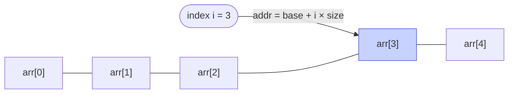

# Memorize: Arrays

## In a Hurry?

- **Core Operations**: create, access by index (`O(1)`), modify by index (`O(1)`), traverse — plus multidimensional access via the same formula extended with one stride per dimension.
- **Complexities**: access `O(1)`, modify `O(1)`, search `O(n)` (unsorted) or `O(log n)` (sorted via binary search), insert/delete at end `O(1)` amortised, insert/delete in the middle `O(n)`, total space `O(n)` for a 1D array or `O(Π dᵢ)` for an N-D array of shape `(d₀, d₁, …, d_{N−1})`.
- **One Use-Case**: NumPy `ndarray` — one contiguous buffer with an N-tuple of strides that powers every PyTorch tensor, every Pandas column, and every image and video pixel buffer; the same address arithmetic indexes a scalar, a row vector, or a 4D training batch.

---

## One-Line Mnemonic

**A row of identical mailboxes, all the same size — and a grid of mailboxes is rows of rows. The index is how many doors past the corner you walk; the stride is how far between rows.**

The mailboxes are the cells; the street is the contiguous memory block; the "corner" is the base address. Same-size doors are what make "skip `i` of them" a one-step computation. Stack the streets into a grid and you still only need one address per coordinate — multiply each index by its stride, add them up, walk that many doors past the base.

---

## Real-World Analogy

Imagine a long apartment building where every flat has the exact same floor plan. The building's street number is the address of flat `0`; every other flat sits a fixed number of metres further down. To find flat `7`, you do not knock on doors `0`, `1`, `2`, …, `6` — you walk straight to `street_number + 7 × flat_width`. One multiplication, one addition, and you are standing at the right door. Now imagine the building is a high-rise: same identical flats, stacked on identical floors. To find *floor 3, flat 7*, you do `street_number + 3 × floor_height + 7 × flat_width` — two strides, one address. Add depth (apartment cluster) and a fourth dimension (city block) and the formula keeps growing one term at a time. The same two costs apply: you cannot stick a new flat between `3` and `4` without shoving every higher-numbered flat one slot up, and the building's shape — floors, flats per floor, depth — is fixed the day construction finishes.

---

## Visual Summary

<strong>An array is one contiguous block of equal-size cells. Any index is a single multiply-add away — addr = base + i × size — so access and modify are O(1) regardless of length.</strong>

---

## Key Operations

| Operation | Time | Space | Key Insight |
|---|---|---|---|
| Create (fixed size, default values) | `O(n)` | `O(n)` | Zero-fills `n` cells; the allocator writes every byte. |
| Access by index 1D (`arr[i]`) | `O(1)` | `O(1)` | One multiply, one add, one read — independent of `i` and `n`. |
| Access by index 2D (`arr[i][j]`, row-major) | `O(1)` | `O(1)` | `address = base + (i × num_cols + j) × element_size` — two multiplies, two adds. |
| Access by index N-D (`arr[i₀]…[i_{N−1}]`) | `O(1)` | `O(1)` | `address = base + Σ index_k × stride_k`; constant time because `N` is a constant. |
| Modify by index (any rank) | `O(1)` | `O(1)` | Same address arithmetic as access, plus one memory write. |
| Search (unsorted) | `O(n)` | `O(1)` | No structure to exploit — every cell may hold the target. |
| Search (sorted, binary) | `O(log n)` | `O(1)` | Sorted layout enables halving; the contiguous block is what makes the midpoint `O(1)` to find. |
| Traverse 1D | `O(n)` | `O(1)` | Loop walks adjacent bytes; the prefetcher keeps up for free. |
| Traverse 2D row-major (rows outer, cols inner) | `O(m × n)` | `O(1)` | Inner loop walks adjacent bytes — cache-friendly in C/Python/Java. |
| Traverse 2D column-major (cols outer, rows inner) | `O(m × n)` | `O(1)` | Inner loop jumps `num_cols × element_size` each step — cache-hostile in a row-major language; `5–10×` slower in wall clock. |
| Insert at end (fixed-size) | `O(1)` | `O(1)` | Only if there is unused capacity. |
| Insert at end (dynamic array) | `O(1)` amortised, `O(n)` worst | `O(1)` amortised | Geometric resizing spreads the resize-and-copy work over all appends. |
| Insert in the middle | `O(n)` | `O(1)` | Every element from the insertion index onward shifts one slot right. |
| Delete from the end | `O(1)` | `O(1)` | One decrement of the logical length. |
| Delete from the middle | `O(n)` | `O(1)` | Every element after the deletion index shifts one slot left. |
| Slice (Python `list`) | `O(k)` | `O(k)` | Allocates a new list of length `k`; full copy. |
| Slice (NumPy `ndarray`) | `O(1)` | `O(1)` | Returns a view — same buffer, new strides; writes back-propagate to the original. |

---

## Common Mistakes

- **Treating dynamic-array append as a true `O(1)` operation in latency-critical code**:
  - *What*: relying on `list.append` / `ArrayList.add` / `vector::push_back` to be constant-time inside a real-time loop (audio, game frame, trading hot path).
  - *Why*: the promise is *amortised* `O(1)` — every full buffer triggers an `O(n)` resize-and-copy spike that blows the per-iteration latency budget.
  - *Fix*: pre-size when the final length is known (`[0] * n`, `new ArrayList<>(n)`); the buffer never grows and no resize ever fires.
- **Inserting or deleting in the middle of an array inside a loop**:
  - *What*: calling `list.insert(i, x)` / `list.remove(x)` / `ArrayList.add(i, x)` inside a loop over `n` elements.
  - *Why*: each call shifts every element from index `i` onward — that is `O(n)` per call, so the loop is silently `O(n²)`.
  - *Fix*: build a new list with a comprehension or filter, or switch to a structure designed for middle-insertion (linked list, deque).
- **Assuming negative indexing and out-of-bounds reads behave the same across languages**:
  - *What*: porting `arr[-1]` or `arr[n]` between Python, Java, and C without thinking about the difference.
  - *Why*: `arr[-1]` is "the last element" in Python and JavaScript's `at()`, undefined behaviour in C (reads memory *before* the buffer), and an exception in Java; `arr[n]` raises in Python / Java but is undefined in C.
  - *Fix*: compute `arr[len - 1]` explicitly when porting; never rely on implicit bounds checks in C or C++.
- **Iterating a 2D array in the cache-hostile loop order**:
  - *What*: writing `for c: for r: arr[r][c]` in a row-major language, jumping a full row's stride per step.
  - *Why*: row-major lays adjacent column indices in adjacent memory; column-stride traversal evicts the cache line on every step instead of every `row_width` step. Same `O(rows × cols)`, `5–10×` slower in wall-clock.
  - *Fix*: put the rightmost subscript in the innermost loop in row-major languages (C, Python, Java, NumPy default); flip the convention in column-major ones (Fortran, MATLAB, BLAS).
- **Mixing row-major and column-major mental models across language boundaries**:
  - *What*: assuming `arr[i][j]` resolves to the same address everywhere when bridging Python ↔ Fortran, NumPy ↔ BLAS, or row-major ↔ column-major libraries.
  - *Why*: the address formula uses a different stride product under each convention — row-major multiplies the *inner* dims, column-major multiplies the *outer* dims.
  - *Fix*: check the storage convention before you write the loop; in NumPy, pin it explicitly with `order='C'` or `order='F'` and verify via `arr.flags`.
- **The `[[0] * cols] * rows` shared-row trap in Python**:
  - *What*: writing to `grid[0][0]` mutates every row of the supposedly-independent 2D grid.
  - *Why*: `[0] * cols` evaluates once to one inner list; multiplying by `rows` aliases the SAME inner list `rows` times — they all point to the same memory.
  - *Fix*: use `[[0] * cols for _ in range(rows)]`, which re-evaluates `[0] * cols` per iteration and produces `rows` independent inner lists.
- **Mixing up Python `list` slicing (copy) with NumPy slicing (view)**:
  - *What*: editing `np_arr[1:5]` and being surprised that the original `np_arr` changed too.
  - *Why*: `lst[1:5]` allocates a new list (snapshot); `np_arr[1:5]` returns a view into the same backing buffer, so writes back-propagate.
  - *Fix*: call `.copy()` on a NumPy slice when you intend a snapshot; check `arr.base is None` to confirm a buffer is independent.

---

## Quick Recall

Click any question to reveal the answer.

<strong>Q:</strong> Worst-case complexity of <code>arr[i]</code> read or write?

**A:** `O(1)` time, `O(1)` space. One multiplication and one addition compute the address; one memory read or write completes the access.

<strong>Q:</strong> Worst-case complexity of inserting at the middle of an array of length <code>n</code>?

**A:** `O(n)` time, `O(1)` extra space. Every element from the insertion index to the end shifts one slot to the right.

<strong>Q:</strong> Worst-case complexity of <code>arr.append(x)</code> on a <em>dynamic</em> array?

**A:** `O(n)` time worst case (the resize-and-copy step); `O(1)` amortised across many appends because geometric resizing spreads the total resize work as `O(n)` over `n` appends.

<strong>Q:</strong> Why are array indices zero-based?

**A:** The address formula `addr = base + size × index` lands on the first element when `index = 0`. Starting at `1` would skip the base address and require a `-1` correction in the formula on every access.

<strong>Q:</strong> Address of element at index <code>i</code> in an int array of base address <code>B</code> with 4-byte ints?

**A:** `B + 4 × i`.

<strong>Q:</strong> Why are arrays so cache-friendly?

**A:** Contiguous memory plus fixed element size means the CPU's hardware prefetcher can predict the next cache line and fetch it before the program asks for it. Linked structures defeat this at every pointer hop.

<strong>Q:</strong> Difference between Python's <code>list</code> and <code>array.array</code>?

**A:** `list` is an array of `PyObject*` pointers — heterogeneous, every element a heap-allocated boxed object. `array.array` is a typed primitive array (one contiguous buffer of `int`s, `float`s, etc.) with no boxing. NumPy's `ndarray` generalises the same idea to N dimensions.

<strong>Q:</strong> What does <em>contiguous</em> mean for an array's storage?

**A:** Every element sits immediately next to its neighbour in memory, with no gaps between cells and no pointer hops. The address of `arr[i+1]` is always `address(arr[i]) + size_of_element`.

<strong>Q:</strong> Why must every element of a fixed-size array have the same type?

**A:** Because the address formula `base + size × index` requires a single, known `size` per element. Mixed-type elements would each occupy a different number of bytes and break the constant-time indexing guarantee.

<strong>Q:</strong> What does a Python <code>list</code> slice return versus a NumPy slice?

<!-- VERIFY: NumPy basic slicing returns a view; fancy indexing (arr[[1,3,5]]) returns a copy. Phrasing covers the common slice form. -->

**A:** `list[1:5]` allocates a new list (a copy). `numpy[1:5]` returns a view into the same backing buffer, so mutations write through to the original.

<strong>Q:</strong> What is the pre-size pattern in Python and Java to avoid resize hiccups?

**A:** `arr = [0] * n` in Python, or `new ArrayList<>(n)` in Java — pre-allocates the backing buffer so subsequent appends do not trigger reallocation.

<strong>Q:</strong> Address formula for <code>arr[i][j]</code> in a row-major 2D <code>int</code> array with base <code>B</code>, <code>num_cols</code> columns, and 4-byte ints?

**A:** `B + (i × num_cols + j) × 4`. The row index is multiplied by the row width (`num_cols`) because each step in `i` skips one whole row.

<strong>Q:</strong> Address formula for <code>arr[i][j]</code> in a column-major 2D <code>int</code> array with base <code>B</code>, <code>num_rows</code> rows, and 4-byte ints?

**A:** `B + (j × num_rows + i) × 4`. The column index is multiplied by the column height (`num_rows`) because each step in `j` skips one whole column.

<strong>Q:</strong> Generalised N-dimensional address formula?

**A:** `address = base + Σ index_k × stride_k`, where `stride_k` for a row-major array is the product of all dimensions to the right of `k` (and for column-major, the product of all dimensions to the left). One multiply and one add per dimension; `O(1)` because `N` is a constant.

<strong>Q:</strong> In a row-major 2D array, why is <code>for r: for c: arr[r][c]</code> faster than <code>for c: for r: arr[r][c]</code> even though both are <code>O(m × n)</code>?

**A:** The first walks adjacent bytes (`arr[r][c]` and `arr[r][c+1]` are neighbours in memory), so the hardware prefetcher keeps the cache filled. The second jumps `num_cols × element_size` between accesses, missing the cache on most steps. The Big-O is identical; the wall-clock factor is `5–10×` on large matrices.

<strong>Q:</strong> What is the <code>[[0] * cols] * rows</code> trap in Python?

**A:** It creates *one* inner list of zeros and aliases it `rows` times, so writing `grid[0][0] = 1` makes every row's first cell `1`. Use `[[0] * cols for _ in range(rows)]` — the comprehension evaluates `[0] * cols` afresh per row and produces independent lists.

<strong>Q:</strong> Why does the row-major address formula multiply <code>i</code> by <code>num_cols</code> instead of <code>num_rows</code>?

**A:** Each row stores `num_cols` elements, so skipping one full row jumps `num_cols` cells in memory. The multiplier is the length of the contiguous span you are stepping over; for row-major that is the row width.

