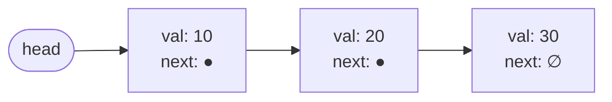

# Linked Lists

## Why It Exists

You just saw the array's defining weakness: inserting or deleting anywhere but the end is `O(n)`, because every element after the gap has to shift over to keep the block packed. Push a value onto the front of a million-item array and a million items slide one slot to the right.

What if adding an item didn't move anything at all? What if you could splice a new value into the sequence by changing *two pointers* — no shifting, no copying, no matter how long the list is?

That's the **linked list**. It throws out the one rule that makes arrays both fast and rigid — *store everything in one contiguous block* — and replaces it with a chain of separate nodes that each know only where the next one lives.

## See It Work

Here are three nodes linked into a chain, and a loop that walks it from the `head` to the end. Run it — then click **Visualise** and watch the walker hop along the `next` pointers.

> ▶ Run it, then click **Visualise** — watch the walker hop along the `next` pointers from `head` to `null`.

```python run viz=linked-list viz-root=head viz-kind=list-single
class Node:
    def __init__(self, val):
        self.val = val
        self.next = None        # link to the next node — None means "end"

# build  head → 10 → 20 → 30 → null
head = Node(10)
head.next = Node(20)
head.next.next = Node(30)

# traverse: follow `next` until it runs off the end
node = head
while node is not None:
    print(node.val)
    node = node.next
```

## How It Works

A linked list is a chain of **nodes**, where each node carries two things:

- **value** — the data the node stores.
- **next** — a *reference* (another word for a pointer: a stored address) to the following node, or **null** for the last one.



<p align="center"><strong><code>head</code> points at the first node; each node's <code>next</code> links to the following one; the last node's <code>next</code> is <code>null</code> (∅).</strong></p>

A single **head** reference anchors the list; from it, you reach every other node by following `next` arrows. The nodes themselves sit at *scattered* addresses — wherever the allocator found room — so what puts them in order is the chain of pointers, not their position in memory. That one change flips every cost the array gave you:

- **Inserting is `O(1)` — at the head, or right after a node you already hold.** It's two pointer writes: point the new node at the rest of the list, then point the previous link at the new node. Nothing shifts, whatever the length.
- **Deleting has a catch.** To remove a node you make the node *before* it skip over it — but a singly node only knows its *successor*, never the node behind it. Removing the head is `O(1)`; removing one in the middle means first walking from the head to find its predecessor, an `O(n)` scan. (That blind spot is exactly what the doubly linked list fixes next.)
- **Access by position is `O(n)`.** There's no `base + i × size` arithmetic — to reach the k-th node you follow k pointers from the head, one hop at a time.

The invariant that keeps it sound: starting at `head` and following `next` repeatedly visits every node exactly once and ends at `null`. Lose the `head` reference and the whole list is unreachable — every node is findable only through the one before it.

That gives the array and the linked list mirror-image strengths:

| | Array | Linked list |
|---|---|---|
| Access k-th item | `O(1)` (address arithmetic) | `O(n)` (walk from head) |
| Insert / delete at front | `O(n)` (shift everything) | `O(1)` (rewire two pointers) |
| Memory | packed, fast to scan | one extra pointer per node; nodes scattered |

### Key Takeaway

A linked list trades the array's instant indexing for cheap edits at a spot you already hold — `O(1)` to insert there or remove the head — but `O(n)` to *find* a spot, since there's no indexing.

## Trace It

Insert `5` at the front of `head → 10 → 20 → 30`:

1. Make a new node holding `5`.
2. Point its `next` at the current head (`10`).
3. Move `head` to the new node.

Done — `head → 5 → 10 → 20 → 30`. Two pointer writes, and not one of the existing nodes moved.

Before you read on: if that list held a *million* nodes instead of three, how many of them would shift to make room at the front?

Still zero. That's the whole point — the cost of a head insert doesn't depend on the length at all, where the array's `O(n)` front-insert grows with every element. The flip side shows up the moment you ask for "the 500,000th item": the array jumps there instantly; the linked list has to walk half a million `next` hops to find it.

## Your Turn

Build a list by pushing onto the front — each push is the `O(1)` two-write splice you just traced — then walk it:

```python run viz=linked-list viz-root=head viz-kind=list-single
class Node:
    def __init__(self, val, nxt=None):
        self.val = val
        self.next = nxt

def push_front(head, val):       # O(1): the new node points at the old head
    return Node(val, head)

head = None
for v in [30, 20, 10]:           # push 30, then 20, then 10 → list reads 10, 20, 30
    head = push_front(head, v)

node, out = head, []
while node:                      # traverse to collect the values in order
    out.append(node.val)
    node = node.next
print(out)                       # [10, 20, 30]
```

```java run viz=linked-list viz-root=head viz-kind=list-single
public class Main {
  static class Node {
    int val; Node next;
    Node(int val, Node next) { this.val = val; this.next = next; }
  }

  public static void main(String[] args) {
    Node head = null;
    for (int v : new int[]{30, 20, 10}) head = new Node(v, head);  // O(1) push-front

    StringBuilder out = new StringBuilder();
    for (Node node = head; node != null; node = node.next) out.append(node.val).append(" ");
    System.out.println(out.toString().trim());   // 10 20 30
  }
}
```

Ready to make the pointers dance? Start with [Reverse a List](/cortex/data-structures-and-algorithms/linear-structures/singly-linked-list/pattern-reversal/pattern) — the three-pointer walk that every linked-list interview leans on.

## Reflect & Connect

Linked lists rarely show up in everyday application code, yet they sit under some of the most critical infrastructure in the stack — precisely because `O(1)` splicing is worth more than fast scanning when the list *is* a queue of work. (The systems named below are ones you'll meet later; the point here is just that the humble linked list is everywhere underneath.)

- **The Linux kernel** threads processes, open files, and driver registrations through `struct list_head` — an *intrusive* list, meaning the link fields live inside each structure instead of in separate node objects.
- **Garbage collectors** keep freed memory blocks on a singly linked *free list* — reclaiming a block is one pointer write to push it onto the head.
- **LISP and every functional language** build lists from `cons` cells (two-field nodes: a value and a link to the rest), so a new version can share the entire tail of the old one — impossible with a contiguous array.

But know when *not* to reach for one. Here is the catch the costs above hide: memory arrives in fast contiguous chunks called **cache lines**, so scanning an array's packed cells streams along, while hopping a linked list's scattered nodes pays a fresh memory fetch at nearly every step. Bjarne Stroustrup's well-known benchmark shows a growable array beating a linked list on almost every workload for exactly this reason. The rule of thumb: a linked list wins when the work is mostly `O(1)` edits at the ends (queues, free lists, undo stacks); the array wins when you need indexed access, that cache-friendly scanning, or tight memory — which is most of the time.

**Prerequisites:** [Arrays](/cortex/data-structures-and-algorithms/linear-structures/arrays/what-is-an-array) and [Measuring Cost](/cortex/data-structures-and-algorithms/foundations/measuring-cost).
**What's next:** the patterns that make linked lists sing — [Reversal](/cortex/data-structures-and-algorithms/linear-structures/singly-linked-list/pattern-reversal/pattern) and [Fast & Slow Pointers](/cortex/data-structures-and-algorithms/linear-structures/singly-linked-list/pattern-fast-and-slow-pointers/pattern) (Floyd's cycle trick).

## Recall

> **Mnemonic:** *Value + `next`, anchored at `head`, terminated by `null`. Cheap to splice, costly to find.*

| Operation | Cost | Why |
|---|---|---|
| insert at head, or after a held node | `O(1)` | two pointer writes; nothing shifts |
| delete the head | `O(1)` | re-anchor `head` to the next node |
| delete or find a node by position | `O(n)` | no look-back, no indexing — walk from `head` |
| space | `O(n)` + one pointer per node | the `next` reference is the overhead |

<details>
<summary><strong>Q:</strong> What two things does a node hold?</summary>

**A:** A value and a `next` pointer to the following node (or `null` at the tail).

</details>
<details>
<summary><strong>Q:</strong> Why is a head insert `O(1)` for a list but `O(n)` for an array?</summary>

**A:** The list rewires two pointers; the array shifts every element right.

</details>
<details>
<summary><strong>Q:</strong> Why is reaching the k-th node `O(n)`?</summary>

**A:** No address arithmetic — you follow k `next` pointers from the head.

</details>
<details>
<summary><strong>Q:</strong> When does a linked list beat a dynamic array?</summary>

**A:** When the work is mostly `O(1)` edits at the ends; the array wins on indexed access, cache, and memory.

</details>

## Sources & Verify

- **CLRS** (Cormen, Leiserson, Rivest, Stein), *Introduction to Algorithms*, 4th ed., **§10.2 — Linked Lists**: the canonical treatment of singly/doubly lists, sentinels, and the complexity proofs.
- **Linus Torvalds — "good taste" and the pointer-to-pointer delete** ([clip](https://www.youtube.com/watch?v=o8NPllzkFhE)) — why deleting with a pointer *to* the link erases the special-case for the head.
- **Bjarne Stroustrup — "Why you should avoid linked lists"** (GoingNative 2012) — the cache-locality benchmark where `std::vector` beats `std::list`; read it to calibrate *when* a list actually wins.
- **Linux kernel** [`include/linux/list.h`](https://github.com/torvalds/linux/blob/master/include/linux/list.h) — the most-read linked-list implementation in the world; verify the `O(1)` insert/delete claims against real code.
- Both runnable blocks are verified by running; the `O(1)`-splice / `O(n)`-access costs follow directly from the trace.
