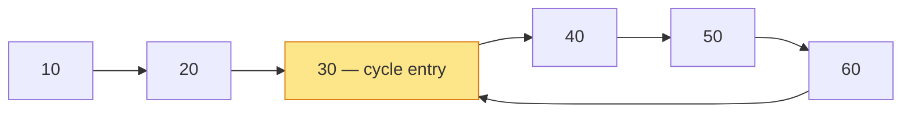

## Why It Exists

A [linked list](/cortex/data-structures-and-algorithms/linear-structures/singly-linked-list/what-is-a-linked-list) is supposed to end: follow `.next` enough times and you hit `null`. But one misplaced pointer — `tail.next = head` — turns the list into a loop, and your innocent `while (cur != null)` traversal runs *forever*, pegging a CPU core and taking production down. So you need to *detect* whether a list contains a cycle.

The obvious fix is a **visited set**: walk the list, remember every node you've seen, and if you ever revisit one, there's a cycle. Correct, but it costs `O(n)` extra memory. **Floyd's tortoise-and-hare** does it in `O(1)` space with a beautiful trick: run two pointers at different speeds — a **slow** one moving one node per step and a **fast** one moving two. If the list ends, the fast pointer falls off the end (`null`) and there's no cycle. If the list loops, the fast pointer laps the track and *must* eventually land on the slow one — they meet *inside* the cycle. No bookkeeping, no extra memory, just two pointers and the arithmetic of relative speed. And a second phase recovers something the visited-set can't get for free: the exact node where the cycle *begins*.

## See It Work

Build one list whose tail loops back into the middle and one that ends normally, then run the two pointers on each:

> ▶ Run it — `true` for the cyclic list, `false` for the straight one.

```python run viz=linked-list viz-root=head viz-kind=list-single
import ast

class ListNode:
    def __init__(self, val, next=None):
        self.val = val
        self.next = next

def build_list(values, pos):
    if not values:
        return None
    nodes = []
    head = None
    for v in reversed(values):
        node = ListNode(v, head)
        head = node
        nodes.insert(0, node)
    if pos >= 0:
        nodes[-1].next = nodes[pos]   # tail links back -> cycle
    return head

def has_cycle(head):
    slow = fast = head
    while fast and fast.next:
        slow = slow.next                 # tortoise: 1 step
        fast = fast.next.next            # hare: 2 steps
        if slow is fast: return True     # they met -> cycle
    return False                          # fast fell off the end -> no cycle

values = ast.literal_eval(input())
pos = int(input())
head = build_list(values, pos)
print("true" if has_cycle(head) else "false")
```

```java run viz=linked-list viz-root=head viz-kind=list-single
import java.util.*;

public class Main {
    static class ListNode {
        int val; ListNode next;
        ListNode(int val) { this.val = val; }
        ListNode(int val, ListNode next) { this.val = val; this.next = next; }
    }

    static ListNode buildList(int[] values, int pos) {
        if (values.length == 0) return null;
        ListNode[] nodes = new ListNode[values.length];
        for (int i = 0; i < values.length; i++) nodes[i] = new ListNode(values[i]);
        for (int i = 0; i < values.length - 1; i++) nodes[i].next = nodes[i + 1];
        if (pos >= 0) nodes[values.length - 1].next = nodes[pos];   // tail links back -> cycle
        return nodes[0];
    }

    static boolean hasCycle(ListNode head) {
        ListNode slow = head, fast = head;
        while (fast != null && fast.next != null) {
            slow = slow.next; fast = fast.next.next;        // 1 step vs 2 steps
            if (slow == fast) return true;
        }
        return false;
    }

    public static void main(String[] args) {
        Scanner sc = new Scanner(System.in);
        int[] values = parseIntArray(sc.nextLine());
        int pos = Integer.parseInt(sc.nextLine().trim());
        ListNode head = buildList(values, pos);
        System.out.println(hasCycle(head));
    }

    // "[1, 2, 3]" → {1, 2, 3}
    static int[] parseIntArray(String line) {
        String inner = line.replaceAll("[\\[\\]\\s]", "");
        if (inner.isEmpty()) return new int[0];
        String[] parts = inner.split(",");
        int[] out = new int[parts.length];
        for (int i = 0; i < parts.length; i++) out[i] = Integer.parseInt(parts[i]);
        return out;
    }
}
```

```testcases
{
  "args": [
    { "id": "values", "label": "values", "type": "int[]", "placeholder": "[10, 20, 30, 40, 50, 60]" },
    { "id": "pos", "label": "pos (tail→index, -1=none)", "type": "int", "placeholder": "2" }
  ],
  "cases": [
    { "args": { "values": "[10, 20, 30, 40, 50, 60]", "pos": "2" }, "expected": "true" },
    { "args": { "values": "[10, 20, 30, 40, 50, 60]", "pos": "-1" }, "expected": "false" },
    { "args": { "values": "[]", "pos": "-1" }, "expected": "false" },
    { "args": { "values": "[1]", "pos": "-1" }, "expected": "false" },
    { "args": { "values": "[1]", "pos": "0" }, "expected": "true" },
    { "args": { "values": "[1, 2]", "pos": "0" }, "expected": "true" },
    { "args": { "values": "[1, 2]", "pos": "-1" }, "expected": "false" },
    { "args": { "values": "[1, 2, 3, 4]", "pos": "1" }, "expected": "true" }
  ]
}
```

Both print `true` for the cyclic list and `false` for the straight one. On the cyclic list the fast pointer can never reach `null` — it's trapped on the loop — so it keeps lapping until it collides with the slow pointer. On the straight list the fast pointer reaches the end, the `while` condition fails, and we return `false`. Two pointers, no extra memory, and the same `O(n)` traversal cost as a single pass.

## How It Works

The whole algorithm is two phases over a "ρ-shaped" list — a tail that runs into a loop:



<p align="center"><strong>A list with a cycle looks like the Greek letter ρ: a straight "tail" (10 → 20) leading into a loop (30 → 40 → 50 → 60 → back to 30). Node 30 is the <em>cycle entry</em> — the only node with two incoming links.</strong></p>

- **Why they're guaranteed to meet (phase 1).** If there's no cycle, the fast pointer hits `null` and you're done. If there *is* a cycle, both pointers eventually enter the loop, and from then on think of the *forward distance from fast to slow* around the loop. Each step, fast advances 2 and slow advances 1, so fast gains exactly **1** on slow per step. A quantity that decreases by exactly 1 each step must pass through 0 — and 0 means they're on the same node. Crucially, gaining only 1 per step means fast can never *leap over* slow without landing on it ([Trace It](#trace-it)). The meeting happens within `O(n)` steps, using `O(1)` space.
- **Finding the cycle entry (phase 2).** Detection alone returns a boolean; the meeting point is somewhere *inside* the loop, not the entry. The fix is a clean piece of arithmetic: let `μ` be the tail length (head to entry) and the meeting point be some distance into the loop. It works out that the distance from the **head** to the entry equals the distance from the **meeting point** to the entry (modulo the loop length). So **reset one pointer to the head**, then advance *both* pointers one step at a time — they meet exactly at the cycle's entry node ([Your Turn](#your-turn)).
- **Why O(1) space matters.** A visited-set solves detection too, but at `O(n)` memory — untenable for a billion-node list or a memory-constrained device. Floyd needs two pointers regardless of list size. (Brent's algorithm is a faster cousin with the same `O(1)` space.) The same two-speed-pointer idea also finds a list's **midpoint** in one pass (when fast hits the end, slow is at the middle) and powers palindrome and reorder algorithms — it's the [fast-and-slow-pointers pattern](/cortex/data-structures-and-algorithms/linear-structures/singly-linked-list/what-is-a-linked-list).

> **Key takeaway.** **Floyd's tortoise-and-hare** detects a cycle with two pointers — slow (1 step) and fast (2 steps) — in `O(n)` time and `O(1)` space. No cycle → fast reaches `null`; cycle → fast gains 1 node on slow each step, so it must land on slow (it can't skip past). That's phase 1 (a boolean). **Phase 2** finds the cycle's entry: reset one pointer to the head and advance both one step at a time until they meet. It's the `O(1)`-space alternative to an `O(n)` visited-set, and the seed of the fast-and-slow-pointers pattern.

## Trace It

The claim that fast "must land on" slow rather than jump over it is the crux of the proof — and it's easy to doubt, since fast moves *two* nodes at a time. Watch the gap.

**Predict before you run:** both pointers are in a loop of length 5, and fast is currently 3 nodes ahead of slow (equivalently, 3 nodes *behind*, going forward around the loop). Since fast moves 2 and slow moves 1, fast closes that gap by 1 each step. What does the gap do over successive steps — does it hit 0 exactly, or can it skip from 1 straight past 0?

```python run viz=linked-list viz-root=head viz-kind=list-single
# Once both pointers are in a cycle of length L, track the forward gap from fast to slow.
# fast moves 2, slow moves 1 -> fast closes the gap by EXACTLY 1 each step, so it reaches 0
# (a meeting) and can never leap past slow.
def gap_each_step(L, start_gap):
    gap, seq = start_gap, [start_gap]
    while gap != 0:
        gap = (gap - 1) % L              # closes by exactly 1 per step
        seq.append(gap)
    return seq

L = int(input())
start_gap = int(input())
print(gap_each_step(L, start_gap))
```

```java run viz=linked-list viz-root=head viz-kind=list-single
import java.util.*;

public class Main {
    static List<Integer> gapEachStep(int L, int startGap) {
        List<Integer> seq = new ArrayList<>();
        int gap = startGap;
        seq.add(gap);
        while (gap != 0) {
            gap = (gap - 1) % L;
            seq.add(gap);
        }
        return seq;
    }

    public static void main(String[] args) {
        Scanner sc = new Scanner(System.in);
        int L = Integer.parseInt(sc.nextLine().trim());
        int startGap = Integer.parseInt(sc.nextLine().trim());
        System.out.println(gapEachStep(L, startGap));
    }
}
```

```testcases
{
  "args": [
    { "id": "L", "label": "L (cycle length)", "type": "int", "placeholder": "5" },
    { "id": "start_gap", "label": "start_gap", "type": "int", "placeholder": "3" }
  ],
  "cases": [
    { "args": { "L": "5", "start_gap": "3" }, "expected": "[3, 2, 1, 0]" },
    { "args": { "L": "5", "start_gap": "1" }, "expected": "[1, 0]" },
    { "args": { "L": "4", "start_gap": "2" }, "expected": "[2, 1, 0]" },
    { "args": { "L": "6", "start_gap": "5" }, "expected": "[5, 4, 3, 2, 1, 0]" },
    { "args": { "L": "3", "start_gap": "0" }, "expected": "[0]" }
  ]
}
```

<details>
<summary><strong>Reveal</strong></summary>

The gap goes `[3, 2, 1, 0]` — it decreases by exactly 1 each step and lands *on* 0. That 0 is the meeting: both pointers on the same node. The reason fast can't "skip over" slow is the heart of the proof: although fast moves two physical nodes per step, its position *relative to slow* changes by only **one** node per step (2 − 1 = 1). A relative speed of 1 means fast visits every relative offset in turn — `3, 2, 1, 0` — so it cannot jump from offset 1 to a negative offset without passing through 0. (Contrast a fast pointer of speed 3: relative speed 2 could step 2 → 0 *or* 2 → ... and on some loop lengths overshoot, which is exactly why the classic algorithm uses speed 2, where relative speed is guaranteed to be 1.) This is also why detection is `O(n)`: the gap starts at less than the loop length and shrinks by 1 each step, so they meet within a loop's worth of steps. The two-pointer trick isn't luck — it's the arithmetic of relative speed 1 around a finite ring.

</details>

## Your Turn

Detection gives a yes/no. The richer question — *where does the cycle begin?* — falls out of one more pass with a surprising reset.

**Predict:** after the pointers meet inside the loop, you reset one pointer to the head and advance *both* one node at a time. For the list `[10, 20, 30, 40, 50, 60]` whose tail loops back to index 2, which node do they meet at?

```python run viz=linked-list viz-root=head viz-kind=list-single
import ast

class ListNode:
    def __init__(self, val, next=None):
        self.val = val
        self.next = next

def build_list(values, pos):
    if not values:
        return None
    nodes = []
    head = None
    for v in reversed(values):
        node = ListNode(v, head)
        head = node
        nodes.insert(0, node)
    if pos >= 0:
        nodes[-1].next = nodes[pos]
    return head

def cycle_start(head):
    # Your code goes here — phase 1: advance slow (1 step) and fast (2 steps)
    # until they meet. Phase 2: reset one pointer to head, advance both 1
    # step until they meet again — that node is the cycle entry.
    # Return None if no cycle.
    pass

values = ast.literal_eval(input())
pos = int(input())
head = build_list(values, pos)
result = cycle_start(head)
print(result.val if result else -1)
```

```java run viz=linked-list viz-root=head viz-kind=list-single
import java.util.*;

public class Main {
    static class ListNode {
        int val; ListNode next;
        ListNode(int val) { this.val = val; }
        ListNode(int val, ListNode next) { this.val = val; this.next = next; }
    }

    static ListNode buildList(int[] values, int pos) {
        if (values.length == 0) return null;
        ListNode[] nodes = new ListNode[values.length];
        for (int i = 0; i < values.length; i++) nodes[i] = new ListNode(values[i]);
        for (int i = 0; i < values.length - 1; i++) nodes[i].next = nodes[i + 1];
        if (pos >= 0) nodes[values.length - 1].next = nodes[pos];
        return nodes[0];
    }

    static ListNode cycleStart(ListNode head) {
        // Your code goes here — phase 1: advance slow (1 step) and fast (2 steps)
        // until they meet. Phase 2: reset one pointer to head, advance both 1
        // step until they meet again — that node is the cycle entry.
        // Return null if no cycle.
        return null;
    }

    public static void main(String[] args) {
        Scanner sc = new Scanner(System.in);
        int[] values = parseIntArray(sc.nextLine());
        int pos = Integer.parseInt(sc.nextLine().trim());
        ListNode head = buildList(values, pos);
        ListNode result = cycleStart(head);
        System.out.println(result != null ? result.val : -1);
    }

    // "[1, 2, 3]" → {1, 2, 3}
    static int[] parseIntArray(String line) {
        String inner = line.replaceAll("[\\[\\]\\s]", "");
        if (inner.isEmpty()) return new int[0];
        String[] parts = inner.split(",");
        int[] out = new int[parts.length];
        for (int i = 0; i < parts.length; i++) out[i] = Integer.parseInt(parts[i]);
        return out;
    }
}
```

```testcases
{
  "args": [
    { "id": "values", "label": "values", "type": "int[]", "placeholder": "[10, 20, 30, 40, 50, 60]" },
    { "id": "pos", "label": "pos (tail→index, -1=none)", "type": "int", "placeholder": "2" }
  ],
  "cases": [
    { "args": { "values": "[10, 20, 30, 40, 50, 60]", "pos": "2" }, "expected": "30" },
    { "args": { "values": "[10, 20, 30, 40, 50, 60]", "pos": "-1" }, "expected": "-1" },
    { "args": { "values": "[1, 2, 3, 4]", "pos": "0" }, "expected": "1" },
    { "args": { "values": "[1, 2, 3, 4]", "pos": "1" }, "expected": "2" },
    { "args": { "values": "[1]", "pos": "0" }, "expected": "1" },
    { "args": { "values": "[1, 2]", "pos": "-1" }, "expected": "-1" }
  ]
}
```

<details>
<summary>Editorial</summary>

Both print `cycle start value: 30 | node index: 2` — exactly the node the tail loops back to. The reset looks like magic but it's just algebra: if the tail (head → entry) has length `μ` and the meeting point sits `k` nodes into a loop of length `L`, the meeting-point identity works out so that `μ` steps from the head and `μ` steps onward from the meeting point both arrive at the entry. So advancing two pointers at the *same* speed — one from the head, one from the meeting point — collides them precisely at the entry, in another `O(n)` steps and `O(1)` space. With the entry node in hand you can also *break* the loop (set the node just before the entry's `.next = null`), which is how "remove the cycle" problems are solved.

```python solution time=O(n) space=O(1)
import ast

class ListNode:
    def __init__(self, val, next=None):
        self.val = val
        self.next = next

def build_list(values, pos):
    if not values:
        return None
    nodes = []
    head = None
    for v in reversed(values):
        node = ListNode(v, head)
        head = node
        nodes.insert(0, node)
    if pos >= 0:
        nodes[-1].next = nodes[pos]
    return head

def cycle_start(head):
    slow = fast = head
    while fast and fast.next:
        slow = slow.next; fast = fast.next.next
        if slow is fast:                         # phase 1: met inside the cycle
            p = head                             # phase 2: reset one pointer to the head
            while p is not slow:                 # advance both 1 step -> meet at the entry
                p = p.next; slow = slow.next
            return p
    return None

values = ast.literal_eval(input())
pos = int(input())
head = build_list(values, pos)
result = cycle_start(head)
print(result.val if result else -1)
```

```java solution
import java.util.*;

public class Main {
    static class ListNode {
        int val; ListNode next;
        ListNode(int val) { this.val = val; }
        ListNode(int val, ListNode next) { this.val = val; this.next = next; }
    }

    static ListNode buildList(int[] values, int pos) {
        if (values.length == 0) return null;
        ListNode[] nodes = new ListNode[values.length];
        for (int i = 0; i < values.length; i++) nodes[i] = new ListNode(values[i]);
        for (int i = 0; i < values.length - 1; i++) nodes[i].next = nodes[i + 1];
        if (pos >= 0) nodes[values.length - 1].next = nodes[pos];
        return nodes[0];
    }

    static ListNode cycleStart(ListNode head) {
        ListNode slow = head, fast = head;
        while (fast != null && fast.next != null) {
            slow = slow.next; fast = fast.next.next;
            if (slow == fast) {                              // phase 1: met inside the cycle
                ListNode p = head;                           // phase 2: reset one pointer to the head
                while (p != slow) { p = p.next; slow = slow.next; }   // meet at the entry
                return p;
            }
        }
        return null;
    }

    public static void main(String[] args) {
        Scanner sc = new Scanner(System.in);
        int[] values = parseIntArray(sc.nextLine());
        int pos = Integer.parseInt(sc.nextLine().trim());
        ListNode head = buildList(values, pos);
        ListNode result = cycleStart(head);
        System.out.println(result != null ? result.val : -1);
    }

    // "[1, 2, 3]" → {1, 2, 3}
    static int[] parseIntArray(String line) {
        String inner = line.replaceAll("[\\[\\]\\s]", "");
        if (inner.isEmpty()) return new int[0];
        String[] parts = inner.split(",");
        int[] out = new int[parts.length];
        for (int i = 0; i < parts.length; i++) out[i] = Integer.parseInt(parts[i]);
        return out;
    }
}
```

</details>

## Reflect & Connect

- **Two pointers beat a visited-set on space.** Both detect a cycle in `O(n)` time, but Floyd uses `O(1)` memory vs the set's `O(n)`. On huge or memory-tight lists, that's the difference between feasible and not.
- **Relative speed 1 is why it works.** Fast moves 2, slow moves 1, so fast gains exactly one node per step. A gap that shrinks by 1 must hit 0 — they always meet, and fast can never leap past. Speed 2 is the choice that guarantees relative speed 1.
- **Phase 2 is pure algebra.** Reset one pointer to the head, advance both at equal speed; they collide at the cycle entry because head-to-entry distance equals meeting-point-to-entry distance (mod loop length). That also lets you locate and break the loop.
- **It generalizes to the fast-and-slow pattern.** The same two-speed idea finds a list's midpoint (fast hits the end ⇒ slow is centered), tests palindromes, and reorders lists — see the [fast-and-slow-pointers pattern](/cortex/data-structures-and-algorithms/linear-structures/singly-linked-list/what-is-a-linked-list) built on this lesson.
- **Cycles are everywhere.** Beyond linked lists: detecting infinite loops in iterated functions (`x → f(x)`), finding duplicates in an array via the "value-as-pointer" trick (LeetCode 287), and cryptographic cycle-finding (Pollard's rho factorization) all run tortoise-and-hare.

## Recall

<details>
<summary><strong>Q:</strong> How does Floyd's tortoise-and-hare detect a cycle, and at what cost?</summary>

**A:** Run a slow pointer (one step) and a fast pointer (two steps). If the fast pointer reaches `null`, there's no cycle; if it ever equals the slow pointer, there's a cycle. `O(n)` time, `O(1)` space — no visited-set needed.

</details>
<details>
<summary><strong>Q:</strong> Why are the two pointers guaranteed to meet if a cycle exists, and why can't fast skip over slow?</summary>

**A:** Once both are in the loop, fast gains exactly one node on slow per step (it moves 2, slow moves 1). The forward gap therefore decreases by exactly 1 each step and must reach 0 — a meeting. Because the relative change is only 1, fast lands on slow rather than leaping past it.

</details>
<details>
<summary><strong>Q:</strong> How do you find the node where the cycle begins?</summary>

**A:** After the pointers meet inside the loop, reset one pointer to the head and advance both one node per step. They meet at the cycle's entry node, because the head-to-entry distance equals the meeting-point-to-entry distance (modulo the loop length).

</details>
<details>
<summary><strong>Q:</strong> What advantage does Floyd's algorithm have over a hash-set of visited nodes?</summary>

**A:** Both run in `O(n)` time, but the hash-set uses `O(n)` extra space while Floyd uses `O(1)` (just two pointers). For very large or memory-constrained lists, the constant space is decisive.

</details>
<details>
<summary><strong>Q:</strong> Where else does tortoise-and-hare show up?</summary>

**A:** Finding a linked list's midpoint in one pass, palindrome and reorder algorithms (the fast-and-slow pattern), detecting cycles in iterated functions `x → f(x)`, the array-duplicate trick (LeetCode 287), and Pollard's rho factorization.

</details>

## Sources & Verify

- **Floyd's cycle-detection** (tortoise and hare), as presented in **CLRS** and Knuth's *TAOCP* Vol. 2 (exercise 3.1); **Brent's algorithm** (1980) is a faster `O(1)`-space variant.
- **Sedgewick & Wayne**, *Algorithms* — linked-list traversal and two-pointer techniques; LeetCode 141 (Linked List Cycle), 142 (Cycle II), and 287 (Find the Duplicate Number) are the canonical practice problems.
- The detection (`true` on the cyclic list, `false` on the straight one), the gap closing `[3, 2, 1, 0]`, and the phase-2 entry (`value 30, index 2`) all come from the runnable blocks above (deterministic, built from explicit `ListNode` references) — re-run to verify.
