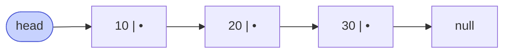

# Memorize: Singly Linked List

## In a Hurry?

- **Core Operations**: traverse, search, insert at head/tail/position, delete at head/tail/by-value, detect cycle (Floyd's tortoise-and-hare).
- **Complexities**: access by index `O(n)`, search `O(n)`, insert at head `O(1)`, insert at tail `O(n)` without a tail pointer or `O(1)` with one, delete head `O(1)`, delete by value `O(n)`, cycle detection `O(n)` time and `O(1)` extra space, total space `O(n)` plus one pointer per node.
- **One Use-Case**: the Linux kernel's `struct list_head` — an intrusively-linked doubly linked list embedded into every process descriptor, open file, and loadable module; `O(1)` insertion and deletion matter more than cache locality when the list represents process queues or driver registrations.

---

## One-Line Mnemonic

**A chain of heap-scattered nodes, each holding a value and the address of the next; only the `head` is named, only the tail's `null` marks the end.**

The chain is the structure; the `head` reference is the single entry point; the `null` is the only termination signal the loop can see. Every operation reduces to two moves: follow a pointer (`curr = curr.next`) or redirect a pointer (`curr.next = ...`).

---

## Real-World Analogy

Picture a treasure hunt where each clue points to the location of the next clue. You only know the address of the first clue — the **head** — and the only way to reach clue seven is to read clues one through six in order. Each slip names exactly one successor; the last slip says *"end of trail"* instead of an address. Add a new clue between two existing ones, and you simply rewrite one instruction on the slip before it and one on the new slip itself — no other treasure hunter has to move, and no other clue has to be rewritten. Remove a clue, and you splice past it the same way: one instruction redirects, the orphaned slip is thrown out. Lose the first slip, and the entire trail becomes unreachable — the clues still exist somewhere, but nobody can find them.

---

## Visual Summary

<strong>Each node holds a value and one forward pointer. You can only walk left-to-right from head, so reaching index i costs O(i) hops — but splicing a node you already hold is O(1).</strong>

---

## Key Operations

| Operation | Time | Space | Key Insight |
|---|---|---|---|
| Access by index (`k`-th node) | `O(k)` | `O(1)` | No address arithmetic — follow `k` `.next` hops from `head`. |
| Search by value | `O(n)` worst, `O(1)` best | `O(1)` | Walk and compare; early-return on the first match. |
| Length | `O(n)` | `O(1)` | No `.length` field — every length query walks the chain, unless the list caches `size`. |
| Traverse all nodes | `O(n)` | `O(1)` | One cursor; stop when `curr` is `null`. Recursive form costs `O(n)` stack space — avoid on large inputs. |
| Insert at head | `O(1)` | `O(1)` | `new.next = head; head = new` — two pointer writes, independent of `n`. |
| Insert at tail (no tail pointer) | `O(n)` | `O(1)` | Walk to the node whose `.next` is `null`, then attach. |
| Insert at tail (cached tail pointer) | `O(1)` | `O(1)` | `tail.next = new; tail = new` — same shape as head insert. |
| Insert after a known node | `O(1)` | `O(1)` | `new.next = node.next; node.next = new` — wire forward first. |
| Insert before a known node | `O(n)` worst, `O(1)` if `node == head` | `O(1)` | Singly linked lists are forward-only — walk with `prev`/`curr` until `curr == node`. |
| Insert at distance `k` | `O(k)` | `O(1)` | Walk `k − 1` steps to the predecessor, then splice. |
| Delete head | `O(1)` | `O(1)` | `head = head.next` — no predecessor required. |
| Delete tail | `O(n)` | `O(1)` | Walk until `curr.next.next == null`, then `curr.next = null`. |
| Delete by value | `O(n)` worst, `O(1)` best (head match) | `O(1)` | Walk `prev`/`curr` until `curr.val == data`; deletes the first match only. |
| Delete after a known node | `O(1)` | `O(1)` | `node.next = node.next.next` — pure splice. |
| Detect cycle (Floyd's) | `O(n)` | `O(1)` | Slow advances `1`, fast advances `2`; collision proves a cycle, `fast == null` proves none. |
| Find cycle entry (Floyd's, phase 2) | `O(n)` | `O(1)` | After collision, reset `fast = head`, walk both at speed `1`; they meet at the cycle start. |
| Cycle detection (hash-set alternative) | `O(n)` | `O(n)` | Stores every visited node; trades `O(n)` extra space for slightly clearer code. |

---

## Common Mistakes

- **Reversing the wire-forward / wire-backward order when splicing**:
  - *What*: writing `node.next = new_node` before `new_node.next = node.next` when inserting after a given node.
  - *Why*: the first assignment overwrites the only pointer to the rest of the list, so the second line reads back `new_node` and writes a self-reference into `new_node.next` — the tail of the chain is silently dropped.
  - *Fix*: always wire forward first — `new_node.next = node.next; node.next = new_node`.
- **Dereferencing `curr.next` without a null check**:
  - *What*: inside the traversal loop, reading `curr.next.val` or comparing `curr.next == target` when `curr` is the tail.
  - *Why*: the tail's `.next` is `null` by invariant — every step beyond `curr` itself needs its own guard, otherwise the read crashes with `NullPointerException` (Java) or `AttributeError` (Python).
  - *Fix*: guard with `curr.next is not null` before any read that depends on it; for the standard "walk to the tail" pattern, write `while curr.next is not null:` rather than `while curr is not null:`.
- **Forgetting to update or return the new head after a mutation**:
  - *What*: writing a function that does `head = head.next` to delete the first node, then leaving the caller's local variable pointing at the original first node.
  - *Why*: in pass-by-value languages (Java, Python's name binding) reassigning the parameter does not affect the caller — the new head must be returned.
  - *Fix*: every function that may change which node is the head signs `head: ListNode -> ListNode` and the caller writes `head = mutate(head)`. Or use a sentinel/dummy head so the head is never the special case.
- **Mutating `.next` mid-walk without saving the successor first**:
  - *What*: inside a traversal whose body rewires `curr.next` (insert, delete, reverse), then advancing with `curr = curr.next`.
  - *Why*: the rewire changes `curr.next` to a different node — the loop now advances into the wrong subgraph or into `null`, skipping the rest of the list.
  - *Fix*: cache the original successor before the mutation: `next_ref = curr.next; rewire; curr = next_ref`.
- **Using a single-pointer `while curr != null` loop on a list that might contain a cycle**:
  - *What*: walking a list whose tail loops back to an interior node — the loop runs forever, pegs a CPU core, and never returns.
  - *Why*: the loop's only stop signal is the tail's `null`, and a cyclic list has no `null` to find.
  - *Fix*: when the input is untrusted, run Floyd's tortoise-and-hare (`O(n)` time, `O(1)` space) before any other traversal — return early if a cycle is detected, or pass the cycle entry to the caller for repair.
- **Losing the `head` reference**:
  - *What*: overwriting the caller's only handle to the list during a mutation (e.g. walking with `head = head.next` instead of a separate cursor) — the original head becomes unreachable.
  - *Why*: every node except the head is reachable only through its predecessor's `.next`; the moment `head` no longer points at the first node, the bytes are still in RAM but no code can find them.
  - *Fix*: always walk with a separate cursor variable (`curr`, `cursor`, `node`) and leave the externally-visible `head` untouched unless the operation's contract explicitly changes which node is first.

---

## Quick Recall

Click any question to reveal the answer.

<strong>Q:</strong> What two fields does a singly linked list node hold?

**A:** A `val` (the payload, any type) and a `next` pointer (the address of the following node, or `null` if the node is the tail).

<strong>Q:</strong> What is the time complexity of accessing the <code>k</code>-th node in a singly linked list of length <code>n</code>?

**A:** `O(k)` time, `O(1)` space. There is no base-plus-stride shortcut — you must follow `k` `.next` hops from the head.

<strong>Q:</strong> Why is insertion at the head <code>O(1)</code> but insertion at the tail <code>O(n)</code> without a cached tail pointer?

**A:** Head insertion is two pointer writes that do not depend on `n`. Tail insertion has to first *find* the tail by walking the entire list — the splice is still `O(1)`, but the walk is `O(n)`.

<strong>Q:</strong> What is the only condition that ends the standard singly-linked-list traversal loop?

**A:** `curr is null`. The tail node's `.next` is `null` by invariant, so the cursor eventually lands there and the `while` test fails. Corrupt the tail's `.next` or build a cycle and the loop never terminates.

<strong>Q:</strong> What two pointer writes form the canonical "insert after a known node" splice, and in what order?

**A:** First `new.next = node.next` (wire forward), then `node.next = new` (wire backward). Reversing the order overwrites the only reference to the rest of the list and drops the tail.

<strong>Q:</strong> What two pointer writes form the canonical "delete after a known node" splice?

**A:** `prev.next = victim.next`, then free the victim (or drop the reference in a GC language). One assignment unlinks the victim; the freed node is unreachable afterwards.

<strong>Q:</strong> Why does a singly linked list need an extra walk to delete a node by value, while a doubly linked list does not?

**A:** A singly linked node has no back-pointer, so finding the predecessor requires a forward walk from the head. A doubly linked node holds `prev`, making the predecessor `O(1)` to reach — at the cost of one extra pointer per node.

<strong>Q:</strong> What does a sentinel (dummy) head node simplify?

**A:** It removes the head-vs-mid branch from insert and delete code — `dummy.next` is the real head, so every node has a predecessor. The dummy is allocated once before the operation and discarded after.

<strong>Q:</strong> Why is Floyd's tortoise-and-hare algorithm <code>O(1)</code> in extra space, while the hash-set cycle detector is <code>O(n)</code>?

**A:** Floyd's uses two pointers (`slow` and `fast`) and shares the list itself as state — no auxiliary memory beyond two references. The hash-set approach stores every visited node, scaling extra memory with the list's length.

<strong>Q:</strong> In Floyd's algorithm, what does the collision of <code>slow</code> and <code>fast</code> prove?

**A:** The list contains a cycle. The collision point is *some* node inside the loop — not necessarily the cycle's entry. Phase 2 (reset `fast = head`, walk both at speed `1`) is what locates the entry.

<strong>Q:</strong> What two checks identify whether a given node is a "boundary" node (head, tail, both, or neither)?

**A:** `node == head` (pointer identity for the head check) and `node.next == null` (tail check). Both true: `both`; only the first: `first`; only the second: `last`; neither: `none`. Total cost is `O(1)`.

<strong>Q:</strong> Why is the recursive form of traversal a worse choice than the iterative form on large inputs?

**A:** Recursion costs `O(n)` stack space — one frame per node — while the iterative form keeps space at `O(1)`. Singly linked traversal is not tail-call-optimised in Python or the default JVM, so a million-node list overflows the call stack.

<strong>Q:</strong> Roughly how much memory does a singly linked list of <code>n</code> integers use compared to an integer array of the same length?

**A:** Roughly six times as much on a 64-bit machine — each node carries the value, an 8-byte `next` pointer, and `~8` bytes of allocator metadata, versus the array's tight 4 bytes per `int`. The trade is structural flexibility for memory and cache locality.

<strong>Q:</strong> What happens to a linked list's nodes if the only externally-held <code>head</code> reference is overwritten?

**A:** Every node becomes unreachable. The bytes remain in RAM until the garbage collector (or `free`) reclaims them, but no code can access them — every node except the head is reachable only through its predecessor's `.next`.

<strong>Q:</strong> What is the cost of caching a <code>size</code> field on the list object, and what does it buy you?

**A:** Every insert and delete must update `size` (a constant-time write). In exchange, `length()` becomes `O(1)` instead of `O(n)`. Java's `LinkedList` and Redis's `adlist` both make this trade.

