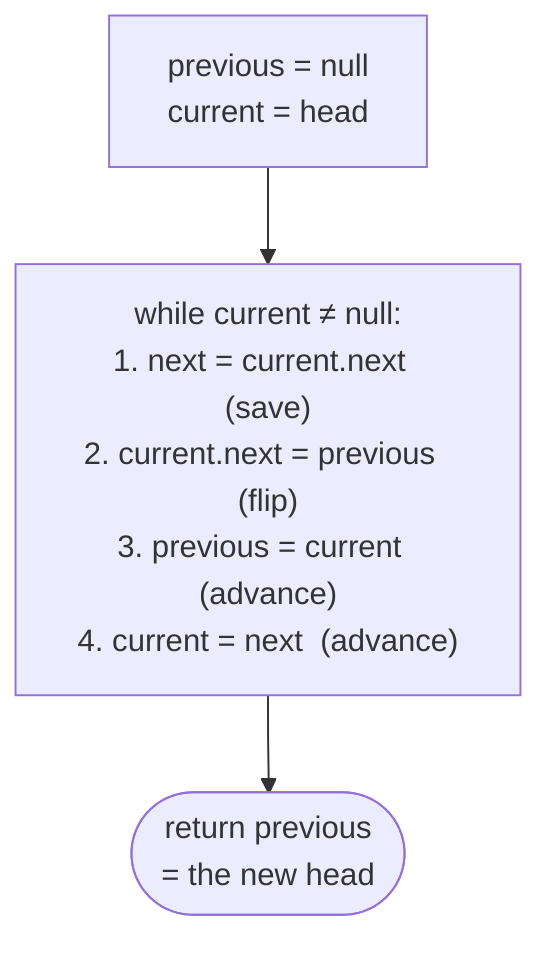

# Pattern: Reversal

## Why It Exists

A singly linked list only points *forward* — each node knows its successor and nothing else. So "process this list backward," "reverse the first `k` nodes," or "is this list a palindrome?" all hit the same wall: you can't walk against the arrows.

The obvious fix is to copy every value into an array, reverse that, and rebuild — `O(n)` time but also `O(n)` extra space, and you've thrown away the list structure. The key realization: **you don't need to move the data at all.** The values are fine where they are; it's the `next` pointers that point the wrong way. Flip each `next` to point at the *previous* node instead, and the list is reversed in place — `O(1)` extra space, one pass.

## See It Work

Reverse `5 → 7 → 3 → 10` by flipping pointers, never touching values. Run it, then **Visualise** the arrows turning around one by one.

> ▶ Run it, then click **Visualise** — watch each node's arrow flip to point backward as `current` sweeps through the list.

```python run viz=linked-list viz-root=head viz-kind=list-single
class ListNode:
    def __init__(self, val, next=None):
        self.val = val
        self.next = next

head = ListNode(5, ListNode(7, ListNode(3, ListNode(10))))   # 5 → 7 → 3 → 10

previous = None
current = head
while current is not None:          # walk the list once
    next_node = current.next        # save the forward link before we overwrite it
    current.next = previous         # flip this node's pointer backward
    previous = current              # previous trails forward
    current = next_node             # advance into the rest of the list
head = previous                     # previous is the old tail = the new head

vals = []
node = head
while node:
    vals.append(node.val)
    node = node.next
print(vals)                         # [10, 3, 7, 5]
```

## How It Works

You carry **three pointers** through one pass:

- `previous` — the already-reversed part, trailing behind (starts `null`).
- `current` — the node being rewired right now (starts at `head`).
- `next` — a one-step lookahead, saved *before* you overwrite the link.

Each tick does four things in this exact order: **save** `next = current.next`, **flip** `current.next = previous`, then **advance** `previous = current` and `current = next`.



<p align="center"><strong>the three-pointer loop: save the forward link, flip the current node's pointer backward, then slide both trailing pointers forward. When <code>current</code> falls off the end, <code>previous</code> is the new head.</strong></p>

Why must `next` be saved *first*? Because step 2 overwrites `current.next` — the instant you flip it, the only pointer to the rest of the list is gone. Save it, and you can still find your way forward. When `current` runs off the end (`null`), `previous` is sitting on the old tail, which is now the front: **`previous` is the new head.** One pass, no extra structure → **`O(n)` time, `O(1)` space.**

### Key Takeaway

Reverse a singly linked list by walking it once with `previous`/`current`/`next`, flipping each `next` to point backward. Save the lookahead *before* the flip, and return `previous` as the new head — `O(n)` time, `O(1)` space, values never move.

## Trace It

`head = 5 → 7 → 3 → 10`, starting `previous = null`, `current = 5`:

| tick | save `next` | after flip | `previous` | `current` |
|---|---|---|---|---|
| 1 | `7` | `5 → null` | `5` | `7` |
| 2 | `3` | `7 → 5` | `7` | `3` |
| 3 | `10` | `3 → 7` | `3` | `10` |
| 4 | `null` | `10 → 3` | `10` | `null` → stop |

Before you read on: the loop stops when `current` is `null` — so what is `previous` pointing at, and why is *that* the answer?

`previous` is on `10`, the node that used to be the tail. Every node now points at its old predecessor, so following `next` from `10` gives `10 → 3 → 7 → 5 → null` — the reversed list. The old `head` (`5`) is now the tail pointing at `null`, exactly as the first tick set it. `previous` always trails one step behind `current`, so when `current` leaves the list, `previous` is the last real node — the new front.

## Your Turn

The reusable in-place reversal — returns the new head:

```python run viz=linked-list viz-root=head viz-kind=list-single
class ListNode:
    def __init__(self, val, next=None):
        self.val = val
        self.next = next

def reverse(head):
    previous = None
    current = head
    while current is not None:
        next_node = current.next     # save before overwriting
        current.next = previous      # flip
        previous = current           # advance
        current = next_node
    return previous                  # new head

# build 1 → 2 → 3, reverse, read it back
head = ListNode(1, ListNode(2, ListNode(3)))
out, node = [], reverse(head)
while node:
    out.append(node.val); node = node.next
print(out)                           # [3, 2, 1]
```

```java run viz=linked-list viz-root=head viz-kind=list-single
public class Main {
  static class ListNode { int val; ListNode next; ListNode(int v){ val = v; } }

  static ListNode reverse(ListNode head) {
    ListNode previous = null, current = head;
    while (current != null) {
      ListNode next = current.next;  // save before overwriting
      current.next = previous;       // flip
      previous = current;            // advance
      current = next;
    }
    return previous;                 // new head
  }

  public static void main(String[] args) {
    ListNode head = new ListNode(1); head.next = new ListNode(2); head.next.next = new ListNode(3);
    StringBuilder sb = new StringBuilder("[");
    for (ListNode c = reverse(head); c != null; c = c.next) sb.append(c.val).append(c.next != null ? ", " : "");
    System.out.println(sb.append("]"));   // [3, 2, 1]
  }
}
```

Drill the family in **Practice** — [Reverse a List](/cortex/data-structures-and-algorithms/linear-structures/singly-linked-list/pattern-reversal/problems/reverse-a-list), [Reverse First K Nodes](/cortex/data-structures-and-algorithms/linear-structures/singly-linked-list/pattern-reversal/problems/reverse-first-k-nodes), [Reverse Last K Nodes](/cortex/data-structures-and-algorithms/linear-structures/singly-linked-list/pattern-reversal/problems/reverse-last-k-nodes), and [Reverse the Given Segment](/cortex/data-structures-and-algorithms/linear-structures/singly-linked-list/pattern-reversal/problems/reverse-the-given-segment).

## Reflect & Connect

The three-pointer flip is one of the highest-leverage list moves — it shows up wherever something must go backward:

- **Whole-list, prefix, suffix, segment** — the *same loop*, just bounded differently. To reverse an inner segment `[i, j]`: walk to the node before `i`, reverse exactly `j − i + 1` nodes, then **stitch** the reversed piece back to the untouched parts on both sides. The pointers before `i` and after `j` never move.
- **Reversal as a sub-step** — palindrome check (reverse the second half, then compare against the first), and reorder-style problems (`L0→Ln→L1→Ln-1→…`) split the list, reverse one half, and weave. That composition is the [next pattern](/cortex/data-structures-and-algorithms/linear-structures/singly-linked-list/pattern-reversal-subproblem/pattern).
- **Iterative beats recursive here** — a recursive reversal is elegant but costs `O(n)` stack space; the three-pointer loop is `O(1)`. On a long list, recursion risks a stack overflow the loop never will.

**Prerequisites:** [What Is a Linked List?](/cortex/data-structures-and-algorithms/linear-structures/singly-linked-list/what-is-a-linked-list).
**What's next:** reversal as a building block inside larger walks — [Reversal as a Subproblem](/cortex/data-structures-and-algorithms/linear-structures/singly-linked-list/pattern-reversal-subproblem/pattern).

## Recall

> **Mnemonic:** *Three pointers — `previous`, `current`, `next`. Save next, flip current backward, advance both. `previous` ends up as the new head.*

| | |
|---|---|
| Pointers | `previous` (trails, starts `null`), `current` (starts `head`), `next` (lookahead) |
| Each tick | save `next` → flip `current.next = previous` → `previous = current` → `current = next` |
| Returns | `previous` — the old tail, now the head |
| Cost | `O(n)` time, `O(1)` space (no copy, values never move) |

<details>
<summary><strong>Q:</strong> Why save `next` before flipping `current.next`?</summary>

**A:** The flip overwrites `current.next` — without the saved lookahead you'd lose the only pointer to the rest of the list.

</details>
<details>
<summary><strong>Q:</strong> What does `previous` hold when the loop ends?</summary>

**A:** The old tail, which is the new head — `current` has just walked off the end into `null`.

</details>
<details>
<summary><strong>Q:</strong> How do you reverse only an inner segment `[i, j]`?</summary>

**A:** Reverse exactly those nodes, then stitch the reversed piece back to the node before `i` and the node after `j`.

</details>
<details>
<summary><strong>Q:</strong> Why prefer the iterative loop over recursion?</summary>

**A:** Recursion uses `O(n)` stack space (overflow risk on long lists); the loop is `O(1)`.

</details>

## Sources & Verify

- **CLRS**, *Introduction to Algorithms*, 4th ed., §10.2 — singly linked lists and pointer manipulation.
- **Sedgewick & Wayne**, *Algorithms*, 4th ed., §1.3 — linked structures; reversing a list as the canonical in-place pointer exercise.
- The three-pointer loop and its `O(n)`/`O(1)` bounds are the standard result; both runnable blocks are verified by running (outputs `[10, 3, 7, 5]` and `[3, 2, 1]`).
