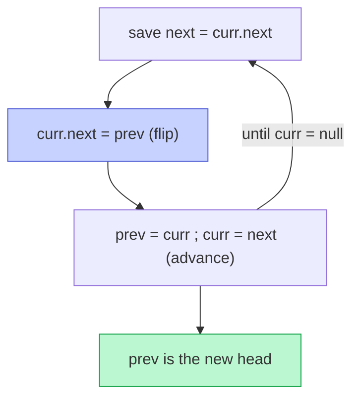

# Memorize: Reversal

## In a Hurry?

- **One-Line Idea**: Walk the segment with three pointers — save the forward link, flip `current.next` backward, advance the two trailing pointers — to reverse a contiguous run of `next` pointers in place.
- **Complexities**: `O(n)` time, `O(1)` space, where `n` is the number of nodes inside the reversed segment (and the loop visits each segment node exactly once).
- **When to Use**: The problem asks for nodes to appear in reversed order across a contiguous segment — full list, prefix, suffix, positional range — or asks for palindrome / mirror / "read backwards" structure on a singly linked list.

---

## One-Line Mnemonic

**"Save next, flip back, march previous and current."**

The four words map one-to-one onto the four lines of the loop body: snapshot the forward link, rewrite `current.next`, advance `previous`, advance `current`. Drill them in that order — any other order corrupts the chain.

---

## Real-World Analogy

Picture a one-way conga line where every dancer faces the next person's back, and you need to make every dancer turn around so they face the previous person's back instead. You walk along the line, and at every dancer you whisper to them: "remember who is in front of you right now (that's `next`), now turn around and face the person who was behind you (that's `previous`)." You then step forward to the dancer you just whispered to (you become the new `previous`) and the dancer you took note of becomes the next person to receive the whisper. When the line runs out, you have walked from the original front to the original back, and the line now points in the opposite direction with everybody still in the same physical spots.

---

## Visual Summary



<p align="center"><strong>Reverse a singly list with three pointers: before flipping each node's next to point back, stash the forward link so the rest isn't lost. One pass, O(n) time, O(1) space.</strong></p>

---

## Pattern Recognition Triggers

The pattern fits when **all four** answers are "yes" — the same diagnostic that gates each problem in the section.

- The problem asks for **reversed order** across a contiguous segment — full list, prefix, suffix, or a positional range `[left, right]`.
- The segment has **identifiable endpoints** — either given as references (`start`, `end`), computed by a 1-indexed position (`left`, `right`), or implied by a counted walk (first `k`, last `k`).
- The work is **strictly structural** — only `next` pointers change; node values are never read for the rewrite decision.
- `O(1)` extra space is **required or strongly preferred**; the iterative three-pointer loop never recurses or allocates.

Common surface signals: "reverse the linked list," "reverse the first / last `k` nodes," "reverse between positions `left` and `right`," "is this list a palindrome," "reorder the list so it reads `a, last, b, second-last, …`," "given two list references, reverse the segment between them."

---

## Don't Confuse With

| | **Reversal (this pattern)** | **Fast-and-Slow Pointers** |
|---|---|---|
| **Problem shape** | "Reverse a segment of the list" — change the structural order of `next` pointers | "Find a position in the list using two cursors with different speeds" — locate a midpoint, detect a cycle, or find a node `k` from the end |
| **Pointer roles** | `previous` (trails), `current` (rewrites), `next` (forward snapshot) — all flowing forward at the same speed | `slow` (one step/tick), `fast` (two steps/tick or `k`-step lead) — both flowing forward, never rewriting |
| **What changes** | `current.next` is rewritten every tick — the chain is reshaped | Nothing structural — only the cursor positions advance; the list is unchanged |
| **Complexity** | `O(n)` time, `O(1)` space (plus `O(n)` for positional walks in the segment variants) | `O(n)` time, `O(1)` space |
| **When this goes wrong** | You're walking the list and the values come out reversed but the structure is now broken (a cycle, or a dropped tail) — wrong loop order or you forgot to save the forward link before clobbering `current.next`. | You're trying to "reverse to position `k`" by counting two pointers — wrong pattern; the reversal pattern uses a counter inside the rewriting loop, not two cursors. Switch to the reversal pattern when the goal is to change the order of `next` pointers, not just to land on a position. |

The fast-and-slow pattern (next chapter) is the sibling pattern — it finds positions; the reversal pattern changes structure.

---

## Template Code

```python
# Reversal pattern — generic three-pointer loop for a singly linked list.
# The two knobs are the initial `previous` and the loop's stop sentinel.
from typing import Optional


class ListNode:
    def __init__(self, val=0, next=None):
        self.val = val
        self.next = next


def reverse_segment(start: ListNode, stop: Optional[ListNode]) -> ListNode:
    """
    Reverse the segment from `start` (inclusive) up to but not including `stop`.

    - Full-list reversal:  start = head,  stop = None,  initial previous = None.
    - Segment reversal:    start = start, stop = end.next, initial previous = stop.
    """
    previous: Optional[ListNode] = stop      # 1. sentinel for the segment's tail successor
    current: Optional[ListNode] = start      # 2. cursor for the next node to flip

    while current is not stop:               # 3. stop sentinel — None for full-list, end.next for segment
        next_node = current.next             # 4. SAVE forward link FIRST
        current.next = previous              # 5. FLIP the back link
        previous = current                   # 6. ADVANCE previous one step
        current = next_node                  # 7. ADVANCE current one step

    return previous                          # 8. new head of the reversed segment
```

The two knobs are: the **initial `previous`** (`None` for full-list reversal, `end.next` for segment reversal so the reversed tail points to the right successor automatically) and the **stop sentinel** (`None` for full-list, `end.next` for segment, or a counter check for "reverse first `k`"). The body never changes.

---

## Common Mistakes

- **Flipping before saving the forward link**:
  - *What*: writing `current.next = previous` *before* `next_node = current.next`. The next iteration reads `current.next` and finds `previous` instead of the original successor, walking backwards into the already-reversed prefix.
  - *Why*: `current.next` is overwritten by the flip, destroying the only path forward. Without an upfront snapshot, the rest of the list becomes unreachable.
  - *Fix*: always order the body as `next_node = current.next; current.next = previous; previous = current; current = next_node` — snapshot first, flip second, advance last.
- **Forgetting to stitch the prefix after a bounded reversal**:
  - *What*: reverse-first-`k` runs the loop with a `count < k` guard but never executes the `head.next = current` stitch. The reversed prefix's tail (the original head) still points to whatever was second in the original list, so the list now has two disjoint chains.
  - *Why*: a bounded reversal leaves the original head pointing into the reversed chain (correct) and the segment's `next` from the last flip pointing wherever `previous` was at the start of that tick (wrong — it should point to the first un-flipped node).
  - *Fix*: after any prefix-bounded loop, write `head.next = current` (where `current` is the first un-flipped node) before returning `previous` as the new head.
- **Initialising `previous = None` for segment reversal**:
  - *What*: copying the full-list reversal template into a segment-reversal helper. The reversed segment's tail (the original `start`) ends up with `next = None`, breaking the link to the suffix and truncating the list.
  - *Why*: full-list reversal wants the new tail to point to `None`; segment reversal wants the new tail to point to `end.next`.
  - *Fix*: initialise `previous = end.next` (captured *before* the loop runs) for any segment-reversal variant. The reversed tail then points to the correct successor automatically.
- **Using `current.next` as the stop condition after rewriting it**:
  - *What*: writing `while current.next is not None` (or similar) when the loop body has already rewritten `current.next`. The loop now terminates one node too early — or, worse, walks into the already-reversed segment.
  - *Why*: `current.next` is no longer a reliable forward marker once it has been flipped. The stop condition must be a stable reference — `None` (for full-list) or a sentinel captured before the loop runs (`rightBound = end.next`).
  - *Fix*: stop on `current is None` (full-list) or `current is rightBound` (segment). Never on `current.next`.
- **Reaching for recursion in production code**:
  - *What*: writing the elegant 3-line recursive reversal as the production solution.
  - *Why*: recursion costs `O(n)` stack space; for a 10-million-node list that overflows the default stack (~1 MB / ~10⁵ frames) on most language runtimes.
  - *Fix*: use the iterative three-pointer loop — same `O(n)` time, `O(1)` space, no risk of stack overflow regardless of input size.

---

## Minimum Viable Example

Reverse `1 → 2 → 3 → null` in place:

```
Init:  previous = null, current = 1.
Tick 1: next = 2, 1.next = null,  previous = 1, current = 2.
Tick 2: next = 3, 2.next = 1,     previous = 2, current = 3.
Tick 3: next = null, 3.next = 2,  previous = 3, current = null → loop ends.
Result: 3 → 2 → 1 → null.  Return previous = 3.
```

Three nodes, three ticks, zero auxiliary allocations — the complete pattern in four lines.

---

## Quick Recall

**Q: What is the time and space complexity of the iterative three-pointer reversal?**
A: `O(n)` time (one tick per segment node) and `O(1)` space (three local references regardless of `n`).

**Q: What is the very first line inside the loop body?**
A: `next_node = current.next` — snapshot the forward link *before* it gets clobbered by the flip on the next line.

**Q: What changes between full-list and segment reversal?**
A: Two knobs only. Initial `previous` is `None` (full-list) vs `end.next` (segment). Stop condition is `current is None` (full-list) vs `current is end.next` (segment).

**Q: After a prefix-bounded reversal (reverse-first-`k`), what extra line do you need?**
A: `head.next = current` — stitch the original head (now the reversed prefix's new tail) to the first un-flipped node.

**Q: Why is recursion a bad idea in production code even though it works?**
A: Recursion uses `O(n)` stack space and overflows the default ~1 MB stack on lists with more than ~10⁵ nodes. The iterative version uses `O(1)` extra space and never crashes.

**Q: What should you reach for first if the problem says "reverse the linked list between positions `left` and `right`"?**
A: Walk to find `end` (position `right`) and `leftBound` (position `left − 1`). Call the segment-reversal helper with `start = leftBound.next` and `end`. Stitch the prefix with `leftBound.next = newHead`. Handle `left == 1` by returning the helper's result directly as the new head.
