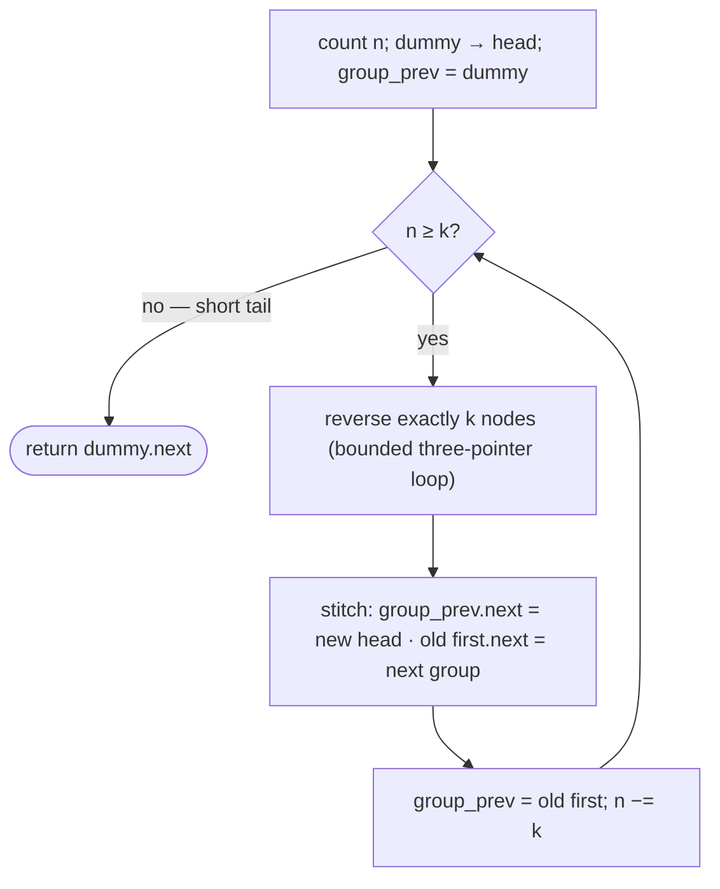

# Pattern: Reversal as a Subproblem

## Why It Exists

You already have the three-pointer reversal. But many problems don't want the *whole* list flipped — they want it reversed **in pieces**: swap every adjacent pair (`1→2→3→4` becomes `2→1→4→3`), reverse every group of `k`, reverse alternating runs. Whole-list reversal is too blunt.

The realization: reversal becomes a **subroutine** you call repeatedly on bounded chunks. The flipping itself is solved — what's new is the **bookkeeping around each chunk.** When you reverse a middle segment, its first node becomes its last, so you must reconnect two seams: the node *before* the chunk has to point at the chunk's new head, and the chunk's new tail (its old first node) has to point at whatever comes *after*. Lose track of either seam and the list fractures.

## See It Work

Reverse the list in groups of `k = 2` — a pairwise swap. `1→2→3→4→5` becomes `2→1→4→3→5` (the lone `5` has no partner, so it stays). Run it, then **Visualise** each pair flip and re-stitch.

> ▶ Run it, then click **Visualise** — each full group of `k` flips in place, then the seams reconnect; the short tail is left untouched.

```python run viz=linked-list viz-root=head viz-kind=list-single
class ListNode:
    def __init__(self, val, next=None):
        self.val = val
        self.next = next

head = ListNode(1, ListNode(2, ListNode(3, ListNode(4, ListNode(5)))))   # 1 → 2 → 3 → 4 → 5
k = 2

n, node = 0, head
while node:                          # count nodes so we only reverse FULL groups
    n += 1
    node = node.next

dummy = ListNode(0, head)            # a stand-in "node before the list" — uniform seam
group_prev = dummy
while n >= k:
    prev, cur = None, group_prev.next
    for _ in range(k):               # reverse exactly k nodes (bounded three-pointer loop)
        nxt = cur.next
        cur.next = prev
        prev = cur
        cur = nxt
    tail = group_prev.next           # old first node = this group's new tail
    group_prev.next = prev           # seam 1: before-node → group's new head
    tail.next = cur                  # seam 2: group's new tail → next group's start
    group_prev = tail                # advance to the seam before the next group
    n -= k
head = dummy.next

vals = []
node = head
while node:
    vals.append(node.val)
    node = node.next
print(vals)                          # [2, 1, 4, 3, 5]
```

## How It Works

Three ideas carry every variant:

1. **A dummy node** sits in front of `head`. The first group has no "real" node before it, so the dummy gives every group a uniform predecessor to relink — no special case for the head.
2. **The bounded reversal** is the inner `for _ in range(k)` loop: the exact three-pointer flip you already know, stopped after `k` nodes instead of at `null`.
3. **The stitch** reconnects two seams. Before reversing, `group_prev.next` is the group's *first* node — which after the flip is its *last*. So save it as `tail`, point `group_prev.next` at the new head (`prev`), and point `tail.next` at the next group's start (`cur`). Then `group_prev = tail` — the new tail is the predecessor of the next group.



<p align="center"><strong>for each full group: reverse <code>k</code> nodes, then reconnect the before-seam and after-seam; advance to the next group and repeat. The short remainder is left as-is.</strong></p>

Counting first (`n`) is what lets you reverse only *full* groups and leave a short remainder untouched — exactly the common requirement. Every node is visited a constant number of times, so it's **`O(n)` time, `O(1)` space.**

### Key Takeaway

Reverse bounded chunks with the three-pointer loop, then re-stitch two seams per chunk — the before-node points at the chunk's new head, the chunk's new tail points at the next chunk. A dummy node removes the head special case; counting first leaves a short tail untouched.

## Trace It

`k = 2` over `1→2→3→4→5` (`n = 5`), `group_prev` starting at the dummy:

| `n` | group reversed | seams stitched | list so far |
|---|---|---|---|
| 5 | `1,2` → `2,1` | dummy→2, 1→3 | `2→1→3→4→5` |
| 3 | `3,4` → `4,3` | 1→4, 3→5 | `2→1→4→3→5` |
| 1 | — (`1 < k`) | — | `2→1→4→3→5` |

Before you read on: when `n` dropped to `1`, the loop stopped and `5` was never touched. What in the code guaranteed the leftover got left alone — and would `n > 0` instead of `n ≥ k` have been a bug?

The guard `while n >= k` is exactly it: a chunk is only reversed when a *full* `k` nodes remain. Using `n > 0` would enter the loop with one node left, and the inner `for _ in range(k)` would walk off the end into `null` and crash (or silently corrupt links). Counting up front and gating on `n ≥ k` is what makes "reverse full groups, keep the remainder" correct.

## Your Turn

The reusable reverse-in-groups-of-`k` (with `k = 2`, it's a pairwise swap):

```python run viz=linked-list viz-root=head viz-kind=list-single
class ListNode:
    def __init__(self, val, next=None):
        self.val = val
        self.next = next

def reverse_k_group(head, k):
    n, node = 0, head
    while node:
        n += 1
        node = node.next
    dummy = ListNode(0, head)
    group_prev = dummy
    while n >= k:
        prev, cur = None, group_prev.next
        for _ in range(k):
            nxt = cur.next; cur.next = prev; prev = cur; cur = nxt
        tail = group_prev.next
        group_prev.next = prev       # before-seam
        tail.next = cur              # after-seam
        group_prev = tail
        n -= k
    return dummy.next

head = ListNode(1, ListNode(2, ListNode(3, ListNode(4, ListNode(5)))))
out, node = [], reverse_k_group(head, 3)
while node:
    out.append(node.val); node = node.next
print(out)                           # [3, 2, 1, 4, 5]
```

```java run viz=linked-list viz-root=head viz-kind=list-single
public class Main {
  static class ListNode { int val; ListNode next; ListNode(int v){ val = v; } ListNode(int v, ListNode n){ val = v; next = n; } }

  static ListNode reverseKGroup(ListNode head, int k) {
    int n = 0;
    for (ListNode x = head; x != null; x = x.next) n++;
    ListNode dummy = new ListNode(0, head), groupPrev = dummy;
    while (n >= k) {
      ListNode prev = null, cur = groupPrev.next;
      for (int i = 0; i < k; i++) { ListNode nxt = cur.next; cur.next = prev; prev = cur; cur = nxt; }
      ListNode tail = groupPrev.next;
      groupPrev.next = prev;         // before-seam
      tail.next = cur;               // after-seam
      groupPrev = tail;
      n -= k;
    }
    return dummy.next;
  }

  public static void main(String[] args) {
    ListNode head = new ListNode(1, new ListNode(2, new ListNode(3, new ListNode(4, new ListNode(5)))));
    StringBuilder sb = new StringBuilder("[");
    for (ListNode c = reverseKGroup(head, 3); c != null; c = c.next) sb.append(c.val).append(c.next != null ? ", " : "");
    System.out.println(sb.append("]"));   // [3, 2, 1, 4, 5]
  }
}
```

Drill the family in **Practice** — [Pairwise Swap](/cortex/data-structures-and-algorithms/linear-structures/singly-linked-list/pattern-reversal-subproblem/problems/pairwise-swap), [Reverse K Segments](/cortex/data-structures-and-algorithms/linear-structures/singly-linked-list/pattern-reversal-subproblem/problems/reverse-k-segments), [Reverse Increasing Groups](/cortex/data-structures-and-algorithms/linear-structures/singly-linked-list/pattern-reversal-subproblem/problems/reverse-increasing-groups), and [Reverse Alternate Segments](/cortex/data-structures-and-algorithms/linear-structures/singly-linked-list/pattern-reversal-subproblem/problems/reverse-alternate-segments).

## Reflect & Connect

Once reversal is a callable subroutine, a whole family opens up — they differ only in *how the chunks are chosen*:

- **Pairwise swap** = groups of `k = 2`. **Reverse-K-group** = fixed `k`. **Increasing groups** = group sizes `1, 2, 3, …`. **Alternate segments** = reverse one run, skip the next.
- **The stitch is the transferable skill** — "track the node before and the node after the part you're mutating" recurs in segment-reversal, list partitioning, and merging. The dummy-node trick (a uniform predecessor so the head isn't a special case) is worth keeping in your reflexes.
- **It composes upward** — reorder problems (`L0→Ln→L1→Ln-1→…`) and palindrome checks combine a *split* and a *reversal*; the next two patterns build exactly that machinery.

**Prerequisites:** [Reversal](/cortex/data-structures-and-algorithms/linear-structures/singly-linked-list/pattern-reversal/pattern).
**What's next:** slide a fixed-size window of nodes along the list — [Sliding-Window Traversal](/cortex/data-structures-and-algorithms/linear-structures/singly-linked-list/pattern-sliding-window-traversal/pattern).

## Recall

> **Mnemonic:** *Dummy in front, count `n`, reverse `k` nodes while `n ≥ k`, then stitch two seams: before → new head, new tail → next group.*

| | |
|---|---|
| Dummy node | uniform predecessor → no head special case |
| Bounded reversal | three-pointer loop stopped after `k` nodes |
| Stitch | `group_prev.next = new head` · `old first.next = next group` · `group_prev = old first` |
| Guard | `while n ≥ k` → reverse full groups, leave the short tail |
| Cost | `O(n)` time, `O(1)` space |

<details>
<summary><strong>Q:</strong> Why a dummy node before the head?</summary>

**A:** It gives the first group a real predecessor to relink, so the head needs no special case.

</details>
<details>
<summary><strong>Q:</strong> What are the two seams stitched after reversing a chunk?</summary>

**A:** The before-node points at the chunk's new head; the chunk's new tail (old first node) points at the next chunk's start.

</details>
<details>
<summary><strong>Q:</strong> Why count `n` and gate on `n ≥ k`?</summary>

**A:** So only full groups reverse and a short remainder is left untouched — `n > 0` would walk past the end and crash.

</details>
<details>
<summary><strong>Q:</strong> How is pairwise swap related to this pattern?</summary>

**A:** It's the `k = 2` case of reverse-in-groups-of-`k`.

</details>

## Sources & Verify

- **CLRS**, *Introduction to Algorithms*, 4th ed., §10.2 — linked-list pointer manipulation; the dummy-node (sentinel) simplification.
- **Sedgewick & Wayne**, *Algorithms*, 4th ed., §1.3 — linked structures and in-place restructuring.
- Reverse-nodes-in-`k`-group is a standard interview problem; both runnable blocks are verified by running (outputs `[2, 1, 4, 3, 5]` and `[3, 2, 1, 4, 5]`).
