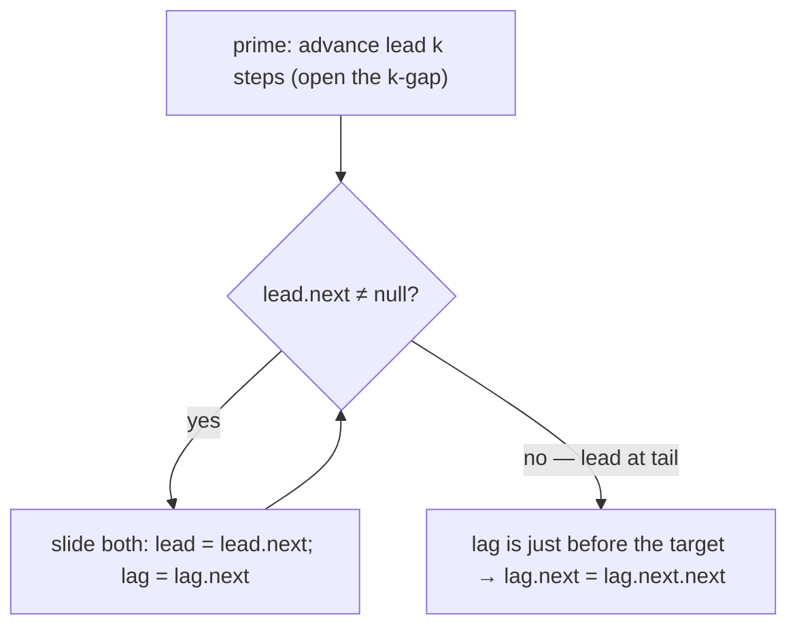

# Pattern: Sliding-Window Traversal

## Why It Exists

"Remove the `k`-th node from the *end* of the list." On an array you'd just index `len − k`. On a singly linked list you're stuck twice over: you can only walk *forward*, and you don't even know the length without a full pass first.

The naive fix is two passes — walk once to count `n`, then walk `n − k` nodes to the target. Correct, but it reads the list twice. The realization that collapses it to one pass: instead of measuring from the end, **hold two pointers a fixed `k` nodes apart.** That gap is a window of size `k`. Prime the lead pointer `k` steps ahead, then slide *both* forward in lockstep — the gap never changes. The instant the lead pointer falls off the end, the trailing pointer is sitting exactly `k` nodes from the end. You found the target without ever knowing `n`.

## See It Work

Remove the 2nd node from the end of `1→2→3→4→5` (that's the `4`). One pass, two pointers a fixed gap apart. Run it, then **Visualise** the window slide.

> ▶ Run it, then click **Visualise** — `lead` opens a gap of `k`, then `lead` and `lag` slide together until `lead` hits the tail; `lag` is left just before the target.

```python run viz=linked-list viz-root=head viz-kind=list-single
import ast

class ListNode:
    def __init__(self, val, next=None):
        self.val = val
        self.next = next

def build_list(values):              # [1, 2, 3] → 1 → 2 → 3 → null
    head = None
    for v in reversed(values):
        head = ListNode(v, head)
    return head

def print_list(head):                # 1 → 2 → 3 → [1, 2, 3]
    out = []
    while head:
        out.append(head.val)
        head = head.next
    print(out)

values = ast.literal_eval(input())   # the test case's values
k = int(input())                     # the test case's k

head = build_list(values)
dummy = ListNode(0, head)
lead = lag = dummy
for _ in range(k):                   # open a gap of k: lead leads lag by k nodes
    lead = lead.next
while lead.next is not None:         # slide both in lockstep until lead is at the last node
    lead = lead.next
    lag = lag.next
lag.next = lag.next.next             # lag sits just before the target → unlink it
head = dummy.next

print_list(head)
```

```java run viz=linked-list viz-root=head viz-kind=list-single
import java.util.*;

public class Main {
  static class ListNode {
    int val; ListNode next;
    ListNode(int val) { this.val = val; }
    ListNode(int val, ListNode next) { this.val = val; this.next = next; }
  }

  public static void main(String[] args) {
    Scanner sc = new Scanner(System.in);
    int[] values = parseIntArray(sc.nextLine());
    int k = Integer.parseInt(sc.nextLine().trim());

    ListNode head = buildList(values);
    ListNode dummy = new ListNode(0, head);
    ListNode lead = dummy, lag = dummy;
    for (int i = 0; i < k; i++) lead = lead.next;   // open the k-gap
    while (lead.next != null) {                      // slide in lockstep to the tail
      lead = lead.next;
      lag = lag.next;
    }
    lag.next = lag.next.next;                        // unlink the k-th-from-end
    head = dummy.next;

    printList(head);
  }

  static ListNode buildList(int[] values) {      // {1, 2, 3} → 1 → 2 → 3 → null
    ListNode head = null;
    for (int i = values.length - 1; i >= 0; i--) head = new ListNode(values[i], head);
    return head;
  }

  static void printList(ListNode head) {         // 1 → 2 → 3 → [1, 2, 3]
    List<Integer> out = new ArrayList<>();
    for (ListNode n = head; n != null; n = n.next) out.add(n.val);
    System.out.println(out);
  }

  // "[1, 2, 3]" → {1, 2, 3} — reads the test case's values
  static int[] parseIntArray(String line) {
    String inner = line.replaceAll("[\\[\\]\\s]", "");
    if (inner.isEmpty()) return new int[0];
    String[] parts = inner.split(",");
    int[] out = new int[parts.length];
    for (int i = 0; i < parts.length; i++) out[i] = Integer.parseInt(parts[i]);
    return out;
  }
}
```

```testcases
{
  "args": [
    { "id": "values", "label": "values", "type": "int[]", "placeholder": "[1, 2, 3, 4, 5]" },
    { "id": "k", "label": "k", "type": "int", "placeholder": "2" }
  ],
  "cases": [
    { "args": { "values": "[1, 2, 3, 4, 5]", "k": "2" }, "expected": "[1, 2, 3, 5]" },
    { "args": { "values": "[1, 2, 3, 4, 5]", "k": "1" }, "expected": "[1, 2, 3, 4]" },
    { "args": { "values": "[1, 2, 3, 4, 5]", "k": "5" }, "expected": "[2, 3, 4, 5]" },
    { "args": { "values": "[1]", "k": "1" }, "expected": "[]" }
  ]
}
```

## How It Works

Two pointers, `lead` and `lag`, and a **dummy node** in front of the head so even removing the first node needs no special case. The traversal has two phases:

1. **Prime** — advance `lead` exactly `k` steps. Now `lead` is `k` nodes ahead of `lag`: the window is open.
2. **Slide** — advance *both* one step at a time until `lead.next` is `null` (i.e. `lead` is on the last node). Because they move together, the `k`-gap is preserved the whole way.

When the slide ends, `lag` is `k + 1` nodes from the end — that is, **just before** the `k`-th-from-last node. Unlink it with `lag.next = lag.next.next`.



<p align="center"><strong>prime the lead pointer <code>k</code> ahead to open the window, slide both in lockstep until the lead reaches the tail, then the lag pointer is parked right before the <code>k</code>-th-from-end node.</strong></p>

The window size is fixed by the *gap*, not by re-reading the list — which is exactly why one pass suffices. **`O(n)` time, `O(1)` space.** The dummy is what makes the head case fall out for free: when `k` equals the list length, `lag` never moves past the dummy, and `dummy.next = dummy.next.next` correctly drops the old head.

### Key Takeaway

Hold two pointers a fixed `k` apart and slide them in lockstep; when the lead hits the end, the lag pointer marks `k`-from-the-end — one pass, no length count, no backward walk. A dummy node makes removing the head a non-special case.

## Trace It

`k = 2` over `1→2→3→4→5`, both pointers starting at the dummy `d`:

| phase | `lead` | `lag` | note |
|---|---|---|---|
| prime ×2 | `2` | `d` | gap of 2 opened |
| slide | `3` | `1` | |
| slide | `4` | `2` | |
| slide | `5` | `3` | `lead.next = null` → stop |
| unlink | — | `3` | `3.next = 5` removes `4` |

Before you read on: the slide stops when `lead` is on `5` (the tail), and `lag` lands on `3`. Why is `3` — not `4` — the right place to stop, even though `4` is the node we're deleting?

To unlink a node from a singly linked list you need its **predecessor**, because you rewrite the predecessor's `next`. `4` is the target, but you can't delete it from itself — you delete it by setting `3.next = 4.next`. The `k`-gap is tuned so `lag` lands on the predecessor: `lead` is `k` ahead, so when `lead` is on the last node, `lag` is `k` nodes back from it, i.e. one before the `k`-th-from-end. That off-by-one *is* the pattern.

## Your Turn

The reusable remove-`k`-th-from-end — one pass:

```python run viz=linked-list viz-root=head viz-kind=list-single
import ast

class ListNode:
    def __init__(self, val, next=None):
        self.val = val
        self.next = next

def remove_kth_from_end(head, k):
    # Your code goes here — dummy + two pointers a k-gap apart;
    # prime lead k steps, slide in lockstep, unlink at lag.
    pass

def build_list(values):              # [1, 2, 3] → 1 → 2 → 3 → null
    head = None
    for v in reversed(values):
        head = ListNode(v, head)
    return head

def print_list(head):                # 1 → 2 → 3 → [1, 2, 3]
    out = []
    while head:
        out.append(head.val)
        head = head.next
    print(out)

values = ast.literal_eval(input())   # the test case's values
k = int(input())                     # the test case's k
print_list(remove_kth_from_end(build_list(values), k))
```

```java run viz=linked-list viz-root=head viz-kind=list-single
import java.util.*;

public class Main {
  static class ListNode {
    int val; ListNode next;
    ListNode(int val) { this.val = val; }
    ListNode(int val, ListNode next) { this.val = val; this.next = next; }
  }

  static ListNode removeKthFromEnd(ListNode head, int k) {
    // Your code goes here — dummy + two pointers a k-gap apart;
    // prime lead k steps, slide in lockstep, unlink at lag.
    return null;
  }

  public static void main(String[] args) {
    Scanner sc = new Scanner(System.in);
    int[] values = parseIntArray(sc.nextLine());
    int k = Integer.parseInt(sc.nextLine().trim());
    printList(removeKthFromEnd(buildList(values), k));
  }

  static ListNode buildList(int[] values) {      // {1, 2, 3} → 1 → 2 → 3 → null
    ListNode head = null;
    for (int i = values.length - 1; i >= 0; i--) head = new ListNode(values[i], head);
    return head;
  }

  static void printList(ListNode head) {         // 1 → 2 → 3 → [1, 2, 3]
    List<Integer> out = new ArrayList<>();
    for (ListNode n = head; n != null; n = n.next) out.add(n.val);
    System.out.println(out);
  }

  // "[1, 2, 3]" → {1, 2, 3} — reads the test case's values
  static int[] parseIntArray(String line) {
    String inner = line.replaceAll("[\\[\\]\\s]", "");
    if (inner.isEmpty()) return new int[0];
    String[] parts = inner.split(",");
    int[] out = new int[parts.length];
    for (int i = 0; i < parts.length; i++) out[i] = Integer.parseInt(parts[i]);
    return out;
  }
}
```

```testcases
{
  "args": [
    { "id": "values", "label": "values", "type": "int[]", "placeholder": "[1, 2, 3, 4, 5]" },
    { "id": "k", "label": "k", "type": "int", "placeholder": "2" }
  ],
  "cases": [
    { "args": { "values": "[1, 2, 3, 4, 5]", "k": "2" }, "expected": "[1, 2, 3, 5]" },
    { "args": { "values": "[1, 2, 3, 4, 5]", "k": "1" }, "expected": "[1, 2, 3, 4]" },
    { "args": { "values": "[1, 2, 3, 4, 5]", "k": "5" }, "expected": "[2, 3, 4, 5]" },
    { "args": { "values": "[1]", "k": "1" }, "expected": "[]" },
    { "args": { "values": "[1, 2]", "k": "1" }, "expected": "[1]" },
    { "args": { "values": "[1, 2]", "k": "2" }, "expected": "[2]" }
  ]
}
```

<details>
<summary>Editorial</summary>

Prime the dummy-rooted `lead` pointer `k` steps ahead to open the window, then slide both pointers in lockstep until `lead.next` is `null` — `lag` is now just before the target. Unlink with `lag.next = lag.next.next` and return `dummy.next`.

```python solution time=O(n) space=O(1)
import ast

class ListNode:
    def __init__(self, val, next=None):
        self.val = val
        self.next = next

def remove_kth_from_end(head, k):
    dummy = ListNode(0, head)
    lead = lag = dummy
    for _ in range(k):              # open the k-gap
        lead = lead.next
    while lead.next is not None:    # slide in lockstep to the tail
        lead = lead.next
        lag = lag.next
    lag.next = lag.next.next        # unlink the k-th-from-end
    return dummy.next

def build_list(values):              # [1, 2, 3] → 1 → 2 → 3 → null
    head = None
    for v in reversed(values):
        head = ListNode(v, head)
    return head

def print_list(head):                # 1 → 2 → 3 → [1, 2, 3]
    out = []
    while head:
        out.append(head.val)
        head = head.next
    print(out)

values = ast.literal_eval(input())   # the test case's values
k = int(input())                     # the test case's k
print_list(remove_kth_from_end(build_list(values), k))
```

```java solution
import java.util.*;

public class Main {
  static class ListNode {
    int val; ListNode next;
    ListNode(int val) { this.val = val; }
    ListNode(int val, ListNode next) { this.val = val; this.next = next; }
  }

  static ListNode removeKthFromEnd(ListNode head, int k) {
    ListNode dummy = new ListNode(0, head);
    ListNode lead = dummy, lag = dummy;
    for (int i = 0; i < k; i++) lead = lead.next;   // open the k-gap
    while (lead.next != null) {                      // slide in lockstep to the tail
      lead = lead.next;
      lag = lag.next;
    }
    lag.next = lag.next.next;                        // unlink the k-th-from-end
    return dummy.next;
  }

  public static void main(String[] args) {
    Scanner sc = new Scanner(System.in);
    int[] values = parseIntArray(sc.nextLine());
    int k = Integer.parseInt(sc.nextLine().trim());
    printList(removeKthFromEnd(buildList(values), k));
  }

  static ListNode buildList(int[] values) {      // {1, 2, 3} → 1 → 2 → 3 → null
    ListNode head = null;
    for (int i = values.length - 1; i >= 0; i--) head = new ListNode(values[i], head);
    return head;
  }

  static void printList(ListNode head) {         // 1 → 2 → 3 → [1, 2, 3]
    List<Integer> out = new ArrayList<>();
    for (ListNode n = head; n != null; n = n.next) out.add(n.val);
    System.out.println(out);
  }

  // "[1, 2, 3]" → {1, 2, 3} — reads the test case's values
  static int[] parseIntArray(String line) {
    String inner = line.replaceAll("[\\[\\]\\s]", "");
    if (inner.isEmpty()) return new int[0];
    String[] parts = inner.split(",");
    int[] out = new int[parts.length];
    for (int i = 0; i < parts.length; i++) out[i] = Integer.parseInt(parts[i]);
    return out;
  }
}
```

</details>

## Reflect & Connect

Drill the family in **Practice** — [K Maximum Sum](/cortex/data-structures-and-algorithms/linear-structures/singly-linked-list/pattern-sliding-window-traversal/problems/k-maximum-sum), [Trim Nth Node](/cortex/data-structures-and-algorithms/linear-structures/singly-linked-list/pattern-sliding-window-traversal/problems/trim-nth-node), [Swap Nth Nodes](/cortex/data-structures-and-algorithms/linear-structures/singly-linked-list/pattern-sliding-window-traversal/problems/swap-nth-nodes), and [K Rotations](/cortex/data-structures-and-algorithms/linear-structures/singly-linked-list/pattern-sliding-window-traversal/problems/k-rotations).

The fixed-gap window is the linked-list answer to "I need to know where I am *relative to the end*":

- **Kth from the end, trim/swap the Nth, rotate by `k`, sum over every `k`-node window** — all maintain two pointers a constant distance apart and slide them together.
- **Why a gap and not an index** — an array sliding window can index both edges directly; a singly list can't look back, so the *gap between two forward pointers* becomes the window. That reframing — "distance, not position" — is the transferable idea.
- **Set the gap, then never recompute it** — the entire efficiency comes from priming the gap once and preserving it. If you find yourself re-walking to measure, you've lost the pattern.

This is one specialization of the two-pointer idea; the **next** pattern uses two pointers moving at *different speeds* (not a fixed gap) to find the middle or detect a cycle.

**Prerequisites:** [What Is a Linked List?](/cortex/data-structures-and-algorithms/linear-structures/singly-linked-list/what-is-a-linked-list).
**What's next:** two pointers at different speeds — [Fast & Slow Pointers](/cortex/data-structures-and-algorithms/linear-structures/singly-linked-list/pattern-fast-and-slow-pointers/pattern).

## Recall

> **Mnemonic:** *Prime the lead `k` ahead, slide both in lockstep. Lead hits the tail ⇒ lag is just before the `k`-th-from-end. Dummy handles the head.*

| | |
|---|---|
| Window | the fixed `k`-node gap between `lead` and `lag` |
| Prime | advance `lead` `k` steps |
| Slide | both forward until `lead.next == null` |
| Result | `lag` is the predecessor of the `k`-th-from-end → unlink |
| Cost | `O(n)` one pass, `O(1)` space |

<details>
<summary><strong>Q:</strong> How does this beat the two-pass (count, then walk) approach?</summary>

**A:** A fixed `k`-gap between two pointers locates the target in a single pass — the length is never needed.

</details>
<details>
<summary><strong>Q:</strong> Why does `lag` stop on the *predecessor* of the target, not the target?</summary>

**A:** Unlinking a node needs its predecessor (you rewrite `predecessor.next`); the `k`-gap is tuned so `lag` lands there.

</details>
<details>
<summary><strong>Q:</strong> What does the dummy node buy you?</summary>

**A:** Removing the head becomes a non-special case — `lag` rests on the dummy and `dummy.next = dummy.next.next` drops the old head.

</details>
<details>
<summary><strong>Q:</strong> How is this window different from an array sliding window?</summary>

**A:** A list can't index backward, so the *gap between two forward pointers* is the window — distance, not position.

</details>

## Sources & Verify

- **CLRS**, *Introduction to Algorithms*, 4th ed., §10.2 — singly linked lists; sentinel/dummy nodes to remove boundary special cases.
- **Sedgewick & Wayne**, *Algorithms*, 4th ed., §1.3 — linked structures and traversal.
- "Remove the Nth node from the end in one pass" with two gap-separated pointers is the standard result; both runnable blocks are verified by running against their test cases.
