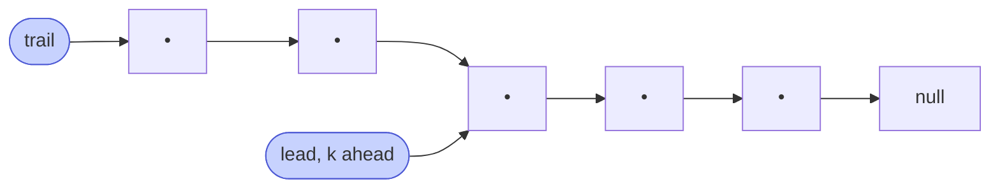

# Memorize: Sliding Window Traversal

## In a Hurry?

- **One-Line Idea**: Two pointers chained `k` apart march down the list together — when the leader hits the tail, the trailer is parked exactly on the `k`-th-from-end node.
- **Complexities**: `O(n)` time, `O(1)` space, where `n` is the length of the list and `k` is the fixed gap between the two pointers.
- **When to Use**: The problem asks about a node at a **fixed offset** from the tail (or from another moving cursor) — `k`-th from end, last `k`, gap of `k` — and a single forward pass is required or strongly preferred.

---

## One-Line Mnemonic

**"Two pointers chained `k` apart; advance together, return the trailer."**

The phrase encodes the whole pattern: the gap is `k`, the loop is lockstep, and the answer is always the trailing pointer when the leader detects the tail. Drill it before any "`k`-th from end" problem — the gap choice (`k` vs `k − 1`) and the work at each tick are the only knobs.

---

## Real-World Analogy

Picture two cars on a single-lane straight road, the front car towing the back car on a fixed-length rope. The road has no rear-view mirror and you can only ever look forward. To find the spot on the road that is exactly `k` car-lengths before the end of the road, both cars accelerate together, the rope stays taut, and the moment the front car runs out of road, the back car is parked exactly `k` car-lengths behind it — your answer is wherever the back car happens to be. The rope is the gap; the lockstep motion is the slide; the front car's tail-detection is the loop's stopping condition.

---

## Visual Summary



<p align="center"><strong>Open a fixed gap of k between two pointers, then advance both together. When the lead falls off the end, the trail sits exactly k-from-end — one pass instead of measure-then-walk.</strong></p>

---

## Pattern Recognition Triggers

The pattern fits when **all four** answers are "yes" — the same diagnostic that gates each problem in the section.

- The problem references a node at a **fixed offset** from the tail or from another moving cursor — `k`-th from end, last `k`, gap of `k` between two nodes.
- The answer can be **read off when one pointer reaches the tail** — no length lookup is required before the work begins.
- Per-tick work is **`O(1)`** — a comparison, a sum update, a pointer splice — rather than a nested re-walk of the list.
- **`O(1)` extra space** is required or strongly preferred — single-pass / streaming-friendly is the win.

Common surface signals: "find the `k`-th from end," "remove the `k`-th from end," "swap the `k`-th nodes from both ends," "rotate the list by `k`," "find the maximum sum of any contiguous `k` nodes," "process pairs of nodes `k` apart."

---

## Don't Confuse With

| | **Sliding Window Traversal (this pattern)** | **Fast-and-Slow Pointers (next chapter)** | **Reversal (pattern 07)** |
|---|---|---|---|
| **Problem shape** | "Find / trim / swap / rotate at a fixed offset `k` from the tail" — distance is the answer | "Find the middle / detect a cycle / find the meeting point" — speed difference is the answer | "Reverse a contiguous segment of the list in place" — pointer direction is the answer |
| **Pointer speeds** | Both at **speed 1**, separated by a fixed gap `k` | `slow` at speed 1, `fast` at speed 2 (the gap grows over time) | All flowing forward at speed 1; `current.next` is rewritten each tick |
| **What you read** | The trailing pointer when the leader detects the tail | The slow pointer when the fast pointer detects the tail or its own meeting point | `previous` as the new head of the reversed segment |
| **Complexity** | `O(n)` time, `O(1)` space | `O(n)` time, `O(1)` space | `O(n)` time, `O(1)` space |
| **When this goes wrong** | You wanted the *middle* of the list (one specific position, no `k` in the problem statement) — the trailer never lands on the right node because the right node is `n / 2` away, not `k` away. Switch to fast-and-slow. | You wanted "the `k`-th from end" (a fixed offset is named in the problem) — the slow pointer at half-speed lands `n / 2` away from the fast, not `k` away. Switch to sliding-window traversal. | You wanted "reverse from position `left` to `right`" — there is no fixed offset to track, only a segment to flip. Switch to the reversal pattern. |

The fast-and-slow pattern is the sibling pattern — both walk the list once with two pointers, but sliding-window traversal preserves a fixed gap, fast-and-slow widens the gap over time.

---

## Template Code

```python
# Sliding-window traversal — generic two-pointer lockstep walk over a singly
# linked list. The two knobs are the gap (k vs k − 1) and the per-tick work.
from typing import Optional


class ListNode:
    def __init__(self, val=0, next=None):
        self.val = val
        self.next = next


def sliding_window_traversal(head: Optional[ListNode], k: int) -> Optional[ListNode]:
    """
    Walk a fixed-gap window through the list. Returns the trailing pointer
    when the leader (`end`) reaches the tail.

    - Find k-th from end:   gap = k − 1, return start when end.next is None.
    - Trim k-th from end:   gap = k − 1, splice prev_to_start.next = start.next.
    - Window aggregation:   gap = k − 1, maintain a running sum across ticks.
    """
    if head is None or k <= 0:
        return None

    start = head                              # 1. trailing pointer — the answer
    end = head                                # 2. leading pointer — the tail detector

    # Phase 1 — prime the gap. Move end (k − 1) hops alone.
    for _ in range(k - 1):
        if end is None:
            return None                       # 3. list shorter than k
        end = end.next

    if end is None or end.next is None:
        return start                          # 4. head IS the k-th from end

    # Phase 2 — lockstep slide. Both advance one node per tick.
    while end.next is not None:
        # Optional per-tick work goes here (sum update, splice, etc.)
        start = start.next                    # 5. trailing pointer marches forward
        end = end.next                        # 6. leading pointer marches forward

    return start                              # 7. answer is at the trailer
```

The two knobs are: the **gap** (`k − 1` puts `start` on the `k`-th-from-end node; `k` puts `start` on the predecessor) and the **per-tick work** (read for find, subtract / add for window sum, capture a predecessor for trim / swap / rotate). The body never changes.

---

## Common Mistakes

- **Off-by-one on the gap**:
  - *What*: walking `end` for `k` hops instead of `k − 1` (or vice versa) during the priming phase. The trailing pointer ends up one node off from the intended answer.
  - *Why*: a "distance of `k`" between two nodes is `k` hops between them, which covers `k + 1` nodes (both endpoints included). For "the `k`-th from the end," you want a gap of `k − 1` hops because the `k`-th-from-end is `k − 1` hops before the tail.
  - *Fix*: write down on a whiteboard what `start` should be holding when `end.next` is `null`. If `start` should be the `k`-th-from-end, the gap is `k − 1`; if `start` should be the predecessor, the gap is `k`.
- **Reading the termination condition off the wrong pointer**:
  - *What*: writing `while start is not None` (or `while start.next is not None`) when the loop should read `end`. The trailing pointer never detects the tail — it is always `k − 1` hops behind it.
  - *Why*: `start` is the answer-bearing reference; `end` is the boundary-detecting reference. Swapping their roles puts the termination check on the wrong pointer.
  - *Fix*: the loop condition is always on `end` — `while end is not None` (gap = `k`, `start` lands on the predecessor) or `while end.next is not None` (gap = `k − 1`, `start` lands on the answer).
- **Forgetting the "list shorter than `k`" early exit**:
  - *What*: skipping the `if end is None: return` guard inside the priming loop. The lockstep slide then dereferences a `null` pointer the first time it tries `end.next`.
  - *Why*: when `k` exceeds the list length, the priming walk falls off the tail. Without an early exit, the code crashes rather than returning a sensible "no answer" value.
  - *Fix*: inside the priming loop, check `if end is None: return <sentinel>` before each advance. The sentinel is problem-specific (`-1` for K Maximum Sum, `head` for Trim Nth Node, `null` for general find).
- **Not normalising `k` modulo length for rotation**:
  - *What*: forgetting `k = k % length` when `k` can exceed the list length. The lockstep walk's gap (`k − 1`) becomes larger than `length − 1`, so the priming walk falls off the tail and the algorithm misbehaves.
  - *Why*: a rotation by `length` is a no-op; a rotation by `length + r` is the same as a rotation by `r`. The pattern needs the *effective* `k` in `[0, length)`.
  - *Fix*: compute `length` in a forward walk, then either recurse with `k % length` or just assign `k = k % length` before the priming loop.
- **Per-tick work that walks the list (nested loop)**:
  - *What*: doing `O(k)` work inside the lockstep loop — e.g. recomputing the window sum from scratch each tick instead of using `sum = sum - start.val + end.val`.
  - *Why*: collapses the algorithm from `O(n)` to `O(n · k)`. For `k = n / 2`, that's `O(n²)` — the same as the brute force the pattern was supposed to beat.
  - *Fix*: per-tick work must be `O(1)`. Maintain a running invariant (sum, max, count) that updates with one subtract + one add, not one full re-walk.

---

## Minimum Viable Example

Find the `2`-nd-from-end node in `1 → 2 → 3 → 4 → null`:

```
Init:   start = 1, end = 1.
Prime:  end advances 1 hop (k − 1 = 1)  → start = 1, end = 2.
Tick 1: end.next = 3 (not null)         → start = 2, end = 3.
Tick 2: end.next = 4 (not null)         → start = 3, end = 4.
Tick 3: end.next is null → loop ends.   Return start = 3. ✓
```

Four nodes, three ticks after priming, zero auxiliary allocations — the complete pattern in four lines.

---

## Quick Recall

**Q: What is the time and space complexity of the lockstep sliding-window-traversal walk?**
A: `O(n)` time (one tick per node, two pointers at speed 1) and `O(1)` space (two or three local references regardless of `n` or `k`).

**Q: What gap do you set between `start` and `end` to find the `k`-th-from-end node?**
A: `k − 1` hops. After the lockstep slide, `start` is `k − 1` hops behind `end`, so when `end` is on the tail, `start` is exactly the `k`-th node from the end.

**Q: What gap do you set to land `start` on the *predecessor* of the `k`-th-from-end (for trim)?**
A: `k` hops. With one extra hop in the gap, `start` lands one node earlier — exactly on the predecessor.

**Q: Why is the termination condition always on `end`, never on `start`?**
A: `end` is the boundary-detecting pointer; `start` is the answer-bearing pointer. Reading the termination off `start` would require knowing the tail's position from the trailing reference — but the whole point of the gap is that `start` lags behind.

**Q: What is the single most common bug in sliding-window-traversal code?**
A: Off-by-one on the gap. A "distance of `k`" between two nodes is `k` hops, covering `k + 1` nodes including both endpoints. Pick the wrong gap and the trailing pointer lands one node off from the intended answer.

**Q: When `k >= length`, what is the effective `k` for rotation?**
A: `k % length`. Compute `length` in a forward walk, then recurse (or re-assign) with `k % length` so the effective rotation lies in `[0, length)`.

**Q: How does sliding-window traversal differ from fast-and-slow pointers (next chapter)?**
A: Both walk the list once with two pointers, but sliding-window traversal keeps a **fixed gap** with both pointers at speed 1 — the answer is the trailing pointer when the leader hits the tail. Fast-and-slow widens the gap over time (one pointer at speed 1, the other at speed 2) — the answer is the meeting point or the slow pointer's position when the fast one finishes.
