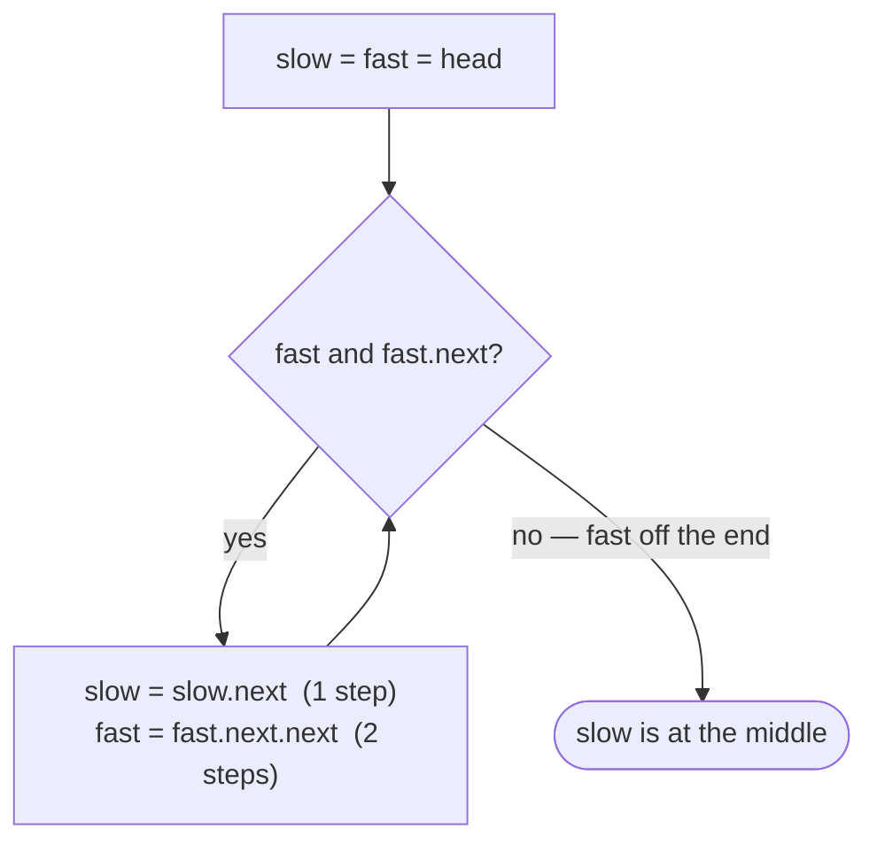

# Pattern: Fast & Slow Pointers

## Why It Exists

"Find the middle node of the list." Same wall as before: no random access, and you don't know the length without walking the whole thing first.

The naive answer is two passes — count `n`, then walk `n / 2`. The realization that beats it: run two pointers at **different speeds**. Move `slow` one step and `fast` two steps each tick. Since `fast` covers twice the ground, when `fast` falls off the end (having traversed the *whole* list), `slow` has traversed exactly *half* — it's sitting on the middle. The 2:1 ratio **encodes the half-length** without ever computing it, in a single pass.

This is the second flavor of two-pointer traversal. The previous pattern fixed a *gap*; this one fixes a *speed ratio* — and that small change unlocks midpoint, palindrome, and cycle problems.

## See It Work

Find the middle of `1→2→3→4→5`. `fast` leaps two at a time, `slow` strolls one — when `fast` runs out, `slow` is on the middle. Run it, then **Visualise** the hare outrun the tortoise.

> ▶ Run it, then click **Visualise** — `fast` advances two nodes per step, `slow` one; when `fast` reaches the end, `slow` marks the midpoint.

```python run viz=linked-list viz-root=head viz-kind=list-single
class ListNode:
    def __init__(self, val, next=None):
        self.val = val
        self.next = next

head = ListNode(1, ListNode(2, ListNode(3, ListNode(4, ListNode(5)))))   # 1 → 2 → 3 → 4 → 5

slow = fast = head
while fast is not None and fast.next is not None:   # fast moves 2, slow moves 1
    slow = slow.next
    fast = fast.next.next
print(slow.val)                                      # 3 — the middle
```

## How It Works

Both pointers start at the head. Each tick, `slow` advances **one** node and `fast` advances **two**. The loop continues `while fast and fast.next` — the two-part guard is what keeps `fast.next.next` from dereferencing `null`.

- `fast` checks **both** `fast` (odd-length stop) and `fast.next` (even-length stop) before leaping, so it never runs off the end.
- When the loop ends, `slow` has taken half as many steps as `fast` — it's on the middle.



<p align="center"><strong>two pointers from the head: <code>slow</code> steps one, <code>fast</code> steps two. <code>fast</code> exits the list having walked the whole length; <code>slow</code>, at half speed, lands on the midpoint.</strong></p>

**Odd vs even** is decided by that guard. For odd length (`1→2→3→4→5`), `fast` stops *on* the last node and `slow` lands on the single middle (`3`). For even length (`1→2→3→4→5→6`), `fast` stops at `null` and `slow` lands on the **second** of the two middles (`4`) — which is exactly the right split point for "second half starts here." One pass → **`O(n)` time, `O(1)` space.**

### Key Takeaway

Run `slow` at one step and `fast` at two; when `fast` reaches the end, `slow` is at the middle — the 2:1 ratio encodes the half-length with no counting. Guard the loop with `while fast and fast.next` to stay on the right node for both odd and even lengths.

## Trace It

`1→2→3→4→5`, both starting at `1`:

| tick | `slow` | `fast` | guard `fast and fast.next`? |
|---|---|---|---|
| start | `1` | `1` | yes |
| 1 | `2` | `3` | yes |
| 2 | `3` | `5` | `5.next == null` → stop |

`slow = 3` — the middle.

Before you read on: for an **even** list `1→2→3→4→5→6`, where does `slow` end up — and why is that the more useful landing spot than the *first* middle (`3`)?

`slow` lands on `4`, the second middle. Trace it: `fast` goes `1→3→5→null` (it stops because `fast` itself becomes `null` after `5.next.next`), and `slow` goes `1→2→3→4`. Landing on `4` means `slow` points at the **head of the second half** — so to split the list into halves you just sever the link *before* `slow`. Had the guard landed `slow` on `3`, you'd need an extra step to find where the second half begins. The guard is chosen to make splitting fall out for free.

## Your Turn

The reusable midpoint finder:

```python run viz=linked-list viz-root=head viz-kind=list-single
class ListNode:
    def __init__(self, val, next=None):
        self.val = val
        self.next = next

def middle(head):
    slow = fast = head
    while fast is not None and fast.next is not None:
        slow = slow.next            # 1 step
        fast = fast.next.next       # 2 steps
    return slow                     # the middle (second middle if even)

head = ListNode(1, ListNode(2, ListNode(3, ListNode(4, ListNode(5)))))
print(middle(head).val)             # 3
```

```java run viz=linked-list viz-root=head viz-kind=list-single
public class Main {
  static class ListNode { int val; ListNode next; ListNode(int v){ val = v; } ListNode(int v, ListNode n){ val = v; next = n; } }

  static ListNode middle(ListNode head) {
    ListNode slow = head, fast = head;
    while (fast != null && fast.next != null) {
      slow = slow.next;             // 1 step
      fast = fast.next.next;        // 2 steps
    }
    return slow;                    // the middle (second middle if even)
  }

  public static void main(String[] args) {
    ListNode head = new ListNode(1, new ListNode(2, new ListNode(3, new ListNode(4, new ListNode(5)))));
    System.out.println(middle(head).val);   // 3
  }
}
```

Drill the family in **Practice** — [Middle Node Search](/cortex/data-structures-and-algorithms/linear-structures-singly-linked-list-pattern-fast-and-slow-pointers-problems-middle-node-search), [Split List in Half](/cortex/data-structures-and-algorithms/linear-structures-singly-linked-list-pattern-fast-and-slow-pointers-problems-split-list-in-half), [Equal Halves](/cortex/data-structures-and-algorithms/linear-structures-singly-linked-list-pattern-fast-and-slow-pointers-problems-equal-halves), and [Palindrome Checker](/cortex/data-structures-and-algorithms/linear-structures-singly-linked-list-pattern-fast-and-slow-pointers-problems-palindrome-checker).

## Reflect & Connect

The two-speed walk is one of the most reused list tricks because the speed ratio is really a *measuring tape*:

- **Midpoint family** — find the middle, **split** a list in half (find middle, sever), and **palindrome check** (find middle, reverse the second half, compare against the first — reversal as a sub-step, exactly the earlier pattern).
- **Cycle detection (Floyd's tortoise & hare)** — the deepest use: if the list has a cycle, the fast pointer eventually *laps* the slow one and they collide; if there's no cycle, fast just exits. That single idea also locates the cycle's entry point — see [Detecting a Cycle](/cortex/data-structures-and-algorithms/linear-structures-singly-linked-list-detecting-cycle-in-singly-linked-lists).
- **Gap vs ratio** — contrast the previous pattern: a fixed *gap* encodes "distance from the end"; a fixed *speed ratio* encodes "fraction of the length." Pick the one whose invariant matches the question.

**Prerequisites:** [What Is a Linked List?](/cortex/data-structures-and-algorithms/linear-structures-singly-linked-list-what-is-a-linked-list).
**What's next:** use the midpoint to cut a list cleanly in two — [Split](/cortex/data-structures-and-algorithms/linear-structures-singly-linked-list-pattern-split-pattern).

## Recall

> **Mnemonic:** *`slow` +1, `fast` +2. `while fast and fast.next`. Fast hits the end ⇒ slow is the middle (second middle if even).*

| | |
|---|---|
| Speeds | `slow` one node/tick, `fast` two |
| Loop guard | `while fast and fast.next` (no `null` deref, correct odd/even stop) |
| Odd length | `slow` on the single middle |
| Even length | `slow` on the **second** middle = head of the second half |
| Cost | `O(n)` one pass, `O(1)` space |

<details>
<summary><strong>Q:</strong> Why does `slow` land on the middle when `fast` reaches the end?</summary>

**A:** `fast` moves twice as fast, so when it has covered the whole list, `slow` has covered exactly half.

</details>
<details>
<summary><strong>Q:</strong> What does the `while fast and fast.next` guard protect against?</summary>

**A:** Dereferencing `null` in `fast.next.next`, and it sets the correct stopping node for both odd and even lengths.

</details>
<details>
<summary><strong>Q:</strong> On an even-length list, which middle does `slow` land on, and why is that handy?</summary>

**A:** The second middle — it's the head of the second half, so splitting is just severing the link before `slow`.

</details>
<details>
<summary><strong>Q:</strong> How does the same pattern detect a cycle?</summary>

**A:** With a cycle, the fast pointer laps and collides with the slow one; with no cycle, fast simply exits.

</details>

## Sources & Verify

- **CLRS**, *Introduction to Algorithms*, 4th ed. — two-pointer traversal; Floyd's cycle-detection (problem 10-2 family).
- **Sedgewick & Wayne**, *Algorithms*, 4th ed., §1.3 — linked structures and traversal.
- The 2:1 midpoint walk and Floyd's tortoise-and-hare are standard results; both runnable blocks are verified by running (output `3`; the even-length `4` claim verified separately).
