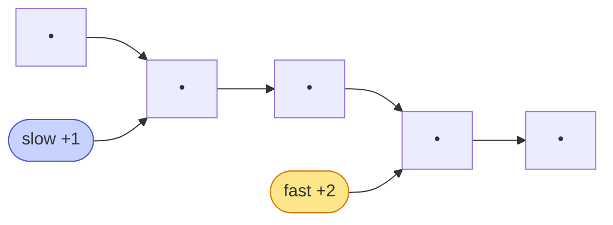

# Memorize: Fast and Slow Pointers

## In a Hurry?

- **One-Line Idea**: Walk the list with two pointers — `slow` at 1 step per tick, `fast` at 2 — so that when `fast` falls off the end, `slow` is parked at the middle in a single pass.
- **Complexities**: `O(n)` time, `O(1)` space, where `n` is the number of nodes in the list (and `fast` covers the list in `n / 2` ticks).
- **When to Use**: The problem asks for a node at a **proportional position** in a singly linked list — the middle, the `1 / k` point, the boundary between halves — without first measuring the length.

---

## One-Line Mnemonic

**"Hare laps tortoise — they meet at the middle."**

The hare moves at twice the tortoise's speed. By the time the hare reaches the finish line, the tortoise has covered exactly half the distance. The 2:1 speed ratio is the entire algorithm — change the ratio, change the landing position.

---

## Real-World Analogy

Picture two runners on a one-way track without distance markers. The slow runner jogs at a steady pace; the fast runner sprints at twice that pace. Neither knows how long the track is. The moment the fast runner crosses the finish line, you tap the slow runner on the shoulder — they are at the exact halfway point of the track, because they covered half as much ground in the same amount of time. No measuring tape needed, no second lap, just two consistent speeds and one observation at the finish line.

---

## Visual Summary



<p align="center"><strong>Two pointers at different speeds — slow moves one node, fast moves two. When fast reaches the end, slow is at the middle; in a looped list they collide, exposing the cycle. One pass, O(1) space.</strong></p>

---

## Pattern Recognition Triggers

The pattern fits when **all four** answers are "yes" — the same diagnostic that gates each problem in the section.

- The problem asks for a node at a **proportional position** in the list — the middle, the `1 / k` point, the predecessor of the middle, or the boundary between two halves.
- The position can be computed from a **single forward pass**, without first measuring the length or copying into an array.
- The per-step work is **`O(1)`** — a constant number of pointer hops and comparisons.
- `O(1)` extra space is **required or strongly preferred**; the two-speed walk never recurses, allocates, or builds auxiliary structures.

Common surface signals: "find the middle of the linked list," "split the list into two halves," "is the list a palindrome," "delete the `n`-th node from the end," "detect a cycle," "find where two lists intersect."

---

## Don't Confuse With

| | **Fast-and-Slow (this pattern)** | **Sliding Window (pattern 09)** | **Cycle Detection (lesson 05)** |
|---|---|---|---|
| **Problem shape** | "Find a node at a proportional position" — the middle, the `1 / k` point, the predecessor of the middle | "Find the `k`-th node from the end" or "the node at a fixed gap from another" | "Does the list contain a cycle, and where does it start?" |
| **Pointer roles** | `slow` (1 step/tick), `fast` (2 or `k` steps/tick) — speed ratio is fixed | `lead` and `trail` — both at the same speed, separated by a fixed gap of `k` nodes | `slow` (1 step/tick), `fast` (2 steps/tick) — same speed ratio as middle-finding |
| **What changes between ticks** | The 2:1 speed gap widens proportionally — `fast` is always at `2 *` `slow`'s index | The fixed gap stays at exactly `k` — both pointers advance by 1 per tick | Same as fast-and-slow — but the cycle bends the track so `fast` eventually laps `slow` |
| **What ends the loop** | `fast` runs out of room — `fast == null` (even length) or `fast.next == null` (odd length) | `lead` reaches the tail — `trail` is then `k` nodes behind | `fast == slow` (cycle exists) or `fast` runs out of room (no cycle) |
| **Output** | `slow`'s position when the loop exits | `trail`'s position when `lead` hits the tail | A boolean (or the meeting point, then a second walk to find the cycle's start) |
| **When this goes wrong** | You're trying to find a node at a **fixed distance** from the end (e.g. "remove the `k`-th from the end") and the result is off by a length-dependent amount — wrong pattern; that's sliding window with a fixed `k`-node gap. | You're trying to find the **middle** by spacing pointers `n / 2` apart and the result requires knowing `n` first — wrong pattern; switch to the 2:1 ratio so the proportional position falls out for free. | You're using fast-and-slow to find the middle and the loop never terminates — the list has a cycle, and `fast` is endlessly lapping `slow`. Switch to cycle detection (same algorithm, different stopping condition: `fast == slow` instead of `fast == null`). |

Cycle detection and middle-finding share the exact same two-pointer walk — they differ only in what the loop watches for. Sliding window is the sibling pattern that fixes the gap between pointers instead of their speed ratio.

---

## Template Code

```python
# Fast-and-slow pointers — generic 2:1 walk for a singly linked list.
# The only knob is the fast pointer's step count.
from typing import Optional


class ListNode:
    def __init__(self, val=0, next=None):
        self.val = val
        self.next = next


def find_middle(head: Optional[ListNode]) -> Optional[ListNode]:
    """
    Return the middle node of the list (second middle on even lengths).
    The loop ends when fast falls off the end — slow is then at index n/2.
    """
    slow: Optional[ListNode] = head          # 1. one step per tick
    fast: Optional[ListNode] = head          # 2. two steps per tick

    while fast is not None and fast.next is not None:   # 3. guard both hops
        slow = slow.next                     # 4. advance slow by 1
        fast = fast.next.next                # 5. advance fast by 2

    return slow                              # 6. slow is at the middle
```

The two knobs are: the **fast pointer's step count** (`fast.next.next` for the 2:1 ratio that finds the middle; `fast.next.next.next` for the 3:1 ratio that finds the `1 / 3` point) and the **starting position of `fast`** (`head` lands `slow` on the second middle for even lengths; `head.next` lands it on the first middle). The body never changes.

---

## Common Mistakes

- **Forgetting to null-check `fast.next` before reading `fast.next.next`**:
  - *What*: writing `while fast != null:` as the loop guard. On an even-length list, `fast` reaches the last node, `fast.next` is `null`, and `fast.next.next` throws `NullPointerException` (Java) or `AttributeError` (Python).
  - *Why*: the two-hop advance needs *both* `fast` and `fast.next` to be non-`null`; a one-clause guard catches only the first case.
  - *Fix*: always write `while fast != null AND fast.next != null` — both clauses, in that order so short-circuit evaluation handles the `null` `fast` case first.
- **Not handling 0 or 1 nodes before entering the loop**:
  - *What*: calling the function on an empty list (`head = null`) or a one-node list and expecting a sensible result. The two-pointer walk technically works (loop guard fails immediately), but problems that do post-walk structural work (splitting, severing, comparing) crash when they try to dereference `slow` or `slow.next`.
  - *Why*: the post-walk branches assume both `head` and `slow` exist; degenerate inputs break that assumption.
  - *Fix*: early-return for `head is null` and `head.next is null` before the walk. Return whatever the problem defines as the trivial answer (e.g. `[head, null]` for splitting, `true` for palindrome, `head` for middle-finding).
- **Off-by-one on the even-length midpoint convention**:
  - *What*: expecting `slow` to land on the first middle for an even-length list (e.g. node `2` on `[1, 2, 3, 4]`) and being surprised that it lands on the second (node `3`). The downstream split or comparison then includes one extra node in the wrong half.
  - *Why*: with both pointers starting at `head`, the 2:1 invariant places `slow` at index `t` when `fast` is at index `2 * t`. For even `n`, `fast` walks off the end at `t = n / 2`, so `slow` is at index `n / 2` — the second middle by 0-indexed convention.
  - *Fix*: if the first middle is wanted, start `fast = head.next` instead of `head`. The same loop body then lands `slow` one node earlier.
- **Mutating `slow.next` while still walking**:
  - *What*: trying to sever the list inside the loop body — for example, writing `slow.next = null` mid-walk to "save" the cut. The next tick's `slow = slow.next` then reads `null`, ending the walk prematurely or crashing on the dereference.
  - *Why*: the walk depends on the original forward chain being intact; rewriting `slow.next` destroys the only path forward.
  - *Fix*: do all structural rewrites *after* the loop exits. Track helper references (like `prev_to_slow` for splitting) inside the loop, but leave the `next` pointers alone until the walk has placed `slow` at the boundary.
- **Confusing fast-and-slow with cycle detection on a list known to have a cycle**:
  - *What*: calling the middle-finding helper on a list with a cycle and getting an infinite loop. `fast` never reaches `null`; it endlessly laps `slow` inside the cycle.
  - *Why*: the loop guard assumes the list is finite and terminated by `null`. A cycle removes the `null` sentinel, so the guard never fires.
  - *Fix*: if cycle detection is needed, use Floyd's algorithm — the same 2:1 walk but with the stop condition `fast == slow` instead of `fast == null`. Pattern recognition matters: same algorithm, different observation.

---

## Minimum Viable Example

Find the middle of `1 → 2 → 3 → 4 → 5 → null`:

```
Init:   slow = 1, fast = 1.
Tick 1: slow = 2, fast = 3.
Tick 2: slow = 3, fast = 5.
Tick 3: guard fails — fast = 5, fast.next = null.
Result: slow = 3 — the middle. Return slow.
```

Five nodes, two ticks of work, zero auxiliary allocations — the complete pattern in four lines.

---

## Quick Recall

**Q: What is the time and space complexity of the 2:1 fast-and-slow walk?**
A: `O(n)` time (one tick per pair of nodes, `n / 2` ticks total) and `O(1)` space (two local references regardless of `n`).

**Q: What is the loop guard for the 2:1 walk?**
A: `while fast != null AND fast.next != null` — both clauses, in that order so short-circuit evaluation prevents dereferencing a `null` `fast`.

**Q: Why does `slow` land on the second middle for even-length lists?**
A: At tick `t`, `slow` is at index `t` and `fast` is at index `2 * t`. For even `n`, `fast` runs out of room at `t = n / 2`, so `slow` is at index `n / 2` — the second middle by 0-indexed convention.

**Q: How do you land on the first middle instead?**
A: Start `fast = head.next` instead of `head`. The same loop body then exits one tick earlier and `slow` is at index `n / 2 - 1`.

**Q: What changes if the problem says "find the `1 / 3` point" instead of the middle?**
A: Advance `fast` by 3 steps per tick (`fast = fast.next.next.next`) and guard all three hops (`fast != null AND fast.next != null AND fast.next.next != null`). Same skeleton, different ratio.

**Q: How is cycle detection related to fast-and-slow?**
A: Exact same algorithm — `slow` at 1 step, `fast` at 2. Only the stop condition differs: `fast == slow` detects a cycle (because `fast` laps `slow` inside the loop), `fast == null` confirms no cycle. One technique, two observations.
