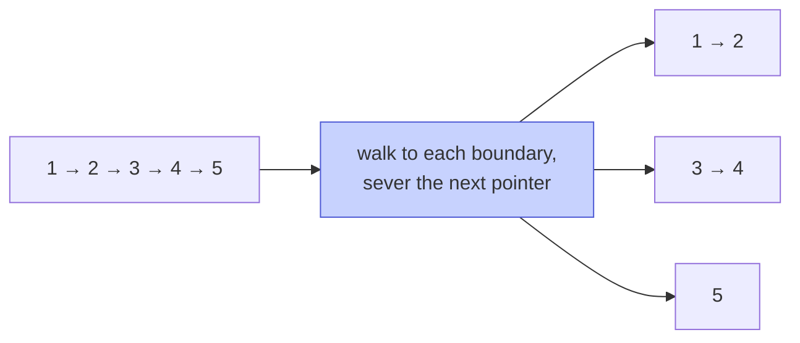

# Memorize: Split

## In a Hurry?

- **One-Line Idea**: Walk the list once and route every node to one of `k` output chains using a classifier — `k` dummy heads plus `k` tail pointers keep each append `O(1)`.
- **Complexities**: `O(n)` time, `O(k)` space, where `n` is the number of input nodes and `k` is the number of output lists. Nodes are re-linked, not copied.
- **When to Use**: The problem asks to **partition** the input list into multiple output lists by some per-node classifier — predicate, modulo, position, or alternation.

---

## One-Line Mnemonic

**"Dummies up front, tails on the move, classifier at the door."**

The dummies anchor each output chain so the first append never needs a `null` check; the tails travel forward as each bucket grows; the classifier is the only problem-specific line. Three roles, one template.

---

## Real-World Analogy

Picture a mail-sorting room. Letters arrive on a single conveyor belt (the input list). In front of you sits a row of empty mail crates (the dummies), one per destination. You read each letter's zip code (the classifier), drop the letter into the right crate, and immediately move on to the next. You never re-read a letter, never copy it — the physical envelope is the same one, and it ends up in a different crate. At the end of the shift you peel off the top sheet from each crate (the dummy) and what's underneath is the sorted output. Every letter travelled once; every crate ends up with a self-contained stack.

---

## Visual Summary



<p align="center"><strong>Cut a list into pieces — k roughly-equal parts, evens vs odds, before/after a pivot — by walking to each boundary and severing the next pointer there. O(n), pointer surgery only.</strong></p>

---

## Pattern Recognition Triggers

The pattern fits when **all four** answers are "yes" — the same diagnostic that gates each problem in the section.

- The problem asks to **partition the input list into multiple output lists** by some classifier — predicate, modulo, position, or alternation.
- The destination bucket for each node can be computed **locally**, from the node itself (plus at most a small piece of stateful counter), without look-ahead or backtracking.
- The per-step work is **`O(1)`** — one classifier call, one tail-append, one pointer advance per node.
- Output lists are allowed to **share the original nodes** (re-linked, not copied). If fresh allocations are mandated, the same template works at an extra `O(n)` allocation cost.

Common surface signals: "split by parity," "partition by predicate," "round-robin distribute," "split into `k` equal parts," "bucket by hash," "group consecutive runs of `k` into alternate lists."

---

## Don't Confuse With

| | **Split (this pattern)** | **Merge (pattern 12)** | **Fast-and-Slow (pattern 10)** |
|---|---|---|---|
| **Problem shape** | "Partition one list into `k` output lists by a classifier" | "Combine multiple input lists into one output list by some merge rule" | "Find a node at a proportional position in a single list" |
| **Direction of work** | One input → many outputs | Many inputs → one output | One input → one output (or a sub-walk) |
| **Pointer roles** | `current` (walker), `tail[i]` per bucket | One tail on the output, one pointer per input list | `slow` (1 step), `fast` (2 or `k` steps) |
| **What classifies a node** | A per-node predicate / modulo / position counter | A per-list comparison (which input head has the smaller value, e.g. sorted merge) | Not classified — two pointers walk at fixed speeds without partitioning |
| **Output structure** | `k` independent terminated chains | One terminated chain | A single node reference (`slow`'s position) |
| **When this goes wrong** | You apply split to "interleave two lists into one" and end up with `k = 2` empty output chains because the classifier is on the wrong direction — wrong pattern; switch to merge, which reads from many heads instead of routing to many tails. | You apply merge to "split one list by parity" and end up calling a comparator on a single input head — wrong pattern; switch to split, which routes one head into many tails. | You apply fast-and-slow to "partition the list by value" and the walker never partitions anything because two pointers at fixed speeds can't classify nodes — wrong pattern; switch to split, which makes the classifier the routing rule. |

Split is the inverse of merge: one chain in, many chains out (split) versus many chains in, one chain out (merge). Fast-and-slow is the sibling positional pattern that walks but doesn't partition.

---

## Template Code

```python
# Split — generic dummy-and-tails template for partitioning a singly linked list.
# The only knob is classify(node) — every variant in the chapter swaps that one line.
from typing import Callable, List, Optional


class ListNode:
    def __init__(self, val=0, next=None):
        self.val = val
        self.next = next


def split(
    head: Optional[ListNode],
    k: int,
    classify: Callable[[ListNode], int],
) -> List[Optional[ListNode]]:
    """
    Partition `head` into `k` output lists. classify(node) returns the bucket
    index in [0, k). Returns a list of k heads (None for empty buckets).
    """
    dummy = [ListNode() for _ in range(k)]      # 1. k placeholder heads
    tail = dummy[:]                              # 2. k tails, one per bucket

    current = head                               # 3. walker on the input list
    while current is not None:
        idx = classify(current)                  # 4. one classifier call
        tail[idx].next = current                 # 5. link node into its bucket
        tail[idx] = current                      # 6. advance the bucket's tail
        current = current.next                   # 7. advance the walker

    for i in range(k):
        tail[i].next = None                      # 8. seal every output list

    return [dummy[i].next for i in range(k)]     # 9. peel past the dummies
```

The two knobs are: the **classifier function** (`current.val % 2` for parity; `current.val % k` for modulo; a stateful counter for alternating groups; a position counter for `k`-way split) and the **bucket count `k`** (which controls the array sizes). The body never changes — only step 4 differs across problems.

---

## Common Mistakes

- **Forgetting to seal the tails after the walk**:
  - *What*: skipping the `for i in range(k): tail[i].next = None` loop and returning the dummies' `.next` pointers directly. The first few nodes of each bucket render correctly, but the last node of each bucket still points into the middle of some other bucket — the outputs bleed into each other.
  - *Why*: during the walk, `tail[i].next` was the original list's forward edge; it only gets overwritten when the *next* node is appended to the same bucket. The last node in each bucket never sees that overwrite.
  - *Fix*: always run the sealing loop after the walk. Two lines, non-negotiable.
- **Initialising `tail = dummy` instead of `tail = dummy[:]` (Python)**:
  - *What*: writing `tail = dummy` so `tail` and `dummy` are the *same* list object. Then `tail[idx] = current` also mutates `dummy[idx]`, and the final `dummy[i].next` reads the last appended node's `.next` instead of the bucket's real head.
  - *Why*: `dummy[:]` creates a shallow copy of the list of node references; `dummy` alone shares the list. Linked-list node objects are still shared either way — only the outer list object's identity matters.
  - *Fix*: always write `tail = dummy[:]` (Python) or build `tail` as a fresh `ArrayList` (Java). The two arrays must be independent.
- **Reading `current.next` after rewriting `tail[idx].next = current`**:
  - *What*: writing `current = current.next` *before* `tail[idx].next = current` and `tail[idx] = current`. The walker has already moved on, so the append lands on the wrong node.
  - *Why*: the routing core is order-sensitive. The append must reference `current` (the node being routed); the walker advance happens *after* the append, not before.
  - *Fix*: follow the canonical order — classify, link, advance the bucket tail, advance the walker. `current = current.next` is always the last line of the loop body.
- **Trying to apply the dummy-and-tails template to a non-partition problem**:
  - *What*: reaching for split when the problem says "merge two sorted lists" or "find the cycle entry." The dummy/tail setup makes no sense — there's nothing to route, only one output.
  - *Why*: the template's whole purpose is to route from one input chain to multiple output chains. Problems that produce a single output need a different shape (merge, fast-and-slow, reversal).
  - *Fix*: confirm with the diagnostic — "are there multiple output lists?" If no, the pattern is wrong. Switch to the appropriate pattern based on what the output looks like.
- **Mishandling empty buckets in the result**:
  - *What*: assuming every output head is non-`null` and dereferencing `result[i].val` without a guard. Empty buckets are common (`k > n` in k-way split; all values landing in one bucket of modulo split).
  - *Why*: an empty bucket's `dummy[i].next` is still `null` — the dummy was never appended to. The template doesn't promise non-empty outputs.
  - *Fix*: treat each result entry as `Optional<ListNode>`; check for `null` before dereferencing. The caller can also short-circuit when `current` is already `null` at the start of an outer bucket loop (as the k-way split does).

---

## Minimum Viable Example

Even/odd split on `1 → 2 → 3 → 4 → null` with `k = 2`:

```
Init:   even_dummy, even_tail = even_dummy.
        odd_dummy,  odd_tail  = odd_dummy.
        current = node 1.
Tick 1: 1 % 2 = 1 → odd.  odd_tail.next = 1; odd_tail = 1.  current = 2.
Tick 2: 2 % 2 = 0 → even. even_tail.next = 2; even_tail = 2. current = 3.
Tick 3: 3 % 2 = 1 → odd.  odd_tail.next = 3; odd_tail = 3.  current = 4.
Tick 4: 4 % 2 = 0 → even. even_tail.next = 4; even_tail = 4. current = null.
Seal:   even_tail.next = null; odd_tail.next = null.
Result: even = 2 → 4; odd = 1 → 3.
```

Four nodes, four ticks, two dummies, zero copies — the full template in eight lines.

---

## Quick Recall

**Q: What is the time and space complexity of the dummy-and-tails split?**
A: `O(n)` time (each node is routed in `O(1)` and visited exactly once) and `O(k)` space (`k` dummies and `k` tails, independent of `n`).

**Q: Why do you need dummy nodes at all?**
A: They absorb the "first append into this bucket" special case. Without them, every append needs an `if tail[b] is None` guard. With them, the routing core is two unconditional lines.

**Q: What happens if you skip the final `tail[i].next = None` loop?**
A: The last node of each bucket still points into the original chain — the outputs bleed into each other. Sealing is non-negotiable; it converts shared tails into independent terminated lists.

**Q: How is the classifier different between even/odd split and modulo split?**
A: Even/odd uses `current.val % 2` (two buckets); modulo uses `current.val % k` (`k` buckets). The classifier expression is different; the routing skeleton is identical.

**Q: When would you skip the dummies entirely?**
A: When the output buckets are *consecutive segments* of the original list — k-way split is the canonical case. Each segment's head is the natural first node, no placeholder needed; severing via `current.next = null` is what isolates the buckets.

**Q: What's the difference between routing per node and routing per chunk?**
A: Per-node routing classifies one node at a time (even/odd, modulo). Per-chunk routing walks `k` nodes at a time, severs the chunk, then splices it onto the bucket tail in one assignment (alternate groups). Same skeleton, larger unit of work.
