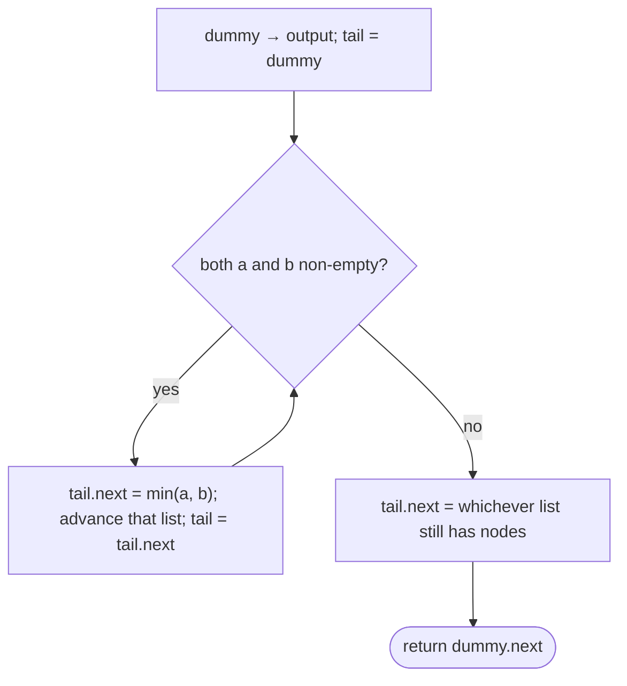

# Pattern: Merge

## Why It Exists

You have two **sorted** lists and want one sorted list containing all their nodes. This is the combine step of merge sort, and the shape of "merge two sorted streams" everywhere.

The naive route ignores the gift you were given: dump every value into an array, sort it (`O((m+n) log(m+n))`), and rebuild a list — extra space *and* a sort you didn't need. The realization: the inputs are **already sorted**, so the next node of the answer is always whichever of the two current heads is smaller. There's no searching and no sorting — just *look at two fronts, take the smaller, advance*. Splice nodes instead of copying values and it's `O(m+n)` time, `O(1)` extra space.

## See It Work

Merge `1→3→5` with `2→4→6`. At each step, take the smaller of the two heads. Run it.

```python run viz=linked-list viz-root=head viz-kind=list-single
import ast

class ListNode:
    def __init__(self, val, next=None):
        self.val = val
        self.next = next

def build_list(values):              # [1, 3, 5] → 1 → 3 → 5 → null
    head = None
    for v in reversed(values):
        head = ListNode(v, head)
    return head

def print_list(head):                # 1 → 2 → 3 → [1, 2, 3]
    out = []
    while head:
        out.append(head.val)
        head = head.next
    print(out)

a = build_list(ast.literal_eval(input()))
b = build_list(ast.literal_eval(input()))

dummy = ListNode(0)                          # a stand-in head — no special case for the first pick
tail = dummy
while a and b:
    if a.val <= b.val:                       # take the smaller front; <= keeps it stable
        tail.next = a; a = a.next
    else:
        tail.next = b; b = b.next
    tail = tail.next                         # extend the output
tail.next = a if a else b                    # one list is empty; attach the other's leftover wholesale

print_list(dummy.next)
```

```java run viz=linked-list viz-root=head viz-kind=list-single
import java.util.*;

public class Main {
  static class ListNode {
    int val; ListNode next;
    ListNode(int val) { this.val = val; }
    ListNode(int val, ListNode next) { this.val = val; this.next = next; }
  }

  public static void main(String[] args) {
    Scanner sc = new Scanner(System.in);
    ListNode a = buildList(parseIntArray(sc.nextLine()));
    ListNode b = buildList(parseIntArray(sc.nextLine()));

    ListNode dummy = new ListNode(0);        // a stand-in head — no special case for the first pick
    ListNode tail = dummy;
    while (a != null && b != null) {
      if (a.val <= b.val) { tail.next = a; a = a.next; }
      else                { tail.next = b; b = b.next; }
      tail = tail.next;                      // extend the output
    }
    tail.next = (a != null) ? a : b;         // one list is empty; attach the other's leftover wholesale

    printList(dummy.next);
  }

  static ListNode buildList(int[] values) {      // {1, 3, 5} → 1 → 3 → 5 → null
    ListNode head = null;
    for (int i = values.length - 1; i >= 0; i--) head = new ListNode(values[i], head);
    return head;
  }

  static void printList(ListNode head) {         // 1 → 2 → 3 → [1, 2, 3]
    List<Integer> out = new ArrayList<>();
    for (ListNode n = head; n != null; n = n.next) out.add(n.val);
    System.out.println(out);
  }

  // "[1, 3, 5]" → {1, 3, 5} — reads the test case's values
  static int[] parseIntArray(String line) {
    String inner = line.replaceAll("[\\[\\]\\s]", "");
    if (inner.isEmpty()) return new int[0];
    String[] parts = inner.split(",");
    int[] out = new int[parts.length];
    for (int i = 0; i < parts.length; i++) out[i] = Integer.parseInt(parts[i]);
    return out;
  }
}
```

```testcases
{
  "args": [
    { "id": "a", "label": "a", "type": "int[]", "placeholder": "[1, 3, 5]" },
    { "id": "b", "label": "b", "type": "int[]", "placeholder": "[2, 4, 6]" }
  ],
  "cases": [
    { "args": { "a": "[1, 3, 5]", "b": "[2, 4, 6]" }, "expected": "[1, 2, 3, 4, 5, 6]" },
    { "args": { "a": "[1, 2, 7, 8]", "b": "[3, 4]" }, "expected": "[1, 2, 3, 4, 7, 8]" },
    { "args": { "a": "[]", "b": "[1, 2, 3]" }, "expected": "[1, 2, 3]" },
    { "args": { "a": "[1, 2, 3]", "b": "[]" }, "expected": "[1, 2, 3]" },
    { "args": { "a": "[1]", "b": "[1]" }, "expected": "[1, 1]" }
  ]
}
```

## How It Works

Two ideas carry it:

1. **A dummy head + a `tail` pointer.** The dummy is a throwaway node the output grows from, so the *first* splice is no different from the rest — no "is this the first node?" special case. `tail` always points at the last node of the output-so-far.
2. **The selector loop.** While *both* inputs have nodes, compare their heads, splice the smaller onto `tail`, and advance that input. When one input runs dry, the other is already sorted and ≥ everything placed — so attach its entire remaining tail in one move.



<p align="center"><strong>compare the two heads, splice the smaller onto the output's tail, advance that list; when one empties, attach the rest of the other.</strong></p>

Each node is spliced exactly once, so it's **`O(m + n)` time, `O(1)` extra space** (the result reuses the input nodes). Using `<=` rather than `<` makes the merge **stable** — when values tie, the node from `a` goes first, preserving original order, which matters when you merge records keyed on one field.

### Key Takeaway

Merge two sorted lists by repeatedly splicing the smaller of the two heads onto a dummy-headed output, then attaching the leftover when one side empties. Sorted inputs make the choice trivial → `O(m+n)` time, `O(1)` space; `<=` keeps it stable.

## Trace It

Merging `a = 1→3→5` and `b = 2→4→6`:

| step | `a` head | `b` head | take | output so far |
|---|---|---|---|---|
| 1 | `1` | `2` | `1` (a) | `1` |
| 2 | `3` | `2` | `2` (b) | `1→2` |
| 3 | `3` | `4` | `3` (a) | `1→2→3` |
| 4 | `5` | `4` | `4` (b) | `1→2→3→4` |
| 5 | `5` | `6` | `5` (a) | `1→2→3→4→5` |
| — | `∅` | `6` | attach `b` | `1→2→3→4→5→6` |

Before you read on: at step 5, `a` empties (its `5` was just taken) while `b` still holds `6`. Why can the loop *stop comparing* and just attach the rest of `b` instead of continuing node by node?

Because `b` is sorted and every node still in it is `≥` everything already placed — `6` is larger than the `5` we just appended, and anything after it (none here) would be larger still. There's nothing left to compare *against*, so node-by-node splicing would do the same work as one pointer assignment. Attaching the leftover tail wholesale is correct precisely because each input was sorted to begin with — the same property that made the selector trivial.

## Your Turn

The reusable merge of two sorted lists:

```python run viz=linked-list viz-root=head viz-kind=list-single
import ast

class ListNode:
    def __init__(self, val, next=None):
        self.val = val
        self.next = next

def merge_two(a, b):
    # Your code goes here — dummy head, splice the smaller head each tick,
    # advance that cursor, then drain the remainder. Return dummy.next.
    pass

def build_list(values):              # [1, 2, 3] → 1 → 2 → 3 → null
    head = None
    for v in reversed(values):
        head = ListNode(v, head)
    return head

def print_list(head):                # 1 → 2 → 3 → [1, 2, 3]
    out = []
    while head:
        out.append(head.val)
        head = head.next
    print(out)

a = build_list(ast.literal_eval(input()))
b = build_list(ast.literal_eval(input()))
print_list(merge_two(a, b))
```

```java run viz=linked-list viz-root=head viz-kind=list-single
import java.util.*;

public class Main {
  static class ListNode {
    int val; ListNode next;
    ListNode(int val) { this.val = val; }
    ListNode(int val, ListNode next) { this.val = val; this.next = next; }
  }

  static ListNode mergeTwo(ListNode a, ListNode b) {
    // Your code goes here — dummy head, splice the smaller head each tick,
    // advance that cursor, then drain the remainder. Return dummy.next.
    return null;
  }

  public static void main(String[] args) {
    Scanner sc = new Scanner(System.in);
    ListNode a = buildList(parseIntArray(sc.nextLine()));
    ListNode b = buildList(parseIntArray(sc.nextLine()));
    printList(mergeTwo(a, b));
  }

  static ListNode buildList(int[] values) {      // {1, 2, 3} → 1 → 2 → 3 → null
    ListNode head = null;
    for (int i = values.length - 1; i >= 0; i--) head = new ListNode(values[i], head);
    return head;
  }

  static void printList(ListNode head) {         // 1 → 2 → 3 → [1, 2, 3]
    List<Integer> out = new ArrayList<>();
    for (ListNode n = head; n != null; n = n.next) out.add(n.val);
    System.out.println(out);
  }

  // "[1, 2, 3]" → {1, 2, 3} — reads the test case's values
  static int[] parseIntArray(String line) {
    String inner = line.replaceAll("[\\[\\]\\s]", "");
    if (inner.isEmpty()) return new int[0];
    String[] parts = inner.split(",");
    int[] out = new int[parts.length];
    for (int i = 0; i < parts.length; i++) out[i] = Integer.parseInt(parts[i]);
    return out;
  }
}
```

```testcases
{
  "args": [
    { "id": "a", "label": "a", "type": "int[]", "placeholder": "[1, 2, 7, 8]" },
    { "id": "b", "label": "b", "type": "int[]", "placeholder": "[3, 4]" }
  ],
  "cases": [
    { "args": { "a": "[1, 2, 7, 8]", "b": "[3, 4]" }, "expected": "[1, 2, 3, 4, 7, 8]" },
    { "args": { "a": "[1, 3, 5]", "b": "[2, 4, 6]" }, "expected": "[1, 2, 3, 4, 5, 6]" },
    { "args": { "a": "[]", "b": "[1, 2, 3]" }, "expected": "[1, 2, 3]" },
    { "args": { "a": "[1, 2, 3]", "b": "[]" }, "expected": "[1, 2, 3]" },
    { "args": { "a": "[1]", "b": "[1]" }, "expected": "[1, 1]" },
    { "args": { "a": "[1, 3]", "b": "[2, 4]" }, "expected": "[1, 2, 3, 4]" }
  ]
}
```

<details>
<summary>Editorial</summary>

The loop is exactly the See-It-Work walk, packaged as a reusable function: `dummy` and `tail` anchor the output, and each tick compares the two heads, splices the smaller (`<=` for stability), advances that cursor, then advances `tail`. When one list empties the other's remaining tail is sorted and ≥ everything placed — one pointer assignment drains it. Empty inputs never enter the loop and correctly pass through to the drain step.

```python solution time=O(m+n) space=O(1)
import ast

class ListNode:
    def __init__(self, val, next=None):
        self.val = val
        self.next = next

def merge_two(a, b):
    dummy = ListNode(0)
    tail = dummy
    while a and b:
        if a.val <= b.val:
            tail.next = a; a = a.next
        else:
            tail.next = b; b = b.next
        tail = tail.next
    tail.next = a if a else b        # attach the remaining tail
    return dummy.next

def build_list(values):              # [1, 2, 3] → 1 → 2 → 3 → null
    head = None
    for v in reversed(values):
        head = ListNode(v, head)
    return head

def print_list(head):                # 1 → 2 → 3 → [1, 2, 3]
    out = []
    while head:
        out.append(head.val)
        head = head.next
    print(out)

a = build_list(ast.literal_eval(input()))
b = build_list(ast.literal_eval(input()))
print_list(merge_two(a, b))
```

```java solution
import java.util.*;

public class Main {
  static class ListNode {
    int val; ListNode next;
    ListNode(int val) { this.val = val; }
    ListNode(int val, ListNode next) { this.val = val; this.next = next; }
  }

  static ListNode mergeTwo(ListNode a, ListNode b) {
    ListNode dummy = new ListNode(0), tail = dummy;
    while (a != null && b != null) {
      if (a.val <= b.val) { tail.next = a; a = a.next; }
      else                { tail.next = b; b = b.next; }
      tail = tail.next;
    }
    tail.next = (a != null) ? a : b;   // attach the remaining tail
    return dummy.next;
  }

  public static void main(String[] args) {
    Scanner sc = new Scanner(System.in);
    ListNode a = buildList(parseIntArray(sc.nextLine()));
    ListNode b = buildList(parseIntArray(sc.nextLine()));
    printList(mergeTwo(a, b));
  }

  static ListNode buildList(int[] values) {      // {1, 2, 3} → 1 → 2 → 3 → null
    ListNode head = null;
    for (int i = values.length - 1; i >= 0; i--) head = new ListNode(values[i], head);
    return head;
  }

  static void printList(ListNode head) {         // 1 → 2 → 3 → [1, 2, 3]
    List<Integer> out = new ArrayList<>();
    for (ListNode n = head; n != null; n = n.next) out.add(n.val);
    System.out.println(out);
  }

  // "[1, 2, 3]" → {1, 2, 3} — reads the test case's values
  static int[] parseIntArray(String line) {
    String inner = line.replaceAll("[\\[\\]\\s]", "");
    if (inner.isEmpty()) return new int[0];
    String[] parts = inner.split(",");
    int[] out = new int[parts.length];
    for (int i = 0; i < parts.length; i++) out[i] = Integer.parseInt(parts[i]);
    return out;
  }
}
```

</details>

## Reflect & Connect

Drill the family in **Practice** — [Alternate Node Fusion](/cortex/data-structures-and-algorithms/linear-structures/singly-linked-list/pattern-merge/problems/alternate-node-fusion), [Merge Sorted Lists](/cortex/data-structures-and-algorithms/linear-structures/singly-linked-list/pattern-merge/problems/merge-sorted-lists), [Merge Sorted Lists II](/cortex/data-structures-and-algorithms/linear-structures/singly-linked-list/pattern-merge/problems/merge-sorted-lists-ii), and [List Addition](/cortex/data-structures-and-algorithms/linear-structures/singly-linked-list/pattern-merge/problems/list-addition).

The dummy-head + tail-splice skeleton is the reusable core; the variants only change the *selector*:

- **Sorted merge** (smaller head wins), **alternate fusion** (interleave regardless of value — selector just alternates), **add two numbers** (walk both, sum digits with a carry — a merge with arithmetic instead of comparison).
- **Merge K sorted lists** scales the idea — either fold pairwise (`O(N log k)`) or pull the global minimum from a [heap](/cortex/data-structures-and-algorithms/trees/heap/what-is-a-heap) of the `k` heads. Same "take the smallest front" instinct, more fronts.
- **It's the inverse of split, and the heart of merge sort** — split a list at the middle (fast/slow), sort each half, then *merge* them back. The whole-list version of "combine sorted pieces" is exactly this pattern called recursively.

**Prerequisites:** [What Is a Linked List?](/cortex/data-structures-and-algorithms/linear-structures/singly-linked-list/what-is-a-linked-list).
**What's next:** combine split, reverse, and merge into one restructuring — [Reorder](/cortex/data-structures-and-algorithms/linear-structures/singly-linked-list/pattern-reorder/pattern).

## Recall

> **Mnemonic:** *Dummy + tail. While both: splice the smaller head, advance it. One empties ⇒ attach the other's leftover. `<=` is stable.*

| | |
|---|---|
| Dummy head | output grows from it → first splice is not a special case |
| Selector | `a.val <= b.val ? take a : take b`, then `tail = tail.next` |
| Leftover | when one list empties, attach the other's remaining tail wholesale |
| Cost | `O(m + n)` time, `O(1)` extra space (nodes reused) |

<details>
<summary><strong>Q:</strong> Why is merging sorted lists `O(m+n)` and not `O((m+n) log(m+n))`?</summary>

**A:** Sorted inputs make the next node always the smaller of two heads — no sort or search, just one linear pass.

</details>
<details>
<summary><strong>Q:</strong> What does the dummy head buy you?</summary>

**A:** The first node is spliced like any other — no "is the output empty yet?" special case.

</details>
<details>
<summary><strong>Q:</strong> Why attach the leftover tail in one step instead of looping?</summary>

**A:** The remaining list is sorted and ≥ everything already placed, so there's nothing left to compare — a single pointer assignment suffices.

</details>
<details>
<summary><strong>Q:</strong> Why `<=` rather than `<`?</summary>

**A:** On ties it takes the node from `a` first, keeping the merge stable (original order preserved).

</details>

## Sources & Verify

- **CLRS**, *Introduction to Algorithms*, 4th ed., §2.3.1 — the `MERGE` procedure (the combine step of merge sort) and its `O(m+n)` bound.
- **Sedgewick & Wayne**, *Algorithms*, 4th ed., §2.2 — merging and merge sort; stability.
- "Merge two sorted lists" with a dummy head and splice selector is the standard result; both runnable blocks are verified by running against their test cases.
