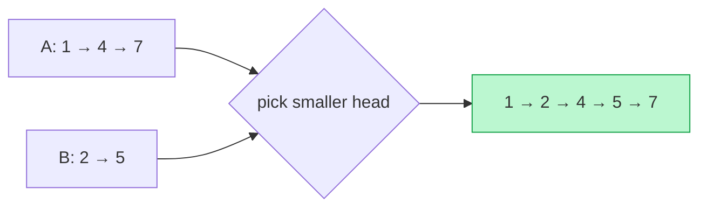

# Memorize: Merge

## In a Hurry?

- **One-Line Idea**: Walk all input lists in lockstep, picking one winner per tick via an `O(1)` selector and splicing it onto a dummy-headed output until every input runs dry.
- **Complexities**: `O(n + m)` time, `O(1)` extra space for splicing variants (alternate fusion, sorted merge); `O(max(n, m))` extra space for the allocate-new-nodes variant (list addition). `n` and `m` are the input lengths.
- **When to Use**: The problem combines two or more input lists into one output, with each output node decided by a constant-time function of the current heads.

---

## One-Line Mnemonic

**"Dummy head, splice winner, drain leftover."**

Every merge variant — alternate fusion, sorted merge, descending merge, digit-by-digit addition — is the same three-act loop. The dummy head removes the first-node special case, the splice line picks today's winner, and the drain step disposes of whichever input outlives the others.

---

## Real-World Analogy

Picture a stapler at the head of a conveyor belt, with two feeder lines bringing in stacks of cards from the left and right. A clerk reads the top card of each feeder, picks one according to a fixed rule (smallest number wins, or take from the left then the right alternately, or build a new card holding the sum), staples it to the growing chain, and advances the feeder it took from. The clerk never reaches deeper into either feeder — only the top card matters. When one feeder runs out, the remaining feeder's whole stack gets stapled to the chain in one motion. The output emerges as a single ordered chain whose composition is decided entirely by the clerk's rule.

---

## Visual Summary



<p align="center"><strong>Weave two sorted lists into one: repeatedly splice off the smaller of the two heads onto the tail of the result. A dummy head keeps the splicing uniform — O(n + m), no copying.</strong></p>

---

## Pattern Recognition Triggers

The pattern fits when **all four** answers are "yes" — the same diagnostic that gates each problem in the section.

- The problem combines **two or more input lists** into a single output list, with each output node coming from exactly one input (or from a fixed function of synchronised input nodes).
- The choice of "which input contributes the next output node" can be made by an **`O(1)` selector** looking only at the current heads — no scan of the remaining suffixes.
- The output is a **linked list** that can be built either by **rewiring input nodes in place** or by **allocating fresh nodes** when the output values differ from any input value.
- `O(1)` extra space is **sufficient** for the splicing variants, or `O(max(n_i))` for the allocate-new-nodes variant. The merge skeleton never needs auxiliary buffers.

Common surface signals: "merge two sorted lists," "interleave two lists alternately," "add two numbers represented as linked lists," "zip two lists together," "combine `k` sorted lists into one," "build the output by walking inputs in lockstep."

---

## Don't Confuse With

| | **Merge (this pattern)** | **Split (pattern 11)** | **Reversal (pattern 07)** |
|---|---|---|---|
| **Problem shape** | "Combine `k` input lists into one output by a selector on the current heads." | "Split one input list into `k` output buckets by a classifier on the current node." | "Reverse a list (or a sublist) in place by flipping `.next` pointers." |
| **Number of inputs / outputs** | `k` inputs → 1 output. The selector decides which input contributes each output node. | 1 input → `k` outputs. The classifier decides which bucket each input node goes to. | 1 input → 1 output. No splitting, no merging — just direction flipping. |
| **Splice direction** | Inputs feed forward into the output; `tail.next = winner`. | Input feeds out to one of `k` tails; `bucket_tail.next = currentNode`. | No splice in the merge sense — each node's `.next` is rewritten to point at the previous node. |
| **Per-step decision** | `O(1)` selector reads `k` current heads, returns the winner. | `O(1)` classifier reads the current input node, returns a bucket id. | No decision per node — every node is reversed unconditionally. |
| **Output count** | Always 1. | Always `k` (one per bucket, possibly empty). | Always 1. |
| **When this goes wrong** | You're trying to merge inputs but the splice produces garbage — likely the cursor advance happened *before* the `tail.next` assignment, so the winner's `.next` still drags its input list along. Wrong order; rewrite to read, splice, advance. | You're splitting one list and got `k` lists but the input is no longer traversable — the splice corrupted the input chain. Wrong pattern direction; revisit split, not merge. | You're trying to combine two reversed lists and the comparator output is the wrong direction — likely you reused the ascending `<=` after reversing inputs. Flip to `>=` to keep stability on descending output. |

The three patterns share the dummy-head + tail idiom; what differs is the direction of the splice and the cardinality of the inputs versus outputs.

---

## Template Code

```python
# Merge — generic dummy-head splice loop for a singly linked list.
# Swap out `select_winner` to specialise to a concrete merge variant.
from typing import Optional


class ListNode:
    def __init__(self, val=0, next=None):
        self.val = val
        self.next = next


def merge_two(headA: Optional[ListNode], headB: Optional[ListNode]) -> Optional[ListNode]:
    """
    Combine two singly linked lists into one. The selector below picks the
    smaller head (sorted merge); swap it out for any O(1) selector.
    """
    dummy = ListNode()                       # 1. throwaway sentinel
    tail = dummy                             # 2. moving end-of-output cursor

    currentA, currentB = headA, headB        # 3. one cursor per input

    while currentA is not None and currentB is not None:
        # 4. O(1) selector — the only line that changes per variant
        if currentA.val <= currentB.val:
            winner, currentA = currentA, currentA.next
        else:
            winner, currentB = currentB, currentB.next

        tail.next = winner                   # 5. splice the winner
        tail = winner                        # 6. advance the output tail

    # 7. drain whichever input is still non-empty (at most one)
    tail.next = currentA if currentA is not None else currentB

    return dummy.next                        # 8. skip the dummy
```

The two knobs are the **selector** (line 4 — `<=` for ascending merge, `>=` for descending, a flipping boolean for alternate fusion, an arithmetic sum for list addition) and the **splice line** (`tail.next = winner` for splicing variants; `tail.next = ListNode(sum % 10)` for list addition). Everything else — the dummy, the loop guard, the drain — stays exactly as shown.

---

## Common Mistakes

- **Advancing the winner's cursor before splicing it onto `tail`**:
  - *What*: writing `currentA = currentA.next; tail.next = currentA` (in that order). The splice now attaches the *next* input node instead of the winner, and the loop walks faster than intended.
  - *Why*: the merge invariant is that `winner` (whatever cursor was just chosen) becomes the next output node. Advancing first overwrites the cursor that pointed to the winner.
  - *Fix*: always read, splice, then advance. Capture the winner first (`winner = currentA`), then write `tail.next = winner`, then advance the input cursor (`currentA = currentA.next`). The Python destructuring `winner, currentA = currentA, currentA.next` does both reads safely.
- **Forgetting to advance `tail` after the splice**:
  - *What*: writing `tail.next = winner` without the follow-up `tail = winner`. The next iteration's `tail.next = winner` then overwrites the splice instead of extending it, and every output except the last winner is lost.
  - *Why*: `tail` is the moving end-of-output cursor; if it doesn't move, every splice happens at the same point.
  - *Fix*: pair the splice and the cursor advance — `tail.next = winner; tail = winner`. Treat them as one atomic write.
- **Looping through the leftover suffix node by node**:
  - *What*: after the main loop, writing a second `while currentA is not None: tail.next = currentA; tail = tail.next; currentA = currentA.next` block. Correct but wasteful — every node is walked even though they are already correctly chained.
  - *Why*: the input is a linked list, so the remaining suffix is one self-contained chain rooted at the cursor. A single splice attaches it whole.
  - *Fix*: replace the per-node drain with `tail.next = currentA if currentA is not None else currentB`. This is `O(1)` versus `O(remaining length)`.
- **Skipping the dummy and special-casing the first output node**:
  - *What*: writing `if head is None: head = winner else: tail.next = winner` inside the loop, with a separate branch for the very first iteration. The loop body now has two shapes instead of one.
  - *Why*: every iteration after the first does the same three updates, but the first allocation of `head` is different because there is no previous `tail` to splice from.
  - *Fix*: create a `dummy` node before the loop and let `tail = dummy`. Every iteration is then identical; the dummy is discarded by returning `dummy.next`. The throwaway node is worth the simpler loop body.
- **Forgetting the final carry node in list addition**:
  - *What*: after both inputs are drained in `list_addition`, returning `dummy.next` without checking `if carry > 0: tail.next = ListNode(carry)`. Adding `99 + 1` produces `[0, 0]` instead of `[0, 0, 1]`.
  - *Why*: the running carry can survive past the last input column — `9 + 1 = 10` leaves `carry = 1` after the only input column, with no more digits to absorb it.
  - *Fix*: after both drain loops, write a single `if carry > 0: tail.next = ListNode(carry)`. The carry is at most `1` because two digits plus a carry of `1` cannot exceed `19`, so one extra node is always enough.

---

## Minimum Viable Example

Merge ascending `A = [1, 3]` and `B = [2, 4]`:

```
Init:   dummy = ⊙, tail = dummy, currentA = 1, currentB = 2.
Iter 1: 1 <= 2 → splice 1; currentA = 3, tail = 1.
Iter 2: 3 <= 2 ? no → splice 2; currentB = 4, tail = 2.
Iter 3: 3 <= 4 → splice 3; currentA = null, tail = 3.
Drain:  currentB = 4 → tail.next = currentB (one splice attaches [4]).
Result: dummy.next = 1 → 2 → 3 → 4 → null.
```

Four nodes, three iterations of work, zero allocations beyond the dummy — the complete pattern in five lines.

---

## Quick Recall

**Q: What is the time and space complexity of merging two singly linked lists?**
A: `O(n + m)` time (each iteration consumes one input node) and `O(1)` extra space for splicing variants (the dummy is the only allocation); `O(max(n, m))` extra space for the list-addition variant, which allocates one output node per column.

**Q: Why use a dummy node at the head of the output?**
A: It removes the "is this the first output node?" special case from the loop body. Every iteration does the same three-line splice (`tail.next = winner; advance input cursor; tail = winner`), and the throwaway dummy is discarded by returning `dummy.next`.

**Q: What is the correct order of operations inside the merge loop?**
A: Read the winner from the current heads → write `tail.next = winner` → advance the winner's input cursor → advance `tail`. Advancing the input cursor *before* the splice attaches the wrong node and drags the rest of the input list along.

**Q: How is the leftover suffix attached after the main loop?**
A: In a single splice — `tail.next = currentA if currentA is not None else currentB`. The suffix is already correctly chained because we never severed it, so no per-node loop is needed. That makes the drain step `O(1)`.

**Q: What changes between alternate fusion, sorted merge, and list addition?**
A: Only the selector and (for list addition) the splice line. Alternate fusion flips a boolean; sorted merge compares the two head values; list addition computes `sum = currentA.val + currentB.val + carry` and emits a new node. The dummy-head splice skeleton is identical across all three.

**Q: How does merge generalise to `k > 2` input lists?**
A: Replace the two-cursor comparison with a min-heap of size `k` holding the current head of each input. Each iteration extracts the min in `O(log k)`, splices it, advances that input's cursor, and pushes the new head. Total cost is `O(n log k)` time, `O(k)` extra space for the heap — the linked-list version of `k`-way merge sort.
