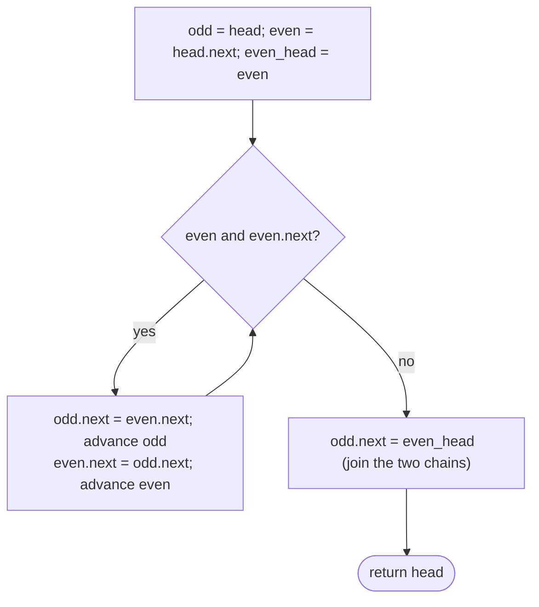

# Pattern: Reorder

## Why It Exists

Some problems don't sort a list — they **regroup** it: gather all odd-position nodes before the even-position ones, move every node `< x` ahead of the rest, or fold the back half into the front (`L0→Ln→L1→Ln-1→…`). The relative order changes by a *rule*, not by comparison.

The naive approach copies the values into an array, rearranges there, and writes them back — `O(n)` extra space, and it shuffles *values* between nodes, which breaks the moment a node carries identity (an id, a back-reference) you mustn't move. The realization: leave the nodes exactly where they sit in memory and **re-thread the pointers**. Walk once, assign each node to a group, splice it onto that group's growing chain, then concatenate the chains. Nodes never move — only `next` links change. `O(1)` extra space.

This pattern sits last because the interesting reorders **compose the earlier primitives** — split, reverse, and merge become building blocks.

## See It Work

Reorder `1→2→3→4→5` so the odd-*position* nodes come first, then the even-position ones: `1→3→5→2→4`. Two chains grow as you walk, then join. Run it, then **Visualise** the re-threading.

> ▶ Run it, then click **Visualise** — `odd` and `even` chains grow interleaved as you walk; at the end the even chain is hung off the odd chain's tail.

```python run viz=linked-list viz-root=head viz-kind=list-single
class ListNode:
    def __init__(self, val, next=None):
        self.val = val
        self.next = next

head = ListNode(1, ListNode(2, ListNode(3, ListNode(4, ListNode(5)))))   # 1 → 2 → 3 → 4 → 5

odd = head                           # 1st, 3rd, 5th … nodes
even = head.next                     # 2nd, 4th … nodes
even_head = even                     # remember where the evens start
while even is not None and even.next is not None:
    odd.next = even.next             # link this odd node to the next odd node
    odd = odd.next
    even.next = odd.next             # link this even node to the next even node
    even = even.next
odd.next = even_head                 # concatenate: evens hang off the odd tail

vals = []
node = head
while node:
    vals.append(node.val)
    node = node.next
print(vals)                          # [1, 3, 5, 2, 4]
```

## How It Works

Grow **two chains at once** while walking the original list:

- `odd` builds the chain of nodes at positions 1, 3, 5, …; `even` builds positions 2, 4, ….
- Save `even_head` — the first even node — because that's where the second chain begins, and you'll need it to join the chains at the end.
- Each iteration relinks one node into each chain (`odd.next = even.next`, then `even.next = odd.next`) and advances both. The loop guard `even and even.next` stops cleanly for both odd and even lengths.
- **Concatenate**: `odd.next = even_head` hangs the whole even chain off the tail of the odd chain.



<p align="center"><strong>split the nodes into an odd-position chain and an even-position chain as you walk, then concatenate the even chain onto the odd chain's tail.</strong></p>

One pass, two pointers, a constant amount of bookkeeping → **`O(n)` time, `O(1)` space.** The same skeleton — *classify each node into a chain, then concatenate* — covers value partitions (`< x` chain + `≥ x` chain) and other regroupings; only the classification rule changes.

### Key Takeaway

Reorder by re-threading, not moving values: walk once, splice each node onto its group's chain, then concatenate the chains. `O(n)` time, `O(1)` space — and the richest reorders compose split + reverse + merge.

## Trace It

`1→2→3→4→5`, `odd = 1`, `even = 2`, `even_head = 2`:

| step | action | odd chain | even chain |
|---|---|---|---|
| 1 | `odd.next = 3`; `even.next = 4` | `1→3` | `2→4` |
| 2 | `odd.next = 5`; `even.next = null` | `1→3→5` | `2→4` |
| join | `odd.next = even_head` | `1→3→5→2→4` | — |

Before you read on: the two chains are built *interleaved* in a single pass — `odd` and `even` leapfrog each other through the original list. Why save `even_head` at the very start instead of finding the even chain's head later?

Because by the time the loop ends, the original `head.next` link has been **overwritten** — `odd.next` now points at `3`, not `2`. The node `2` is still the start of the even chain, but nothing points to it anymore except the variable you saved. Capturing `even_head` up front is the one piece of state that survives the re-threading; without it, the even chain would be unreachable and the concatenation impossible.

## Your Turn

The reusable odd/even-position reorder:

```python run viz=linked-list viz-root=head viz-kind=list-single
class ListNode:
    def __init__(self, val, next=None):
        self.val = val
        self.next = next

def odd_even(head):
    if head is None or head.next is None:
        return head
    odd = head
    even = head.next
    even_head = even
    while even is not None and even.next is not None:
        odd.next = even.next
        odd = odd.next
        even.next = odd.next
        even = even.next
    odd.next = even_head             # concatenate
    return head

head = ListNode(1, ListNode(2, ListNode(3, ListNode(4, ListNode(5)))))
out, node = [], odd_even(head)
while node:
    out.append(node.val); node = node.next
print(out)                           # [1, 3, 5, 2, 4]
```

```java run viz=linked-list viz-root=head viz-kind=list-single
public class Main {
  static class ListNode { int val; ListNode next; ListNode(int v){ val = v; } ListNode(int v, ListNode n){ val = v; next = n; } }

  static ListNode oddEven(ListNode head) {
    if (head == null || head.next == null) return head;
    ListNode odd = head, even = head.next, evenHead = even;
    while (even != null && even.next != null) {
      odd.next = even.next; odd = odd.next;
      even.next = odd.next; even = even.next;
    }
    odd.next = evenHead;             // concatenate
    return head;
  }

  public static void main(String[] args) {
    ListNode head = new ListNode(1, new ListNode(2, new ListNode(3, new ListNode(4, new ListNode(5)))));
    StringBuilder sb = new StringBuilder("[");
    for (ListNode c = oddEven(head); c != null; c = c.next) sb.append(c.val).append(c.next != null ? ", " : "");
    System.out.println(sb.append("]"));   // [1, 3, 5, 2, 4]
  }
}
```

Drill the family in **Practice** — [Relocate Node](/cortex/data-structures-and-algorithms/linear-structures/singly-linked-list/pattern-reorder/problems/relocate-node), [Parity Order](/cortex/data-structures-and-algorithms/linear-structures/singly-linked-list/pattern-reorder/problems/parity-order), [Value Partition](/cortex/data-structures-and-algorithms/linear-structures/singly-linked-list/pattern-reorder/problems/value-partition), and [Shuffle List](/cortex/data-structures-and-algorithms/linear-structures/singly-linked-list/pattern-reorder/problems/shuffle-list).

## Reflect & Connect

Reorder is where the linked-list toolkit comes together:

- **Classify-and-concatenate** covers most of it — by index parity (above), by **value** (a `< x` chain and a `≥ x` chain, kept stable, then joined — the partition step of quicksort on lists), by any per-node predicate.
- **The capstone composition** — the classic *fold* reorder `L0→Ln→L1→Ln-1→…` is built entirely from the patterns you already have: **split** the list at the middle ([fast & slow](/cortex/data-structures-and-algorithms/linear-structures/singly-linked-list/pattern-fast-and-slow-pointers/pattern)), **[reverse](/cortex/data-structures-and-algorithms/linear-structures/singly-linked-list/pattern-reversal/pattern)** the second half, then **[merge](/cortex/data-structures-and-algorithms/linear-structures/singly-linked-list/pattern-merge/pattern)** the two halves alternately. Recognizing a hard reorder as "split + reverse + merge" is the whole skill.
- **Always save the heads you'll overwrite** — re-threading destroys the original links as you go; the one or two pointers you stash up front (`even_head` here) are what keep the rebuilt chains reachable.

**Prerequisites:** [Merge](/cortex/data-structures-and-algorithms/linear-structures/singly-linked-list/pattern-merge/pattern).

## Recall

> **Mnemonic:** *Grow two chains while you walk — odd positions, even positions — saving `even_head`. Then `odd.next = even_head` joins them. Re-thread, don't move values.*

| | |
|---|---|
| Technique | classify each node into a chain, then concatenate the chains |
| Two chains | `odd` (positions 1,3,5…), `even` (2,4…); save `even_head` |
| Join | `odd.next = even_head` after the walk |
| Capstone | the fold reorder = split (fast/slow) + reverse + merge |
| Cost | `O(n)` time, `O(1)` space (pointers re-threaded, values untouched) |

<details>
<summary><strong>Q:</strong> Why re-thread pointers instead of moving values into an array?</summary>

**A:** `O(1)` space, and it preserves node identity — values that mustn't move (ids, back-references) stay put.

</details>
<details>
<summary><strong>Q:</strong> Why must `even_head` be saved before the loop?</summary>

**A:** The loop overwrites `head.next`, so the even chain's start becomes unreachable except through the saved pointer.

</details>
<details>
<summary><strong>Q:</strong> What's the unifying skeleton across reorder variants?</summary>

**A:** Classify each node into a chain by some rule, then concatenate the chains; only the rule differs.

</details>
<details>
<summary><strong>Q:</strong> How is the classic fold reorder built?</summary>

**A:** Split at the middle (fast/slow), reverse the second half, then merge the two halves alternately — composing three earlier patterns.

</details>

## Sources & Verify

- **CLRS**, *Introduction to Algorithms*, 4th ed., §10.2 — linked-list pointer manipulation; partitioning by re-linking.
- **Sedgewick & Wayne**, *Algorithms*, 4th ed., §1.3 — linked structures and in-place restructuring.
- "Odd Even Linked List" (group by index parity) and the fold reorder are standard problems; both runnable blocks are verified by running (output `[1, 3, 5, 2, 4]`).
