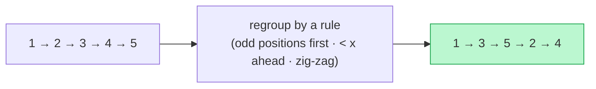

# Memorize: Reorder

## In a Hurry?

- **One-Line Idea**: Reorder a list in place by splitting its nodes into `k` temporary sub-lists with a classifier `f1`, then merging those sub-lists back into one with a selector `f2`.
- **Complexities**: `O(n)` time, `O(1)` extra space. `n` is the input list's length; the only allocations are a constant number of dummy heads.
- **When to Use**: The problem rearranges the nodes of one linked list in place, and the target order can be expressed as "route by `O(1)` classifier, then weave by `O(1)` selector".

---

## One-Line Mnemonic

**"Split by `f1`, weave by `f2`."**

Every reorder variant — parity-order, value-partition, relocate-node, zig-zag shuffle — is the same two-pass pipeline. Pick `f1` (the classifier that routes input nodes into buckets), pick `f2` (the selector that picks which bucket contributes the next output node), and the algorithm writes itself. The pipeline body is identical across variants; the two functions are the whole problem.

---

## Real-World Analogy

Picture a postal sorting room with one input belt and two outgoing slots. A clerk reads each envelope as it arrives, applies a rule (the classifier `f1`) — for example "if the zip code is odd, send left; otherwise send right" — and drops the envelope into the chosen slot. Once the input belt is empty, the two outgoing piles are still in arrival order within each pile. A second clerk then picks up the piles and walks them in lockstep, applying a different rule (the selector `f2`) — for example "always take from the left pile until it's empty, then take the rest from the right" — and lays the envelopes onto an output belt. The same envelopes leave the room, but the order they leave in is dictated entirely by `f1` and `f2`. Nothing is reprinted; nothing is reweighed.

---

## Visual Summary



<p align="center"><strong>Rearrange a list by a rule rather than by value — odd-position nodes first, every node < x ahead, front-back zig-zag — by splitting into chains and relinking. O(n) time, O(1) space.</strong></p>

---

## Pattern Recognition Triggers

The pattern fits when **all four** answers are "yes" — the same diagnostic that gates each problem in the section.

- The problem **rearranges the nodes of one input list in place**, producing an output that contains the same nodes in a different order.
- The target order can be expressed as **"route nodes by an `O(1)` classifier `f1`, then weave them by an `O(1)` selector `f2`"** — without sorting, without random access, without re-reading the list multiple times.
- The resulting sub-lists are **bounded in count** (typically two, occasionally `k`) and consumable in one forward pass during the merge.
- `O(1)` extra space is **sufficient** for the buckets and the merge state. The only allocations should be dummy heads — one per bucket plus one for the output.

Common surface signals: "reorder in place," "group by parity," "partition around a value," "move the last node to the front," "zig-zag the list," "shuffle by index," "interleave first half with reversed second half."

---

## Don't Confuse With

| | **Reorder (this pattern)** | **Split (pattern 11)** | **Merge (pattern 12)** |
|---|---|---|---|
| **Problem shape** | "Rearrange the nodes of one input list in place into a new order, by composing split and merge." | "Split one input list into `k` output buckets by a classifier on the current node." | "Combine `k` input lists into one output by a selector on the current heads." |
| **Number of inputs / outputs** | 1 input → 1 output. Internally there are `k` temporary buckets, but the output is one list. | 1 input → `k` outputs. The classifier decides which bucket each input node goes to. | `k` inputs → 1 output. The selector decides which input contributes each output node. |
| **Pipeline shape** | Split pass + merge pass over the same nodes — both passes are linear and disjoint. | One pass — the split pass on its own. No merge. | One pass — the merge pass on its own. No split. |
| **Per-step decision** | `f1` for the split phase, `f2` for the merge phase. Two `O(1)` functions, one per pass. | One `O(1)` classifier `f1`. The output is the `k` buckets directly. | One `O(1)` selector `f2`. The input is `k` already-built lists. |
| **When this goes wrong** | The reorder pipeline produces a partially-corrupt chain — likely the split pass forgot to terminate one bucket with `null`, so the merge pass walks past the bucket end into stale input nodes. Symptom: extra nodes appear in the output or the program loops forever. Always set both `bucket_tail.next = null` after the split pass. | You're routing nodes into `k` buckets but the input chain is mangled — the splice corrupted the input cursor. Wrong pattern direction; revisit split's "read current.next *before* the splice" discipline. | You're combining `k` input lists but the selector is reading nodes that don't exist — likely one input was consumed by an earlier merge pass without re-initialising. Wrong pattern direction; revisit merge's "guard the loop on all cursors non-null" rule. |

The three patterns share the dummy-head + tail idiom; what differs is whether you split (one to many), merge (many to one), or do both in sequence (reorder).

---

## Template Code

```python
# Reorder — generic split-then-merge pipeline for a singly linked list.
# Swap out `classify` (f1) and `select_winner` (f2) to specialise to a
# concrete reorder variant.
from typing import Optional


class ListNode:
    def __init__(self, val=0, next=None):
        self.val = val
        self.next = next


def reorder(head: Optional[ListNode]) -> Optional[ListNode]:
    """
    Two-pass reorder: split into two buckets by f1, then merge by f2.
    Generalises to k buckets by widening the cursors below.
    """
    if head is None or head.next is None:
        return head                                # 1. trivial inputs

    # --- Split pass (uses f1 = classify) ---
    dummyA = ListNode()
    tailA = dummyA                                 # 2. bucket A
    dummyB = ListNode()
    tailB = dummyB                                 # 3. bucket B

    current = head
    counter = 1                                    # 4. optional state for f1
    while current is not None:
        if classify(current, counter):             # 5. f1 — O(1) classifier
            tailA.next = current
            tailA = current
        else:
            tailB.next = current
            tailB = current
        current = current.next                     # 6. advance the input cursor
        counter += 1

    tailA.next = None                              # 7. terminate both buckets
    tailB.next = None

    headA, headB = dummyA.next, dummyB.next        # 8. real bucket heads

    # --- Merge pass (uses f2 = select_winner) ---
    dummy = ListNode()
    tail = dummy
    currentA, currentB = headA, headB
    while currentA is not None and currentB is not None:
        if select_winner(currentA, currentB):      # 9. f2 — O(1) selector
            winner, currentA = currentA, currentA.next
        else:
            winner, currentB = currentB, currentB.next
        tail.next = winner
        tail = winner

    tail.next = currentA if currentA is not None else currentB

    return dummy.next                              # 10. skip the dummy
```

The two knobs are `classify` (line 5 — `counter % 2 == 1` for parity-order, `node.val < X` for value-partition) and `select_winner` (line 9 — a flipping boolean for alternate-fuse, plain concatenation by setting `tail.next = headB` after walking headA's tail for simpler variants). Everything else — the dummies, the loop guards, the bucket termination, the drain — stays exactly as shown.

---

## Common Mistakes

- **Forgetting to terminate the buckets with `null` after the split pass**:
  - *What*: writing `tailA.next` and `tailB.next` splices inside the loop but no explicit `tailA.next = None; tailB.next = None` afterwards. The merge pass then walks past the intended bucket end into stale input chain, either looping forever or producing a corrupt output.
  - *Why*: every `.next` field in the bucket nodes is still whatever the input had originally, except for the ones overwritten by splices. The last node spliced into bucket A still has its original `.next` pointing into the rest of the input chain.
  - *Fix*: after the split-pass loop, always set `tailA.next = None` and `tailB.next = None`. Treat the bucket termination step as part of the split pass, not as an afterthought.
- **Advancing `current` before splicing it onto a bucket**:
  - *What*: writing `current = current.next; tailA.next = current` (in that order). The splice now attaches the *next* input node instead of the current one, and the loop skips a node every iteration.
  - *Why*: the splice line `tailA.next = current` is what stitches the bucket together. Advancing `current` first destroys the reference to the node you meant to splice.
  - *Fix*: always read, splice, then advance. The order is `tailA.next = current; advance the bucket tail; advance current = current.next`. Treat the bucket splice and the input advance as two distinct steps.
- **Using the wrong dummy when returning the head of the output**:
  - *What*: writing `return dummy.next` when the variant has multiple dummies — say `return dummyA.next` would return the head of bucket A instead of the merged output. Symptom: the output is truncated to one bucket's content.
  - *Why*: each bucket has its own dummy, and the merge pass introduces yet another (the output dummy). It's easy to confuse them when the variable names are similar.
  - *Fix*: name the dummies distinctly (`odd_dummy`, `even_dummy`, `merged_dummy`) and return the merge-pass dummy's `.next`. If the merge step is plain concatenation (no separate merge dummy), return the head of the first bucket after stitching the second bucket onto its tail.
- **Skipping the trivial-input guard and crashing on `head = null`**:
  - *What*: launching straight into the split-pass loop without checking for an empty or singleton list. On `head = null`, `current.next` throws a null-pointer exception; on `head = [x]`, the algorithm runs needlessly and may corrupt the singleton's `.next` field.
  - *Why*: the algorithm assumes there's something to reorder. Lists with zero or one node already satisfy any reorder target trivially.
  - *Fix*: open the function with `if head is None or head.next is None: return head`. One line, prevents both crashes and unnecessary work.
- **Forgetting to compose `f1` correctly when the variant pre-processes a sub-list**:
  - *What*: in zig-zag shuffle, treating `f1` as a one-line classifier when it's actually a small pipeline (split at the middle, then reverse the second half). Trying to inline it as `index % 2` produces the wrong sub-lists.
  - *Why*: most reorder variants have an `f1` that fits in one expression, but a few — the composite reorders — have an `f1` that itself uses earlier patterns. Pattern-matching on the simpler shape silently picks the wrong decomposition.
  - *Fix*: when the target order has "first half / reversed second half" structure, write `f1` as two steps: `(first_half, second_half) = split_in_half(head)` followed by `second_half = reverse(second_half)`. Then `f2` is plain alternate-fuse. Each step is a single-pass walk you've already mastered.

---

## Minimum Viable Example

Reorder `A = [1, 2, 3, 4]` into parity-order (`f1 = counter % 2`, `f2 = concatenate`):

```
Split:   ⊙_o → 1 → 3 → null    (odd-indexed bucket)
         ⊙_e → 2 → 4 → null    (even-indexed bucket)
Merge:   walk odd tail to 3; set 3.next = even_head (=2).
Result:  1 → 3 → 2 → 4 → null.
```

Four nodes, one split pass plus one tail walk, zero allocations beyond the two dummies — the complete pattern in five lines.

---

## Quick Recall

**Q: What is the time and space complexity of the reorder pipeline?**
A: `O(n)` time for the split pass plus `O(n)` for the merge pass (`O(n)` total) and `O(1)` extra space (a constant number of dummy heads and cursors, regardless of input size).

**Q: What are the two knobs that customise a reorder variant?**
A: `f1` — the `O(1)` classifier that routes input nodes into temporary buckets during the split pass — and `f2` — the `O(1)` selector that picks which bucket contributes the next output node during the merge pass.

**Q: Why does the split pass need to terminate each bucket's tail with `null`?**
A: Because the bucket nodes' `.next` fields are still whatever the input had unless explicitly overwritten — the last node spliced into each bucket still points into the original input chain. Without `tail.next = null`, the merge pass walks past the bucket end and consumes stale nodes.

**Q: When does the merge step degenerate to plain concatenation?**
A: When `f2` is "drain bucket A entirely, then drain bucket B". Walk bucket A to its tail, set `tail.next = head_of_B`, and return `head_of_A`. Used by parity-order and value-partition.

**Q: How does the reorder pattern relate to split and merge?**
A: Reorder is the composition of the two: pattern 11 (split) is the first pass, pattern 12 (merge) is the second pass, and pattern 13 (reorder) is the wrapper that names which `f1` and `f2` apply. Master split and merge in isolation, and every reorder variant becomes a one-line choice of two functions.

**Q: What is the most expensive reorder variant in the chapter?**
A: Shuffle-list. Its `f1` is itself a composite of two earlier patterns — find-the-middle (fast-and-slow) and reverse-the-second-half (reversal pattern) — before the merge selector ever runs. Even so, the total cost is `O(n)` time and `O(1)` extra space, because all three sub-passes are single-pass and disjoint.
