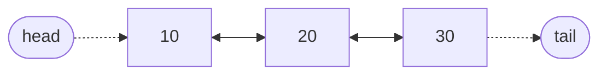

# Doubly & Circular Linked Lists

## Why It Exists

The singly linked list had one weakness even *it* couldn't fix. To delete a node, you have to rewire the `next` pointer of the node **in front of** it — but a singly node only knows its *successor*, never the node behind it. So to delete a node you're already holding, you first have to find its predecessor — and with no back-link, the only way there is to walk from the head: an `O(n)` scan.

That's a strange tax. You're *pointing right at* the node you want gone, and it still costs a full scan to remove it. What if every node also remembered the node *behind* it? Then its predecessor would be one hop away, and the delete would be instant.

That one extra pointer — `prev` — is the **doubly linked list**. It's a tiny change with an outsized payoff, and it's why your browser's Back button, an LRU cache, and the Linux kernel's process lists are all built on it.

## See It Work

Each node now carries `prev` *and* `next`, so the chain reads in both directions. Run this — it walks *backward* from the tail, something a singly list cannot do — then click **Visualise**.

> ▶ Run it, then click **Visualise** — the walk follows `prev` from the `tail` back to the `head`; every node links both ways.

```python run viz=linked-list viz-root=head viz-kind=list-double
import ast

class Node:
    def __init__(self, val):
        self.val = val
        self.prev = None        # the node behind — the new idea
        self.next = None

values = ast.literal_eval(input())   # the test case's values

# build  head ⇄ … ⇄ tail  (every link wired both ways)
head = tail = None
for v in values:
    node = Node(v)
    node.prev = tail
    if tail is not None:
        tail.next = node
    else:
        head = node
    tail = node

# walk BACKWARD from the tail — only a doubly list can do this
node = tail
while node is not None:
    print(node.val)
    node = node.prev
```

```java run viz=linked-list viz-root=head viz-kind=list-double
import java.util.*;

public class Main {
  static class Node {
    int val; Node prev, next;             // prev is the new idea
    Node(int val) { this.val = val; }
  }

  public static void main(String[] args) {
    int[] values = parseIntArray(new Scanner(System.in).nextLine());  // the test case's values

    // build  head ⇄ … ⇄ tail  (every link wired both ways)
    Node head = null, tail = null;
    for (int v : values) {
      Node node = new Node(v);
      node.prev = tail;
      if (tail != null) tail.next = node;
      else head = node;
      tail = node;
    }

    // walk BACKWARD from the tail — only a doubly list can do this
    for (Node node = tail; node != null; node = node.prev)
      System.out.println(node.val);
  }

  // "[10, 20, 30]" → {10, 20, 30} — reads the test case's values
  static int[] parseIntArray(String line) {
    String inner = line.replaceAll("[\\[\\]\\s]", "");
    if (inner.isEmpty()) return new int[0];
    String[] parts = inner.split(",");
    int[] out = new int[parts.length];
    for (int i = 0; i < parts.length; i++) out[i] = Integer.parseInt(parts[i]);
    return out;
  }
}
```

```testcases
{
  "args": [
    { "id": "values", "label": "values", "type": "int[]", "placeholder": "[10, 20, 30]" }
  ],
  "cases": [
    { "args": { "values": "[10, 20, 30]" }, "expected": "30\n20\n10" },
    { "args": { "values": "[1, 2, 3]" }, "expected": "3\n2\n1" },
    { "args": { "values": "[-5, 0, 5]" }, "expected": "5\n0\n-5" }
  ]
}
```

## How It Works

A doubly linked list is a singly linked list with one field added to every node:

- **value** — the data, as before.
- **next** — the following node (or `null` at the tail).
- **prev** — the *preceding* node (or `null` at the head). This is the whole idea.



<p align="center"><strong>every link runs both ways: each node's <code>next</code> points forward and its <code>prev</code> points back, with <code>head</code> and <code>tail</code> anchoring the two ends.</strong></p>

The list is anchored at *both* ends now — a `head` and a `tail` reference — so you can start a walk from either side. The payoff lands on deletion. To remove a node you already hold, you splice its two neighbours together:

```
target.prev.next = target.next      # the node behind now skips over target
target.next.prev = target.prev      # the node ahead now skips back over it
```

Because `target.prev` is right there, no scan is needed — deleting a known node is `O(1)`, where the singly list paid `O(n)` to find the predecessor first. That's the trade made concrete.

The discipline this demands: **every structural change rewrites four pointers**, not two — the target's `prev`/`next` and each neighbour's mirror. The invariant to hold after every edit is `a.next.prev == a` (and `a.prev.next == a`). Set a `next` without its matching `prev` and the list still walks forward but dead-ends going backward — a bug that surfaces hours later. The ends need care too: deleting the head or tail also moves the `head`/`tail` anchor, and skips the neighbour that isn't there. A standard trick folds those boundary cases away — a **circular** layout wires `tail.next` back to `head`, and a **sentinel** (one dummy node that's always present) leaves no `null` ends to special-case at all.

### Key Takeaway

The `prev` pointer buys `O(1)` deletion of a held node and backward traversal; you pay with one extra pointer per node and the discipline to update all four links on every edit.

## Trace It

Delete the middle node `b` from `a ⇄ b ⇄ c` — and you're already holding `b`:

1. `b.prev.next = b.next` → `a.next` now points at `c`.
2. `b.next.prev = b.prev` → `c.prev` now points at `a`.

Done — `a ⇄ c`, and `b` is unlinked. Two pointer writes, no walking.

Before you read on: on a *singly* list, holding that same middle node, why couldn't you do this in two writes?

Because a singly `b` doesn't know `a`. You'd have to walk from the head to find whoever points at `b`, just to fix its `next` — the `O(n)` scan the `prev` pointer erases. That single saved scan is the entire reason the structure exists.

## Your Turn

Implement `delete(node)` — unlink a node you already hold in `O(1)`, splicing its two neighbours together. The driver builds the list, walks to the node at `index`, and calls your `delete`:

```python run viz=linked-list viz-root=head viz-kind=list-double
import ast

class Node:
    def __init__(self, val):
        self.val = val
        self.prev = self.next = None

def delete(node):                      # O(1): unlink a node you already hold
    # Your code goes here — splice the two neighbours together so the chain
    # skips `node`. Rewrite both sides; a null neighbour means an end.
    pass

values = ast.literal_eval(input())     # the test case's values
index = int(input())                   # which node to unlink (0-based)

head = tail = None
for v in values:
    n = Node(v)
    n.prev = tail
    if tail is not None:
        tail.next = n
    else:
        head = n
    tail = n

target = head                          # walk to the node at `index`
for _ in range(index):
    target = target.next
if target is head:                     # deleting the head moves the anchor
    head = head.next
delete(target)                         # the O(1) unlink you wrote

node, out = head, []
while node:
    out.append(node.val)
    node = node.next
print(out)
```

```java run viz=linked-list viz-root=head viz-kind=list-double
import java.util.*;

public class Main {
  static class Node { int val; Node prev, next; Node(int v) { val = v; } }

  static void delete(Node node) {              // O(1): unlink a node you already hold
    // Your code goes here — splice the two neighbours together so the chain
    // skips `node`. Rewrite both sides; a null neighbour means an end.
  }

  public static void main(String[] args) {
    Scanner sc = new Scanner(System.in);
    int[] values = parseIntArray(sc.nextLine());           // the test case's values
    int index = Integer.parseInt(sc.nextLine().trim());    // which node to unlink (0-based)

    Node head = null, tail = null;
    for (int v : values) {
      Node n = new Node(v);
      n.prev = tail;
      if (tail != null) tail.next = n;
      else head = n;
      tail = n;
    }

    Node target = head;                          // walk to the node at `index`
    for (int i = 0; i < index; i++) target = target.next;
    if (target == head) head = head.next;        // deleting the head moves the anchor
    delete(target);                              // the O(1) unlink you wrote

    List<Integer> out = new ArrayList<>();
    for (Node n = head; n != null; n = n.next) out.add(n.val);
    System.out.println(out);
  }

  // "[10, 20, 30]" → {10, 20, 30} — reads the test case's values
  static int[] parseIntArray(String line) {
    String inner = line.replaceAll("[\\[\\]\\s]", "");
    if (inner.isEmpty()) return new int[0];
    String[] parts = inner.split(",");
    int[] out = new int[parts.length];
    for (int i = 0; i < parts.length; i++) out[i] = Integer.parseInt(parts[i]);
    return out;
  }
}
```

```testcases
{
  "args": [
    { "id": "values", "label": "values", "type": "int[]", "placeholder": "[10, 20, 30]" },
    { "id": "index", "label": "index", "type": "int", "placeholder": "1" }
  ],
  "cases": [
    { "args": { "values": "[10, 20, 30]", "index": "1" }, "expected": "[10, 30]" },
    { "args": { "values": "[1, 2, 3, 4, 5]", "index": "0" }, "expected": "[2, 3, 4, 5]" },
    { "args": { "values": "[1, 2, 3, 4, 5]", "index": "4" }, "expected": "[1, 2, 3, 4]" },
    { "args": { "values": "[42]", "index": "0" }, "expected": "[]" }
  ]
}
```

<details>
<summary>Editorial</summary>

`delete` is the `O(1)` splice from the Trace It walk, packaged as a function: point the predecessor's `next` past `node`, and point the successor's `prev` back over it. The two guards cover the ends — a head has no `prev`, a tail has no `next`, so the missing side is simply skipped. Because `node.prev` is already in hand, no scan is needed; the cost is `O(1)` whatever the length. (Re-anchoring `head` when the first node goes is driver bookkeeping — it lives outside the unlink itself.)

```python solution time=O(1) space=O(1)
import ast

class Node:
    def __init__(self, val):
        self.val = val
        self.prev = self.next = None

def delete(node):                      # O(1): unlink a node you already hold
    if node.prev is not None:
        node.prev.next = node.next
    if node.next is not None:
        node.next.prev = node.prev

values = ast.literal_eval(input())     # the test case's values
index = int(input())                   # which node to unlink (0-based)

head = tail = None
for v in values:
    n = Node(v)
    n.prev = tail
    if tail is not None:
        tail.next = n
    else:
        head = n
    tail = n

target = head                          # walk to the node at `index`
for _ in range(index):
    target = target.next
if target is head:                     # deleting the head moves the anchor
    head = head.next
delete(target)                         # the O(1) unlink

node, out = head, []
while node:
    out.append(node.val)
    node = node.next
print(out)
```

```java solution
import java.util.*;

public class Main {
  static class Node { int val; Node prev, next; Node(int v) { val = v; } }

  static void delete(Node node) {              // O(1): unlink a node you already hold
    if (node.prev != null) node.prev.next = node.next;
    if (node.next != null) node.next.prev = node.prev;
  }

  public static void main(String[] args) {
    Scanner sc = new Scanner(System.in);
    int[] values = parseIntArray(sc.nextLine());           // the test case's values
    int index = Integer.parseInt(sc.nextLine().trim());    // which node to unlink (0-based)

    Node head = null, tail = null;
    for (int v : values) {
      Node n = new Node(v);
      n.prev = tail;
      if (tail != null) tail.next = n;
      else head = n;
      tail = n;
    }

    Node target = head;                          // walk to the node at `index`
    for (int i = 0; i < index; i++) target = target.next;
    if (target == head) head = head.next;        // deleting the head moves the anchor
    delete(target);                              // the O(1) unlink

    List<Integer> out = new ArrayList<>();
    for (Node n = head; n != null; n = n.next) out.add(n.val);
    System.out.println(out);
  }

  // "[10, 20, 30]" → {10, 20, 30} — reads the test case's values
  static int[] parseIntArray(String line) {
    String inner = line.replaceAll("[\\[\\]\\s]", "");
    if (inner.isEmpty()) return new int[0];
    String[] parts = inner.split(",");
    int[] out = new int[parts.length];
    for (int i = 0; i < parts.length; i++) out[i] = Integer.parseInt(parts[i]);
    return out;
  }
}
```

</details>

## Reflect & Connect

Now make the four-pointer dance automatic with [Reversal](/cortex/data-structures-and-algorithms/linear-structures/doubly-linked-list/pattern-reversal/pattern) and the [Two Pointers](/cortex/data-structures-and-algorithms/linear-structures/doubly-linked-list/pattern-two-pointers/pattern) walk that *only* a doubly list can run.

The doubly linked list earns its second pointer wherever a system must remove or reorder an element it already has a handle on:

- **LRU caches** (and Python's `OrderedDict`) pair a hash map with a doubly linked list: the map finds a key's node in `O(1)`, and the `prev`/`next` pointers let you yank it out and move it to the front in `O(1)` — the move that keeps "least recently used" correct on every access.
- **A browser's Back/Forward history** is a doubly linked list of pages — stepping either way from where you are must be `O(1)` no matter how deep the history.
- **The Linux kernel** threads processes and resources through an intrusive *circular* doubly linked list (`struct list_head`), where the circular layout plus a sentinel erases the head/tail special cases entirely.

When does the *singly* list still win? When memory is tight (one pointer per node, not two) and the walk is forward-only — stacks, queues, and free lists. And recall Stroustrup's warning from the last lesson: for pure iteration a packed array beats either list on cache. The doubly list's niche is precise — `O(1)` edits at a *known* handle, both ends, or backward walks.

**Prerequisites:** [Linked Lists](/cortex/data-structures-and-algorithms/linear-structures/singly-linked-list/what-is-a-linked-list) and [Measuring Cost](/cortex/data-structures-and-algorithms/foundations/measuring-cost).
**What's next:** the first structures *built on* lists — [Stacks](/cortex/data-structures-and-algorithms/linear-structures/stack/what-is-a-stack), where restricting access to one end turns a list into a discipline.

## Recall

> **Mnemonic:** *Two pointers per node, four writes per edit. The `prev` link turns an `O(n)` delete into `O(1)`.*

| Operation | Cost | Why |
|---|---|---|
| delete / insert at a held node | `O(1)` | `prev` gives the predecessor directly — no scan |
| insert / delete at either end | `O(1)` | both `head` and `tail` are anchored |
| access / find the k-th node | `O(n)` | still no random access — walk `next` (or `prev`) |
| space | `O(n)` + **two** pointers per node | the `prev` pointer is the extra cost over a singly list |

<details>
<summary><strong>Q:</strong> What three fields does a doubly node hold?</summary>

**A:** value, `prev` (preceding node), and `next` (following node).

</details>
<details>
<summary><strong>Q:</strong> Why is deleting a held node `O(1)` here but `O(n)` in a singly list?</summary>

**A:** `target.prev` is in hand; the singly list must walk from the head to find the predecessor.

</details>
<details>
<summary><strong>Q:</strong> How many pointers change per structural edit, and what invariant must hold?</summary>

**A:** Four; `a.next.prev == a` must hold after every edit.

</details>
<details>
<summary><strong>Q:</strong> What does a sentinel + circular layout buy you?</summary>

**A:** It removes the `null` head/tail special cases — there are no ends to check.

</details>

## Sources & Verify

- **CLRS** (Cormen, Leiserson, Rivest, Stein), *Introduction to Algorithms*, 4th ed., **§10.2 — Linked Lists**: doubly linked lists and the **sentinel** technique that erases every head/tail boundary case at the cost of one dummy node.
- **Linux kernel** [`include/linux/list.h`](https://github.com/torvalds/linux/blob/master/include/linux/list.h) — the world's most-read doubly-linked-list; `list_add` / `list_del` are four-line proofs of the bidirectional invariant.
- **CPython** [`Objects/odictobject.c`](https://github.com/python/cpython/blob/main/Objects/odictobject.c) — `OrderedDict`: the hash-map-plus-doubly-list design every LRU cache uses for `O(1)` `move_to_end`.
- Both runnable blocks are verified by running; the `O(1)`-delete-vs-`O(n)` claim follows directly from the trace.
