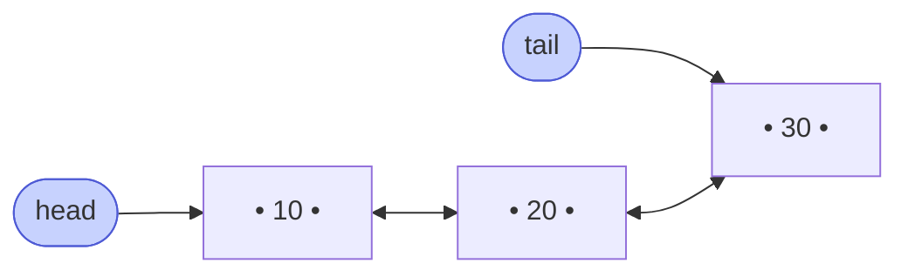

# Memorize: Doubly Linked List

## In a Hurry?

- **Core Operations**: forward and reverse traversal, search, insert at head/tail/before/after, delete head/tail/by-value/by-node-reference — every "modification at a known position" is `O(1)` because `node.prev` is one dereference away.
- **Complexities**: forward or reverse traversal `O(n)` time and `O(1)` space, search `O(n)` time, access by index `O(min(k, n − k))` if both ends are known, insert/delete at any known node `O(1)` time and `O(1)` space, total space `O(n)` with two pointers per node (`~33%` more memory than a singly linked list).
- **One Use-Case**: every production LRU cache — a hash map gives `O(1)` lookup by key, and the doubly linked list gives `O(1)` `move-to-front` on every hit because the freshly-accessed node already holds its predecessor in `node.prev`. The singly linked sibling cannot match this guarantee — it would re-walk the list on every cache hit.

---

## One-Line Mnemonic

**A chain of heap-scattered nodes wired by paired `prev` and `next` pointers, anchored at both ends by `head` and `tail`, terminated by `null` on both sides — every link is two pointers, never one.**

The mnemonic is the invariant: every adjacent pair satisfies `a.next.prev == a` and `b.prev.next == b`. Every operation reduces to three motions — follow `next`, follow `prev`, or rewrite a `(next, prev)` pair. Forget the mirror update and the forward chain stays correct while the backward chain silently rots.

---

## Real-World Analogy

Picture a conga line where every dancer keeps one hand on the shoulder of the person *in front* of them and one hand on the shoulder of the person *behind* them. The line has a named first dancer (the **head**) and a named last dancer (the **tail**), and the two end-of-line dancers each have one free hand instead of two. To remove the dancer in position 47, you do not start at the front and count to 46 — you tap the dancer being removed, follow their backward hand to find their predecessor, follow their forward hand to find their successor, and have those two clasp each other directly. The removed dancer drops out and the line continues, in constant time, regardless of how many hundreds of dancers stretch in either direction. Insert a new dancer between two old ones, and the same four-shoulder reshuffle slots them in on the spot. The whole structure exists for this trick — knowing *who is behind me* is exactly what a singly linked list refuses to tell you.

---

## Visual Summary

<strong>Every node links both ways (prev and next), so traversal runs in either direction and deleting a node you already hold is O(1) — no scan to find its predecessor.</strong>

---

## Key Operations

| Operation | Time | Space | Key Insight |
|---|---|---|---|
| Forward traversal (`head → tail`) | `O(n)` | `O(1)` | Cursor seeded with `head`, advanced via `curr = curr.next`, stops when `curr` is `null`. |
| Reverse traversal (`tail → head`) | `O(n)` | `O(1)` | Same loop shape, seeded with `tail`, advanced via `curr = curr.prev`. The list has *two* `null` sentinels, one at each boundary. |
| Access `k`-th node from head | `O(k)` | `O(1)` | No address arithmetic — follow `k` `next` hops from `head`. |
| Access `k`-th node from either end | `O(min(k, n − k))` | `O(1)` | Pick the closer anchor; cuts the worst case to `n/2`. `LinkedList.get(i)` in Java and `LINDEX` in Redis both exploit this. |
| Search by value | `O(n)` worst, `O(1)` best | `O(1)` | Walk and compare; direction is a free hyperparameter when you have a hint about where the target lives (LRU tail, history head). |
| Length | `O(n)` | `O(1)` | No `.length` field — every length query walks the chain, unless the list caches `size` (then `O(1)` reads, but every insert/delete must update it). |
| Insert at head | `O(1)` | `O(1)` | Three pointer writes: `new.next = head`, `new.prev = null`, `head.prev = new`; caller swaps the `head` reference. |
| Insert at tail (cached `tail`) | `O(1)` | `O(1)` | Mirror of insert at head: `tail.next = new`, `new.prev = tail`, `new.next = null`; caller swaps the `tail` reference. |
| Insert after a known node | `O(1)` | `O(1)` | Four pointer writes — wire `new.next` and `new.prev` first, then redirect `node.next` and `node.next.prev` (guard the last write if `node` is the tail). |
| Insert before a known node | `O(1)` | `O(1)` | The headline upgrade over a singly linked list — `node.prev` is the predecessor in one hop, so the splice is the mirror of "insert after". |
| Insert at distance `k` | `O(min(k, n − k))` | `O(1)` | Walk from the closer anchor `k − 1` steps, then four-pointer splice. |
| Delete head | `O(1)` | `O(1)` | `head = head.next; head.prev = null` — guard the second write for a one-node list (which leaves `head == tail == null`). |
| Delete tail | `O(1)` | `O(1)` | Mirror of delete head: `tail = tail.prev; tail.next = null`. |
| Delete by value | `O(n)` worst, `O(1)` best | `O(1)` | Walk to find the match, then four-pointer unlink. The walk is what dominates — the unlink itself is `O(1)`. |
| Delete a known node | `O(1)` | `O(1)` | `node.prev.next = node.next; node.next.prev = node.prev` — the operation that justifies the whole structure. A singly linked list cannot match this in `O(1)`. |
| Delete after a known node | `O(1)` | `O(1)` | Same shape as insert-after — splice the successor out, guard the `prev` mirror write if the successor was the tail. |
| Delete before a known node | `O(1)` | `O(1)` | `node.prev` is the victim; splice it out via `node.prev.prev.next = node` and `node.prev = node.prev.prev`, then handle the head-becomes-victim case. |
| Reverse the list in place | `O(n)` | `O(1)` | One forward pass; at each node swap its `prev` and `next` pointers, then swap the `head` and `tail` anchors. No value moves. |

---

## Common Mistakes

- **Forgetting the mirror pointer update**:
  - *What*: writing `a.next = b` without the companion `b.prev = a` (or vice versa) anywhere inside an insert, delete, or splice.
  - *Why*: the doubly-linked invariant `a.next.prev == a` is the structure's entire correctness contract; breaking it silently desynchronises the forward and backward chains, so forward traversal still works but reverse traversal jumps over or into the wrong node.
  - *Fix*: treat every link as **two** pointer writes. After each structural change, mentally run `assert a.next.prev == a and b.prev.next == b` on every node touched — or wrap the four-pointer splice in a single helper so the mirror write cannot be forgotten in line.
- **Reversing the wire-new-first / redirect-neighbours-second order**:
  - *What*: writing `predecessor.next = new` before `new.next = predecessor.next` when inserting between two existing nodes.
  - *Why*: the first assignment overwrites the only forward reference to the successor, so the second line reads back `new` itself and writes a self-loop into `new.next` — the tail of the chain becomes unreachable.
  - *Fix*: always set the new node's `next` and `prev` first (copying the *old* neighbours into it), then redirect the neighbours' pointers. The same "save before clobber" rule applies on the `prev` side.
- **Forgetting to update the `head` or `tail` anchor after a boundary edit**:
  - *What*: deleting the first node with `head = head.next` but leaving `head.prev` pointing at the freed node, or inserting before the head without updating the externally-held `head` reference.
  - *Why*: the doubly linked list has *two* externally-held references, not one. Any operation that touches the first or last node must keep both anchors consistent — otherwise the next "start from head/tail" walk begins inside the deleted region or skips the newly-inserted boundary node.
  - *Fix*: write every boundary operation as a function that returns the new `(head, tail)` pair (or mutates a list object that owns both). After every delete-head, set the new head's `prev` to `null`; after every delete-tail, set the new tail's `next` to `null`.
- **Missing the single-node-list (`head == tail`) special case**:
  - *What*: deleting the sole remaining node and leaving one of the two anchors pointing at the freed node, so the list is half-empty in one direction.
  - *Why*: when `head == tail` and the list has one node, deletion must null *both* anchors at once; insertion into an empty list must set *both* anchors to the new node at once. Code that handles only one of the two leaves the structure inconsistent.
  - *Fix*: explicitly branch on `head == null` for inserts and on `head == tail` (or `head.next == null`) for deletes — the empty-list and one-node-list cases are the two corners every operation must own.
- **Re-splicing a node without detaching it first**:
  - *What*: writing `a.next = b` when `b` is already somewhere later in the chain — typically inside a "move to front" routine that forgets to unlink the victim first.
  - *Why*: the rewire creates a cycle in both directions; subsequent traversals never terminate and the list looks corrupt forward and backward simultaneously.
  - *Fix*: always run a two-phase mutation — *detach* the moving node from its current neighbours (four pointer writes that unlink it), *then* splice it into its destination (four more pointer writes that link it in). The invariant must hold at the end of each phase, not only at the end of the routine.
- **Letting a stale `tail` reference outlive its node**:
  - *What*: batching multiple tail-region deletions and only recomputing `tail` once at the end; partial failure mid-batch leaves `tail` pointing at a freed or detached node.
  - *Why*: every tail-touching mutation has to update the external `tail` reference inside the same logical step as the unlink — moving the bookkeeping outside that step creates a window where the invariant is wrong.
  - *Fix*: update `tail` (and `head`) inside the same critical section as the structural change. If batching is required, recompute the anchor from the new last node at the end of every individual mutation, not once at the bottom of the loop.
- **Picking the wrong end for a directional search**:
  - *What*: searching from `head` when the target was last inserted near `tail` — correctness is fine, but the constant factor is the worst case.
  - *Why*: a doubly linked list pays an extra pointer per node specifically so direction becomes a free hyperparameter; ignoring it forfeits the constant-factor win without any compensating benefit.
  - *Fix*: read the problem for hints about where the target lives. Recently inserted, recently accessed, or "most likely match" near the back → start from `tail`. Older, head-skewed access patterns → start from `head`. `LinkedList.get(i)` and Redis's `LINDEX` both do this automatically by picking the closer anchor.

---

## Quick Recall

Click any question to reveal the answer.

<strong>Q:</strong> What three fields does a doubly linked list node hold?

**A:** A `val` (the payload, any type), a `prev` pointer (the address of the predecessor, or `null` if this is the head), and a `next` pointer (the address of the successor, or `null` if this is the tail).

<strong>Q:</strong> What two externally-held references does a doubly linked list need to support <code>O(1)</code> operations at both ends?

**A:** `head` (the first node, entry point for forward traversal) and `tail` (the last node, entry point for backward traversal). Without `tail`, finding the last node still costs `O(n)` even though *walking backward from it* is free.

<strong>Q:</strong> What is the doubly-linked invariant that every operation must preserve?

**A:** For every adjacent pair, `a.next.prev == a` and `b.prev.next == b`. Plus `head.prev == null` and `tail.next == null`. Every bug in this chapter is a violation of one of those four equations.

<strong>Q:</strong> Why is deleting a known node <code>O(1)</code> in a doubly linked list but <code>O(n)</code> in a singly linked list?

**A:** A doubly linked list pre-stores the predecessor in `node.prev`, so the unlink is `node.prev.next = node.next; node.next.prev = node.prev` — a constant number of rewires. A singly linked list has no back-pointer, so finding the predecessor requires a forward walk from `head`, and that walk is the `O(n)` cost.

<strong>Q:</strong> What does reverse traversal cost in time and space, and how does it compare to a singly linked list?

**A:** `O(n)` time and `O(1)` extra space. A singly linked list cannot match this — to walk in reverse it must either reverse the list first (`O(n)` extra time) or stash every node into a stack (`O(n)` extra space). The `prev` pointer makes the reverse walk *structurally identical* to the forward walk, just keyed on a different pointer.

<strong>Q:</strong> What is the canonical four-pointer "insert between two existing nodes" splice, and in what order?

**A:** With `predecessor` and `successor` both non-null: (1) `new.next = successor`, (2) `new.prev = predecessor`, (3) `predecessor.next = new`, (4) `successor.prev = new`. Always wire the new node first, then redirect the neighbours — reversing the order overwrites the only pointer to the rest of the list.

<strong>Q:</strong> A list prints correctly forward but garbage backward. Which invariant is broken?

**A:** The mirror invariant `a.next.prev == a`. Some operation wrote a `next` pointer without writing the corresponding `prev` pointer (or vice versa). The forward chain is intact, but the backward chain dead-ends or jumps to a stale node at the broken link.

<strong>Q:</strong> When a list has exactly one node, what do <code>head</code>, <code>tail</code>, <code>prev</code>, and <code>next</code> all equal?

**A:** `head == tail` (they reference the same node), and that node's `prev == null` and `next == null`. Any insert or delete code that assumes `head != tail` or that the neighbours exist must guard this case.

<strong>Q:</strong> Roughly how much extra memory does a doubly linked list of <code>n</code> integers use compared to a singly linked list of the same length?

**A:** About `33%` more — each node carries one additional 8-byte pointer (`prev`) on a 64-bit machine. Compared to an integer array, the doubly linked list uses roughly *eight times* the memory; the array stores 4 bytes per `int`, while each list node is `~32` bytes (value + padding + two pointers + allocator metadata).

<strong>Q:</strong> Why is "access by index <code>k</code>" <code>O(min(k, n − k))</code> rather than <code>O(k)</code>?

**A:** Both anchors are reachable in `O(1)`, so the walk can start from whichever end is closer to index `k`. The worst case is therefore `n/2`, not `n` — and `LinkedList.get(i)` in Java and `LINDEX` in Redis both exploit this branch. Random access is still `O(n)` in the asymptotic sense, but the constant factor is halved.

<strong>Q:</strong> How does a doubly linked list reverse in place, and at what cost?

**A:** Walk forward once; at each node swap its `prev` and `next` pointers. After one `O(n)` pass the chain is reversed in `O(1)` extra space — no values move. Then swap the external `head` and `tail` references. The whole routine touches `2n` pointer fields plus two anchor writes.

<strong>Q:</strong> Why is "insert before a known node" the operation that most justifies the doubly linked list?

**A:** In a singly linked list it is `O(n)` — finding the predecessor requires walking from the head. In a doubly linked list it is `O(1)` — the predecessor is `node.prev`, one dereference away. This is the operation that delete-a-known-node, LRU `move_to_front`, and intrusive-list unlinking all reduce to.

<strong>Q:</strong> Why does an LRU cache pair a hash map with a doubly linked list rather than a singly linked list?

**A:** On every cache hit the cache must move the accessed entry to the front, which requires unlinking it from its current position in `O(1)`. The unlink is `node.prev.next = node.next; node.next.prev = node.prev` — only possible because `node.prev` is pre-stored. A singly linked list would walk from `head` to find the predecessor on every access, collapsing the cache's amortised `O(1)` to `O(n)`.

<strong>Q:</strong> What does a sentinel (dummy) head-and-tail pair simplify in a doubly linked list?

**A:** It removes every "is this the head?" and "is this the tail?" branch from insert and delete code — every real node always has a `prev` and a `next` that are non-null sentinels rather than `null`. The two sentinels are allocated once when the list is created and never deleted. The Linux kernel's `struct list_head` is the canonical example.

<strong>Q:</strong> Why does direction become a free hyperparameter for search in a doubly linked list?

**A:** Both `head` and `tail` are reachable in `O(1)`, and either traversal costs `O(n)` worst case. So the algorithm picks the entry point based on where the target is statistically likely to live — recently inserted items live near the tail (start from `tail`), older items live near the head (start from `head`). Correctness is identical either way; only the constant factor changes.

<strong>Q:</strong> What is the cost of caching a <code>size</code> field on the list object, and what does it buy you?

**A:** Every insert and every delete must update `size` (a constant-time write — but every mutation now touches one extra field). In exchange, `length()` becomes `O(1)` instead of `O(n)`. Java's `LinkedList` and Redis's `adlist` both make this trade.

<strong>Q:</strong> When does a doubly linked list beat a singly linked list, and when does the singly linked list win?

**A:** The doubly linked list wins for any workload with delete-a-known-node, insert-before, frequent reverse traversal, or `O(1)` operations at both ends — LRU caches, deques, undo/redo stacks, intrusive kernel lists. The singly linked list wins when memory per node matters (one pointer instead of two), when the access pattern is strictly forward (stacks, queues, free lists), or when the doubled bookkeeping per mutation is a correctness liability rather than a speed win.

