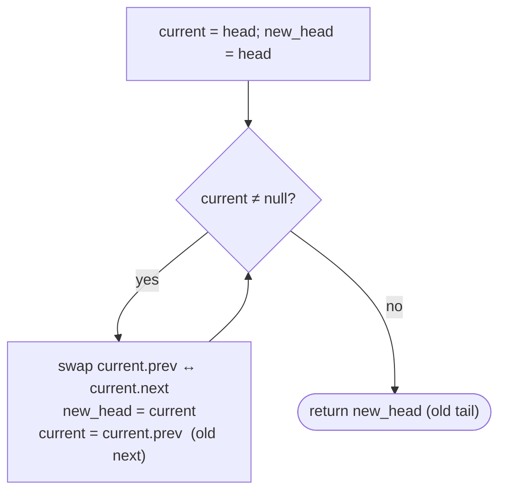

# Pattern: Reversal

## Why It Exists

Reversing a *singly* list needed a careful three-pointer dance: because flipping a node's `next` destroyed the only forward link, you had to save the lookahead first. A *doubly* list hands you that lookahead for free — every node already carries a backward pointer (`prev`) **and** a forward pointer (`next`).

So reversal becomes almost trivial. The list is already threaded in both directions; "reversed" just means every node should treat its old `prev` as `next` and its old `next` as `prev`. **Swap the two pointers on each node**, and the structure is reversed — the old tail is the new head. No separate save, because after the swap the old forward link is still right there in `prev`.

## See It Work

Reverse `1 ⇄ 2 ⇄ 3` into `3 ⇄ 2 ⇄ 1` by swapping `prev` and `next` on every node. Run it, then **Visualise** the pointers flip.

> ▶ Run it, then click **Visualise** — each node swaps its two pointers; the walk advances through the *old* `next` (now sitting in `prev`), and the old tail becomes the head.

```python run viz=linked-list viz-root=head viz-kind=list-double
import ast

class ListNode:
    def __init__(self, val, prev=None, next=None):
        self.val = val
        self.prev = prev
        self.next = next

def build_list(values):              # [1, 2, 3] → 1 ⇄ 2 ⇄ 3
    head = tail = None
    for v in values:
        node = ListNode(v, prev=tail)
        if tail is not None:
            tail.next = node
        else:
            head = node
        tail = node
    return head

def print_list(head):                # 1 ⇄ 2 ⇄ 3 → [1, 2, 3]
    out = []
    while head:
        out.append(head.val)
        head = head.next
    print(out)

head = build_list(ast.literal_eval(input()))   # the test case's values

current = head
new_head = head
while current is not None:
    current.prev, current.next = current.next, current.prev   # swap the two pointers
    new_head = current                                        # old tail becomes the new head
    current = current.prev                                    # advance via old next (now stored in prev)
head = new_head

print_list(head)
```

```java run viz=linked-list viz-root=head viz-kind=list-double
import java.util.*;

public class Main {
  static class ListNode {
    int val; ListNode prev, next;
    ListNode(int val) { this.val = val; }
  }

  public static void main(String[] args) {
    ListNode head = buildList(parseIntArray(new Scanner(System.in).nextLine()));

    ListNode current = head, newHead = head;
    while (current != null) {
      ListNode tmp = current.next;     // swap the two pointers
      current.next = current.prev;
      current.prev = tmp;
      newHead = current;               // old tail becomes the new head
      current = current.prev;          // advance via old next (now stored in prev)
    }
    head = newHead;

    printList(head);
  }

  static ListNode buildList(int[] values) {      // {1, 2, 3} → 1 ⇄ 2 ⇄ 3
    ListNode head = null, tail = null;
    for (int v : values) {
      ListNode node = new ListNode(v);
      node.prev = tail;
      if (tail != null) tail.next = node;
      else head = node;
      tail = node;
    }
    return head;
  }

  static void printList(ListNode head) {         // 1 ⇄ 2 ⇄ 3 → [1, 2, 3]
    List<Integer> out = new ArrayList<>();
    for (ListNode n = head; n != null; n = n.next) out.add(n.val);
    System.out.println(out);
  }

  // "[1, 2, 3]" → {1, 2, 3} — reads the test case's values
  static int[] parseIntArray(String line) {
    String inner = line.replaceAll("[\\[\\]\\s]", "");
    if (inner.isEmpty()) return new int[0];
    String[] parts = inner.split(",");
    int[] out = new int[parts.length];
    for (int i = 0; i < parts.length; i++) out[i] = Integer.parseInt(parts[i]);
    return out;
  }
}
```

```testcases
{
  "args": [
    { "id": "values", "label": "values", "type": "int[]", "placeholder": "[1, 2, 3]" }
  ],
  "cases": [
    { "args": { "values": "[1, 2, 3]" }, "expected": "[3, 2, 1]" },
    { "args": { "values": "[5, 7, 3, 10]" }, "expected": "[10, 3, 7, 5]" },
    { "args": { "values": "[42]" }, "expected": "[42]" },
    { "args": { "values": "[]" }, "expected": "[]" }
  ]
}
```

## How It Works

Walk the list once. At each node, **swap** `prev` and `next` (one simultaneous assignment). Then move on — but the old forward neighbour is now stored in `current.prev`, so advancing means following `current.prev`. The last node you touch (the old tail) is the new head.



<p align="center"><strong>for each node, swap its <code>prev</code> and <code>next</code>; follow the old <code>next</code> (now in <code>prev</code>) to the next node; the old tail becomes the new head.</strong></p>

The contrast with the singly list is the whole point: there, the three-pointer loop existed *only* to preserve the forward link before overwriting it. Here, the swap puts the old forward link into `prev` in the same step — **the backward pointer is the saved lookahead.** One swap per node → **`O(n)` time, `O(1)` space.**

For a **segment** reversal `[start, end]`, swap pointers only within the segment, then re-stitch *both* seams: the node before `start` and the node after `end` each need their links updated, and the reversed segment's two ends need their outward `prev`/`next` reconnected — a four-pointer mirror of the singly case, because every link exists in duplicate.

### Key Takeaway

Reverse a doubly linked list by swapping each node's `prev` and `next` and walking via the old `next` (now in `prev`); the old tail is the new head. No three-pointer save is needed — the backward pointer already holds the lookahead. `O(n)` time, `O(1)` space.

## Trace It

`1 ⇄ 2 ⇄ 3`, starting `current = 1`:

| step | node | after swap | `new_head` | advance to (`current.prev`) |
|---|---|---|---|---|
| 1 | `1` | `1.next=null, 1.prev=2` | `1` | `2` |
| 2 | `2` | `2.next=1, 2.prev=3` | `2` | `3` |
| 3 | `3` | `3.next=2, 3.prev=null` | `3` | `null` → stop |

Result: `3 ⇄ 2 ⇄ 1`, head = `3`.

Before you read on: in the singly list, advancing meant following a pointer you'd *saved* before overwriting. Here we advance with `current = current.prev`. Why does reading `prev` move us *forward* (toward the old tail), not backward?

Because the swap already happened. The instant we swapped node `1`, its old `next` (which pointed at `2`) landed in `1.prev`. So `current.prev` no longer means "the previous node" — it now holds what *used* to be the forward link. Reading it walks us toward the old tail, exactly where the singly version's saved `next` pointer would have taken us. The doubly list's second pointer absorbs the bookkeeping the singly list did by hand.

## Your Turn

Write the reusable doubly-list reversal — `reverse(head)` returns the new head. One swap per node, walk via the old `next`:

```python run viz=linked-list viz-root=head viz-kind=list-double
import ast

class ListNode:
    def __init__(self, val, prev=None, next=None):
        self.val = val
        self.prev = prev
        self.next = next

def reverse(head):
    # Your code goes here — swap each node's prev and next, walk via the old
    # next (now in prev), and return the old tail as the new head.
    pass

def build_list(values):              # [1, 2, 3] → 1 ⇄ 2 ⇄ 3
    head = tail = None
    for v in values:
        node = ListNode(v, prev=tail)
        if tail is not None:
            tail.next = node
        else:
            head = node
        tail = node
    return head

def print_list(head):                # 1 ⇄ 2 ⇄ 3 → [1, 2, 3]
    out = []
    while head:
        out.append(head.val)
        head = head.next
    print(out)

head = build_list(ast.literal_eval(input()))   # the test case's values
print_list(reverse(head))
```

```java run viz=linked-list viz-root=head viz-kind=list-double
import java.util.*;

public class Main {
  static class ListNode {
    int val; ListNode prev, next;
    ListNode(int val) { this.val = val; }
  }

  static ListNode reverse(ListNode head) {
    // Your code goes here — swap each node's prev and next, walk via the old
    // next (now in prev), and return the old tail as the new head.
    return null;
  }

  public static void main(String[] args) {
    ListNode head = buildList(parseIntArray(new Scanner(System.in).nextLine()));
    printList(reverse(head));
  }

  static ListNode buildList(int[] values) {      // {1, 2, 3} → 1 ⇄ 2 ⇄ 3
    ListNode head = null, tail = null;
    for (int v : values) {
      ListNode node = new ListNode(v);
      node.prev = tail;
      if (tail != null) tail.next = node;
      else head = node;
      tail = node;
    }
    return head;
  }

  static void printList(ListNode head) {         // 1 ⇄ 2 ⇄ 3 → [1, 2, 3]
    List<Integer> out = new ArrayList<>();
    for (ListNode n = head; n != null; n = n.next) out.add(n.val);
    System.out.println(out);
  }

  // "[1, 2, 3]" → {1, 2, 3} — reads the test case's values
  static int[] parseIntArray(String line) {
    String inner = line.replaceAll("[\\[\\]\\s]", "");
    if (inner.isEmpty()) return new int[0];
    String[] parts = inner.split(",");
    int[] out = new int[parts.length];
    for (int i = 0; i < parts.length; i++) out[i] = Integer.parseInt(parts[i]);
    return out;
  }
}
```

```testcases
{
  "args": [
    { "id": "values", "label": "values", "type": "int[]", "placeholder": "[1, 2, 3, 4]" }
  ],
  "cases": [
    { "args": { "values": "[1, 2, 3, 4]" }, "expected": "[4, 3, 2, 1]" },
    { "args": { "values": "[5, 7, 3, 10]" }, "expected": "[10, 3, 7, 5]" },
    { "args": { "values": "[42]" }, "expected": "[42]" },
    { "args": { "values": "[]" }, "expected": "[]" },
    { "args": { "values": "[1, 1, 2, 2]" }, "expected": "[2, 2, 1, 1]" }
  ]
}
```

<details>
<summary>Editorial</summary>

The loop is exactly the See-It-Work walk, packaged to return its result: a single cursor `current` sweeps the list, and each tick swaps that node's `prev` and `next` in one stroke. After the swap, the old forward link sits in `current.prev`, so `current = current.prev` advances toward the old tail. `new_head` tracks the most recently swapped node, so when `current` falls off the end it holds the old tail — the new head. An empty list never enters the loop and returns `None`.

```python solution time=O(n) space=O(1)
import ast

class ListNode:
    def __init__(self, val, prev=None, next=None):
        self.val = val
        self.prev = prev
        self.next = next

def reverse(head):
    current = head
    new_head = head
    while current is not None:
        current.prev, current.next = current.next, current.prev   # swap
        new_head = current
        current = current.prev                                    # old next
    return new_head

def build_list(values):              # [1, 2, 3] → 1 ⇄ 2 ⇄ 3
    head = tail = None
    for v in values:
        node = ListNode(v, prev=tail)
        if tail is not None:
            tail.next = node
        else:
            head = node
        tail = node
    return head

def print_list(head):                # 1 ⇄ 2 ⇄ 3 → [1, 2, 3]
    out = []
    while head:
        out.append(head.val)
        head = head.next
    print(out)

head = build_list(ast.literal_eval(input()))   # the test case's values
print_list(reverse(head))
```

```java solution
import java.util.*;

public class Main {
  static class ListNode {
    int val; ListNode prev, next;
    ListNode(int val) { this.val = val; }
  }

  static ListNode reverse(ListNode head) {
    ListNode current = head, newHead = head;
    while (current != null) {
      ListNode tmp = current.next;     // swap prev and next
      current.next = current.prev;
      current.prev = tmp;
      newHead = current;
      current = current.prev;          // old next
    }
    return newHead;
  }

  public static void main(String[] args) {
    ListNode head = buildList(parseIntArray(new Scanner(System.in).nextLine()));
    printList(reverse(head));
  }

  static ListNode buildList(int[] values) {      // {1, 2, 3} → 1 ⇄ 2 ⇄ 3
    ListNode head = null, tail = null;
    for (int v : values) {
      ListNode node = new ListNode(v);
      node.prev = tail;
      if (tail != null) tail.next = node;
      else head = node;
      tail = node;
    }
    return head;
  }

  static void printList(ListNode head) {         // 1 ⇄ 2 ⇄ 3 → [1, 2, 3]
    List<Integer> out = new ArrayList<>();
    for (ListNode n = head; n != null; n = n.next) out.add(n.val);
    System.out.println(out);
  }

  // "[1, 2, 3]" → {1, 2, 3} — reads the test case's values
  static int[] parseIntArray(String line) {
    String inner = line.replaceAll("[\\[\\]\\s]", "");
    if (inner.isEmpty()) return new int[0];
    String[] parts = inner.split(",");
    int[] out = new int[parts.length];
    for (int i = 0; i < parts.length; i++) out[i] = Integer.parseInt(parts[i]);
    return out;
  }
}
```

</details>

## Reflect & Connect

Drill the family in **Practice** — [Reverse a List](/cortex/data-structures-and-algorithms/linear-structures/doubly-linked-list/pattern-reversal/problems/reverse-a-list), [Reverse First K Nodes](/cortex/data-structures-and-algorithms/linear-structures/doubly-linked-list/pattern-reversal/problems/reverse-first-k-nodes), [Reverse Last K Nodes](/cortex/data-structures-and-algorithms/linear-structures/doubly-linked-list/pattern-reversal/problems/reverse-last-k-nodes), and [Reverse the Given Segment](/cortex/data-structures-and-algorithms/linear-structures/doubly-linked-list/pattern-reversal/problems/reverse-the-given-segment).

The doubly-list reversal is a clean lesson in how a richer structure simplifies an algorithm:

- **Singly vs doubly** — the singly reversal's whole complexity was *preserving the forward link*; the doubly list stores it in `prev`, so one swap per node replaces the three-pointer loop. More pointers to maintain on insert/delete, but reversal gets simpler.
- **Segment reversal is the common variant** — reverse first-`k`, last-`k`, or `[i, j]`: swap within the bounds, then reconnect *both* seams (every link is doubled, so there are twice as many to re-stitch). Getting all four boundary pointers right is the real exercise.
- **Sometimes you don't reverse at all** — because a doubly list can already be walked *backward* from the tail via `prev`, "process the list in reverse" often needs no reversal — just iterate from the tail. Reach for an actual reversal only when you must hand off a list whose forward order is flipped.

**Prerequisites:** [Doubly Linked Lists](/cortex/data-structures-and-algorithms/linear-structures/doubly-linked-list/doubly-linked-lists).
**What's next:** reversal applied to bounded chunks — [Reversal as a Subproblem](/cortex/data-structures-and-algorithms/linear-structures/doubly-linked-list/pattern-reversal-subproblem/pattern).

## Recall

> **Mnemonic:** *Swap `prev` ↔ `next` on every node; walk via the old `next` (now in `prev`); old tail is the new head. The backward pointer is the free lookahead.*

| | |
|---|---|
| Per node | swap `prev` and `next` (one simultaneous assignment) |
| Advance | `current = current.prev` (holds the old `next` after the swap) |
| New head | the old tail (last node visited) |
| vs singly | no three-pointer save — `prev` is the preserved forward link |
| Cost | `O(n)` time, `O(1)` space |

<details>
<summary><strong>Q:</strong> Why does a doubly list need no three-pointer save to reverse?</summary>

**A:** Swapping puts the old `next` into `prev` in the same step, so the forward link is preserved automatically.

</details>
<details>
<summary><strong>Q:</strong> After swapping a node's pointers, why does `current.prev` advance you forward?</summary>

**A:** The swap moved the old `next` into `prev`, so `prev` now holds what used to be the forward link.

</details>
<details>
<summary><strong>Q:</strong> What's the new head after reversal?</summary>

**A:** The old tail — the last node visited in the walk.

</details>
<details>
<summary><strong>Q:</strong> What extra work does segment reversal need versus the singly case?</summary>

**A:** Both seams must be re-stitched and every node's two pointers reconnected — twice the boundary links.

</details>

## Sources & Verify

- **CLRS**, *Introduction to Algorithms*, 4th ed., §10.2 — doubly linked lists; `prev`/`next` pointer manipulation.
- **Sedgewick & Wayne**, *Algorithms*, 4th ed., §1.3 — linked structures.
- "Reverse a doubly linked list by swapping each node's pointers" is the standard result; both runnable blocks are verified by running (outputs `[3, 2, 1]` and `[4, 3, 2, 1]`, with `prev` links checked consistent).
