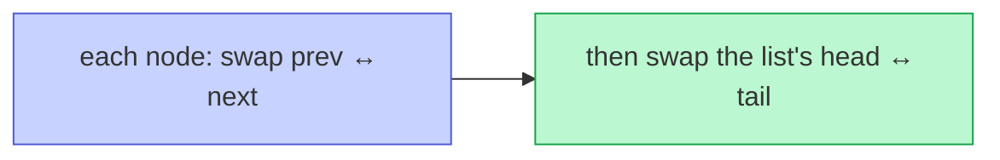

# Memorize: Reversal

## In a Hurry?

- **One-Line Idea**: Walk the segment, swap each node's `prev` and `next` in one stroke, then write four boundary stitches to reconnect the reversed segment to its outer neighbours in both directions.
- **Complexities**: `O(n)` time, `O(1)` space, where `n` is the number of nodes inside the reversed segment (the loop visits each segment node exactly once with constant work per visit).
- **When to Use**: The problem asks for nodes to appear in reversed order across a contiguous segment — full list, prefix, suffix, positional range — or asks for palindrome / mirror / rotate / undo-stack rewind structure on a doubly linked list.

---

## One-Line Mnemonic

**"Swap prev and next, step via prev, then stitch four boundaries."**

The phrase encodes the entire algorithm: the body of the swap loop (swap two fields, step via the field that just became `prev`), and the four boundary writes that fall out of capturing `leftBound` and `rightBound` before the swaps begin.

---

## Real-World Analogy

Picture a two-way conga line where every dancer is holding the shoulders of both the dancer in front and the dancer behind. To reverse the line, you walk along it and at every dancer you give one instruction: "let go of the front person and the back person, and now grab them the other way round — your old back person is your new front person, and vice versa." After you finish the walk, every dancer is facing the opposite direction with the same physical neighbours, but the dancer who used to be at the back of the line is now leading and the dancer who used to be in front is now at the rear. Four pieces of paperwork remain: whoever was standing in front of the line's old front and behind the line's old back must be notified of the new neighbour, in both directions.

---

## Visual Summary



<p align="center"><strong>A doubly list reverses with one swap per node — exchange each node's prev and next — because the backward link means no forward pointer is ever lost. Finish by swapping head and tail. O(n).</strong></p>

---

## Pattern Recognition Triggers

The pattern fits when **all four** answers are "yes" — the same diagnostic that gates each problem in the section.

- The problem asks for **reversed order** across a contiguous segment — full list, prefix, suffix, or a positional range `[left, right]`.
- The segment has **identifiable endpoints** — either given as references (`start`, `end`), computed by a 1-indexed position (`left`, `right`), or implied by a counted walk (first `k`, last `k`).
- The work is **strictly structural** — only `prev` and `next` pointers change; node values are never read for the rewrite decision.
- `O(1)` extra space is **required or strongly preferred**; the iterative per-node swap never recurses or allocates.

Common surface signals: "reverse the doubly linked list," "reverse the first / last `k` nodes," "reverse between positions `left` and `right`," "rotate the list by `k` positions," "is this doubly linked list a palindrome," "reorder alternately so the list reads `a, last, b, second-last, …`."

---

## Don't Confuse With

| | **Reversal (this pattern)** | **Fast-and-Slow Pointers** |
|---|---|---|
| **Problem shape** | "Reverse a segment of the list" — change the structural order of `prev` and `next` pointers | "Find a position in the list using two cursors with different speeds" — locate a midpoint, detect a cycle, or find a node `k` from the end |
| **Pointer roles** | `current` (rewrites this node), `leftBound`/`rightBound` (captured once before the swaps) — all flowing forward at the same speed | `slow` (one step/tick), `fast` (two steps/tick or `k`-step lead) — both flowing forward, never rewriting |
| **What changes** | Each node's `prev` and `next` are swapped — the chain is reshaped in both directions | Nothing structural — only the cursor positions advance; the list is unchanged |
| **Complexity** | `O(n)` time, `O(1)` space (plus `O(n)` for positional walks in the segment variants) | `O(n)` time, `O(1)` space |
| **When this goes wrong** | The forward walk looks correct but a backward walk from any node beyond the segment lands inside the reversed segment — a boundary `prev` was not mirrored after the swap. Or you advanced via `current.next` instead of `current.prev` and the loop walked backwards into already-swapped nodes. | You're trying to "reverse to position `k`" by counting two pointers — wrong pattern; the reversal pattern uses a counter inside the rewriting loop, not two cursors. Switch to the reversal pattern when the goal is to change the order of `prev`/`next` pointers, not just to land on a position. |

The fast-and-slow pattern is the sibling pattern — it finds positions; the reversal pattern changes structure in both directions.

---

## Template Code

```python
# Reversal pattern — generic per-node swap loop for a doubly linked list.
# The two knobs are the boundary captures (leftBound, rightBound) and the
# stop sentinel.
from typing import Optional


class ListNode:
    def __init__(self, val=0, prev=None, next=None):
        self.val = val
        self.prev = prev
        self.next = next


def reverse_segment(start: ListNode, end: ListNode) -> None:
    """
    Reverse the segment from `start` to `end` (inclusive) in place.

    - Full-list reversal:  start = head,  end = tail   (leftBound and rightBound are both None).
    - Segment reversal:    start = node,  end = node   (leftBound and/or rightBound may be None).
    """
    if start is end:                                     # 1. single-node segment is a no-op
        return

    left_bound = start.prev                              # 2. CAPTURE boundary refs BEFORE any swap
    right_bound = end.next                               #    (the swaps will overwrite these fields)

    current: Optional[ListNode] = start                  # 3. cursor for the next node to swap
    while current is not right_bound:                    # 4. stop sentinel — None for full-list, end.next for segment
        current.prev, current.next = current.next, current.prev   # 5. SWAP — flip both pointer fields
        current = current.prev                           # 6. ADVANCE via prev — the field that held .next half a line ago

    start.next = right_bound                             # 7. STITCH new tail forward to right_bound
    if right_bound is not None:                          #    mirror — keep both directions consistent
        right_bound.prev = start

    end.prev = left_bound                                # 8. STITCH new head backward to left_bound
    if left_bound is not None:                           #    mirror
        left_bound.next = end
```

The two knobs are: the **boundary captures** (`leftBound = start.prev`, `rightBound = end.next`, read once before any pointer mutation because the swaps overwrite those fields) and the **stop sentinel** (`rightBound` for any segment; for a full-list reversal `rightBound` is `None`, which makes the four stitches' null guards collapse the boundary writes to clearing `start.next` and `end.prev`). The body never changes.

---

## Common Mistakes

- **Reading `leftBound` or `rightBound` after the swaps begin**:
  - *What*: writing `left_bound = start.prev` *inside* the swap loop, or after the first swap on `start`. The captured value is wrong because `start.prev` has been overwritten with the old `start.next` by the swap.
  - *Why*: every swap clobbers two of the boundary references' source fields. The discipline is "save before clobber" — the same pattern as snapshot-the-forward-link in the singly-linked variant.
  - *Fix*: capture both boundaries on the two lines immediately after the early-return guard, before the swap loop. Treat those two lines as inseparable from the loop setup.
- **Advancing via `current.next` instead of `current.prev`**:
  - *What*: writing `current = current.next` after the swap, mirroring the singly-linked-list pattern. The loop now walks backwards into already-swapped nodes, hits the `leftBound` sentinel (which is `null` or outside the segment), and either crashes or terminates one node early.
  - *Why*: after the swap, the *old* `next` is now in `prev`. Forward motion in the *original* list order requires reading the field that *used to be* `next` — which is `prev` post-swap.
  - *Fix*: always advance with `current = current.prev` after a per-node swap on a doubly linked list. The mnemonic: "step via the field that just became prev — because half a line ago it was next."
- **Forgetting to mirror one of the four boundary stitches**:
  - *What*: writing `start.next = right_bound` but not `right_bound.prev = start` (or `end.prev = left_bound` but not `left_bound.next = end`). The forward walk from `head` looks correct, but a backward walk from any node past the segment follows a stale `prev` pointer into the middle of the reversed segment.
  - *Why*: every connection in a doubly linked list is two pointers — setting one direction without the other leaves the list inconsistent. Most test suites only walk forward, so this bug ships and surfaces later in production.
  - *Fix*: write the four stitches as two paired blocks — `start.next = right_bound; if right_bound: right_bound.prev = start` and `end.prev = left_bound; if left_bound: left_bound.next = end`. Reviewing the pair in one glance catches missing mirrors.
- **Initialising `leftBound` and `rightBound` to non-null values when the segment touches the head or tail**:
  - *What*: omitting the null guards on the stitches. When the segment includes `head`, `left_bound` is `None`, and the unguarded `left_bound.next = end` raises `AttributeError`.
  - *Why*: a contiguous segment can touch either end of the list, in which case one or both boundary nodes don't exist.
  - *Fix*: always wrap the mirror writes in `if right_bound is not None:` and `if left_bound is not None:`. The non-mirror writes (`start.next = right_bound`, `end.prev = left_bound`) are safe — they're just assigning `None` to a field, which is the correct terminal state.
- **Reaching for recursion in production code**:
  - *What*: writing the elegant 3-line recursive reversal as the production solution.
  - *Why*: recursion costs `O(n)` stack space; for a 10-million-node list that overflows the default stack (~1 MB / ~10⁵ frames) on most language runtimes.
  - *Fix*: use the iterative per-node swap loop — same `O(n)` time, `O(1)` space, no risk of stack overflow regardless of input size.

---

## Minimum Viable Example

Reverse the whole list `1 ⇄ 2 ⇄ 3 ⇄ null` in place:

```
Init:  current = 1   (left_bound = null, right_bound = null)
Tick 1: swap 1: prev=2,   next=null   →   current = current.prev = 2
Tick 2: swap 2: prev=3,   next=1      →   current = current.prev = 3
Tick 3: swap 3: prev=null, next=2     →   current = current.prev = null → loop ends
Stitch (collapsed because both bounds are null): 1.next = null (already); 3.prev = null (already).
Result: 3 ⇄ 2 ⇄ 1 ⇄ null.  Return 3 as the new head.
```

Three nodes, three swaps, zero auxiliary allocations — the complete pattern in three lines.

---

## Quick Recall

**Q: What is the time and space complexity of the iterative per-node swap reversal?**
A: `O(n)` time (one tick per segment node) and `O(1)` space (a constant number of local references regardless of `n`).

**Q: Why does a doubly linked list need fewer pointers than a singly linked list for the same reversal?**
A: A DLL already encodes both directions, so the back-link doesn't need to be reconstructed. One swap per node replaces the SLL's three-pointer dance.

**Q: What is the very first thing you do inside `reverse(start, end)` before the swap loop?**
A: Capture `left_bound = start.prev` and `right_bound = end.next` — the swaps will overwrite those fields, so reading them later is wrong.

**Q: After swapping `current.prev` and `current.next`, which field do you read to advance?**
A: `current = current.prev` — that field held `current.next` half a line ago, before the swap.

**Q: For a full-list reversal, what values do `leftBound` and `rightBound` take?**
A: Both are `null`. The four boundary stitches' null guards collapse the writes to clearing `start.next` and `end.prev`.

**Q: After a prefix-bounded reversal (reverse-first-`k`), what extra writes do you need beyond the swap loop?**
A: Three boundary writes: `head.next = current` (forward), `current.prev = head` (backward mirror, when `current` is non-null), and `previous.prev = null` (clear the new head's `prev`).

**Q: Why is recursion a bad idea in production code even though it works?**
A: Recursion uses `O(n)` stack space and overflows the default ~1 MB stack on lists with more than ~10⁵ nodes. The iterative version uses `O(1)` extra space and never crashes.

**Q: What should you reach for first if the problem says "reverse the doubly linked list between positions `left` and `right`"?**
A: Walk to find `start` (position `left`) and `end` (position `right`). Call `reverse(start, end)`. Return `end` as the new head when `left == 1`, otherwise return `head`.
