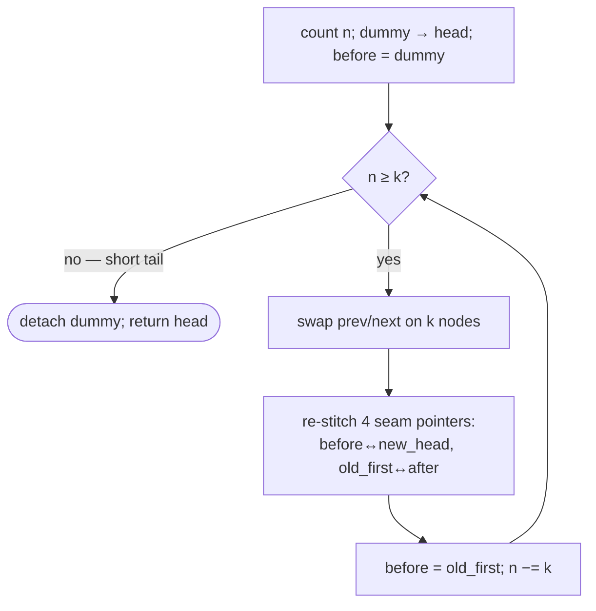

# Pattern: Reversal as a Subproblem

## Why It Exists

You can reverse a whole doubly list with one swap per node. But the useful problems want it reversed **in pieces**: swap every adjacent pair, reverse every group of `k`, flip alternating runs. The chunk reversal itself is the same swap-`prev`/`next`-per-node move you already know.

What's genuinely new is the **stitching**. When you reverse a chunk in the middle of the list, its first node becomes its last, so you must reconnect it to its neighbours — and in a doubly list *every seam carries two links*. The node before the chunk needs its `next` updated and the chunk's new head needs its `prev` updated; likewise on the far side. That's **four boundary pointers per chunk**, versus two in the singly case. Miss one and the list reads correctly forward but is broken backward (or vice versa).

## See It Work

Reverse `1 ⇄ 2 ⇄ 3 ⇄ 4 ⇄ 5` in groups of `k = 2` (a pairwise swap) → `2 ⇄ 1 ⇄ 4 ⇄ 3 ⇄ 5`. Run it, then **Visualise** each pair flip and re-stitch.

> ▶ Run it, then click **Visualise** — each full group's nodes swap their two pointers, then the four seam links reconnect; the short tail is left alone.

```python run viz=linked-list viz-root=head viz-kind=list-double
import ast

class ListNode:
    def __init__(self, val, prev=None, next=None):
        self.val = val
        self.prev = prev
        self.next = next

def build_list(values):              # [1, 2, 3] → 1 ⇄ 2 ⇄ 3
    head = tail = None
    for v in values:
        node = ListNode(v, prev=tail)
        if tail is not None:
            tail.next = node
        else:
            head = node
        tail = node
    return head

def print_list(head):                # 1 ⇄ 2 ⇄ 3 → [1, 2, 3]
    out = []
    while head:
        out.append(head.val)
        head = head.next
    print(out)

values = ast.literal_eval(input())   # the test case's values
k = int(input())                     # the test case's k
head = build_list(values)

def reverse_k_group(head, k):
    n, node = 0, head
    while node:                                       # count nodes → only full groups
        n += 1; node = node.next
    if head is None:
        return head
    dummy = ListNode(0); dummy.next = head; head.prev = dummy
    before = dummy
    while n >= k:
        first = before.next                           # group's first node → becomes its tail
        cur, last = first, None
        for _ in range(k):
            cur.prev, cur.next = cur.next, cur.prev    # swap one node (doubly reversal)
            last = cur
            cur = cur.prev                             # advance via old next (now in prev)
        after, new_head = cur, last
        before.next = new_head; new_head.prev = before     # seam 1 — both links
        first.next = after
        if after is not None:
            after.prev = first                              # seam 2 — both links
        before = first
        n -= k
    head = dummy.next; head.prev = None                # detach the dummy
    return head

head = reverse_k_group(head, k)
print_list(head)
```

```java run viz=linked-list viz-root=head viz-kind=list-double
import java.util.*;

public class Main {
  static class ListNode {
    int val; ListNode prev, next;
    ListNode(int val) { this.val = val; }
  }

  public static void main(String[] args) {
    Scanner sc = new Scanner(System.in);
    ListNode head = buildList(parseIntArray(sc.nextLine()));
    int k = Integer.parseInt(sc.nextLine().trim());
    printList(reverseKGroup(head, k));
  }

  static ListNode reverseKGroup(ListNode head, int k) {
    int n = 0;
    for (ListNode x = head; x != null; x = x.next) n++;
    if (head == null) return head;
    ListNode dummy = new ListNode(0); dummy.next = head; head.prev = dummy;
    ListNode before = dummy;
    while (n >= k) {
      ListNode first = before.next, cur = first, last = null;
      for (int i = 0; i < k; i++) {
        ListNode t = cur.next; cur.next = cur.prev; cur.prev = t;   // swap
        last = cur; cur = cur.prev;
      }
      ListNode after = cur, newHead = last;
      before.next = newHead; newHead.prev = before;             // seam 1
      first.next = after;
      if (after != null) after.prev = first;                    // seam 2
      before = first; n -= k;
    }
    head = dummy.next; head.prev = null;
    return head;
  }

  static ListNode buildList(int[] values) {      // {1, 2, 3} → 1 ⇄ 2 ⇄ 3
    ListNode head = null, tail = null;
    for (int v : values) {
      ListNode node = new ListNode(v);
      node.prev = tail;
      if (tail != null) tail.next = node;
      else head = node;
      tail = node;
    }
    return head;
  }

  static void printList(ListNode head) {         // 1 ⇄ 2 ⇄ 3 → [1, 2, 3]
    List<Integer> out = new ArrayList<>();
    for (ListNode n = head; n != null; n = n.next) out.add(n.val);
    System.out.println(out);
  }

  // "[1, 2, 3]" → {1, 2, 3} — reads the test case's values
  static int[] parseIntArray(String line) {
    String inner = line.replaceAll("[\\[\\]\\s]", "");
    if (inner.isEmpty()) return new int[0];
    String[] parts = inner.split(",");
    int[] out = new int[parts.length];
    for (int i = 0; i < parts.length; i++) out[i] = Integer.parseInt(parts[i]);
    return out;
  }
}
```

```testcases
{
  "args": [
    { "id": "values", "label": "values", "type": "int[]", "placeholder": "[1, 2, 3, 4, 5]" },
    { "id": "k", "label": "k", "type": "int", "placeholder": "2" }
  ],
  "cases": [
    { "args": { "values": "[1, 2, 3, 4, 5]", "k": "2" }, "expected": "[2, 1, 4, 3, 5]" },
    { "args": { "values": "[1, 2, 3, 4, 5]", "k": "3" }, "expected": "[3, 2, 1, 4, 5]" },
    { "args": { "values": "[1, 2, 3, 4, 5, 6]", "k": "3" }, "expected": "[3, 2, 1, 6, 5, 4]" },
    { "args": { "values": "[1, 2, 3, 4, 5]", "k": "5" }, "expected": "[5, 4, 3, 2, 1]" }
  ]
}
```

## How It Works

A dummy node in front gives every group a uniform predecessor (no head special case). Then, per group:

1. **Swap within the chunk.** Run the doubly per-node swap `k` times: each node trades `prev` and `next`, and you advance via the old `next` (now sitting in `prev`). After `k` swaps, the chunk's order is reversed internally.
2. **Re-stitch both seams.** `before` is the node before the chunk; `after` is the node after it. Reconnect all four pointers: `before.next = new_head`, `new_head.prev = before`, `first.next = after`, `after.prev = first` (where `first` is the old first node, now the chunk's tail).
3. **Advance** `before` to `first` (the chunk's new tail) and repeat while a full `k` remain.



<p align="center"><strong>per full group: swap each node's two pointers, then reconnect the four seam links (before↔new-head and old-first↔after). The short remainder is untouched.</strong></p>

Each node is touched a constant number of times, so it's **`O(n)` time, `O(1)` space**. The recurring doubly hazard: it's easy to fix the `next` chain and forget the matching `prev`, leaving a list that walks fine forward but corrupt backward — always reconnect *both* directions at every seam.

### Key Takeaway

Reverse a doubly list in chunks by swapping each node's `prev`/`next` within the chunk, then re-stitching **four** seam pointers (both links on each side). A dummy removes the head special case; counting first leaves a short tail untouched — `O(n)` time, `O(1)` space.

## Trace It

`k = 2` over `1⇄2⇄3⇄4⇄5` (`n = 5`):

| `n` | group | after swap (internal) | four seams stitched | list so far |
|---|---|---|---|---|
| 5 | `1,2` | `2⇄1` | dummy↔2, 1↔3 | `2⇄1⇄3⇄4⇄5` |
| 3 | `3,4` | `4⇄3` | 1↔4, 3↔5 | `2⇄1⇄4⇄3⇄5` |
| 1 | — (`1<k`) | — | — | `2⇄1⇄4⇄3⇄5` |

Before you read on: the singly version re-stitched **two** pointers per chunk; here it's **four**. Which two are the extra ones, and what breaks if you skip them?

The extra two are the **backward** links: `new_head.prev = before` and `after.prev = first`. The singly list has no `prev`, so it never needed them. If you stitch only the `next` links (as you would in the singly case) and forget the `prev` links, a forward walk prints the right answer — `2⇄1⇄4⇄3⇄5` reads correctly via `next` — but walking backward from the tail follows stale `prev` pointers into the wrong nodes. The bug hides until something traverses the list in reverse. In a doubly list, *every* seam fix is two assignments.

## Your Turn

The reusable doubly reverse-in-groups-of-`k` (`k = 2` is a pairwise swap). Write `reverse_k_group(head, k)` — count the nodes, use a dummy predecessor, swap `prev`/`next` on each node in the chunk, re-stitch all four seam pointers:

```python run viz=linked-list viz-root=head viz-kind=list-double
import ast

class ListNode:
    def __init__(self, val, prev=None, next=None):
        self.val = val
        self.prev = prev
        self.next = next

def reverse_k_group(head, k):
    # Your code goes here — count nodes, use dummy predecessor, swap prev/next
    # on each node in each full k-group, re-stitch four seam pointers per chunk.
    pass

def build_list(values):              # [1, 2, 3] → 1 ⇄ 2 ⇄ 3
    head = tail = None
    for v in values:
        node = ListNode(v, prev=tail)
        if tail is not None:
            tail.next = node
        else:
            head = node
        tail = node
    return head

def print_list(head):                # 1 ⇄ 2 ⇄ 3 → [1, 2, 3]
    out = []
    while head:
        out.append(head.val)
        head = head.next
    print(out)

values = ast.literal_eval(input())   # the test case's values
k = int(input())                     # the test case's k
head = build_list(values)
print_list(reverse_k_group(head, k))
```

```java run viz=linked-list viz-root=head viz-kind=list-double
import java.util.*;

public class Main {
  static class ListNode {
    int val; ListNode prev, next;
    ListNode(int val) { this.val = val; }
  }

  static ListNode reverseKGroup(ListNode head, int k) {
    // Your code goes here — count nodes, use dummy predecessor, swap prev/next
    // on each node in each full k-group, re-stitch four seam pointers per chunk.
    return null;
  }

  public static void main(String[] args) {
    Scanner sc = new Scanner(System.in);
    ListNode head = buildList(parseIntArray(sc.nextLine()));
    int k = Integer.parseInt(sc.nextLine().trim());
    printList(reverseKGroup(head, k));
  }

  static ListNode buildList(int[] values) {      // {1, 2, 3} → 1 ⇄ 2 ⇄ 3
    ListNode head = null, tail = null;
    for (int v : values) {
      ListNode node = new ListNode(v);
      node.prev = tail;
      if (tail != null) tail.next = node;
      else head = node;
      tail = node;
    }
    return head;
  }

  static void printList(ListNode head) {         // 1 ⇄ 2 ⇄ 3 → [1, 2, 3]
    List<Integer> out = new ArrayList<>();
    for (ListNode n = head; n != null; n = n.next) out.add(n.val);
    System.out.println(out);
  }

  // "[1, 2, 3]" → {1, 2, 3} — reads the test case's values
  static int[] parseIntArray(String line) {
    String inner = line.replaceAll("[\\[\\]\\s]", "");
    if (inner.isEmpty()) return new int[0];
    String[] parts = inner.split(",");
    int[] out = new int[parts.length];
    for (int i = 0; i < parts.length; i++) out[i] = Integer.parseInt(parts[i]);
    return out;
  }
}
```

```testcases
{
  "args": [
    { "id": "values", "label": "values", "type": "int[]", "placeholder": "[1, 2, 3, 4, 5]" },
    { "id": "k", "label": "k", "type": "int", "placeholder": "2" }
  ],
  "cases": [
    { "args": { "values": "[1, 2, 3, 4, 5]", "k": "2" }, "expected": "[2, 1, 4, 3, 5]" },
    { "args": { "values": "[1, 2, 3, 4, 5]", "k": "3" }, "expected": "[3, 2, 1, 4, 5]" },
    { "args": { "values": "[1, 2, 3, 4, 5, 6]", "k": "3" }, "expected": "[3, 2, 1, 6, 5, 4]" },
    { "args": { "values": "[1, 2, 3]", "k": "1" }, "expected": "[1, 2, 3]" },
    { "args": { "values": "[1, 2, 3, 4, 5]", "k": "5" }, "expected": "[5, 4, 3, 2, 1]" },
    { "args": { "values": "[1]", "k": "2" }, "expected": "[1]" }
  ]
}
```

<details>
<summary>Editorial</summary>

Count nodes first so only full groups of `k` reverse; a dummy predecessor gives the first group a uniform `before` node and eliminates the head special case. Per group: run the per-node doubly swap `k` times (each node trades `prev` and `next`, advance via the old `next` now in `prev`); then re-stitch all four boundary pointers — `before.next = new_head`, `new_head.prev = before`, `first.next = after`, `after.prev = first`. Advance `before` to `first` (the chunk's new tail) and decrement `n`. When `n < k`, detach the dummy and the short remainder is untouched.

```python solution time=O(n) space=O(1)
import ast

class ListNode:
    def __init__(self, val, prev=None, next=None):
        self.val = val
        self.prev = prev
        self.next = next

def reverse_k_group(head, k):
    n, node = 0, head
    while node:                                       # count nodes → only full groups
        n += 1; node = node.next
    if head is None:
        return head
    dummy = ListNode(0); dummy.next = head; head.prev = dummy
    before = dummy
    while n >= k:
        first = before.next                           # group's first node → becomes its tail
        cur, last = first, None
        for _ in range(k):
            cur.prev, cur.next = cur.next, cur.prev    # swap one node (doubly reversal)
            last = cur
            cur = cur.prev                             # advance via old next (now in prev)
        after, new_head = cur, last
        before.next = new_head; new_head.prev = before     # seam 1 — both links
        first.next = after
        if after is not None:
            after.prev = first                              # seam 2 — both links
        before = first
        n -= k
    head = dummy.next; head.prev = None                # detach the dummy
    return head

def build_list(values):              # [1, 2, 3] → 1 ⇄ 2 ⇄ 3
    head = tail = None
    for v in values:
        node = ListNode(v, prev=tail)
        if tail is not None:
            tail.next = node
        else:
            head = node
        tail = node
    return head

def print_list(head):                # 1 ⇄ 2 ⇄ 3 → [1, 2, 3]
    out = []
    while head:
        out.append(head.val)
        head = head.next
    print(out)

values = ast.literal_eval(input())   # the test case's values
k = int(input())                     # the test case's k
head = build_list(values)
print_list(reverse_k_group(head, k))
```

```java solution
import java.util.*;

public class Main {
  static class ListNode {
    int val; ListNode prev, next;
    ListNode(int val) { this.val = val; }
  }

  static ListNode reverseKGroup(ListNode head, int k) {
    int n = 0;
    for (ListNode x = head; x != null; x = x.next) n++;
    if (head == null) return head;
    ListNode dummy = new ListNode(0); dummy.next = head; head.prev = dummy;
    ListNode before = dummy;
    while (n >= k) {
      ListNode first = before.next, cur = first, last = null;
      for (int i = 0; i < k; i++) {
        ListNode t = cur.next; cur.next = cur.prev; cur.prev = t;   // swap
        last = cur; cur = cur.prev;
      }
      ListNode after = cur, newHead = last;
      before.next = newHead; newHead.prev = before;             // seam 1
      first.next = after;
      if (after != null) after.prev = first;                    // seam 2
      before = first; n -= k;
    }
    head = dummy.next; head.prev = null;
    return head;
  }

  public static void main(String[] args) {
    Scanner sc = new Scanner(System.in);
    ListNode head = buildList(parseIntArray(sc.nextLine()));
    int k = Integer.parseInt(sc.nextLine().trim());
    printList(reverseKGroup(head, k));
  }

  static ListNode buildList(int[] values) {      // {1, 2, 3} → 1 ⇄ 2 ⇄ 3
    ListNode head = null, tail = null;
    for (int v : values) {
      ListNode node = new ListNode(v);
      node.prev = tail;
      if (tail != null) tail.next = node;
      else head = node;
      tail = node;
    }
    return head;
  }

  static void printList(ListNode head) {         // 1 ⇄ 2 ⇄ 3 → [1, 2, 3]
    List<Integer> out = new ArrayList<>();
    for (ListNode n = head; n != null; n = n.next) out.add(n.val);
    System.out.println(out);
  }

  // "[1, 2, 3]" → {1, 2, 3} — reads the test case's values
  static int[] parseIntArray(String line) {
    String inner = line.replaceAll("[\\[\\]\\s]", "");
    if (inner.isEmpty()) return new int[0];
    String[] parts = inner.split(",");
    int[] out = new int[parts.length];
    for (int i = 0; i < parts.length; i++) out[i] = Integer.parseInt(parts[i]);
    return out;
  }
}
```

</details>

## Reflect & Connect

Drill the family in **Practice** — [Pairwise Swap](/cortex/data-structures-and-algorithms/linear-structures/doubly-linked-list/pattern-reversal-subproblem/problems/pairwise-swap), [Reverse K Segments](/cortex/data-structures-and-algorithms/linear-structures/doubly-linked-list/pattern-reversal-subproblem/problems/reverse-k-segments), [Reverse Increasing Groups](/cortex/data-structures-and-algorithms/linear-structures/doubly-linked-list/pattern-reversal-subproblem/problems/reverse-increasing-groups), and [Reverse Alternate Segments](/cortex/data-structures-and-algorithms/linear-structures/doubly-linked-list/pattern-reversal-subproblem/problems/reverse-alternate-segments).

The chunk-reversal skeleton is the same across structures; the doubly twist is the doubled bookkeeping:

- **The family** — pairwise swap (`k = 2`), reverse-`k`-group (fixed `k`), increasing groups (`1, 2, 3, …`), alternate segments (reverse one run, skip the next). Only the group-size rule changes.
- **Four pointers, not two** — the transferable doubly lesson: every seam is two assignments. The cheapest reliable check is to walk the result *backward* from the tail and confirm it mirrors the forward walk — exactly the kind of bug a forward-only test misses.
- **The trade-off, again** — the second pointer made whole-list reversal simpler but makes chunk *stitching* heavier. That's the recurring doubly bargain: more links to maintain, more capability per node.

**Prerequisites:** [Reversal](/cortex/data-structures-and-algorithms/linear-structures/doubly-linked-list/pattern-reversal/pattern).
**What's next:** use the two outward pointers to converge from both ends — [Two Pointers](/cortex/data-structures-and-algorithms/linear-structures/doubly-linked-list/pattern-two-pointers/pattern).

## Recall

> **Mnemonic:** *Dummy in front; per group swap `prev`/`next` on `k` nodes, then stitch FOUR seams (both links each side). Count first; short tail untouched.*

| | |
|---|---|
| Chunk reversal | swap `prev`/`next` per node, advance via old `next` (in `prev`) |
| Seams | four pointers: `before↔new_head`, `old_first↔after` |
| Dummy | uniform predecessor → no head special case (detach at the end) |
| Doubly hazard | fixing only `next` leaves `prev` stale → broken backward walk |
| Cost | `O(n)` time, `O(1)` space |

<details>
<summary><strong>Q:</strong> How does doubly chunk-reversal differ from the singly version?</summary>

**A:** Each seam needs both a `next` and a `prev` reconnected — four boundary pointers per chunk instead of two.

</details>
<details>
<summary><strong>Q:</strong> What's the classic bug, and how do you catch it?</summary>

**A:** Fixing `next` but not `prev`; catch it by walking backward from the tail and checking it mirrors the forward walk.

</details>
<details>
<summary><strong>Q:</strong> Why a dummy node?</summary>

**A:** It gives the first group a real predecessor, so reversing the head is not a special case.

</details>
<details>
<summary><strong>Q:</strong> Why count `n` and gate on `n ≥ k`?</summary>

**A:** So only full groups reverse and a short remainder is left untouched.

</details>

## Sources & Verify

- **CLRS**, *Introduction to Algorithms*, 4th ed., §10.2 — doubly linked lists; sentinel nodes and pointer manipulation.
- **Sedgewick & Wayne**, *Algorithms*, 4th ed., §1.3 — linked structures and in-place restructuring.
- Reverse-in-`k`-groups on a doubly list is a standard exercise; both runnable blocks are verified by running (`k=2 ⇒ [2,1,4,3,5]`, `k=3 ⇒ [3,2,1,4,5]`), with backward `prev` links checked consistent.
