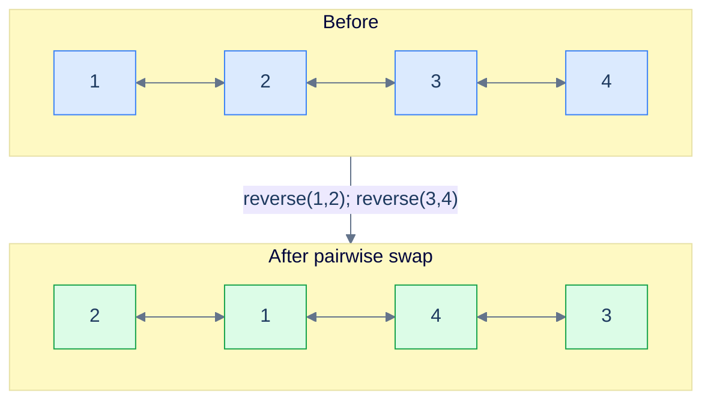
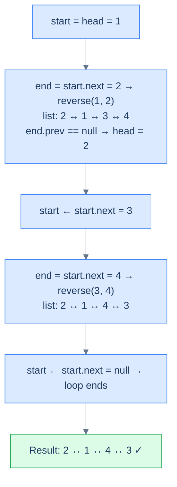

# Pairwise swap

## Problem Statement

Given the **head** of a doubly linked list, swap **every two adjacent nodes** and return the head of the reordered list. Solve it without modifying values — only relink pointers, keeping both `prev` and `next` chains consistent after every swap.

```
Input : head = [1, 2, 3, 4]
Output:        [2, 1, 4, 3]
Explanation: pairs (1,2) → (2,1) and (3,4) → (4,3).
```

---

## Examples

**Example 1**
```
Input:  head = [1, 2, 3, 4]
Output: [2, 1, 4, 3]
Explanation: Swap pair (1, 2) → (2, 1) and pair (3, 4) → (4, 3); the list becomes [2, 1, 4, 3] with both prev and next chains preserved.
```

**Example 2**
```
Input:  head = [1, 2, 3, 4, 5]
Output: [2, 1, 4, 3, 5]
Explanation: Two full pairs swap; the trailing single node 5 has no partner and stays in place — both 5.prev (pointing at 3) and 5.next (None) survive.
```

**Example 3**
```
Input:  head = [1]
Output: [1]
Explanation: A single node has no pair to swap with, so the list is returned unchanged.
```

**Example 4**
```
Input:  head = []
Output: []
Explanation: An empty list trivially produces an empty list.
```

## Constraints

- `0 ≤ list length ≤ 10⁵`
- `-10⁴ ≤ node.val ≤ 10⁴`
- Swap **in place** — `O(1)` extra space; node values must not be copied or rewritten

```python run viz=linked-list viz-root=head
import ast

class ListNode:
    def __init__(self, val, prev=None, next=None):
        self.val = val
        self.prev = prev
        self.next = next

class Solution:
    def pairwise_swap(self, head):
        # Your code goes here — while there's a pair (start, start.next),
        # reverse that two-node chunk; detect the new head via end.prev == None.
        pass

def build_list(values):              # [1, 2, 3] → 1 ⇄ 2 ⇄ 3
    head = tail = None
    for v in values:
        node = ListNode(v, prev=tail)
        if tail is not None:
            tail.next = node
        else:
            head = node
        tail = node
    return head

def print_list(head):                # 1 ⇄ 2 ⇄ 3 → [1, 2, 3]
    out = []
    while head:
        out.append(head.val)
        head = head.next
    print(out)

head = build_list(ast.literal_eval(input()))   # the test case's head
print_list(Solution().pairwise_swap(head))
```

```java run viz=linked-list viz-root=head
import java.util.*;

public class Main {
    static class ListNode {
        int val; ListNode prev, next;
        ListNode(int val) { this.val = val; }
    }

    static class Solution {
        ListNode pairwiseSwap(ListNode head) {
            // Your code goes here — while there's a pair (start, start.next),
            // reverse that two-node chunk; detect the new head via end.prev == null.
            return null;
        }
    }

    public static void main(String[] args) {
        ListNode head = buildList(parseIntArray(new Scanner(System.in).nextLine()));
        printList(new Solution().pairwiseSwap(head));
    }

    static ListNode buildList(int[] values) {      // {1, 2, 3} → 1 ⇄ 2 ⇄ 3
        ListNode head = null, tail = null;
        for (int v : values) {
            ListNode node = new ListNode(v);
            node.prev = tail;
            if (tail != null) tail.next = node;
            else head = node;
            tail = node;
        }
        return head;
    }

    static void printList(ListNode head) {         // 1 ⇄ 2 ⇄ 3 → [1, 2, 3]
        List<Integer> out = new ArrayList<>();
        for (ListNode n = head; n != null; n = n.next) out.add(n.val);
        System.out.println(out);
    }

    // "[1, 2, 3]" → {1, 2, 3} — reads the test case's head
    static int[] parseIntArray(String line) {
        String inner = line.replaceAll("[\\[\\]\\s]", "");
        if (inner.isEmpty()) return new int[0];
        String[] parts = inner.split(",");
        int[] out = new int[parts.length];
        for (int i = 0; i < parts.length; i++) out[i] = Integer.parseInt(parts[i]);
        return out;
    }
}
```

```testcases
{
  "args": [
    { "id": "head", "label": "head", "type": "int[]", "placeholder": "[1, 2, 3, 4]" }
  ],
  "cases": [
    { "args": { "head": "[1, 2, 3, 4]" }, "expected": "[2, 1, 4, 3]" },
    { "args": { "head": "[1, 2, 3, 4, 5]" }, "expected": "[2, 1, 4, 3, 5]" },
    { "args": { "head": "[1]" }, "expected": "[1]" },
    { "args": { "head": "[]" }, "expected": "[]" },
    { "args": { "head": "[1, 2]" }, "expected": "[2, 1]" },
    { "args": { "head": "[1, 2, 3]" }, "expected": "[2, 1, 3]" },
    { "args": { "head": "[5, 5, 5, 5]" }, "expected": "[5, 5, 5, 5]" },
    { "args": { "head": "[1, 2, 3, 4, 5, 6]" }, "expected": "[2, 1, 4, 3, 6, 5]" }
  ]
}
```

<details>
<summary><h2>Intuition</h2></summary>

The **structural property** is that pairwise swap is reverse-k-segments with `k = 2` hard-coded. Every adjacent pair is its own subproblem: a two-node reversal that swaps `(a, b) → (b, a)` while preserving the doubly-linked invariant — `a.prev` becomes `b`, `b.next` becomes `a`, and the boundary links on either side of the pair are re-stitched in both directions. The list decomposes into `⌊n / 2⌋` independent two-node chunks plus an optional trailing singleton. That makes the problem the simplest concrete instance of the reversal-subproblem pattern.

The **pointer placement** uses the same four boundaries as the general k-segment case. `start` points at the pair's first node and `end = start.next` at its second; `leftBound` is read inside the `reverse` helper as `start.prev` (initially `None` because the first pair has no predecessor); `rightBound` is `end.next` cached before the flip starts. After the inner reversal swaps `prev`/`next` on both nodes and stitches the four boundary links, the old `start` is the pair's tail and `start.next` is the next pair's head. The first-pair detection is post-hoc — `end.prev == None` only when the predecessor was `None`, which is true exactly once.

What **breaks if you reach for value-swapping**? Copying `val` between adjacent nodes works for the swap-by-value reading of the problem but violates the constraint "reorder by updating links" — and on a doubly linked list the danger is sharper, because a half-finished pointer swap silently corrupts the backward chain while the forward chain still looks valid. Most importantly, value-swapping doesn't generalise: the next three problems in this section all need true link-level reversal. The segment-reversal call resolves both concerns at once — it flips the actual `prev` and `next` pointers, and the same helper transfers to reverse-k-segments without modification.

</details>
<details>
<summary><h2>What Does "Pairwise Swap" Mean?</h2></summary>


A pairwise swap is just `reverseKSegments` with `k` hard-coded to `2`. Every window has exactly two nodes; `end` is always `start.next`; no `getNodeAtPosition` walk needed.



<p align="center"><strong>Pairwise swap — every adjacent pair becomes a length-2 reversal.</strong></p>

</details>
<details>
<summary><h2>Applying the Diagnostic Questions</h2></summary>

Pairwise swap is the textbook instance of the reversal-subproblem pattern with `k = 2`. The diagnostic confirms the fit before the implementation lands.

| Check | Answer for Pairwise Swap |
|---|---|
| **Q1.** Can the problem or solution be broken down into smaller subproblems? | **Yes** — the rewrite is a sequence of `⌊n / 2⌋` independent two-node reversals; each pair is its own subproblem and the pairs do not interact. |
| **Q2.** Can any subproblem be solved by reversing a part of the linked list? | **Yes** — a two-node reversal is the segment-reversal primitive with `start` and `end = start.next`; one call to `reverse(start, end)` swaps `prev`/`next` on both nodes and re-stitches the boundary in both directions. |
| **Q3.** Does the algorithm only need to walk each node a constant number of times? | **Yes** — each pair is touched exactly once: locate `end` in one hop, swap `prev`/`next` on the two nodes in `O(1)`, stitch the four boundary links in `O(1)`. Total cost is one forward walk. |
| **Q4.** Is each chunk's boundary computable from local state? | **Yes** — `end` is always `start.next`; the seam re-attachment uses `start.prev` (read inside `reverse`) and the post-reversal `end.prev == None` check to detect the first pair. No length precomputation is needed because the per-iteration `start and start.next` guard handles the boundary directly. |

### Q1 — Why "one length-2 reversal per pair"?

Mental model: imagine the list as a row of dominos standing in pairs. Each pair is independent — flipping `(1,2)` doesn't affect `(3,4)`. So the whole job is a parade of identical, non-interfering reversals.

Concrete numbers: for `[1, 2, 3, 4, 5, 6]` you do three calls — `reverse(1,2)`, `reverse(3,4)`, `reverse(5,6)`. Three independent O(2) operations = O(N) total.

What breaks if you treat it as one big reversal: you get `[6, 5, 4, 3, 2, 1]` — full reverse, not pairwise. The "subproblem" view is what restricts each flip to a window of 2.

### Q2 — Why "reverse(start, start.next)"?

Mental model: with `k = 2`, the `end` pointer sits one hop away from `start` *by definition*. No length scan, no walker — just `end = start.next`.

Concrete numbers: at `start = 1`, `end = 1.next = 2`. Call `reverse(1, 2)`. After the call, `start` (node 1) is now the segment tail; `start.next` is node 3 — the head of the next pair. Loop.

What breaks if you skip the bidirectional check `start != null && start.next != null`: an odd-length list (e.g. `[1, 2, 3]`) tries to swap the lonely `3` with `null` and crashes.

</details>
<details>
<summary><h2>The Pairwise Strategy (Visualised)</h2></summary>




<p align="center"><strong>The Pairwise Strategy — same template as <code>reverseKSegments</code>, with the window hard-pinned to 2.</strong></p>

</details>
<details>
<summary><h2>Solution &amp; Analysis</h2></summary>

### The Solution


```python solution time=O(n) space=O(1)
import ast

class ListNode:
    def __init__(self, val, prev=None, next=None):
        self.val = val
        self.prev = prev
        self.next = next


class Solution:
    def reverse(self, start, end):
        if start is None or start == end:
            return

        left_bound = start.prev
        right_bound = end.next
        current = start
        previous = left_bound

        while current != right_bound:
            next_node = current.next
            current.prev, current.next = current.next, current.prev
            previous = current
            current = next_node

        start.next = right_bound
        if right_bound:
            right_bound.prev = start

        end.prev = left_bound
        if left_bound:
            left_bound.next = end

    def pairwise_swap(self, head):

        # If the list is empty or has only one element, no reversal
        # needed.
        if head is None or head.next is None:
            return head

        # Start of the current pair to be reversed
        start = head

        # Loop while there are pairs to be swapped
        while start and start.next:

            # Get the end node of the current pair
            end = start.next

            # Reverse the pair
            self.reverse(start, end)

            # Check if the existing head needs to be updated.
            if end.prev is None:

                # If previous pointer of the end node (which become start
                # after the swap) is null, it means we're at the first
                # pair. So, we need to update the head to the new head
                # node
                head = end

            # Move start to the next pair
            start = start.next

        # Return the head of the modified list
        return head


def build_list(values):              # [1, 2, 3] → 1 ⇄ 2 ⇄ 3
    head = tail = None
    for v in values:
        node = ListNode(v, prev=tail)
        if tail is not None:
            tail.next = node
        else:
            head = node
        tail = node
    return head


def print_list(head):                # 1 ⇄ 2 ⇄ 3 → [1, 2, 3]
    out = []
    while head:
        out.append(head.val)
        head = head.next
    print(out)


head = build_list(ast.literal_eval(input()))   # the test case's head
print_list(Solution().pairwise_swap(head))
```

```java solution
import java.util.*;

public class Main {
    static class ListNode {
        int val; ListNode prev, next;
        ListNode(int val) { this.val = val; }
    }

    static class Solution {
        private void reverse(ListNode start, ListNode end) {
            if (start == null || start == end) {
                return;
            }

            ListNode leftBound = start.prev;
            ListNode rightBound = end.next;
            ListNode current = start;
            ListNode previous = leftBound;

            while (current != rightBound) {
                ListNode next = current.next;

                ListNode temp = current.prev;
                current.prev = current.next;
                current.next = temp;

                previous = current;
                current = next;
            }

            start.next = rightBound;
            if (rightBound != null) {
                rightBound.prev = start;
            }

            end.prev = leftBound;
            if (leftBound != null) {
                leftBound.next = end;
            }
        }

        public ListNode pairwiseSwap(ListNode head) {

            // If the list is empty or has only one element, no reversal
            // needed.
            if (head == null || head.next == null) {
                return head;
            }

            // Start of the current pair to be reversed
            ListNode start = head;

            // Loop while there are pairs to be swapped
            while (start != null && start.next != null) {

                // Get the end node of the current pair
                ListNode end = start.next;

                // Reverse the pair
                reverse(start, end);

                // Check if the existing head needs to be updated.
                if (end.prev == null) {

                    // If previous pointer of the end node (which become
                    // start after the swap) is null, it means we're at the
                    // first pair. So, we need to update the head to the new
                    // head node
                    head = end;
                }

                // Move the start to the next pair.
                start = start.next;
            }

            // Return the head of the modified list
            return head;
        }
    }

    public static void main(String[] args) {
        ListNode head = buildList(parseIntArray(new Scanner(System.in).nextLine()));
        printList(new Solution().pairwiseSwap(head));
    }

    static ListNode buildList(int[] values) {      // {1, 2, 3} → 1 ⇄ 2 ⇄ 3
        ListNode head = null, tail = null;
        for (int v : values) {
            ListNode node = new ListNode(v);
            node.prev = tail;
            if (tail != null) tail.next = node;
            else head = node;
            tail = node;
        }
        return head;
    }

    static void printList(ListNode head) {         // 1 ⇄ 2 ⇄ 3 → [1, 2, 3]
        List<Integer> out = new ArrayList<>();
        for (ListNode n = head; n != null; n = n.next) out.add(n.val);
        System.out.println(out);
    }

    // "[1, 2, 3]" → {1, 2, 3} — reads the test case's head
    static int[] parseIntArray(String line) {
        String inner = line.replaceAll("[\\[\\]\\s]", "");
        if (inner.isEmpty()) return new int[0];
        String[] parts = inner.split(",");
        int[] out = new int[parts.length];
        for (int i = 0; i < parts.length; i++) out[i] = Integer.parseInt(parts[i]);
        return out;
    }
}
```


<details>
<summary><strong>Trace — head = [1, 2, 3, 4]</strong></summary>

```
Step 1 │ start = 1, end = start.next = 2 → reverse(1, 2)
        │ list: 2 → 1 → 3 → 4   |  left_bound is None → head = 2
        │ left_bound = start (node 1); start ← start.next = 3
Step 2 │ start = 3, end = start.next = 4 → reverse(3, 4)
        │ list: 2 → 1 → 4 → 3   |  left_bound = node(1) → left_bound.next = 4
        │ left_bound = start (node 3); start ← start.next = null  →  loop ends
Result: [2, 1, 4, 3] ✓
```

</details>

### Complexity Analysis

| Resource | Cost | Why |
|---|---|---|
| Time | **O(N)** | Each node is visited and pointer-flipped exactly once |
| Space | **O(1)** | Three temporary references; no auxiliary structure |

### Edge Cases

| Case | Example | Expected | Reasoning |
|---|---|---|---|
| Empty list | `head = null` | `null` | Guard at the top short-circuits |
| Single node | `[5]` | `[5]` | `head.next == null` guard catches it |
| Odd length | `[1, 2, 3]` | `[2, 1, 3]` | Loop ends when `start.next == null`; trailing 3 stays |
| Two nodes | `[1, 2]` | `[2, 1]` | One reversal, head promoted |

</details>
<details>
<summary><h2>Approach</h2></summary>

Five numbered steps. No code; the solution block above is the implementation.

1. **Guard the trivial cases.** If `head` is `None` or `head.next` is `None`, the list has zero or one node and no pair exists. Return `head` unchanged.
2. **Initialise the boundary pointer.** Set `start = head`. There is no separate `leftBound` variable — the `reverse` helper reads `start.prev` directly, so the predecessor is always available without a separate cache.
3. **Loop while a full pair exists.** The guard is `start is not None and start.next is not None`. As soon as either is `None`, the trailing fragment is shorter than two nodes and the loop ends, leaving the fragment untouched.
4. **Reverse the current pair and detect the first-pair seam.** Let `end = start.next`. Call `reverse(start, end)` to swap `prev`/`next` on both nodes and re-stitch the four boundary links. After the call, the chunk's new head is the old `end`; if `end.prev` is `None`, the predecessor was `None` (this was the first pair) and the global `head` must be updated to `end`.
5. **Slide the boundary forward.** After the reversal the old `start` is the pair's tail, so `start.next` points at the next pair's head. Set `start = start.next` and repeat. The doubly-linked invariants mean both `start.prev` and `start.next` are already consistent with the rewritten list.

</details>
<details>
<summary><h2>Dry Run — Example 1</h2></summary>

`head = [1, 2, 3, 4]`. Initial state: `start = 1`.

**Iteration 1 — pair `(1, 2)`:**

| step | state |
|---|---|
| `end = start.next` | `end = 2` |
| `reverse(1, 2)` | inside the helper: `leftBound = 1.prev = None`, `rightBound = 2.next = 3`. Swap `prev`/`next` on nodes 1 and 2; stitch `1.next = 3`, `3.prev = 1`, `2.prev = None`, `leftBound.next` skipped because `leftBound is None`. List now `2 ↔ 1 ↔ 3 ↔ 4`. |
| `end.prev is None` → promote head | `head = 2` |
| `start = start.next` | `start = 3` (the old `start` node 1 is now the pair's tail; its `next` is the next pair's head) |

List after iteration 1: `2 ↔ 1 ↔ 3 ↔ 4`.

**Iteration 2 — pair `(3, 4)`:**

| step | state |
|---|---|
| `end = start.next` | `end = 4` |
| `reverse(3, 4)` | `leftBound = 3.prev = 1`, `rightBound = 4.next = None`. Swap `prev`/`next` on nodes 3 and 4; stitch `3.next = None`, `4.prev = 1`, `1.next = 4`. List now `2 ↔ 1 ↔ 4 ↔ 3`. |
| `end.prev is not None` (`4.prev = 1`) → head unchanged | `head = 2` |
| `start = start.next` | `start = None` |

List after iteration 2: `2 ↔ 1 ↔ 4 ↔ 3`.

**Iteration 3 — loop guard:** `start is None` → exit.

**Return:** `head = 2`, traversal yields `[2, 1, 4, 3]` ✓ — and the reverse traversal from the tail (`3.prev = 4, 4.prev = 1, 1.prev = 2, 2.prev = None`) confirms both chains are intact.

</details>
<details>
<summary><h2>Key Takeaway</h2></summary>

Pairwise swap on a doubly linked list is reverse-k-segments with `k = 2` hard-coded plus a bidirectional reversal helper — the per-iteration guard `start and start.next` replaces the explicit `length / k` outer counter, and the first-pair seam is detected post-hoc via `end.prev == None` instead of an upfront `leftBound = None` sentinel.

</details>
