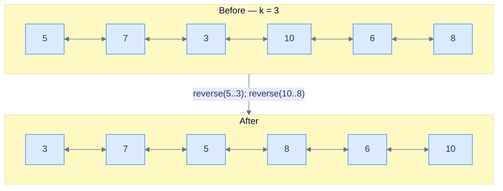
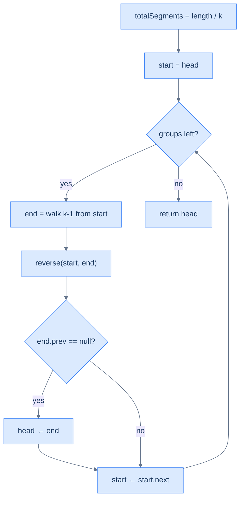

# Reverse K-segments

## Problem Statement

Given the **head** of a doubly linked list and a positive integer **k**, reverse the list in groups of `k`. If the trailing fragment has fewer than `k` nodes, leave it alone. Both the forward and backward chains must remain consistent after every chunk reversal.

```
Input : head = [5, 7, 3, 10, 6, 8], k = 3
Output:        [3, 7, 5, 8, 6, 10]
Explanation: groups of 3 each — (5,7,3) → (3,7,5) and (10,6,8) → (8,6,10).

Input : head = [5, 7, 3, 10, 6], k = 2
Output:        [7, 5, 10, 3, 6]
Explanation: pairs reversed; the lonely trailing 6 is too small to form a group, stays.

Input : head = [5, 7, 3, 10, 6], k = 8
Output:        [5, 7, 3, 10, 6]
Explanation: list length 5 < k=8 → no reversal happens.
```

---

## Examples

**Example 1**
```
Input:  head = [5, 7, 3, 10, 6, 8], k = 3
Output: [3, 7, 5, 8, 6, 10]
Explanation: Two full chunks of three exist. Reverse each: (5, 7, 3) → (3, 7, 5) and (10, 6, 8) → (8, 6, 10). Concatenate to [3, 7, 5, 8, 6, 10] with both prev and next chains intact.
```

**Example 2**
```
Input:  head = [5, 7, 3, 10, 6], k = 2
Output: [7, 5, 10, 3, 6]
Explanation: Two full pairs reverse: (5, 7) → (7, 5) and (3, 10) → (10, 3). The trailing single node 6 is shorter than k and stays in place.
```

**Example 3**
```
Input:  head = [5, 7, 3, 10, 6], k = 8
Output: [5, 7, 3, 10, 6]
Explanation: The full list is shorter than k, so no chunk is reversed and the input is returned unchanged.
```

**Example 4**
```
Input:  head = [1, 2, 3, 4, 5, 6], k = 6
Output: [6, 5, 4, 3, 2, 1]
Explanation: Exactly one full chunk of size 6 spans the whole list; the inner reversal flips the entire list once.
```

<details>
<summary><h2>Intuition</h2></summary>

The **structural property** is that the rewrite is a sequence of `length / k` independent in-place reversals on disjoint chunks of size `k`. Each chunk is a self-contained subproblem: swap `prev`/`next` on every node inside `[start, end]` and re-stitch the four boundary links so neither chain breaks. The trailing fragment of size `length % k` is short-circuited — the outer loop runs exactly `length / k` times, so any leftover nodes never enter a reversal call. This is the general fixed-size form of pairwise swap (`k = 2`).

The **pointer placement** uses the four boundary pointers from the chapter pattern. `start` marks the chunk's first node; `end = getNodeAtPosition(start, k)` walks `k − 1` hops to mark its last node; the helper reads `leftBound = start.prev` and `rightBound = end.next` internally before the flip starts. After reversal, the old `start` is the chunk's tail and `start.next` is the next chunk's head (the seam stitch put it there in both directions). The first-chunk seam is detected post-hoc: `end.prev == None` after a reversal means the predecessor was `None`, so the global `head` must be updated.

What **breaks if you reach for value-copying**? Reading all values into an array, reversing each k-sized window in the array, and writing the values back is `O(n)` time but `O(n)` extra space — and on a doubly linked list it dodges the harder half of the contract, which is keeping `prev` and `next` mutually consistent through the rewrite. Re-traversing the list from `head` to find each chunk's boundary inflates the cost to `O(n²)`. Both shortcuts miss the point: the algorithm should walk each node a constant number of times and rewrite both pointer directions in place. The shared `reverse(start, end)` helper enforces both — one forward walk per chunk, four-pointer bidirectional stitch in `O(1)`.

</details>
<details>
<summary><h2>What Does "Reverse In Groups of K" Mean?</h2></summary>


Same template, generalised window. Where pairwise pinned `k = 2`, here `k` is a parameter; the only addition is the `getNodeAtPosition(start, k)` walk to find each segment's `end`, and the integer-division formula `groups = length / k` that drops the short tail.



<p align="center"><strong>Reverse K-segments — fixed window of size <code>k</code> repeats until fewer than <code>k</code> nodes remain.</strong></p>

</details>
<details>
<summary><h2>Applying the Diagnostic Questions</h2></summary>

Reverse-k-segments is the canonical reversal-subproblem problem — the entire chapter pattern is structured around it. The diagnostic confirms the fit precisely.

| Check | Answer for Reverse-K-Segments |
|---|---|
| **Q1.** Can the problem or solution be broken down into smaller subproblems? | **Yes** — the rewrite decomposes into `length / k` independent reversals on disjoint contiguous chunks of size `k`. The chunks do not share state. |
| **Q2.** Can any subproblem be solved by reversing a part of the linked list? | **Yes** — each chunk reversal is one call to `reverse(start, end)` from chapter pattern 06; the helper swaps `prev`/`next` on every node in `[start, end]` and re-stitches the four boundary links bidirectionally. |
| **Q3.** Does the algorithm only need to walk each node a constant number of times? | **Yes** — `getNodeAtPosition` walks `k − 1` hops to find `end`, and the inner reversal walks the same `k` nodes once. Each node is touched twice across one outer pass. |
| **Q4.** Is each chunk's boundary computable from local state? | **Yes** — `end` is `start` plus `k`, and the seam re-attachment uses `start.prev`/`end.next` (read inside the helper). The length precomputation runs once before the loop and stays constant memory. |

### Q1 — Why "length / k independent reversals"?

Mental model: integer division gives you the count of *complete* windows that fit. Anything left over is shorter than `k` and is excluded by definition.

Concrete numbers: `length = 5, k = 2 → 5 / 2 = 2` complete pairs. The 5th node is the leftover — never reversed. `length = 5, k = 8 → 5 / 8 = 0` — zero reversals, the list comes out unchanged.

What breaks if you use the ceiling instead of the floor: you'd try to reverse a partial trailing segment whose `end` is `null`, and `getNodeAtPosition` would walk off the list and crash.

### Q2 — Why "reverse from start to the k-th node"?

Mental model: each window is a contiguous segment defined by two endpoints. With `start` at the front, walking `k-1` hops lands you on the k-th node — that's `end`.

Concrete numbers: `start = node(5)`, `k = 3` → walk 2 hops → `end = node(3)`. Call `reverse(5, 3)`. Segment becomes `(3, 7, 5)`.

What breaks if you skip the head-promotion check `end.prev == null`: after the first reversal, the original head is buried mid-list and the function returns it as the head — the caller traverses the list starting from a non-head node and misses everything before it.

</details>
<details>
<summary><h2>The K-Segment Strategy (Visualised)</h2></summary>




<p align="center"><strong>The K-Segment Strategy — three reusable building blocks: window-pick, reverse, head-track.</strong></p>

> *Friction prompt — before reading on:* what's the answer for `head = [1, 2, 3, 4, 5], k = 5`? Predict before scrolling.
>
> Answer: `length / k = 1` group, the entire list. After one `reverse(1, 5)`: `[5, 4, 3, 2, 1]`. Head promoted because `end.prev == null`. The "fractional tail" rule reduces to "no tail" when `k` divides `length` exactly.

</details>
<details>
<summary><h2>Solution &amp; Analysis</h2></summary>

### The Solution

```python run viz=linked-list viz-root=head
from typing import Optional

class ListNode:
    def __init__(self, val=0, prev=None, nxt=None):
        self.val = val
        self.prev = prev
        self.next = nxt


def from_list(values):
    if not values:
        return None
    head = ListNode(values[0])
    cur = head
    for v in values[1:]:
        node = ListNode(v, prev=cur)
        cur.next = node
        cur = node
    return head


def to_list(head):
    out = []
    while head is not None:
        out.append(head.val)
        head = head.next
    return out


class Solution:
    def find_length(self, head: Optional[ListNode]) -> int:
        length = 0
        while head is not None:
            length += 1
            head = head.next
        return length

    def get_node_at_position(
        self, head: Optional[ListNode], position: int
    ) -> Optional[ListNode]:
        current = head
        for _ in range(1, position):
            if current is None:
                break
            current = current.next
        return current

    def reverse(
        self, start: Optional[ListNode], end: Optional[ListNode]
    ) -> None:
        if start is None or start == end:
            return

        left_bound = start.prev
        right_bound = end.next if end else None
        current = start
        previous = left_bound

        while current != right_bound:
            next_node = current.next
            current.prev, current.next = current.next, current.prev
            previous = current
            current = next_node

        if start:
            start.next = right_bound
        if right_bound:
            right_bound.prev = start

        if end:
            end.prev = left_bound
        if left_bound:
            left_bound.next = end

    def reverse_k_segments(
        self, head: Optional[ListNode], k: int
    ) -> Optional[ListNode]:

        # If the list is empty, has only one node, or k is 1, no need to
        # reverse segments
        if head is None or head.next is None or k == 1:
            return head

        # Start of the current segment to be reversed
        start = head

        # Find the total number of segments in the linked list
        total_segments = self.find_length(head) // k

        # Loop through the list to reverse every k-length segment
        for _ in range(total_segments):

            # Get the end node of the current segment
            end = self.get_node_at_position(start, k)

            # Reverse the segment
            self.reverse(start, end)

            # Check if the existing head needs to be updated.
            if end and end.prev is None:

                # If previous pointer of the end node (which becomes
                # start after the swap) is null, it means we're at the
                # first segment. So, we need to update the head to the
                # new head node
                head = end

            # Move start to the next segment
            start = start.next

        # Return the head of the modified list
        return head


# Examples from the problem statement
head = from_list([5, 7, 3, 10, 6, 8])
print(to_list(Solution().reverse_k_segments(head, 3)))  # [3, 7, 5, 8, 6, 10]

head = from_list([5, 7, 3, 10, 6])
print(to_list(Solution().reverse_k_segments(head, 2)))  # [7, 5, 10, 3, 6]

head = from_list([5, 7, 3, 10, 6])
print(to_list(Solution().reverse_k_segments(head, 8)))  # [5, 7, 3, 10, 6]

# Edge cases
head = from_list([1])
print(to_list(Solution().reverse_k_segments(head, 1)))  # [1]

head = from_list([1, 2, 3, 4])
print(to_list(Solution().reverse_k_segments(head, 1)))  # [1, 2, 3, 4]

head = from_list([1, 2, 3, 4])
print(to_list(Solution().reverse_k_segments(head, 4)))  # [4, 3, 2, 1]

head = from_list([1, 2, 3, 4, 5, 6])
print(to_list(Solution().reverse_k_segments(head, 2)))  # [2, 1, 4, 3, 6, 5]

head = from_list([1, 2])
print(to_list(Solution().reverse_k_segments(head, 3)))  # [1, 2]
```

```java run viz=linked-list viz-root=head
import java.util.*;

public class Main {
    static class ListNode {
        int val;
        ListNode prev;
        ListNode next;
        ListNode() {}
        ListNode(int val) { this.val = val; }
    }

    static ListNode fromList(int... values) {
        if (values.length == 0) return null;
        ListNode head = new ListNode(values[0]);
        ListNode cur = head;
        for (int i = 1; i < values.length; i++) {
            ListNode node = new ListNode(values[i]);
            node.prev = cur;
            cur.next = node;
            cur = node;
        }
        return head;
    }

    static java.util.List<Integer> toList(ListNode head) {
        java.util.List<Integer> out = new java.util.ArrayList<>();
        while (head != null) { out.add(head.val); head = head.next; }
        return out;
    }

    static class Solution {
        private int findLength(ListNode head) {
            int length = 0;
            while (head != null) {
                length++;
                head = head.next;
            }
            return length;
        }

        private ListNode getNodeAtPosition(ListNode head, int position) {
            ListNode current = head;
            for (int i = 1; i < position; i++) {
                current = current.next;
            }
            return current;
        }

        private void reverse(ListNode start, ListNode end) {
            if (start == null || start == end) {
                return;
            }

            ListNode leftBound = start.prev;
            ListNode rightBound = end.next;
            ListNode current = start;
            ListNode previous = leftBound;

            while (current != rightBound) {
                ListNode next = current.next;

                ListNode temp = current.prev;
                current.prev = current.next;
                current.next = temp;

                previous = current;
                current = next;
            }

            start.next = rightBound;
            if (rightBound != null) {
                rightBound.prev = start;
            }

            end.prev = leftBound;
            if (leftBound != null) {
                leftBound.next = end;
            }
        }

        public ListNode reverseKSegments(ListNode head, int k) {

            // If the list is empty, has only one node, or k is 1, no need to
            // reverse segments
            if (head == null || head.next == null || k == 1) {
                return head;
            }

            // Start of the current segment to be reversed
            ListNode start = head;

            // Find the total number of segments in the linked list
            int totalSegments = findLength(head) / k;

            // Loop through the list to reverse every k-length segment
            for (int i = 0; i < totalSegments; i++) {

                // Get the end node of the current segment
                ListNode end = getNodeAtPosition(start, k);

                // Reverse the segment
                reverse(start, end);

                // Check if the existing head needs to be updated.
                if (end.prev == null) {

                    // If previous pointer of the end node (which becomes
                    // start after the swap) is null, it means we're at the
                    // first segment. So, we need to update the head to the
                    // new head node
                    head = end;
                }

                // Move start to the next segment
                start = start.next;
            }

            // Return the head of the modified list
            return head;
        }
    }

    public static void main(String[] args) {
        // Examples from the problem statement
        System.out.println(toList(new Solution().reverseKSegments(fromList(5, 7, 3, 10, 6, 8), 3)));  // [3, 7, 5, 8, 6, 10]
        System.out.println(toList(new Solution().reverseKSegments(fromList(5, 7, 3, 10, 6), 2)));     // [7, 5, 10, 3, 6]
        System.out.println(toList(new Solution().reverseKSegments(fromList(5, 7, 3, 10, 6), 8)));     // [5, 7, 3, 10, 6]

        // Edge cases
        System.out.println(toList(new Solution().reverseKSegments(fromList(1), 1)));                  // [1]
        System.out.println(toList(new Solution().reverseKSegments(fromList(1, 2, 3, 4), 1)));         // [1, 2, 3, 4]
        System.out.println(toList(new Solution().reverseKSegments(fromList(1, 2, 3, 4), 4)));         // [4, 3, 2, 1]
        System.out.println(toList(new Solution().reverseKSegments(fromList(1, 2, 3, 4, 5, 6), 2)));   // [2, 1, 4, 3, 6, 5]
        System.out.println(toList(new Solution().reverseKSegments(fromList(1, 2), 3)));               // [1, 2]
    }
}
```


<details>
<summary><strong>Trace — head = [5, 7, 3, 10, 6, 8], k = 3</strong></summary>

```
length = 6,  total_segments = 6 / 3 = 2

Step 1 │ start = node(5), end = get_node_at_position(5, 3) = node(3) → reverse(5, 3)
        │ list: 3 → 7 → 5 → 10 → 6 → 8
        │ left_bound is None → head = node(3)
        │ left_bound = start (node 5); start ← left_bound.next = node(10)

Step 2 │ start = node(10), end = get_node_at_position(10, 3) = node(8) → reverse(10, 8)
        │ list: 3 → 7 → 5 → 8 → 6 → 10
        │ left_bound = node(5) → left_bound.next = node(8)
        │ left_bound = start (node 10); start ← left_bound.next = null  →  loop ends

Result: [3, 7, 5, 8, 6, 10] ✓
```

</details>
<details>
<summary><strong>Trace — head = [5, 7, 3, 10, 6], k = 8 (k larger than length)</strong></summary>

```
length = 5,  total = 5 / 8 = 0  → loop never runs
Result: [5, 7, 3, 10, 6] ✓  (list returned unchanged)
```

This trace shows why integer division is the right choice: zero complete windows = zero reversals = no risk of walking off the end.

</details>

### Complexity Analysis

| Resource | Cost | Why |
|---|---|---|
| Time | **O(N)** | One length scan + each node visited once during reversals |
| Space | **O(1)** | Constant working set: a few pointers, no auxiliary structure |

### Edge Cases

| Case | Example | Expected | Reasoning |
|---|---|---|---|
| `k == 1` | `[1, 2, 3], k=1` | `[1, 2, 3]` | Each "group" is a single node; reversing it is a no-op |
| `k > length` | `[1, 2, 3], k=5` | `[1, 2, 3]` | `total = 0`; loop doesn't execute |
| `k == length` | `[1, 2, 3], k=3` | `[3, 2, 1]` | One full reversal; head promoted |
| `length` not multiple of `k` | `[1,2,3,4,5], k=2` | `[2,1,4,3,5]` | Trailing 5 is the dropped fractional tail |

</details>
<details>
<summary><h2>Approach</h2></summary>

Six numbered steps. No code; the solution block above is the implementation.

1. **Guard the trivial cases.** If `head` is `None`, the list has only one node, or `k == 1`, no chunk can or should be reversed. Return `head` unchanged.
2. **Precompute the chunk count.** Walk the list once to find `length`, then set `total_segments = length // k`. The trailing fragment of `length % k` nodes is implicitly skipped because the loop runs exactly `total_segments` times.
3. **Initialise the boundary pointer.** Set `start = head`. There is no separate `leftBound` variable — the `reverse` helper reads `start.prev` directly, so the predecessor is always available without a separate cache.
4. **Drive the outer loop `total_segments` times.** For each iteration, find the chunk's end: `end = getNodeAtPosition(start, k)` walks `k − 1` hops forward from `start`. Then call `reverse(start, end)` to swap `prev`/`next` on every node in `[start, end]` and bidirectionally stitch the four boundary links.
5. **Detect the first-chunk seam.** After the reversal, check `end.prev == None`. If true, the predecessor was `None` and this is the first chunk — update `head = end`. Otherwise the previous chunk's tail already re-attaches via the bidirectional stitch inside `reverse`.
6. **Slide the boundary forward.** Set `start = start.next`. After the reversal, the old `start` is the chunk's tail, so `start.next` is the next chunk's head — the seam stitch put it there in both directions.

</details>
<details>
<summary><h2>Dry Run — Example 1</h2></summary>

`head = [5, 7, 3, 10, 6, 8]`, `k = 3`. Precompute `length = 6`, `total_segments = 6 // 3 = 2`. Initial state: `start = 5`.

**Iteration 1 — chunk `(5, 7, 3)`:**

| step | state |
|---|---|
| `end = getNodeAtPosition(start, 3)` | `end = 3` (advance `start` two hops) |
| `reverse(5, 3)` | `leftBound = 5.prev = None`, `rightBound = 3.next = 10`. Swap `prev`/`next` on nodes 5, 7, 3; stitch `5.next = 10`, `10.prev = 5`, `3.prev = None`, no `leftBound.next` write because `leftBound is None`. List now `3 ↔ 7 ↔ 5 ↔ 10 ↔ 6 ↔ 8`. |
| `end.prev is None` → promote head | `head = 3` |
| `start = start.next` | `start = 10` (old `start` node 5 is now the chunk's tail) |

List after iteration 1: `3 ↔ 7 ↔ 5 ↔ 10 ↔ 6 ↔ 8`.

**Iteration 2 — chunk `(10, 6, 8)`:**

| step | state |
|---|---|
| `end = getNodeAtPosition(start, 3)` | `end = 8` |
| `reverse(10, 8)` | `leftBound = 10.prev = 5`, `rightBound = 8.next = None`. Swap `prev`/`next` on nodes 10, 6, 8; stitch `10.next = None`, `8.prev = 5`, `5.next = 8`. List now `3 ↔ 7 ↔ 5 ↔ 8 ↔ 6 ↔ 10`. |
| `end.prev is not None` (`8.prev = 5`) → head unchanged | `head = 3` |
| `start = start.next` | `start = None` |

List after iteration 2: `3 ↔ 7 ↔ 5 ↔ 8 ↔ 6 ↔ 10`.

**Loop ends** (`total_segments = 2` iterations completed).

**Return:** `head = 3`, traversal yields `[3, 7, 5, 8, 6, 10]` ✓. The reverse-direction traversal from node 10 (`10.prev = 6, 6.prev = 8, 8.prev = 5, 5.prev = 7, 7.prev = 3, 3.prev = None`) confirms the backward chain is consistent.

</details>
<details>
<summary><h2>Key Takeaway</h2></summary>

Reverse-k-segments on a doubly linked list is pairwise swap generalised — precompute `length / k`, run that many chunk reversals via the bidirectional `reverse(start, end)` helper, and let the trailing fragment of `length % k` nodes pass through untouched. The first-chunk seam is detected post-hoc by `end.prev == None`; both `prev` and `next` chains stay consistent because the helper re-stitches all four boundary links in one block after the per-node swap.

</details>
