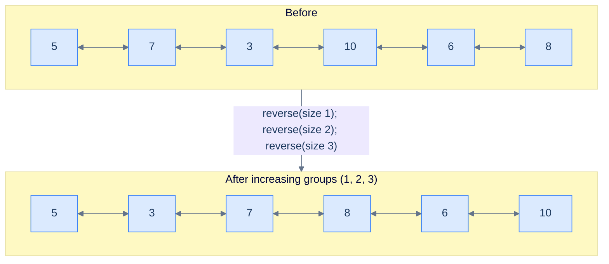
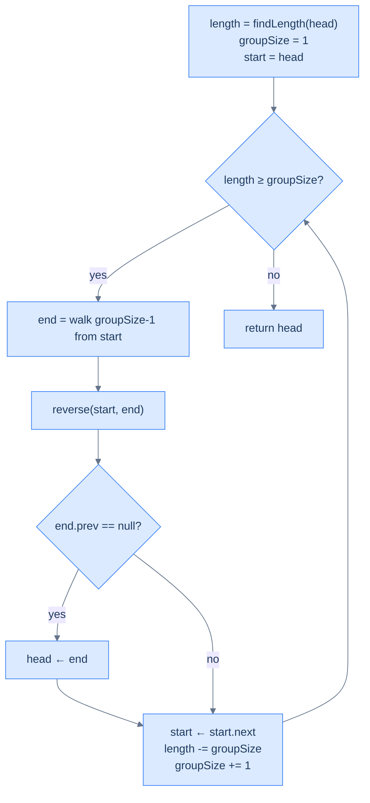

# Reverse increasing groups

## Problem Statement

Given the **head** of a doubly linked list, reverse the list in groups of **increasing size**: first group has size 1, next size 2, then 3, and so on. Return the head of the modified list. If the trailing fragment is shorter than the next required group size, leave it alone. Both `prev` and `next` chains must remain consistent after every chunk reversal.

```
Input : head = [5, 7, 3, 10, 6, 8]
Output:        [5, 3, 7, 8, 6, 10]
Explanation: groups of sizes 1, 2, 3 — (5)→(5), (7,3)→(3,7), (10,6,8)→(8,6,10).

Input : head = [5, 7, 3, 10, 6]
Output:        [5, 3, 7, 10, 6]
Explanation: groups 1 and 2 — (5)→(5), (7,3)→(3,7). The trailing 2 nodes are
             fewer than the next required size of 3 → left unchanged.

Input : head = [5]
Output:        [5]
Explanation: only one group of size 1; reversing it is a no-op.
```

---

## Examples

**Example 1**
```
Input:  head = [5, 7, 3, 10, 6, 8]
Output: [5, 3, 7, 8, 6, 10]
Explanation: Three chunks of sizes 1, 2, 3 cover the list. Reverse each: (5) stays (5); (7, 3) → (3, 7); (10, 6, 8) → (8, 6, 10). Concatenate to [5, 3, 7, 8, 6, 10] with both chains intact.
```

**Example 2**
```
Input:  head = [5, 7, 3, 10, 6]
Output: [5, 3, 7, 10, 6]
Explanation: Two chunks of sizes 1 and 2 reverse to (5) and (3, 7). The remaining two nodes (10, 6) cannot form a chunk of size 3, so they stay untouched.
```

**Example 3**
```
Input:  head = [5]
Output: [5]
Explanation: One chunk of size 1 covers the list; reversing a single node is a no-op (the helper short-circuits on `start == end`).
```

**Example 4**
```
Input:  head = [1, 2, 3, 4, 5, 6, 7]
Output: [1, 3, 2, 6, 5, 4, 7]
Explanation: Three chunks of sizes 1, 2, 3 cover 6 nodes; the trailing node 7 is shorter than the next required size 4 and stays untouched.
```

## Constraints

- `0 ≤ list length ≤ 10⁵`
- `-10⁴ ≤ node.val ≤ 10⁴`
- If the remaining length is shorter than the next group size, leave the fragment untouched
- Reverse **in place** — `O(1)` extra space; node values must not be copied or rewritten

```python run viz=linked-list viz-root=head
import ast

class ListNode:
    def __init__(self, val, prev=None, next=None):
        self.val = val
        self.prev = prev
        self.next = next

class Solution:
    def reverse_increasing_groups(self, head):
        # Your code goes here — find the length, start group_size = 1,
        # loop while length >= group_size: reverse the chunk, advance start,
        # decrement length by group_size, increment group_size.
        pass

def build_list(values):              # [1, 2, 3] → 1 ⇄ 2 ⇄ 3
    head = tail = None
    for v in values:
        node = ListNode(v, prev=tail)
        if tail is not None:
            tail.next = node
        else:
            head = node
        tail = node
    return head

def print_list(head):                # 1 ⇄ 2 ⇄ 3 → [1, 2, 3]
    out = []
    while head:
        out.append(head.val)
        head = head.next
    print(out)

head = build_list(ast.literal_eval(input()))   # the test case's head
print_list(Solution().reverse_increasing_groups(head))
```

```java run viz=linked-list viz-root=head
import java.util.*;

public class Main {
    static class ListNode {
        int val; ListNode prev, next;
        ListNode(int val) { this.val = val; }
    }

    static class Solution {
        ListNode reverseIncreasingGroups(ListNode head) {
            // Your code goes here — find the length, start groupSize = 1,
            // loop while length >= groupSize: reverse the chunk, advance start,
            // decrement length by groupSize, increment groupSize.
            return null;
        }
    }

    public static void main(String[] args) {
        ListNode head = buildList(parseIntArray(new Scanner(System.in).nextLine()));
        printList(new Solution().reverseIncreasingGroups(head));
    }

    static ListNode buildList(int[] values) {      // {1, 2, 3} → 1 ⇄ 2 ⇄ 3
        ListNode head = null, tail = null;
        for (int v : values) {
            ListNode node = new ListNode(v);
            node.prev = tail;
            if (tail != null) tail.next = node;
            else head = node;
            tail = node;
        }
        return head;
    }

    static void printList(ListNode head) {         // 1 ⇄ 2 ⇄ 3 → [1, 2, 3]
        List<Integer> out = new ArrayList<>();
        for (ListNode n = head; n != null; n = n.next) out.add(n.val);
        System.out.println(out);
    }

    // "[1, 2, 3]" → {1, 2, 3} — reads the test case's head
    static int[] parseIntArray(String line) {
        String inner = line.replaceAll("[\\[\\]\\s]", "");
        if (inner.isEmpty()) return new int[0];
        String[] parts = inner.split(",");
        int[] out = new int[parts.length];
        for (int i = 0; i < parts.length; i++) out[i] = Integer.parseInt(parts[i]);
        return out;
    }
}
```

```testcases
{
  "args": [
    { "id": "head", "label": "head", "type": "int[]", "placeholder": "[5, 7, 3, 10, 6, 8]" }
  ],
  "cases": [
    { "args": { "head": "[5, 7, 3, 10, 6, 8]" }, "expected": "[5, 3, 7, 8, 6, 10]" },
    { "args": { "head": "[5, 7, 3, 10, 6]" }, "expected": "[5, 3, 7, 10, 6]" },
    { "args": { "head": "[5]" }, "expected": "[5]" },
    { "args": { "head": "[1, 2, 3, 4, 5, 6, 7]" }, "expected": "[1, 3, 2, 6, 5, 4, 7]" },
    { "args": { "head": "[1, 2]" }, "expected": "[1, 2]" },
    { "args": { "head": "[1, 2, 3]" }, "expected": "[1, 3, 2]" },
    { "args": { "head": "[10, 20, 30, 40, 50, 60]" }, "expected": "[10, 30, 20, 60, 50, 40]" },
    { "args": { "head": "[]" }, "expected": "[]" }
  ]
}
```

<details>
<summary><h2>Intuition</h2></summary>

The **structural property** is that the chunk size is not fixed — it grows by one after every iteration: `group_size = 1, 2, 3, 4, …`. The list decomposes into chunks of sizes `1, 2, 3, …` until the remaining length cannot accommodate the next size. Each chunk is its own segment-reversal subproblem and the chunks do not interact. The difference from reverse-k-segments is purely in the outer driver's stopping rule and counter update — the inner bidirectional reversal primitive and the seam-detection logic are unchanged.

The **pointer placement** uses the same boundaries as reverse-k-segments with one extra piece of state: `length` (the remaining list length, initially `findLength(head)`) and `group_size` (initially `1`). After each chunk reversal, `length -= group_size` and `group_size += 1`. The loop continues while `length >= group_size`, which is the only check that determines whether the next chunk fits. `start`, `end`, and the implicit `leftBound`/`rightBound` cached inside `reverse` behave exactly as in reverse-k-segments — the only call-site change is that `getNodeAtPosition(start, group_size)` uses the current counter instead of a fixed `k`.

What **breaks if you reach for a recursive solution**? A recursive formulation `reverse_groups(head, size)` could compute "reverse the first `size` nodes, then recurse on the rest with `size + 1`." That works algorithmically but consumes `O(√n)` stack frames (the chunk sizes sum to `1 + 2 + … + g ≈ g²/2 = n`, so `g ≈ √(2n)`). The iterative form stays `O(1)` space and exposes the boundary mechanics directly. The shared `reverse(start, end)` helper resolves the rewrite per chunk in `O(group_size)` and re-stitches both chains without any per-chunk re-traversal from `head`.

</details>
<details>
<summary><h2>What Does "Increasing Groups" Mean?</h2></summary>


Same template, dynamic window. The K-segments problem fixed `k` for every iteration. Here, `k` grows: 1 on iteration 1, 2 on iteration 2, 3 on iteration 3. The loop guard becomes "do I have at least `groupSize` nodes left?"



<p align="center"><strong>Reverse increasing groups — group size grows by 1 each iteration. The cumulative coverage is <code>1 + 2 + 3 + … = n(n+1)/2</code>.</strong></p>

</details>
<details>
<summary><h2>Applying the Diagnostic Questions</h2></summary>

Reverse-increasing-groups extends the chapter pattern with a growing counter. The diagnostic confirms that the outer-driver change does not break any of the four conditions.

| Check | Answer for Reverse Increasing Groups |
|---|---|
| **Q1.** Can the problem or solution be broken down into smaller subproblems? | **Yes** — the rewrite decomposes into chunks of sizes `1, 2, 3, …` until the remaining length is too short. Each chunk is an independent reversal subproblem. |
| **Q2.** Can any subproblem be solved by reversing a part of the linked list? | **Yes** — each chunk is one call to `reverse(start, end)` where `end` is `start` advanced by `group_size − 1` hops. The chunk of size `1` is a degenerate reversal (the `start == end` guard inside `reverse` short-circuits); chunks of size `≥ 2` swap `prev`/`next` per node as usual. |
| **Q3.** Does the algorithm only need to walk each node a constant number of times? | **Yes** — `getNodeAtPosition` walks `group_size − 1` hops and the inner reversal walks the same chunk once. Summed across all chunks this is still one `O(n)` outer walk. |
| **Q4.** Is each chunk's boundary computable from local state? | **Yes** — `end` is `start` plus the local counter `group_size`; the seam stitch uses `start.prev`/`end.next` (read inside the helper). The remaining length and counter are constant-size scalars. |

### Q1 — Why "one reversal per growing window"?

Mental model: the problem is a parade of independent reversals just like K-segments — but the parade marshal grows the window by one each step. Track a `length` counter that you decrement by `groupSize` after each iteration; stop when `length < groupSize`.

Concrete numbers: `length = 6`. Iter 1: `groupSize = 1`, reverse 1 node, `length = 5`. Iter 2: `groupSize = 2`, reverse 2, `length = 3`. Iter 3: `groupSize = 3`, reverse 3, `length = 0`. Iter 4 would need `groupSize = 4` but `length = 0 < 4` → stop.

What breaks if you don't decrement length: the loop never terminates because `length` stays at 6 forever and every iteration looks fine — until `getNodeAtPosition` walks off the list and crashes.

### Q2 — Why "same reverse, dynamic end"?

Mental model: the only thing changing per iteration is how far `end` is from `start`. Everything else — head promotion, advancing `start`, the reverse helper — is identical to K-segments.

Concrete numbers: at iteration 3 with `start = node(10)`, `groupSize = 3` → walk 2 hops → `end = node(8)`. Call `reverse(10, 8)`. Output segment: `(8, 6, 10)`.

What breaks if you don't increment `groupSize` after each iteration: you've reduced the problem to "reverse every node alone", which is a no-op — output equals input.

</details>
<details>
<summary><h2>The Increasing-Group Strategy (Visualised)</h2></summary>




<p align="center"><strong>The Increasing-Group Strategy — same skeleton as K-segments with two new bookkeeping lines: shrink <code>length</code>, grow <code>groupSize</code>.</strong></p>

</details>
<details>
<summary><h2>Solution &amp; Analysis</h2></summary>

### The Solution


```python solution time=O(n) space=O(1)
import ast

class ListNode:
    def __init__(self, val, prev=None, next=None):
        self.val = val
        self.prev = prev
        self.next = next


class Solution:
    def find_length(self, head):
        length = 0
        while head is not None:
            length += 1
            head = head.next
        return length

    def get_node_at_position(self, head, position):
        current = head
        for _ in range(1, position):
            current = current.next
        return current

    def reverse(self, start, end):
        if start is None or start == end:
            return

        left_bound = start.prev
        right_bound = end.next if end else None
        current = start
        previous = left_bound

        while current != right_bound:
            next_node = current.next
            current.prev, current.next = current.next, current.prev
            previous = current
            current = next_node

        if start:
            start.next = right_bound
        if right_bound:
            right_bound.prev = start

        if end:
            end.prev = left_bound
        if left_bound:
            left_bound.next = end

    def reverse_increasing_groups(self, head):

        # If the list is empty or has only one node, no need to
        # reverse segments
        if head is None or head.next is None:
            return head

        # Start of the current segment to be reversed
        start = head

        # Find the length of the linked list
        length = self.find_length(head)

        # Start with a group size of 1
        group_size = 1

        # Loop through the list to reverse segments of increasing size
        while length >= group_size:

            # Get the end node of the current segment
            end = self.get_node_at_position(start, group_size)

            # Reverse the segment
            self.reverse(start, end)

            # Check if the existing head needs to be updated.
            if end and end.prev is None:

                # If previous pointer of the end node (which becomes
                # start after the swap) is null, it means we're at the
                # first segment. So, we need to update the head to the
                # new head node
                head = end

            # Move start to the next segment
            start = start.next

            # Decrement the remaining length by the size of the current
            # group
            length -= group_size

            # Increment group_size for the next segment
            group_size += 1

        # Return the head of the modified list
        return head


def build_list(values):              # [1, 2, 3] → 1 ⇄ 2 ⇄ 3
    head = tail = None
    for v in values:
        node = ListNode(v, prev=tail)
        if tail is not None:
            tail.next = node
        else:
            head = node
        tail = node
    return head


def print_list(head):                # 1 ⇄ 2 ⇄ 3 → [1, 2, 3]
    out = []
    while head:
        out.append(head.val)
        head = head.next
    print(out)


head = build_list(ast.literal_eval(input()))   # the test case's head
print_list(Solution().reverse_increasing_groups(head))
```

```java solution
import java.util.*;

public class Main {
    static class ListNode {
        int val; ListNode prev, next;
        ListNode(int val) { this.val = val; }
    }

    static class Solution {
        private int findLength(ListNode head) {
            int length = 0;
            while (head != null) {
                length++;
                head = head.next;
            }
            return length;
        }

        private ListNode getNodeAtPosition(ListNode head, int position) {
            ListNode current = head;
            for (int i = 1; i < position; ++i) {
                current = current.next;
            }
            return current;
        }

        private void reverse(ListNode start, ListNode end) {
            if (start == null || start == end) {
                return;
            }

            ListNode leftBound = start.prev;
            ListNode rightBound = end.next;
            ListNode current = start;
            ListNode previous = leftBound;

            while (current != rightBound) {
                ListNode next = current.next;

                ListNode temp = current.prev;
                current.prev = current.next;
                current.next = temp;

                previous = current;
                current = next;
            }

            start.next = rightBound;
            if (rightBound != null) {
                rightBound.prev = start;
            }

            end.prev = leftBound;
            if (leftBound != null) {
                leftBound.next = end;
            }
        }

        public ListNode reverseIncreasingGroups(ListNode head) {

            // If the list is empty or has only one node, no need to
            // reverse segments
            if (head == null || head.next == null) {
                return head;
            }

            // Start of the current segment to be reversed
            ListNode start = head;

            // Find the length of the linked list
            int length = findLength(head);

            // Start with a group size of 1
            int groupSize = 1;

            // Loop through the list to reverse segments of increasing size
            while (length >= groupSize) {

                // Get the end node of the current segment
                ListNode end = getNodeAtPosition(start, groupSize);

                // Reverse the segment
                reverse(start, end);

                // Check if the existing head needs to be updated.
                if (end.prev == null) {

                    // If previous pointer of the end node (which becomes
                    // start after the swap) is null, it means we're at the
                    // first segment. So, we need to update the head to the
                    // new head node
                    head = end;
                }

                // Move start to the next segment
                start = start.next;

                // Decrement the remaining length by the size of the current
                // group
                length -= groupSize;

                // increment groupSize for the next segment
                groupSize++;
            }

            // Return the head of the modified list
            return head;
        }
    }

    public static void main(String[] args) {
        ListNode head = buildList(parseIntArray(new Scanner(System.in).nextLine()));
        printList(new Solution().reverseIncreasingGroups(head));
    }

    static ListNode buildList(int[] values) {      // {1, 2, 3} → 1 ⇄ 2 ⇄ 3
        ListNode head = null, tail = null;
        for (int v : values) {
            ListNode node = new ListNode(v);
            node.prev = tail;
            if (tail != null) tail.next = node;
            else head = node;
            tail = node;
        }
        return head;
    }

    static void printList(ListNode head) {         // 1 ⇄ 2 ⇄ 3 → [1, 2, 3]
        List<Integer> out = new ArrayList<>();
        for (ListNode n = head; n != null; n = n.next) out.add(n.val);
        System.out.println(out);
    }

    // "[1, 2, 3]" → {1, 2, 3} — reads the test case's head
    static int[] parseIntArray(String line) {
        String inner = line.replaceAll("[\\[\\]\\s]", "");
        if (inner.isEmpty()) return new int[0];
        String[] parts = inner.split(",");
        int[] out = new int[parts.length];
        for (int i = 0; i < parts.length; i++) out[i] = Integer.parseInt(parts[i]);
        return out;
    }
}
```


<details>
<summary><strong>Trace — head = [5, 7, 3, 10, 6, 8]</strong></summary>

```
length = 6, group_size = 1, start = node(5)

Iter 1 │ group_size = 1, length = 6 ≥ 1 ✓
        │ end = get_node_at_position(5, 1) = node(5) → reverse(5, 5) is a no-op
        │ left_bound is None → head = node(5) (unchanged)
        │ left_bound = node(5); start ← left_bound.next = node(7);  length = 5;  group_size = 2

Iter 2 │ group_size = 2, length = 5 ≥ 2 ✓
        │ end = get_node_at_position(7, 2) = node(3) → reverse(7, 3)
        │ list: 5 → 3 → 7 → 10 → 6 → 8
        │ left_bound = node(5) → left_bound.next = node(3)
        │ left_bound = node(7); start ← left_bound.next = node(10);  length = 3;  group_size = 3

Iter 3 │ group_size = 3, length = 3 ≥ 3 ✓
        │ end = get_node_at_position(10, 3) = node(8) → reverse(10, 8)
        │ list: 5 → 3 → 7 → 8 → 6 → 10
        │ left_bound = node(7) → left_bound.next = node(8)
        │ left_bound = node(10); start ← left_bound.next = null;  length = 0;  group_size = 4

Iter 4 │ length = 0 < group_size = 4 → loop exits
Result: [5, 3, 7, 8, 6, 10] ✓
```

This trace shows the only "trick": iteration 1 with `group_size = 1` is a no-op reverse (start == end), but it still runs the `left_bound is None` head-promotion check — which is harmless because the head doesn't actually change.

</details>

### Complexity Analysis

| Resource | Cost | Why |
|---|---|---|
| Time | **O(N)** | Total reversal work is `1 + 2 + 3 + … ≤ N`; total walker work is also O(N) |
| Space | **O(1)** | Three temporaries; no auxiliary structure |

### Edge Cases

| Case | Example | Expected | Reasoning |
|---|---|---|---|
| Single node | `[5]` | `[5]` | Initial guard returns it; even without the guard, group 1 is a no-op |
| Triangular length (1+2+3=6) | `[a,b,c,d,e,f]` | All groups consume the list cleanly | `length` reaches 0 exactly when the next required group exceeds it |
| Non-triangular length | `[5,7,3,10,6]` | Groups 1 and 2 done; trailing 2 left | After 2 iterations, `length = 2` and `groupSize = 3` → loop exits |
| `groupSize = 1` first iter | always | no-op reversal | `start == end`; reverse short-circuits |

</details>
<details>
<summary><h2>Approach</h2></summary>

Seven numbered steps. No code; the solution block above is the implementation.

1. **Guard the trivial cases.** If `head` is `None` or `head.next` is `None`, the list has zero or one node; the first chunk of size `1` is trivially the whole list. Return `head` unchanged.
2. **Precompute the remaining length.** Walk the list once to find `length`. The outer loop will decrement `length` after every chunk to track what is still available.
3. **Initialise the boundary pointer and counter.** Set `start = head` and `group_size = 1`. The `reverse` helper reads `start.prev` directly, so there is no separate `leftBound` cache; the first-chunk seam is detected post-hoc via `end.prev == None`.
4. **Drive the outer loop while `length >= group_size`.** As soon as the remaining length is shorter than the next chunk's size, the loop ends and any trailing fragment is left untouched.
5. **Reverse the current chunk and detect the first-chunk seam.** Let `end = getNodeAtPosition(start, group_size)`. Call `reverse(start, end)` to swap `prev`/`next` on every node in `[start, end]` and re-stitch the four boundary links. If `end.prev` is `None`, the predecessor was `None` (this was the first chunk) and the global `head` must be updated to `end`.
6. **Slide the boundary forward.** After the reversal the old `start` is the chunk's tail, so `start.next` is the next chunk's head. Set `start = start.next` and repeat.
7. **Update the counters for the next chunk.** Decrement `length` by `group_size`, then increment `group_size` by `1`. The next iteration's check `length >= group_size` uses the updated values.

</details>
<details>
<summary><h2>Dry Run — Example 1</h2></summary>

`head = [5, 7, 3, 10, 6, 8]`. Precompute `length = 6`. Initial state: `start = 5`, `group_size = 1`.

**Iteration 1 — chunk `(5)`, `group_size = 1`:** `length = 6 >= 1`.

| step | state |
|---|---|
| `end = getNodeAtPosition(start, 1)` | `end = 5` (loop body runs zero hops) |
| `reverse(5, 5)` | guard `start == end` triggers; helper returns immediately. List unchanged. |
| `end.prev is None` → promote head | `head = 5` (unchanged) |
| `start = start.next` | `start = 7` |
| `length -= group_size; group_size += 1` | `length = 5`, `group_size = 2` |

List after iteration 1: `5 ↔ 7 ↔ 3 ↔ 10 ↔ 6 ↔ 8` (single-node "reversal" is a no-op on values; the post-hoc head check still fires harmlessly).

**Iteration 2 — chunk `(7, 3)`, `group_size = 2`:** `length = 5 >= 2`.

| step | state |
|---|---|
| `end = getNodeAtPosition(start, 2)` | `end = 3` |
| `reverse(7, 3)` | `leftBound = 7.prev = 5`, `rightBound = 3.next = 10`. Swap `prev`/`next` on nodes 7, 3; stitch `7.next = 10`, `10.prev = 7`, `3.prev = 5`, `5.next = 3`. List now `5 ↔ 3 ↔ 7 ↔ 10 ↔ 6 ↔ 8`. |
| `end.prev is not None` (`3.prev = 5`) → head unchanged | |
| `start = start.next` | `start = 10` |
| `length -= 2; group_size += 1` | `length = 3`, `group_size = 3` |

List after iteration 2: `5 ↔ 3 ↔ 7 ↔ 10 ↔ 6 ↔ 8`.

**Iteration 3 — chunk `(10, 6, 8)`, `group_size = 3`:** `length = 3 >= 3`.

| step | state |
|---|---|
| `end = getNodeAtPosition(start, 3)` | `end = 8` |
| `reverse(10, 8)` | `leftBound = 10.prev = 7`, `rightBound = 8.next = None`. Swap `prev`/`next` on nodes 10, 6, 8; stitch `10.next = None`, `8.prev = 7`, `7.next = 8`. List now `5 ↔ 3 ↔ 7 ↔ 8 ↔ 6 ↔ 10`. |
| `end.prev is not None` (`8.prev = 7`) → head unchanged | |
| `start = start.next` | `start = None` |
| `length -= 3; group_size += 1` | `length = 0`, `group_size = 4` |

List after iteration 3: `5 ↔ 3 ↔ 7 ↔ 8 ↔ 6 ↔ 10`.

**Iteration 4 — loop guard:** `length = 0 < group_size = 4` → exit.

**Return:** `head = 5`, forward traversal yields `[5, 3, 7, 8, 6, 10]` ✓. The reverse-direction traversal from node 10 confirms both chains are consistent.

</details>
<details>
<summary><h2>Key Takeaway</h2></summary>

Reverse-increasing-groups on a doubly linked list is reverse-k-segments with a growing counter — the outer driver tracks `(length, group_size)` and the loop exits the moment the remaining length is shorter than the next chunk. The bidirectional `reverse(start, end)` helper handles every chunk, including the degenerate size-1 first chunk which short-circuits on `start == end`.

</details>
