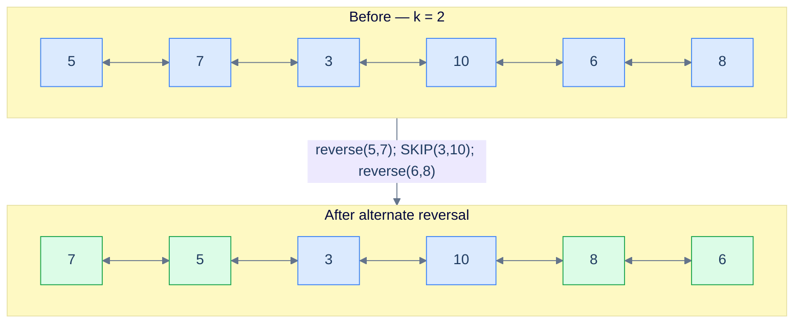
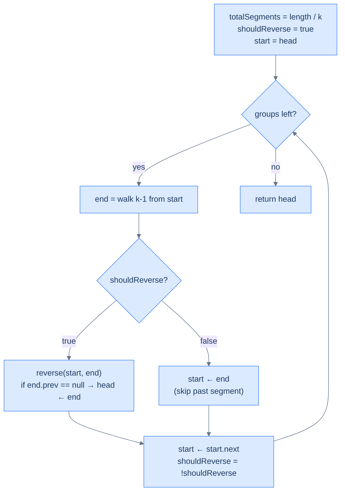

# Reverse alternate segments

## Problem Statement

Given the **head** of a doubly linked list and a positive integer **k**, reverse alternate `k`-node segments — reverse the first segment, **skip** the second, reverse the third, skip the fourth, and so on. Return the head. If the trailing fragment has fewer than `k` nodes, leave it. Both `prev` and `next` chains must remain consistent after every reversed chunk.

```
Input : head = [5, 7, 3, 10, 6, 8], k = 2
Output:        [7, 5, 3, 10, 8, 6]
Explanation: reverse (5,7), skip (3,10), reverse (6,8).

Input : head = [5, 7, 3, 10, 6], k = 3
Output:        [3, 7, 5, 10, 6]
Explanation: reverse (5,7,3); next group would be (10,6,?) — only 2 nodes left,
             which is fewer than k=3, so loop ends. The "skip" never gets a turn.

Input : head = [5, 7, 3, 10, 6], k = 8
Output:        [5, 7, 3, 10, 6]
Explanation: list length 5 < k=8 → no reversal happens.
```

---

## Examples

**Example 1**
```
Input:  head = [5, 7, 3, 10, 6, 8], k = 2
Output: [7, 5, 3, 10, 8, 6]
Explanation: Three chunks of size 2 fit. Reverse chunk 1: (5, 7) → (7, 5); skip chunk 2: (3, 10) stays; reverse chunk 3: (6, 8) → (8, 6). Concatenate to [7, 5, 3, 10, 8, 6] with both chains intact.
```

**Example 2**
```
Input:  head = [5, 7, 3, 10, 6], k = 3
Output: [3, 7, 5, 10, 6]
Explanation: One full chunk of size 3 fits; reverse (5, 7, 3) → (3, 7, 5). The remaining (10, 6) is shorter than k and stays untouched.
```

**Example 3**
```
Input:  head = [5, 7, 3, 10, 6], k = 8
Output: [5, 7, 3, 10, 6]
Explanation: The full list is shorter than k, so no chunk forms and the input is returned unchanged.
```

**Example 4**
```
Input:  head = [1, 2, 3, 4, 5, 6, 7, 8], k = 2
Output: [2, 1, 3, 4, 6, 5, 7, 8]
Explanation: Four chunks of size 2. Reverse chunks 1 and 3 ((1, 2) → (2, 1) and (5, 6) → (6, 5)); skip chunks 2 and 4 ((3, 4) and (7, 8) stay).
```

## Constraints

- `0 ≤ list length ≤ 10⁵`
- `-10⁴ ≤ node.val ≤ 10⁴`
- `1 ≤ k`
- If `k > length`, no reversal happens
- Reverse **in place** — `O(1)` extra space; node values must not be copied or rewritten

```python run viz=linked-list viz-root=head
import ast

class ListNode:
    def __init__(self, val, prev=None, next=None):
        self.val = val
        self.prev = prev
        self.next = next

class Solution:
    def reverse_alternate_segments(self, head, k):
        # Your code goes here — precompute total_segments = length // k,
        # track should_reverse (starts True); on True: reverse and check head;
        # on False: set start = end to skip past the chunk. Toggle each iteration.
        pass

def build_list(values):              # [1, 2, 3] → 1 ⇄ 2 ⇄ 3
    head = tail = None
    for v in values:
        node = ListNode(v, prev=tail)
        if tail is not None:
            tail.next = node
        else:
            head = node
        tail = node
    return head

def print_list(head):                # 1 ⇄ 2 ⇄ 3 → [1, 2, 3]
    out = []
    while head:
        out.append(head.val)
        head = head.next
    print(out)

head = build_list(ast.literal_eval(input()))   # the test case's head
k = int(input())
print_list(Solution().reverse_alternate_segments(head, k))
```

```java run viz=linked-list viz-root=head
import java.util.*;

public class Main {
    static class ListNode {
        int val; ListNode prev, next;
        ListNode(int val) { this.val = val; }
    }

    static class Solution {
        ListNode reverseAlternateSegments(ListNode head, int k) {
            // Your code goes here — precompute totalSegments = length / k,
            // track shouldReverse (starts true); on true: reverse and check head;
            // on false: set start = end to skip past the chunk. Toggle each iteration.
            return null;
        }
    }

    public static void main(String[] args) {
        Scanner sc = new Scanner(System.in);
        ListNode head = buildList(parseIntArray(sc.nextLine()));
        int k = Integer.parseInt(sc.nextLine().trim());
        printList(new Solution().reverseAlternateSegments(head, k));
    }

    static ListNode buildList(int[] values) {      // {1, 2, 3} → 1 ⇄ 2 ⇄ 3
        ListNode head = null, tail = null;
        for (int v : values) {
            ListNode node = new ListNode(v);
            node.prev = tail;
            if (tail != null) tail.next = node;
            else head = node;
            tail = node;
        }
        return head;
    }

    static void printList(ListNode head) {         // 1 ⇄ 2 ⇄ 3 → [1, 2, 3]
        List<Integer> out = new ArrayList<>();
        for (ListNode n = head; n != null; n = n.next) out.add(n.val);
        System.out.println(out);
    }

    // "[1, 2, 3]" → {1, 2, 3} — reads the test case's head
    static int[] parseIntArray(String line) {
        String inner = line.replaceAll("[\\[\\]\\s]", "");
        if (inner.isEmpty()) return new int[0];
        String[] parts = inner.split(",");
        int[] out = new int[parts.length];
        for (int i = 0; i < parts.length; i++) out[i] = Integer.parseInt(parts[i]);
        return out;
    }
}
```

```testcases
{
  "args": [
    { "id": "head", "label": "head", "type": "int[]", "placeholder": "[5, 7, 3, 10, 6, 8]" },
    { "id": "k", "label": "k", "type": "int", "placeholder": "2" }
  ],
  "cases": [
    { "args": { "head": "[5, 7, 3, 10, 6, 8]", "k": "2" }, "expected": "[7, 5, 3, 10, 8, 6]" },
    { "args": { "head": "[5, 7, 3, 10, 6]", "k": "3" }, "expected": "[3, 7, 5, 10, 6]" },
    { "args": { "head": "[5, 7, 3, 10, 6]", "k": "8" }, "expected": "[5, 7, 3, 10, 6]" },
    { "args": { "head": "[1, 2, 3, 4, 5, 6, 7, 8]", "k": "2" }, "expected": "[2, 1, 3, 4, 6, 5, 7, 8]" },
    { "args": { "head": "[1, 2, 3, 4, 5, 6]", "k": "3" }, "expected": "[3, 2, 1, 4, 5, 6]" },
    { "args": { "head": "[1, 2, 3, 4]", "k": "2" }, "expected": "[2, 1, 3, 4]" },
    { "args": { "head": "[]", "k": "2" }, "expected": "[]" },
    { "args": { "head": "[1, 2]", "k": "2" }, "expected": "[2, 1]" }
  ]
}
```

<details>
<summary><h2>Intuition</h2></summary>

The **structural property** is that the rewrite walks fixed-size chunks of `k` but flips only every other one. The list decomposes into `length / k` chunks of size `k`; chunks at even indices (counting from 0) are reversed, chunks at odd indices are skipped. A trailing fragment of `length % k` nodes never enters the loop. The difference from reverse-k-segments is one extra boolean flag in the outer driver — the inner bidirectional reversal primitive is untouched.

The **pointer placement** uses the same boundaries as reverse-k-segments plus a `should_reverse` flag (initially `True`). On `True` iterations the chunk is reversed via the bidirectional helper and the post-hoc `end.prev == None` check promotes the global `head` if this is the first chunk. On `False` iterations no reversal happens — the algorithm sets `start = end` to skip past the entire untouched chunk, then `start = start.next` to land on the next chunk's head. The flag toggles after every iteration, so the pattern reverses, skips, reverses, skips. The reverse-branch advance is just `start = start.next` because `start` (the old chunk head) is now the chunk's tail after reversal; the skip branch needs the extra hop because `start` is still the chunk's head and needs to walk past `end` first.

What **breaks if you reach for a single-pass value-copy**? Reading values into an array, reversing alternate windows, and writing back is `O(n)` time and `O(n)` extra space — it dodges the link-rewrite contract entirely, and on a doubly linked list it cannot enforce the `prev`/`next` consistency that the helper guarantees. Trying to handle the alternation by re-walking the list from `head` every other iteration costs `O(n²)` time. Both shortcuts miss the point: only the outer driver changes between reverse-k-segments and reverse-alternate-segments. The shared `reverse(start, end)` helper carries over without modification; the only structural delta is the conditional reversal step and the asymmetric `start` advance.

</details>
<details>
<summary><h2>What Does "Alternate Segments" Mean?</h2></summary>


Same template as K-segments, plus a boolean flag that flips each iteration. When the flag is `true`, reverse and advance one node (the same `start.next` move as before — because `start` is now the segment tail). When the flag is `false`, **don't** reverse — but still advance `start` past the entire untouched segment, then one more node to land at the next group's head.



<p align="center"><strong>Reverse alternate segments — green = reversed, plain = skipped. The flag toggles every iteration.</strong></p>

</details>
<details>
<summary><h2>Applying the Diagnostic Questions</h2></summary>

Reverse-alternate-segments adds a conditional branch to the chapter pattern. The diagnostic confirms the conditional does not break the pattern's prerequisites.

| Check | Answer for Reverse Alternate Segments |
|---|---|
| **Q1.** Can the problem or solution be broken down into smaller subproblems? | **Yes** — the rewrite decomposes into `length / k` chunks of size `k`. Even-indexed chunks are reversal subproblems; odd-indexed chunks are no-op advance steps. |
| **Q2.** Can any subproblem be solved by reversing a part of the linked list? | **Yes** — every "reverse" chunk is one call to the shared `reverse(start, end)` helper that swaps `prev`/`next` per node and re-stitches the four boundary links; "skip" chunks invoke no helper at all. |
| **Q3.** Does the algorithm only need to walk each node a constant number of times? | **Yes** — `getNodeAtPosition` walks `k − 1` hops per chunk, and reversed chunks add one more `k`-node pass. Skipped chunks add zero extra walks. Overall the list is touched a constant number of times. |
| **Q4.** Is each chunk's boundary computable from local state? | **Yes** — `end` is `start` plus `k`; the `should_reverse` flag toggles after every iteration; `start.prev`/`end.next` are read inside the helper. All state is local and constant-size. |

### Q1 — Why "each segment is reverse-or-skip"?

Mental model: imagine alternating coloured tiles — odd tiles get flipped, even tiles stay. The grid is still defined by the same `length / k` formula; the only new state is "is this an odd or even tile?", tracked by a boolean.

Concrete numbers: `length = 6, k = 2 → 3 segments`. Iter 1: reverse `(5,7)`. Iter 2: skip `(3,10)`. Iter 3: reverse `(6,8)`. Three segments, two reversed, one skipped.

What breaks if the flag isn't toggled: the function reduces to plain `reverseKSegments` (every segment reversed) — wrong output.

### Q2 — Why "skip is a pointer hop"?

Mental model: when we reverse, `start` becomes the segment's *tail*, so `start.next` lands on the next group. When we skip, `start` is still the segment's *head*; we need to walk all the way past `end` ourselves, *then* one more step. That's `start = end.next` (or equivalently, set `start = end` then `start = start.next`).

Concrete numbers: skipping `(3, 10)` with `start = node(3), end = node(10)` → after the skip, `start = node(10).next = node(6)` — the head of the next group.

What breaks if you advance like the reverse case (`start = start.next`) without first moving `start` to `end`: you'd land on the second node of the just-skipped segment instead of past it. The next iteration would slice the list mid-segment and produce garbage.

> *Friction prompt — before reading on:* what's the answer for `head = [1, 2, 3, 4], k = 2` if you toggle the flag wrong (skip first, then reverse)? Predict the output.
>
> Answer: skip `(1, 2)` → list still `[1, 2, 3, 4]`. Reverse `(3, 4)` → `[1, 2, 4, 3]`. Different from "reverse first, skip second" which would give `[2, 1, 3, 4]`. The starting flag value matters — the spec says reverse first.

</details>
<details>
<summary><h2>The Alternating Strategy (Visualised)</h2></summary>




<p align="center"><strong>The Alternating Strategy — the only branch is "reverse vs skip". Both paths end in the same advance-and-toggle.</strong></p>

</details>
<details>
<summary><h2>Solution &amp; Analysis</h2></summary>

### The Solution


```python solution time=O(n) space=O(1)
import ast

class ListNode:
    def __init__(self, val, prev=None, next=None):
        self.val = val
        self.prev = prev
        self.next = next


class Solution:
    def find_length(self, head):
        length = 0
        while head is not None:
            length += 1
            head = head.next
        return length

    def get_node_at_position(self, head, position):
        current = head
        for _ in range(1, position):
            if current is None:
                break
            current = current.next
        return current

    def reverse(self, start, end):
        if start is None or start == end:
            return

        left_bound = start.prev
        right_bound = end.next if end else None
        current = start
        previous = left_bound

        while current != right_bound:
            next_node = current.next
            current.prev, current.next = current.next, current.prev
            previous = current
            current = next_node

        if start:
            start.next = right_bound
        if right_bound:
            right_bound.prev = start

        if end:
            end.prev = left_bound
        if left_bound:
            left_bound.next = end

    def reverse_alternate_segments(self, head, k):

        # If the list is empty, has only one node, or k is 1, no need to
        # reverse segments
        if head is None or head.next is None or k == 1:
            return head

        # Flag to determine whether to reverse the current segment.
        should_reverse = True

        # Start of the current segment to be reversed
        start = head

        # Find the total number of segments in the linked list
        total_segments = self.find_length(head) // k

        # Loop through the list to reverse every k-length segment
        for i in range(total_segments):

            # Get the end node of the current segment
            end = self.get_node_at_position(start, k)

            # Reverse the current segment if the flag is set.
            if should_reverse:

                # Reverse the segment
                self.reverse(start, end)

                # If previous pointer of the end node (which becomes
                # start after the swap) is null, it means we're at the
                # first segment. So, we need to update the head to the
                # new head node
                if end is not None and end.prev is None:
                    head = end

            # Otherwise skip reversing this segment, move start to the
            # end of the segment.
            else:
                start = end

            # Move start to the next segment
            start = start.next

            # Toggle the flag for the next segment
            should_reverse = not should_reverse

        # Return the head of the modified list
        return head


def build_list(values):              # [1, 2, 3] → 1 ⇄ 2 ⇄ 3
    head = tail = None
    for v in values:
        node = ListNode(v, prev=tail)
        if tail is not None:
            tail.next = node
        else:
            head = node
        tail = node
    return head


def print_list(head):                # 1 ⇄ 2 ⇄ 3 → [1, 2, 3]
    out = []
    while head:
        out.append(head.val)
        head = head.next
    print(out)


head = build_list(ast.literal_eval(input()))   # the test case's head
k = int(input())
print_list(Solution().reverse_alternate_segments(head, k))
```

```java solution
import java.util.*;

public class Main {
    static class ListNode {
        int val; ListNode prev, next;
        ListNode(int val) { this.val = val; }
    }

    static class Solution {
        private int findLength(ListNode head) {
            int length = 0;
            while (head != null) {
                length++;
                head = head.next;
            }
            return length;
        }

        private ListNode getNodeAtPosition(ListNode head, int position) {
            ListNode current = head;
            for (int i = 1; i < position; i++) {
                current = current.next;
            }
            return current;
        }

        private void reverse(ListNode start, ListNode end) {
            if (start == null || start == end) {
                return;
            }

            ListNode leftBound = start.prev;
            ListNode rightBound = end.next;
            ListNode current = start;
            ListNode previous = leftBound;

            while (current != rightBound) {
                ListNode next = current.next;

                ListNode temp = current.prev;
                current.prev = current.next;
                current.next = temp;

                previous = current;
                current = next;
            }

            start.next = rightBound;
            if (rightBound != null) {
                rightBound.prev = start;
            }

            end.prev = leftBound;
            if (leftBound != null) {
                leftBound.next = end;
            }
        }

        public ListNode reverseAlternateSegments(ListNode head, int k) {

            // If the list is empty, has only one node, or k is 1, no need to
            // reverse segments
            if (head == null || head.next == null || k == 1) {
                return head;
            }

            // Flag to determine whether to reverse the current segment.
            boolean shouldReverse = true;

            // Start of the current segment to be reversed
            ListNode start = head;

            // Find the total number of segments in the linked list
            int totalSegments = findLength(head) / k;

            // Loop through the list to reverse every k-length segment
            for (int i = 0; i < totalSegments; i++) {

                // Get the end node of the current segment
                ListNode end = getNodeAtPosition(start, k);

                // Reverse the current segment if the flag is set.
                if (shouldReverse) {

                    // Reverse the segment
                    reverse(start, end);

                    // If previous pointer of the end node (which become
                    // start after the swap) is null, it means we're at
                    // the first segment. So, we need to update the head
                    // to the new head node
                    if (end.prev == null) {
                        head = end;
                    }

                }

                // Otherwise skip reversing this segment, move start to the
                // end of the segment.
                else {
                    start = end;
                }

                // Move start to the next segment
                start = start.next;

                // Toggle the flag for the next segment
                shouldReverse = !shouldReverse;
            }

            // Return the head of the modified list
            return head;
        }
    }

    public static void main(String[] args) {
        Scanner sc = new Scanner(System.in);
        ListNode head = buildList(parseIntArray(sc.nextLine()));
        int k = Integer.parseInt(sc.nextLine().trim());
        printList(new Solution().reverseAlternateSegments(head, k));
    }

    static ListNode buildList(int[] values) {      // {1, 2, 3} → 1 ⇄ 2 ⇄ 3
        ListNode head = null, tail = null;
        for (int v : values) {
            ListNode node = new ListNode(v);
            node.prev = tail;
            if (tail != null) tail.next = node;
            else head = node;
            tail = node;
        }
        return head;
    }

    static void printList(ListNode head) {         // 1 ⇄ 2 ⇄ 3 → [1, 2, 3]
        List<Integer> out = new ArrayList<>();
        for (ListNode n = head; n != null; n = n.next) out.add(n.val);
        System.out.println(out);
    }

    // "[1, 2, 3]" → {1, 2, 3} — reads the test case's head
    static int[] parseIntArray(String line) {
        String inner = line.replaceAll("[\\[\\]\\s]", "");
        if (inner.isEmpty()) return new int[0];
        String[] parts = inner.split(",");
        int[] out = new int[parts.length];
        for (int i = 0; i < parts.length; i++) out[i] = Integer.parseInt(parts[i]);
        return out;
    }
}
```


<details>
<summary><strong>Trace — head = [5, 7, 3, 10, 6, 8], k = 2</strong></summary>

```
length = 6, total_segments = 6 / 2 = 3, should_reverse = true, start = node(5)

Iter 1 │ should_reverse = true. end = get_node_at_position(5, 2) = node(7) → reverse(5, 7)
        │ list: 7 → 5 → 3 → 10 → 6 → 8
        │ left_bound is None → head = node(7)
        │ left_bound = start (node 5); start ← left_bound.next = node(3);  should_reverse = false

Iter 2 │ should_reverse = false. end = get_node_at_position(3, 2) = node(10) → SKIP
        │ left_bound = end (node 10); start ← left_bound.next = node(6)
        │ list unchanged. should_reverse = true

Iter 3 │ should_reverse = true. end = get_node_at_position(6, 2) = node(8) → reverse(6, 8)
        │ list: 7 → 5 → 3 → 10 → 8 → 6
        │ left_bound = node(10) → left_bound.next = node(8)
        │ left_bound = start (node 6); start ← left_bound.next = null;  should_reverse = false

Result: [7, 5, 3, 10, 8, 6] ✓
```

This trace highlights the key asymmetry in how `left_bound` advances: on a reversed segment, `start` becomes the tail, so `left_bound = start` then `start = left_bound.next` steps to the next segment. On a skipped segment, no reversal happens, so `left_bound = end` and `start = left_bound.next` jumps straight past the untouched run.

</details>

### Complexity Analysis

| Resource | Cost | Why |
|---|---|---|
| Time | **O(N)** | One length scan + each node touched at most twice (once by walker, once by reverse) |
| Space | **O(1)** | Constant working set |

### Edge Cases

| Case | Example | Expected | Reasoning |
|---|---|---|---|
| `k == 1` | `[1, 2, 3], k=1` | `[1, 2, 3]` | Each "group" is one node; reverse-or-skip is identical for both |
| `k > length` | `[1,2,3,4,5], k=8` | unchanged | `total = 0`; loop doesn't run |
| Length not multiple of `k` | `[5,7,3,10,6], k=3` | `[3,7,5,10,6]` | One reversal, then `length` runs out before the skip can fire |
| Even number of segments | `[1,2,3,4], k=2` | `[2,1,3,4]` | reverse, skip — final list has the second pair untouched |
| Odd number of segments | `[1,2,3,4,5,6], k=2` | `[2,1,3,4,6,5]` | reverse, skip, reverse — flag finishes at `false` |

</details>
<details>
<summary><h2>Key Takeaway</h2></summary>


The reversal-subproblem family looks intimidating from the outside — pairwise swap, k-segment reversal, increasing groups, alternate segments — and beginners write a different bespoke loop for each one. Don't. **They are the same algorithm with one knob turned.** Find the length, decide the window (`k = 2`, fixed `k`, growing `k`, or alternating `k`-with-skip), and call `reverse(start, end)` in a loop. Track the new head with the `end.prev == null` trick. That's it. The hardest part isn't the code — it's *seeing the windowing pattern*. Once you see it, dozens of "medium" linked-list problems collapse into a half-page solution you can write from memory.

> **Transfer challenge:** given a doubly linked list and an integer `m`, reverse every block of size `2m`, but **only the second half of each block** (so the first `m` nodes of each `2m`-block stay put, the next `m` nodes get reversed). Return the new head. Stop reversing once fewer than `2m` nodes remain.
>
> <details>
> <summary><strong>Hint</strong></summary>
>
> It's the alternate-segments problem in disguise. Set the effective window size to `m` and start with `shouldReverse = false` (skip the first `m`, reverse the next `m`, repeat). The "skip first half" branch advances `start = end; start = start.next` exactly like the alternate-segments skip path. The reversed-half branch does the usual `reverse(start, end)` + head check — except the head can never change here because every reversed segment lives strictly to the right of an un-reversed one.
>
> </details>

Next time you see a linked-list problem whose statement contains the words "groups", "segments", "alternate", "every other", or "in pairs" — you won't reach for a bespoke loop. You'll reach for **scan, window, reverse, advance**, and you'll know which one of these four templates fits before you've finished reading the problem.

</details>
<details>
<summary><h2>Approach</h2></summary>

Seven numbered steps. No code; the solution block above is the implementation.

1. **Guard the trivial cases.** If `head` is `None`, the list has only one node, or `k == 1`, no alternation can change anything. Return `head` unchanged.
2. **Precompute the chunk count.** Find `length` and set `total_segments = length // k`. Any trailing fragment of `length % k` nodes is implicitly skipped because the outer loop runs exactly `total_segments` times.
3. **Initialise the boundary pointer and the toggle.** Set `start = head` and `should_reverse = True`. The first chunk is a "reverse" chunk; the flag flips after every iteration. The `reverse` helper reads `start.prev` directly, so there is no separate `leftBound` cache.
4. **Drive the outer loop `total_segments` times.** Each iteration computes `end = getNodeAtPosition(start, k)` and then branches on `should_reverse`.
5. **Reverse branch (`should_reverse = True`).** Call `reverse(start, end)` to swap `prev`/`next` on every node in `[start, end]` and bidirectionally stitch the four boundary links. Check `end.prev == None`; if true, the predecessor was `None` and this is the first chunk — update `head = end`.
6. **Skip branch (`should_reverse = False`).** No reversal call. Advance `start` to `end` so the next step's `start = start.next` lands on the next chunk's head instead of the second node of the current (untouched) chunk.
7. **Advance and toggle.** Set `start = start.next` (works for both branches: after a reverse, the old `start` is the chunk's tail; after a skip, `start = end` set in step 6 is the chunk's tail). Toggle `should_reverse = not should_reverse` for the next iteration.

</details>
<details>
<summary><h2>Dry Run — Example 1</h2></summary>

`head = [5, 7, 3, 10, 6, 8]`, `k = 2`. Precompute `length = 6`, `total_segments = 6 // 2 = 3`. Initial state: `start = 5`, `should_reverse = True`.

**Iteration 1 — chunk `(5, 7)`, `should_reverse = True`:**

| step | state |
|---|---|
| `end = getNodeAtPosition(start, 2)` | `end = 7` |
| `reverse(5, 7)` | `leftBound = 5.prev = None`, `rightBound = 7.next = 3`. Swap `prev`/`next` on nodes 5 and 7; stitch `5.next = 3`, `3.prev = 5`, `7.prev = None`, no `leftBound.next` write. List now `7 ↔ 5 ↔ 3 ↔ 10 ↔ 6 ↔ 8`. |
| `end.prev is None` → promote head | `head = 7` |
| `start = start.next` | `start = 3` (old `start` node 5 is now the chunk's tail) |
| toggle | `should_reverse = False` |

List after iteration 1: `7 ↔ 5 ↔ 3 ↔ 10 ↔ 6 ↔ 8`.

**Iteration 2 — chunk `(3, 10)`, `should_reverse = False`:**

| step | state |
|---|---|
| `end = getNodeAtPosition(start, 2)` | `end = 10` |
| skip branch | no reversal; `start = end = 10` (skip past the chunk) |
| `start = start.next` | `start = 6` |
| toggle | `should_reverse = True` |

List after iteration 2: `7 ↔ 5 ↔ 3 ↔ 10 ↔ 6 ↔ 8` (unchanged — the chunk was skipped; both chains untouched).

**Iteration 3 — chunk `(6, 8)`, `should_reverse = True`:**

| step | state |
|---|---|
| `end = getNodeAtPosition(start, 2)` | `end = 8` |
| `reverse(6, 8)` | `leftBound = 6.prev = 10`, `rightBound = 8.next = None`. Swap `prev`/`next` on nodes 6 and 8; stitch `6.next = None`, `8.prev = 10`, `10.next = 8`. List now `7 ↔ 5 ↔ 3 ↔ 10 ↔ 8 ↔ 6`. |
| `end.prev is not None` (`8.prev = 10`) → head unchanged | `head = 7` |
| `start = start.next` | `start = None` |
| toggle | `should_reverse = False` |

List after iteration 3: `7 ↔ 5 ↔ 3 ↔ 10 ↔ 8 ↔ 6`.

**Loop ends** (`total_segments = 3` iterations completed).

**Return:** `head = 7`, forward traversal yields `[7, 5, 3, 10, 8, 6]` ✓. The reverse-direction traversal from node 6 confirms both chains are consistent.

</details>
<details>
<summary><h2>Key Takeaway</h2></summary>

Reverse-alternate-segments on a doubly linked list is reverse-k-segments with a toggling `should_reverse` flag — on `True` iterations the chunk is reversed via the bidirectional helper; on `False` iterations the algorithm sets `start = end` to skip past the untouched run, then advances `start = start.next` in both branches. The asymmetric advance (one extra hop in the skip branch) is the only structural delta from the fixed-`k` driver.

</details>
