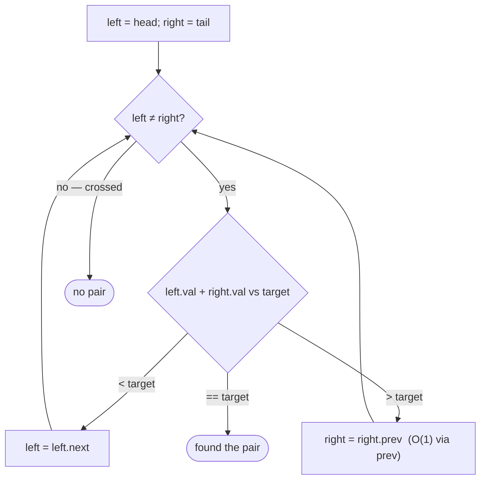

# Pattern: Two Pointers

## Why It Exists

The converging two-pointer scan — one pointer from the front, one from the back, both walking inward — is a workhorse on arrays: "find two sorted values that sum to a target," "is this a palindrome?" The natural question is whether a linked list can do the same.

A **singly** list can't, not efficiently. The right pointer has to move *leftward*, but a singly node has no link back — to step `right` one position left you'd re-walk from the head to find its predecessor, turning each step into `O(n)` and the whole scan into `O(n²)`. A **doubly** list removes exactly that obstacle: every node carries a `prev` pointer, so `right = right.prev` is a single `O(1)` hop. The pattern that's impractical on a singly list is natural here — it's the clearest payoff of the backward pointer.

## See It Work

On a **sorted** doubly list `1 ⇄ 2 ⇄ 4 ⇄ 7 ⇄ 11 ⇄ 15`, find two values that sum to `15`. Start wide (head + tail) and squeeze inward. Run it, then **Visualise** the two pointers converge.

> ▶ Run it, then click **Visualise** — `left` starts at the head, `right` at the tail; too-small a sum advances `left`, too-large retreats `right` (one `prev` hop).

```python run viz=linked-list viz-root=head viz-kind=list-double
import ast

class ListNode:
    def __init__(self, val, prev=None, next=None):
        self.val = val
        self.prev = prev
        self.next = next

def build_list(values):              # [1, 2, 3] → 1 ⇄ 2 ⇄ 3
    head = tail = None
    for v in values:
        node = ListNode(v, prev=tail)
        if tail is not None:
            tail.next = node
        else:
            head = node
        tail = node
    return head

def print_list(head):                # 1 ⇄ 2 ⇄ 3 → [1, 2, 3]
    out = []
    while head:
        out.append(head.val)
        head = head.next
    print(out)

head = build_list(ast.literal_eval(input()))   # the test case's values

left = head
right = head
while right.next:                    # find the tail
    right = right.next
target = int(input())

answer = None
while left is not right:
    s = left.val + right.val
    if s == target:
        answer = [left.val, right.val]; break
    elif s < target:
        left = left.next             # need a bigger sum → move left rightward
    else:
        right = right.prev           # need a smaller sum → move right leftward (O(1))
print(answer)
```

```java run viz=linked-list viz-root=head viz-kind=list-double
import java.util.*;

public class Main {
  static class ListNode {
    int val; ListNode prev, next;
    ListNode(int val) { this.val = val; }
  }

  public static void main(String[] args) {
    Scanner sc = new Scanner(System.in);
    ListNode head = buildList(parseIntArray(sc.nextLine()));
    int target = Integer.parseInt(sc.nextLine().trim());

    ListNode left = head, right = head;
    while (right.next != null) right = right.next;   // find the tail

    List<Integer> answer = null;
    while (left != right) {
      int s = left.val + right.val;
      if (s == target) {
        answer = Arrays.asList(left.val, right.val); break;
      } else if (s < target) {
        left = left.next;                            // need a bigger sum
      } else {
        right = right.prev;                          // need a smaller sum (O(1))
      }
    }
    System.out.println(answer);
  }

  static ListNode buildList(int[] values) {      // {1, 2, 3} → 1 ⇄ 2 ⇄ 3
    ListNode head = null, tail = null;
    for (int v : values) {
      ListNode node = new ListNode(v);
      node.prev = tail;
      if (tail != null) tail.next = node;
      else head = node;
      tail = node;
    }
    return head;
  }

  static void printList(ListNode head) {         // 1 ⇄ 2 ⇄ 3 → [1, 2, 3]
    List<Integer> out = new ArrayList<>();
    for (ListNode n = head; n != null; n = n.next) out.add(n.val);
    System.out.println(out);
  }

  // "[1, 2, 3]" → {1, 2, 3} — reads the test case's values
  static int[] parseIntArray(String line) {
    String inner = line.replaceAll("[\\[\\]\\s]", "");
    if (inner.isEmpty()) return new int[0];
    String[] parts = inner.split(",");
    int[] out = new int[parts.length];
    for (int i = 0; i < parts.length; i++) out[i] = Integer.parseInt(parts[i]);
    return out;
  }
}
```

```testcases
{
  "args": [
    { "id": "values", "label": "values", "type": "int[]", "placeholder": "[1, 2, 4, 7, 11, 15]" },
    { "id": "target", "label": "target", "type": "int", "placeholder": "15" }
  ],
  "cases": [
    { "args": { "values": "[1, 2, 4, 7, 11, 15]", "target": "15" }, "expected": "[4, 11]" },
    { "args": { "values": "[1, 2, 4, 7, 11, 15]", "target": "3" }, "expected": "[1, 2]" },
    { "args": { "values": "[1, 2, 4, 7, 11, 15]", "target": "26" }, "expected": "[11, 15]" },
    { "args": { "values": "[1, 3, 5, 7]", "target": "8" }, "expected": "[1, 7]" }
  ]
}
```

## How It Works

`left` starts at the head, `right` at the tail. The list is **sorted**, so the sum `left.val + right.val` reacts predictably to each move: advancing `left` (`left.next`) can only *raise* the sum; retreating `right` (`right.prev`) can only *lower* it. So:

- `sum < target` → the sum is too small → `left = left.next`.
- `sum > target` → too large → `right = right.prev`.
- `sum == target` → found.

Each step eliminates one value that can't be part of any solution, and the pointers march toward each other until they meet.



<p align="center"><strong>converge from both ends: compare the sum to the target, advance <code>left</code> if too small, retreat <code>right</code> if too large, stop when they meet or match.</strong></p>

The entire scan is **`O(n)` time, `O(1)` space** — but only because `right.prev` is `O(1)`. That single fact is the whole reason this pattern lives in the doubly-list chapter and not the singly one. (It also needs the **tail**; a doubly list that tracks its tail hands you the right pointer's start for free.)

### Key Takeaway

Converge `left` from the head and `right` from the tail on a sorted doubly list: too-small a sum advances `left`, too-large retreats `right` (`prev`), a match wins. `O(n)` time, `O(1)` space — and it's the `O(1)` backward `prev` step that makes the scan possible at all.

## Trace It

Target `15` on `1 ⇄ 2 ⇄ 4 ⇄ 7 ⇄ 11 ⇄ 15`:

| `left` | `right` | sum | vs 15 | move |
|---|---|---|---|---|
| `1` | `15` | 16 | `>` | `right = 11` |
| `1` | `11` | 12 | `<` | `left = 2` |
| `2` | `11` | 13 | `<` | `left = 4` |
| `4` | `11` | 15 | `=` | **found (4, 11)** |

Before you read on: at the very first step the sum `16` was too big, so we moved `right` from `15` to `11` via `right.prev`. On a *singly* list, how expensive would that one backward step have been — and what would it do to the whole scan?

On a singly list there's no `prev`, so finding the node before `15` means walking from the head again — `O(n)` for that *single* step. Do that on every "retreat right," and the `O(n)` scan balloons to `O(n²)`, erasing the advantage over just checking all pairs. The doubly list's `prev` makes the retreat `O(1)`, which is the only reason the converging scan stays linear. Same algorithm as the array version — it just needed the backward pointer to be viable on a list.

## Your Turn

The reusable sorted two-sum on a doubly list — `two_sum(head, target)` returns the first matching pair as a list, or `None` / `null` if none exists:

```python run viz=linked-list viz-root=head viz-kind=list-double
import ast

class ListNode:
    def __init__(self, val, prev=None, next=None):
        self.val = val
        self.prev = prev
        self.next = next

def two_sum(head, target):
    # Your code goes here — find the tail, then converge left from head
    # and right from tail: advance left if sum < target, retreat right if
    # sum > target, return [left.val, right.val] on a match.
    pass

def build_list(values):              # [1, 2, 3] → 1 ⇄ 2 ⇄ 3
    head = tail = None
    for v in values:
        node = ListNode(v, prev=tail)
        if tail is not None:
            tail.next = node
        else:
            head = node
        tail = node
    return head

def print_list(head):                # 1 ⇄ 2 ⇄ 3 → [1, 2, 3]
    out = []
    while head:
        out.append(head.val)
        head = head.next
    print(out)

head = build_list(ast.literal_eval(input()))   # the test case's values
target = int(input())
print(two_sum(head, target))
```

```java run viz=linked-list viz-root=head viz-kind=list-double
import java.util.*;

public class Main {
  static class ListNode {
    int val; ListNode prev, next;
    ListNode(int val) { this.val = val; }
  }

  static List<Integer> twoSum(ListNode head, int target) {
    // Your code goes here — find the tail, then converge left from head
    // and right from tail: advance left if sum < target, retreat right if
    // sum > target, return Arrays.asList(left.val, right.val) on a match.
    return null;
  }

  public static void main(String[] args) {
    Scanner sc = new Scanner(System.in);
    ListNode head = buildList(parseIntArray(sc.nextLine()));
    int target = Integer.parseInt(sc.nextLine().trim());
    List<Integer> result = twoSum(head, target);
    System.out.println(result == null ? "None" : result);
  }

  static ListNode buildList(int[] values) {      // {1, 2, 3} → 1 ⇄ 2 ⇄ 3
    ListNode head = null, tail = null;
    for (int v : values) {
      ListNode node = new ListNode(v);
      node.prev = tail;
      if (tail != null) tail.next = node;
      else head = node;
      tail = node;
    }
    return head;
  }

  static void printList(ListNode head) {         // 1 ⇄ 2 ⇄ 3 → [1, 2, 3]
    List<Integer> out = new ArrayList<>();
    for (ListNode n = head; n != null; n = n.next) out.add(n.val);
    System.out.println(out);
  }

  // "[1, 2, 3]" → {1, 2, 3} — reads the test case's values
  static int[] parseIntArray(String line) {
    String inner = line.replaceAll("[\\[\\]\\s]", "");
    if (inner.isEmpty()) return new int[0];
    String[] parts = inner.split(",");
    int[] out = new int[parts.length];
    for (int i = 0; i < parts.length; i++) out[i] = Integer.parseInt(parts[i]);
    return out;
  }
}
```

```testcases
{
  "args": [
    { "id": "values", "label": "values", "type": "int[]", "placeholder": "[1, 2, 4, 7, 11, 15]" },
    { "id": "target", "label": "target", "type": "int", "placeholder": "15" }
  ],
  "cases": [
    { "args": { "values": "[1, 2, 4, 7, 11, 15]", "target": "15" }, "expected": "[4, 11]" },
    { "args": { "values": "[1, 2, 4, 7, 11, 15]", "target": "3" }, "expected": "[1, 2]" },
    { "args": { "values": "[1, 2, 4, 7, 11, 15]", "target": "26" }, "expected": "[11, 15]" },
    { "args": { "values": "[1, 3, 5, 7]", "target": "8" }, "expected": "[1, 7]" },
    { "args": { "values": "[1, 3, 5, 7]", "target": "100" }, "expected": "None" }
  ]
}
```

<details>
<summary>Editorial</summary>

Find the tail first (one forward walk), then place `left` at the head and `right` at the tail and converge: a too-small sum advances `left` rightward; a too-large sum retreats `right` leftward via the `O(1)` `prev` step. When the sum matches the target, return the pair immediately. If the pointers meet without a match, no such pair exists — return `None` / `null`.

```python solution time=O(n) space=O(1)
import ast

class ListNode:
    def __init__(self, val, prev=None, next=None):
        self.val = val
        self.prev = prev
        self.next = next

def two_sum(head, target):
    left = head
    right = head
    while right.next:                # find the tail
        right = right.next
    while left is not right:
        s = left.val + right.val
        if s == target:
            return [left.val, right.val]
        elif s < target:
            left = left.next
        else:
            right = right.prev       # O(1) backward step
    return None

def build_list(values):              # [1, 2, 3] → 1 ⇄ 2 ⇄ 3
    head = tail = None
    for v in values:
        node = ListNode(v, prev=tail)
        if tail is not None:
            tail.next = node
        else:
            head = node
        tail = node
    return head

def print_list(head):                # 1 ⇄ 2 ⇄ 3 → [1, 2, 3]
    out = []
    while head:
        out.append(head.val)
        head = head.next
    print(out)

head = build_list(ast.literal_eval(input()))   # the test case's values
target = int(input())
print(two_sum(head, target))
```

```java solution
import java.util.*;

public class Main {
  static class ListNode {
    int val; ListNode prev, next;
    ListNode(int val) { this.val = val; }
  }

  static List<Integer> twoSum(ListNode head, int target) {
    ListNode left = head, right = head;
    while (right.next != null) right = right.next;   // find the tail
    while (left != right) {
      int s = left.val + right.val;
      if (s == target) return Arrays.asList(left.val, right.val);
      else if (s < target) left = left.next;
      else right = right.prev;                       // O(1) backward step
    }
    return null;
  }

  public static void main(String[] args) {
    Scanner sc = new Scanner(System.in);
    ListNode head = buildList(parseIntArray(sc.nextLine()));
    int target = Integer.parseInt(sc.nextLine().trim());
    List<Integer> result = twoSum(head, target);
    System.out.println(result == null ? "None" : result);
  }

  static ListNode buildList(int[] values) {      // {1, 2, 3} → 1 ⇄ 2 ⇄ 3
    ListNode head = null, tail = null;
    for (int v : values) {
      ListNode node = new ListNode(v);
      node.prev = tail;
      if (tail != null) tail.next = node;
      else head = node;
      tail = node;
    }
    return head;
  }

  static void printList(ListNode head) {         // 1 ⇄ 2 ⇄ 3 → [1, 2, 3]
    List<Integer> out = new ArrayList<>();
    for (ListNode n = head; n != null; n = n.next) out.add(n.val);
    System.out.println(out);
  }

  // "[1, 2, 3]" → {1, 2, 3} — reads the test case's values
  static int[] parseIntArray(String line) {
    String inner = line.replaceAll("[\\[\\]\\s]", "");
    if (inner.isEmpty()) return new int[0];
    String[] parts = inner.split(",");
    int[] out = new int[parts.length];
    for (int i = 0; i < parts.length; i++) out[i] = Integer.parseInt(parts[i]);
    return out;
  }
}
```

</details>

## Reflect & Connect

Drill the family in **Practice** — [Palindrome Number](/cortex/data-structures-and-algorithms/linear-structures/doubly-linked-list/pattern-two-pointers/problems/palindrome-number), [Two Sum](/cortex/data-structures-and-algorithms/linear-structures/doubly-linked-list/pattern-two-pointers/problems/two-sum), [Duplicate-Aware Two Sum](/cortex/data-structures-and-algorithms/linear-structures/doubly-linked-list/pattern-two-pointers/problems/duplicate-aware-two-sum), and [Approximate Three Sum](/cortex/data-structures-and-algorithms/linear-structures/doubly-linked-list/pattern-two-pointers/problems/approximate-three-sum).

The converging scan transfers directly once you have `O(1)` backward movement:

- **The family** — sorted two-sum (above), **palindrome check** (compare `left.val` and `right.val`, step inward), **three-sum** (fix one node, converge the other two over the rest). All are "squeeze from both ends."
- **The `prev` pointer is the enabler** — this is the canonical demonstration of *why* a doubly list exists: it makes backward traversal `O(1)`, which turns an `O(n²)`-on-a-singly-list scan into `O(n)`. When you see "two values from both ends of a sorted sequence," reach for converging pointers.
- **Where each structure stands** — arrays give `O(1)` movement in *both* directions (indices), so they're the most natural home for this pattern; a doubly list matches them for traversal here; a singly list is the odd one out. Same idea from the [array two-pointers](/cortex/data-structures-and-algorithms/linear-structures/arrays/pattern-two-pointers/pattern) pattern, now on links.

**Prerequisites:** [Doubly Linked Lists](/cortex/data-structures-and-algorithms/linear-structures/doubly-linked-list/doubly-linked-lists).
**What's next:** restructure a doubly list by weaving from both ends — [Reorder](/cortex/data-structures-and-algorithms/linear-structures/doubly-linked-list/pattern-reorder/pattern).

## Recall

> **Mnemonic:** *`left` from head, `right` from tail, squeeze inward. Sum too small → `left.next`; too big → `right.prev`. The `O(1)` `prev` hop is what makes it work.*

| | |
|---|---|
| Setup | `left = head`, `right = tail` (sorted list) |
| Too small | `left = left.next` (raise the sum) |
| Too large | `right = right.prev` (lower the sum) — `O(1)` only with `prev` |
| Stop | values match, or pointers meet |
| Cost | `O(n)` time, `O(1)` space |

<details>
<summary><strong>Q:</strong> Why can't a singly list run the converging two-pointer scan efficiently?</summary>

**A:** Moving `right` leftward needs its predecessor, which costs `O(n)` per step without a `prev` pointer — the scan degrades to `O(n²)`.

</details>
<details>
<summary><strong>Q:</strong> On a sorted list, why is moving one pointer always the right call?</summary>

**A:** Advancing `left` only raises the sum and retreating `right` only lowers it, so each move discards a value that can't be in any solution.

</details>
<details>
<summary><strong>Q:</strong> What two things does the pattern require from the list?</summary>

**A:** Access to the tail (the right pointer's start) and `O(1)` backward movement (`prev`).

</details>
<details>
<summary><strong>Q:</strong> How does three-sum build on this?</summary>

**A:** Fix one node, then converge two pointers over the remaining sorted values.

</details>

## Sources & Verify

- **CLRS**, *Introduction to Algorithms*, 4th ed., §10.2 — doubly linked lists and bidirectional traversal.
- **Sedgewick & Wayne**, *Algorithms*, 4th ed., §1.3 — linked structures; the two-pointer technique on ordered data.
- The sorted two-sum / converging-pointer scan is standard; both runnable blocks are verified by running (output `[4, 11]` for the default case).
