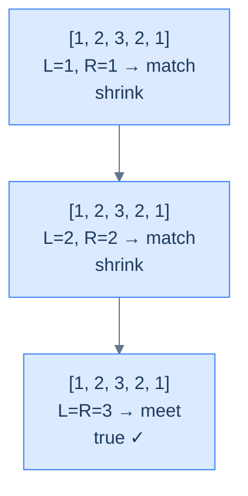

# Palindrome Number

## Problem Statement

Given the **head** of a doubly linked list, return `true` if the list reads the same forwards and backwards, `false` otherwise.

## Examples

**Example 1**
```
Input:  head = [1, 2, 3, 2, 1]
Output: true
Explanation: Reads identically forwards and backwards — the outer 1s match, the inner 2s match, the middle 3 is its own mirror.
```

**Example 2**
```
Input:  head = [6, 6, 6]
Output: true
Explanation: Every value is identical, so every mirror pair trivially matches.
```

**Example 3**
```
Input:  head = [1, 2, 3, 4, 5]
Output: false
Explanation: The outermost pair (1, 5) already disagrees — the algorithm returns false on the very first comparison.
```

**Example 4**
```
Input:  head = [1, 2, 2, 1]
Output: true
Explanation: Even-length palindrome — the pointers never land on the same node; they cross past each other after the inner (2, 2) match passes.
```

## Constraints

- `0 ≤ list length ≤ 10⁵`
- `-10⁴ ≤ node.val ≤ 10⁴`

```python run viz=linked-list viz-root=head
import ast

class ListNode:
    def __init__(self, val, prev=None, next=None):
        self.val = val
        self.prev = prev
        self.next = next

class Solution:
    def palindrome_number(self, head):
        # Your code goes here — find the tail, then place left at head and
        # right at tail; compare values and step inward; return True if all
        # mirror pairs match, False on the first mismatch.
        pass

def build_list(values):              # [1, 2, 3] → 1 ⇄ 2 ⇄ 3
    head = tail = None
    for v in values:
        node = ListNode(v, prev=tail)
        if tail is not None:
            tail.next = node
        else:
            head = node
        tail = node
    return head

def print_list(head):                # 1 ⇄ 2 ⇄ 3 → [1, 2, 3]
    out = []
    while head:
        out.append(head.val)
        head = head.next
    print(out)

head = build_list(ast.literal_eval(input()))   # the test case's head
result = Solution().palindrome_number(head)
print("true" if result else "false")
```

```java run viz=linked-list viz-root=head
import java.util.*;

public class Main {
    static class ListNode {
        int val; ListNode prev, next;
        ListNode(int val) { this.val = val; }
    }

    static class Solution {
        public boolean palindromeNumber(ListNode head) {
            // Your code goes here — find the tail, then place left at head and
            // right at tail; compare values and step inward; return true if all
            // mirror pairs match, false on the first mismatch.
            return false;
        }
    }

    public static void main(String[] args) {
        Scanner sc = new Scanner(System.in);
        ListNode head = buildList(parseIntArray(sc.nextLine()));
        System.out.println(new Solution().palindromeNumber(head));
    }

    static ListNode buildList(int[] values) {      // {1, 2, 3} → 1 ⇄ 2 ⇄ 3
        ListNode head = null, tail = null;
        for (int v : values) {
            ListNode node = new ListNode(v);
            node.prev = tail;
            if (tail != null) tail.next = node;
            else head = node;
            tail = node;
        }
        return head;
    }

    static void printList(ListNode head) {         // 1 ⇄ 2 ⇄ 3 → [1, 2, 3]
        List<Integer> out = new ArrayList<>();
        for (ListNode n = head; n != null; n = n.next) out.add(n.val);
        System.out.println(out);
    }

    static int[] parseIntArray(String line) {
        String inner = line.replaceAll("[\\[\\]\\s]", "");
        if (inner.isEmpty()) return new int[0];
        String[] parts = inner.split(",");
        int[] out = new int[parts.length];
        for (int i = 0; i < parts.length; i++) out[i] = Integer.parseInt(parts[i]);
        return out;
    }
}
```

```testcases
{
  "args": [
    { "id": "head", "label": "head", "type": "int[]", "placeholder": "[1, 2, 3, 2, 1]" }
  ],
  "cases": [
    { "args": { "head": "[1, 2, 3, 2, 1]" }, "expected": "true" },
    { "args": { "head": "[6, 6, 6]" }, "expected": "true" },
    { "args": { "head": "[1, 2, 3, 4, 5]" }, "expected": "false" },
    { "args": { "head": "[1, 2, 2, 1]" }, "expected": "true" },
    { "args": { "head": "[5]" }, "expected": "true" },
    { "args": { "head": "[1, 2]" }, "expected": "false" },
    { "args": { "head": "[1, 2, 1]" }, "expected": "true" },
    { "args": { "head": "[9, 9, 9, 9]" }, "expected": "true" }
  ]
}
```

<details>
<summary><h2>Intuition</h2></summary>


The **structural property** that makes this a two-pointer problem is that a palindrome is defined by *mirror equality* across the centre of the list. Position `i` from the head must equal position `i` from the tail for every valid `i`. A DLL gives both ends in `O(1)` (the caller already passes `head` and `tail`) and a backward step from the tail in `O(1)` via `tail.prev`. The work splits naturally into `n / 2` independent comparisons — exactly the shape a converging two-pointer pass eats for breakfast.

The **pointer placement** is `left = head`, `right = tail`. Each iteration reads the pair `(left.val, right.val)` and decides: if they disagree, the list cannot be a palindrome and we return early; if they match, the inner sub-list `(left.next, right.prev)` must also be a palindrome, so step both pointers inward and continue. The loop terminates when `left == right` (odd-length list, pointers meet on the middle node) or when `left.prev == right` (even-length list, pointers have just crossed). Both termination conditions mean every required pair has been checked.

What **breaks if you reach for the naive approach**? Copying the list into an array and comparing `arr[i]` with `arr[n - 1 - i]` works in `O(n)` time but pays `O(n)` extra space for the copy. Reversing a clone of the list and walking both in parallel hits the same `O(n)` space cost. The two-pointer pass keeps the space at `O(1)` and gains an early-exit on the first mismatch — a list like `[1, 2, 3, 4, 5]` rejects after one comparison, not five.

</details>
<details>
<summary><h2>Applying the Diagnostic Questions</h2></summary>


| Check | Answer for Palindrome Number |
|---|---|
| **Q1.** Are two nodes inspected at the same time, one from each end? | **Yes** — every iteration reads `left.val` and `right.val` together and checks equality. |
| **Q2.** Does one pointer start near `head` and the other near `tail`? | **Yes** — `left = head` and `right = tail` are the initial positions. |
| **Q3.** Do both pointers move strictly inward? | **Yes** — on a match, `left = left.next` and `right = right.prev`; neither pointer ever reverses. |
| **Q4.** Is the per-step work `O(1)`? | **Yes** — one value comparison and two pointer steps per iteration; no inner scan. |

</details>
<details>
<summary><h2>Approach</h2></summary>


Run the converging two-pointer loop until the pointers meet or cross.

1. **Handle the trivial guards.** If `head` is `null` or `head == tail` (empty or single-node list), return `true` — both are vacuously palindromic.
2. **Initialise the pointers.** Set `left = head` and `right = tail`. These will walk inward in lockstep.
3. **Loop until the pointers meet or cross.** Continue while `left != right` (odd-length not yet collided) **and** `left.prev != right` (even-length not yet crossed). The pair guard catches both parities.
4. **Compare the current pair.** If `left.val != right.val`, the list cannot be a palindrome — return `false` immediately.
5. **Step both pointers inward.** Set `left = left.next` and `right = right.prev`. The unprocessed span has shrunk by one node on each side.
6. **Return `true` when the loop exits.** Every pair matched, so the list reads the same forwards and backwards.

</details>
<details>
<summary><h2>The Mirror Strategy (Visualised)</h2></summary>


Plant `left` at the start, `right` at the end. At each step, compare the two values; if they ever differ, return `false`. Otherwise step inward and keep going until the pointers meet (odd length) or cross (even length).



<p align="center"><strong>Palindrome check — mirror comparison from both ends until pointers meet or cross.</strong></p>

</details>
<details>
<summary><h2>Solution &amp; Analysis</h2></summary>

### Solution

```python solution time=O(n) space=O(1)
import ast

class ListNode:
    def __init__(self, val, prev=None, next=None):
        self.val = val
        self.prev = prev
        self.next = next

class Solution:
    def palindrome_number(self, head):

        # Find the tail
        tail = head
        while tail and tail.next:
            tail = tail.next

        # Empty list or single element is a palindrome
        if not head or head == tail:
            return True

        left = head
        right = tail

        while left and right and left != right and left.prev != right:

            # If values don't match, its not a palindrome
            if left.val != right.val:
                return False

            # Move the left pointer to the right
            left = left.next

            # Move the right pointer to the left
            right = right.prev

        # If all values matched, it's a palindrome
        return True

def build_list(values):              # [1, 2, 3] → 1 ⇄ 2 ⇄ 3
    head = tail = None
    for v in values:
        node = ListNode(v, prev=tail)
        if tail is not None:
            tail.next = node
        else:
            head = node
        tail = node
    return head

def print_list(head):                # 1 ⇄ 2 ⇄ 3 → [1, 2, 3]
    out = []
    while head:
        out.append(head.val)
        head = head.next
    print(out)

head = build_list(ast.literal_eval(input()))   # the test case's head
result = Solution().palindrome_number(head)
print("true" if result else "false")
```

```java solution
import java.util.*;

public class Main {
    static class ListNode {
        int val; ListNode prev, next;
        ListNode(int val) { this.val = val; }
    }

    static class Solution {
        public boolean palindromeNumber(ListNode head) {

            // Find the tail
            ListNode tail = head;
            while (tail != null && tail.next != null) tail = tail.next;

            // Empty list or single element is a palindrome
            if (head == null || head == tail) {
                return true;
            }

            ListNode left = head;
            ListNode right = tail;

            while (
                left != null &&
                right != null &&
                left != right &&
                left.prev != right
            ) {

                // If values don't match, its not a palindrome
                if (left.val != right.val) {
                    return false;
                }

                // Move the left pointer to the right
                left = left.next;

                // Move the right pointer to the left
                right = right.prev;
            }

            // If all values matched, it's a palindrome
            return true;
        }
    }

    public static void main(String[] args) {
        Scanner sc = new Scanner(System.in);
        ListNode head = buildList(parseIntArray(sc.nextLine()));
        System.out.println(new Solution().palindromeNumber(head));
    }

    static ListNode buildList(int[] values) {      // {1, 2, 3} → 1 ⇄ 2 ⇄ 3
        ListNode head = null, tail = null;
        for (int v : values) {
            ListNode node = new ListNode(v);
            node.prev = tail;
            if (tail != null) tail.next = node;
            else head = node;
            tail = node;
        }
        return head;
    }

    static void printList(ListNode head) {         // 1 ⇄ 2 ⇄ 3 → [1, 2, 3]
        List<Integer> out = new ArrayList<>();
        for (ListNode n = head; n != null; n = n.next) out.add(n.val);
        System.out.println(out);
    }

    static int[] parseIntArray(String line) {
        String inner = line.replaceAll("[\\[\\]\\s]", "");
        if (inner.isEmpty()) return new int[0];
        String[] parts = inner.split(",");
        int[] out = new int[parts.length];
        for (int i = 0; i < parts.length; i++) out[i] = Integer.parseInt(parts[i]);
        return out;
    }
}
```


<details>
<summary><strong>Trace — head = [1, 2, 3, 2, 1]</strong></summary>

```
list = [1, 2, 3, 2, 1]

Step 1 │ L=node(1), R=node(1)         │ vals match (1 == 1) │ L→2, R→2
Step 2 │ L=node(2), R=node(2)         │ vals match (2 == 2) │ L→3, R→3
Done   │ L == R (both at node(3))     │ loop exits           │ return true
Result: true ✓ (every mirrored pair matched and pointers met in the middle)
```

</details>
<details>
<summary><strong>Trace — head = [1, 2, 3, 4, 5]</strong></summary>

```
list = [1, 2, 3, 4, 5]

Step 1 │ L=node(1), R=node(5)         │ 1 != 5 → mismatch    │ return false
Result: false ✓ (mismatch detected on the very first iteration)
```

</details>

### Complexity Analysis

| Measure | Value | Reason |
|---|---|---|
| Time  | **O(N)** | Each pointer covers half the list; together they touch every node at most once. |
| Space | **O(1)** | Two pointers — no copy, no reverse. |

### Edge Cases

| Case | Example | Expected | Reasoning |
|---|---|---|---|
| Empty list | `head = null` | `true` | Vacuously palindromic. |
| Single node | `[7]` | `true` | A length-1 sequence equals its reverse. |
| Even length match | `[1, 2, 2, 1]` | `true` | Pointers cross (`left.prev == right`) without ever colliding. |
| Even length mismatch | `[1, 2, 3, 1]` | `false` | Inner pair `(2, 3)` fails — return early. |

We've used both pointers symmetrically. Up next: a problem where the *decision* of which pointer to move depends on a computed value.

</details>
<details>
<summary><h2>Key Takeaway</h2></summary>


The palindrome check is the simplest mirror-equality variant — both pointers always move every iteration because the per-pair decision is binary (match or fail). Early exit on the first mismatch is what beats the array-copy baseline in both time and space.

</details>
