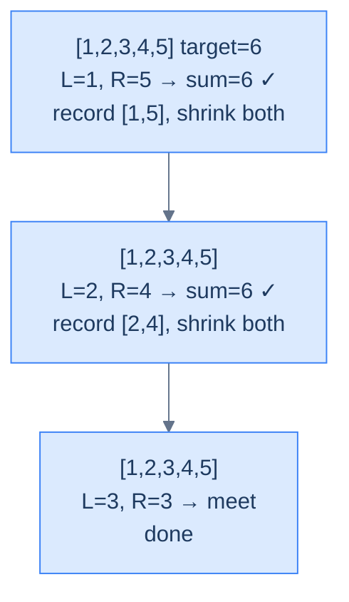

# Two Sum

## Problem Statement

Given the **head** of a doubly linked list sorted in non-decreasing order and an integer **target**, return *all* unique pairs that sum to the target. Do it without extra space. Inputs contain no duplicates.

## Examples

**Example 1**
```
Input:  head = [1, 2, 3, 4, 5], target = 6
Output: [[1, 5], [2, 4]]
Explanation: Two distinct pairs sum to 6 — the outer (1, 5) and the inner (2, 4). The pointers meet at 3 with no further pair to record.
```

**Example 2**
```
Input:  head = [1, 2, 3, 4, 5], target = 10
Output: []
Explanation: The maximum reachable sum is 4 + 5 = 9; no pair can reach 10.
```

**Example 3**
```
Input:  head = [1, 2, 3, 4, 5], target = 9
Output: [[4, 5]]
Explanation: Only the outermost-after-shrink pair (4, 5) sums to 9.
```

**Example 4**
```
Input:  head = [1, 2], target = 3
Output: [[1, 2]]
Explanation: The minimum-length valid case — one pair, one iteration, one match.
```

## Constraints

- `0 ≤ list length ≤ 10⁵`
- `-10⁴ ≤ node.val ≤ 10⁴`
- The list is sorted in non-decreasing order with no duplicate values
- `-10⁸ ≤ target ≤ 10⁸`

```python run viz=linked-list viz-root=head
import ast

class ListNode:
    def __init__(self, val, prev=None, next=None):
        self.val = val
        self.prev = prev
        self.next = next

class Solution:
    def two_sum(self, head, target):
        # Your code goes here — find the tail, then converge left from head
        # and right from tail; when sum == target record [left.val, right.val]
        # and step both inward; advance left if sum < target, retreat right
        # if sum > target; stop when left.val >= right.val.
        pass

def build_list(values):              # [1, 2, 3] → 1 ⇄ 2 ⇄ 3
    head = tail = None
    for v in values:
        node = ListNode(v, prev=tail)
        if tail is not None:
            tail.next = node
        else:
            head = node
        tail = node
    return head

def print_list(head):                # 1 ⇄ 2 ⇄ 3 → [1, 2, 3]
    out = []
    while head:
        out.append(head.val)
        head = head.next
    print(out)

head = build_list(ast.literal_eval(input()))   # the test case's head
target = int(input())
print(Solution().two_sum(head, target))
```

```java run viz=linked-list viz-root=head
import java.util.*;

public class Main {
    static class ListNode {
        int val; ListNode prev, next;
        ListNode(int val) { this.val = val; }
    }

    static class Solution {
        public List<List<Integer>> twoSum(ListNode head, int target) {
            // Your code goes here — find the tail, then converge left from head
            // and right from tail; when sum == target record Arrays.asList(left.val,
            // right.val) and step both inward; advance left if sum < target,
            // retreat right if sum > target; stop when left.val >= right.val.
            return new ArrayList<>();
        }
    }

    public static void main(String[] args) {
        Scanner sc = new Scanner(System.in);
        ListNode head = buildList(parseIntArray(sc.nextLine()));
        int target = Integer.parseInt(sc.nextLine().trim());
        System.out.println(new Solution().twoSum(head, target));
    }

    static ListNode buildList(int[] values) {      // {1, 2, 3} → 1 ⇄ 2 ⇄ 3
        ListNode head = null, tail = null;
        for (int v : values) {
            ListNode node = new ListNode(v);
            node.prev = tail;
            if (tail != null) tail.next = node;
            else head = node;
            tail = node;
        }
        return head;
    }

    static void printList(ListNode head) {         // 1 ⇄ 2 ⇄ 3 → [1, 2, 3]
        List<Integer> out = new ArrayList<>();
        for (ListNode n = head; n != null; n = n.next) out.add(n.val);
        System.out.println(out);
    }

    static int[] parseIntArray(String line) {
        String inner = line.replaceAll("[\\[\\]\\s]", "");
        if (inner.isEmpty()) return new int[0];
        String[] parts = inner.split(",");
        int[] out = new int[parts.length];
        for (int i = 0; i < parts.length; i++) out[i] = Integer.parseInt(parts[i]);
        return out;
    }
}
```

```testcases
{
  "args": [
    { "id": "head", "label": "head", "type": "int[]", "placeholder": "[1, 2, 3, 4, 5]" },
    { "id": "target", "label": "target", "type": "int", "placeholder": "6" }
  ],
  "cases": [
    { "args": { "head": "[1, 2, 3, 4, 5]", "target": "6" }, "expected": "[[1, 5], [2, 4]]" },
    { "args": { "head": "[1, 2, 3, 4, 5]", "target": "10" }, "expected": "[]" },
    { "args": { "head": "[1, 2, 3, 4, 5]", "target": "9" }, "expected": "[[4, 5]]" },
    { "args": { "head": "[1, 2]", "target": "3" }, "expected": "[[1, 2]]" },
    { "args": { "head": "[1]", "target": "1" }, "expected": "[]" },
    { "args": { "head": "[1, 2]", "target": "5" }, "expected": "[]" },
    { "args": { "head": "[1, 3, 5, 7, 9]", "target": "10" }, "expected": "[[1, 9], [3, 7]]" },
    { "args": { "head": "[2, 4, 6, 8]", "target": "10" }, "expected": "[[2, 8], [4, 6]]" }
  ]
}
```

<details>
<summary><h2>Intuition</h2></summary>


The **structural property** that makes this a two-pointer problem is the *sorted* assumption. On a sorted DLL, the smallest unvisited value sits at `left` and the largest sits at `right`. The running sum `left.val + right.val` is a monotonic dial: advancing `left` can only raise it, retreating `right` can only lower it. That monotonicity is exactly the signal the converging-walkers pattern needs to make a single deterministic decision per iteration.

The **pointer placement** is `left = head`, `right = tail`. Per iteration, compute `sum = left.val + right.val` and branch on three cases. If `sum == target`, the pair is valid — record `[left.val, right.val]`, then advance *both* pointers inward (the inputs contain no duplicates, so a value that just participated cannot appear again). If `sum < target`, `left.val` paired against the largest remaining partner still falls short, so it can never reach the target with any smaller partner; advance `left`. If `sum > target`, the symmetric argument retreats `right`. The loop ends when `left.val >= right.val` — the unexplored region has collapsed.

What **breaks if you reach for the naive approach**? The brute-force `O(n²)` pass nests two walks of the list and checks every pair — correct, but quadratic for no good reason. A hash-set lookup would solve `O(n)` time but pays `O(n)` extra space and discards the sorted-order gift the input handed you. The converging two-pointer pass uses the ordering for free and lands at `O(n)` time, `O(1)` extra space, single pass.

</details>
<details>
<summary><h2>Applying the Diagnostic Questions</h2></summary>


| Check | Answer for Two Sum |
|---|---|
| **Q1.** Are two nodes inspected at the same time, one from each end? | **Yes** — every iteration reads `left.val` and `right.val` to compute the running sum. |
| **Q2.** Does one pointer start near `head` and the other near `tail`? | **Yes** — `left = head` and `right = tail`. |
| **Q3.** Do both pointers move strictly inward? | **Yes** — `left` advances via `.next`, `right` retreats via `.prev`; neither ever reverses. |
| **Q4.** Is the per-step work `O(1)`? | **Yes** — one addition, one comparison, one append at most, then a single pointer step. |

</details>
<details>
<summary><h2>Approach</h2></summary>


Run the converging two-pointer loop, steering by the running sum.

1. **Handle the trivial guards.** If `head` is `null` or `head.next` is `null` (empty or single-node list), return an empty result — no pair is possible.
2. **Initialise the pointers and result.** Set `left = head`, `right = tail`, and `result = []`.
3. **Loop while the search space is non-empty.** Continue while `left.val < right.val`. This condition is strict — when `left.val == right.val`, the pointers have either met on the same node or crossed past each other.
4. **Compute the running sum.** Let `sum = left.val + right.val`.
5. **Branch on the sum's relation to the target.** If `sum == target`, append `[left.val, right.val]` to `result`, then set `left = left.next` and `right = right.prev`. If `sum < target`, advance `left = left.next`. If `sum > target`, retreat `right = right.prev`.
6. **Return the result.** When the loop exits, `result` holds every distinct pair summing to `target`, listed outermost-first.

</details>
<details>
<summary><h2>What Does "Decisive Direction" Mean?</h2></summary>


The whole reason two-pointers works on a sorted DLL is that **every move has a guaranteed effect on the running sum**:

- `left.val` is the *minimum* of the unexplored region.
- `right.val` is the *maximum* of the unexplored region.
- Advancing `left` (toward the tail) → sum can only **increase**.
- Retreating `right` (toward the head) → sum can only **decrease**.

So if `sum < target`, the only hope is to grow the sum, and the only way to grow it is `left++`. If `sum > target`, mirror: `right--`. No guesswork.

> *Friction prompt — predict before reading on:* if `sum < target`, why can we *throw away* `left.val` entirely (move past it forever) instead of pairing it with smaller `right` values?
>
> Answer: because `right.val` is the *largest* remaining value. If `left.val + (largest)` is already too small, no smaller partner could ever lift the sum to the target. `left.val` is provably useless — discard it.

</details>
<details>
<summary><h2>The Converging Walkers Strategy (Visualised)</h2></summary>




<p align="center"><strong>Two Sum on a sorted DLL — pointers converge, sum drives every decision, no node is ever revisited.</strong></p>

</details>
<details>
<summary><h2>Solution &amp; Analysis</h2></summary>

### Solution

```python solution time=O(n) space=O(1)
import ast
from typing import List

class ListNode:
    def __init__(self, val, prev=None, next=None):
        self.val = val
        self.prev = prev
        self.next = next

class Solution:
    def two_sum(self, head, target: int) -> List[List[int]]:

        # Find the tail
        tail = head
        while tail and tail.next:
            tail = tail.next

        # Check if the list is empty or has only one element
        if not head or not head.next:
            return []

        # Store the pairs of values that sum up to the target
        result: List[List[int]] = []
        left = head
        right = tail

        # Iterate until left's value becomes greater than right's value
        while left and right and left.val < right.val:
            if left.val + right.val == target:

                # Add the pair to the result list
                result.append([left.val, right.val])

                # Move left to the next node
                left = left.next

                # Move right to the previous node
                right = right.prev

            # Move left to the next node
            elif left.val + right.val < target:
                left = left.next

            # Move right to the previous node
            else:
                right = right.prev

        return result

def build_list(values):              # [1, 2, 3] → 1 ⇄ 2 ⇄ 3
    head = tail = None
    for v in values:
        node = ListNode(v, prev=tail)
        if tail is not None:
            tail.next = node
        else:
            head = node
        tail = node
    return head

def print_list(head):                # 1 ⇄ 2 ⇄ 3 → [1, 2, 3]
    out = []
    while head:
        out.append(head.val)
        head = head.next
    print(out)

head = build_list(ast.literal_eval(input()))   # the test case's head
target = int(input())
print(Solution().two_sum(head, target))
```

```java solution
import java.util.*;

public class Main {
    static class ListNode {
        int val; ListNode prev, next;
        ListNode(int val) { this.val = val; }
    }

    static class Solution {
        public List<List<Integer>> twoSum(ListNode head, int target) {

            // Find the tail
            ListNode tail = head;
            while (tail != null && tail.next != null) tail = tail.next;

            // Check if the list is empty or has only one element
            if (head == null || head.next == null) {
                return new ArrayList<>();
            }

            // Store the pairs of values that sum up to the target
            List<List<Integer>> result = new ArrayList<>();
            ListNode left = head;
            ListNode right = tail;

            // Iterate until left's value becomes greater than right's value
            while (left != null && right != null && left.val < right.val) {
                if (left.val + right.val == target) {

                    // Add the pair to the result list
                    result.add(Arrays.asList(left.val, right.val));

                    // Move left to the next node
                    left = left.next;

                    // Move right to the previous node
                    right = right.prev;
                }

                // Move left to the next node
                else if (left.val + right.val < target) {
                    left = left.next;
                }

                // Move right to the previous node
                else {
                    right = right.prev;
                }
            }

            return result;
        }
    }

    public static void main(String[] args) {
        Scanner sc = new Scanner(System.in);
        ListNode head = buildList(parseIntArray(sc.nextLine()));
        int target = Integer.parseInt(sc.nextLine().trim());
        System.out.println(new Solution().twoSum(head, target));
    }

    static ListNode buildList(int[] values) {      // {1, 2, 3} → 1 ⇄ 2 ⇄ 3
        ListNode head = null, tail = null;
        for (int v : values) {
            ListNode node = new ListNode(v);
            node.prev = tail;
            if (tail != null) tail.next = node;
            else head = node;
            tail = node;
        }
        return head;
    }

    static void printList(ListNode head) {         // 1 ⇄ 2 ⇄ 3 → [1, 2, 3]
        List<Integer> out = new ArrayList<>();
        for (ListNode n = head; n != null; n = n.next) out.add(n.val);
        System.out.println(out);
    }

    static int[] parseIntArray(String line) {
        String inner = line.replaceAll("[\\[\\]\\s]", "");
        if (inner.isEmpty()) return new int[0];
        String[] parts = inner.split(",");
        int[] out = new int[parts.length];
        for (int i = 0; i < parts.length; i++) out[i] = Integer.parseInt(parts[i]);
        return out;
    }
}
```


<details>
<summary><strong>Trace — head = [1, 2, 3, 4, 5], target = 6</strong></summary>

```
arr = [1, 2, 3, 4, 5] (already sorted), target = 6

Step 1 │ left=node(1), right=node(5)
        │ sum = 1 + 5 = 6 == target → record [1, 5], left→2, right→4
Step 2 │ left=node(2), right=node(4)
        │ sum = 2 + 4 = 6 == target → record [2, 4], left→3, right→3
Done   │ left.val == right.val → exit
Result: [[1, 5], [2, 4]] ✓
```

</details>

### Complexity Analysis

| Measure | Value | Reason |
|---|---|---|
| Time  | **O(N)** | Single converging pass; each node visited at most once. |
| Space | **O(1)** auxiliary | Beyond the output list, only two pointer variables. |

### Edge Cases

| Case | Example | Expected | Reasoning |
|---|---|---|---|
| Empty / single element | `arr = []` or `[7]` | `[]` | `left < right` is false immediately — no pair possible. |
| No valid pair | `[1,2,3,4,5], target=10` | `[]` | Loop exits when the indices meet (`left < right` fails). |
| All values smaller than target | `[1,2,3], target=100` | `[]` | `sum < target` always — `left` advances until it meets `right`. |

The sorted, no-duplicate Two Sum is clean. But what if the list contains repeats? That's where the same algorithm sprouts an awkward little subroutine.

</details>
<details>
<summary><h2>Key Takeaway</h2></summary>


Two Sum on a sorted DLL is the canonical pair-search variant — the *direction of motion* on every iteration is decided by `sum vs target`, not by node identity. Sorting is what makes the move-decision deterministic; without it, the running sum is no longer a monotonic dial.

</details>
