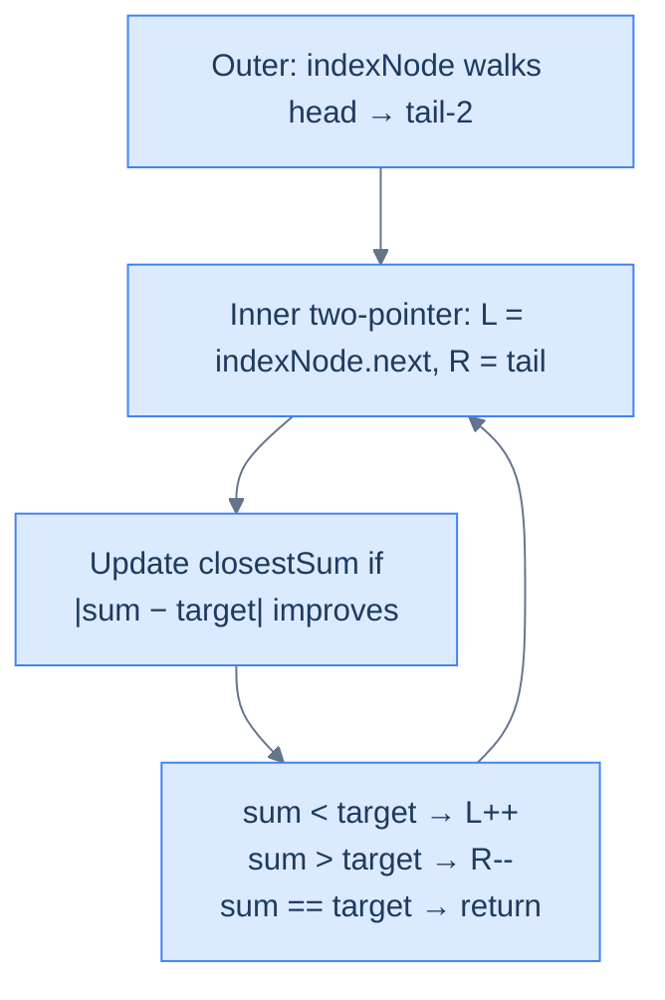

# Approximate Three Sum

## Problem Statement

Given the **head** of a doubly linked list sorted in non-decreasing order and an integer **target**, find three values whose sum is closest to `target`. Return that sum. Each input has exactly one solution.

## Examples

**Example 1**
```
Input:  head = [2, 7, 11, 15], target = 3
Output: 20
Explanation: 2 + 7 + 11 = 20 is the closest reachable sum to 3.
```

**Example 2**
```
Input:  head = [-4, -1, 1, 2], target = 1
Output: 2
Explanation: -1 + 2 + 1 = 2.
```

**Example 3**
```
Input:  head = [0, 0, 0], target = 1
Output: 0
Explanation: 0 + 0 + 0 = 0.
```

**Example 4**
```
Input:  head = [1, 2, 3], target = 6
Output: 6
Explanation: An exact match exists — the inner two-pointer pass returns the sum the moment `sum == target`, saving the rest of the scan.
```

## Constraints

- `3 ≤ list length ≤ 10³`
- `-10³ ≤ node.val ≤ 10³`
- The list is sorted in non-decreasing order
- `-10⁴ ≤ target ≤ 10⁴`
- Exactly one solution exists

```python run viz=linked-list viz-root=head
import ast

class ListNode:
    def __init__(self, val, prev=None, next=None):
        self.val = val
        self.prev = prev
        self.next = next

class Solution:
    def approximate_three_sum(self, head, target):
        # Your code goes here — for each node as indexNode, run a
        # two-pointer pass on the remaining sublist and track the
        # closest sum seen so far.
        pass

def build_list(values):              # [1, 2, 3] → 1 ⇄ 2 ⇄ 3
    head = tail = None
    for v in values:
        node = ListNode(v, prev=tail)
        if tail is not None:
            tail.next = node
        else:
            head = node
        tail = node
    return head

def print_list(head):                # 1 ⇄ 2 ⇄ 3 → [1, 2, 3]
    out = []
    while head:
        out.append(head.val)
        head = head.next
    print(out)

head = build_list(ast.literal_eval(input()))   # the test case's head
target = int(input())
print(Solution().approximate_three_sum(head, target))
```

```java run viz=linked-list viz-root=head
import java.util.*;

public class Main {
    static class ListNode {
        int val; ListNode prev, next;
        ListNode(int val) { this.val = val; }
    }

    static class Solution {
        public int approximateThreeSum(ListNode head, int target) {
            // Your code goes here — for each node as indexNode, run a
            // two-pointer pass on the remaining sublist and track the
            // closest sum seen so far.
            return 0;
        }
    }

    public static void main(String[] args) {
        Scanner sc = new Scanner(System.in);
        ListNode head = buildList(parseIntArray(sc.nextLine()));
        int target = Integer.parseInt(sc.nextLine().trim());
        System.out.println(new Solution().approximateThreeSum(head, target));
    }

    static ListNode buildList(int[] values) {      // {1, 2, 3} → 1 ⇄ 2 ⇄ 3
        ListNode head = null, tail = null;
        for (int v : values) {
            ListNode node = new ListNode(v);
            node.prev = tail;
            if (tail != null) tail.next = node;
            else head = node;
            tail = node;
        }
        return head;
    }

    static void printList(ListNode head) {         // 1 ⇄ 2 ⇄ 3 → [1, 2, 3]
        List<Integer> out = new ArrayList<>();
        for (ListNode n = head; n != null; n = n.next) out.add(n.val);
        System.out.println(out);
    }

    static int[] parseIntArray(String line) {
        String inner = line.replaceAll("[\\[\\]\\s]", "");
        if (inner.isEmpty()) return new int[0];
        String[] parts = inner.split(",");
        int[] out = new int[parts.length];
        for (int i = 0; i < parts.length; i++) out[i] = Integer.parseInt(parts[i]);
        return out;
    }
}
```

```testcases
{
  "args": [
    { "id": "head", "label": "head", "type": "int[]", "placeholder": "[2, 7, 11, 15]" },
    { "id": "target", "label": "target", "type": "int", "placeholder": "3" }
  ],
  "cases": [
    { "args": { "head": "[2, 7, 11, 15]", "target": "3" }, "expected": "20" },
    { "args": { "head": "[-4, -1, 1, 2]", "target": "1" }, "expected": "2" },
    { "args": { "head": "[0, 0, 0]", "target": "1" }, "expected": "0" },
    { "args": { "head": "[1, 2, 3]", "target": "6" }, "expected": "6" },
    { "args": { "head": "[1, 2, 3, 4]", "target": "10" }, "expected": "9" },
    { "args": { "head": "[-1, 0, 1, 2]", "target": "0" }, "expected": "0" },
    { "args": { "head": "[0, 1, 1, 1]", "target": "3" }, "expected": "3" },
    { "args": { "head": "[5, 10, 15, 20]", "target": "40" }, "expected": "40" }
  ]
}
```

<details>
<summary><h2>Intuition</h2></summary>


The **structural property** is that 3-Sum collapses to 2-Sum the moment you fix the first value. For every choice of `indexNode`, the remaining problem is "find the pair in the sublist `(indexNode.next, tail)` whose sum is closest to `target - indexNode.val`" — that is a sorted-list pair-search, exactly the previous variant. Iterate the choice of `indexNode` over every node in the list and keep the best triple seen so far. The sorted assumption survives across the outer loop: the inner range `(indexNode.next, tail)` is itself sorted, so the inner two-pointer pass works without re-sorting.

The **pointer placement** uses three references — one fixed, two converging. The outer cursor `indexNode` walks `head` toward the tail; the inner walkers `left = indexNode.next` and `right = tail` converge inward on each outer iteration. A scalar `closestSum` survives across all outer iterations: it is updated whenever `|sum - target|` improves, where `sum = indexNode.val + left.val + right.val`. The same `sum < target → left.next`, `sum > target → right.prev`, `sum == target → return` decision rule from plain Two Sum drives the inner loop — only the running sum has an extra term.

What **breaks if you reach for the naive approach**? The brute-force `O(n³)` triple-nested loop enumerates every ordered triple — correct, but cubic. Sorting + hashing for the inner pair lookup gets to `O(n²)` time but pays `O(n)` extra space for the hash set and discards the sorted-order gift. The fix-one-reduce approach hits the same `O(n²)` time at `O(1)` extra space, with the bonus that an exact `sum == target` triggers an early return out of the inner loop.

</details>
<details>
<summary><h2>Applying the Diagnostic Questions</h2></summary>


| Check | Answer for Approximate Three Sum |
|---|---|
| **Q1.** Are two nodes inspected at the same time, one from each end? | **Yes** — the inner two-pointer pass reads `left.val` and `right.val` together. The outer `indexNode` pins a third value but the converging-walkers shape applies to the inner pair. |
| **Q2.** Does one pointer start near `head` and the other near `tail`? | **Yes** for the inner loop — `left = indexNode.next` (near the current outer position), `right = tail`. |
| **Q3.** Do both pointers move strictly inward? | **Yes** — the inner `left` advances via `.next`, the inner `right` retreats via `.prev`; the outer `indexNode` also walks forward only. |
| **Q4.** Is the per-step work `O(1)`? | **Yes** — one addition, one absolute-distance check, one comparison, one pointer step. Total cost is `O(n)` per outer iteration, `O(n²)` overall. |

</details>
<details>
<summary><h2>Approach</h2></summary>


Run an outer loop that fixes a node, an inner converging-walkers pass that tracks the closest pair-sum, and a global tracker that survives every outer iteration.

1. **Initialise the global tracker.** Set `closestSum = +∞`. Every reachable triple-sum will beat this on its distance to the target.
2. **Walk the outer cursor.** Set `currentNode = head` and loop while `currentNode != null` and `currentNode.next != null` — the last two nodes cannot pin a triple because the inner sublist would be empty.
3. **Run the inner closest-two-sum.** With `indexNode = currentNode`, set `left = indexNode.next`, `right = tail`. Loop while `left != right` and `left.prev != right`.
4. **Compute the triple sum and update the inner closest.** Let `sum = indexNode.val + left.val + right.val`. If `|sum - target| < |innerClosest - target|`, set `innerClosest = sum`.
5. **Branch the inner pointers.** If `sum == target`, return `sum` immediately — no triple can be closer. If `sum < target`, advance `left = left.next`. If `sum > target`, retreat `right = right.prev`.
6. **Roll the inner closest into the global tracker.** After the inner loop returns its `innerClosest`, update `closestSum` if `|innerClosest - target| < |closestSum - target|`.
7. **Advance the outer cursor and repeat.** Set `currentNode = currentNode.next` and re-enter step 3.
8. **Return `closestSum`.** When the outer loop ends, `closestSum` holds the reachable triple sum closest to `target`.

</details>
<details>
<summary><h2>What Does "Fix One, Two-Pointer the Rest" Mean?</h2></summary>


Three Sum collapses to Two Sum the moment you fix the first value: for every choice of `indexNode`, find the closest **two-sum** to `target − indexNode.val` in the *remaining* sublist. We already know how to do that in linear time. So:

- **Outer loop:** walk `indexNode` from `head` toward the tail.
- **Inner two-pointer:** plant `left = indexNode.next`, `right = tail`, converge.
- **Track the best:** keep `closestSum` — update whenever we find a triple closer to `target`.

Outer loop is O(N), inner two-pointer is O(N) — total **O(N²)**. That's the canonical 3-Sum complexity, and it's optimal without hashing.

</details>
<details>
<summary><h2>The Outer-Inner Strategy (Visualised)</h2></summary>




<p align="center"><strong>Approximate 3-Sum — outer loop fixes one node, inner two-pointer searches the rest. The "closest" tracker survives across iterations.</strong></p>

</details>
<details>
<summary><h2>Solution &amp; Analysis</h2></summary>

### Solution

```python solution time=O(n²) space=O(1)
import ast
from typing import Optional

class ListNode:
    def __init__(self, val, prev=None, next=None):
        self.val = val
        self.prev = prev
        self.next = next

class Solution:
    def closestTwoSum(
        self,
        index_node: Optional['ListNode'],
        tail: Optional['ListNode'],
        target: int,
    ) -> int:
        left = index_node.next
        right = tail
        closest_sum = float("inf")

        # Use a while loop to traverse the list with two pointers
        while left and right and left != right and left.prev != right:

            # Compute the sum of the three numbers
            total = index_node.val + left.val + right.val

            # Update closest_sum if necessary
            if abs(total - target) < abs(closest_sum - target):
                closest_sum = total

            # If the sum equals target, return the sum
            if total == target:
                return total

            # Move the left pointer to increase the sum
            elif total < target:
                left = left.next

            # Move the right pointer to decrease the sum
            else:
                right = right.prev

        return closest_sum

    def approximate_three_sum(
        self,
        head: Optional['ListNode'],
        target: int,
    ) -> int:

        # Find the tail
        tail = head
        while tail and tail.next:
            tail = tail.next

        closest_sum = float("inf")
        current_node = head

        # Traverse each node in the list and calculate the closest two-sum
        while current_node and current_node.next:
            current_sum = self.closestTwoSum(current_node, tail, target)

            # Update closest_sum if a closer sum is found
            if abs(current_sum - target) < abs(closest_sum - target):
                closest_sum = current_sum
            current_node = current_node.next

        return closest_sum

def build_list(values):              # [1, 2, 3] → 1 ⇄ 2 ⇄ 3
    head = tail = None
    for v in values:
        node = ListNode(v, prev=tail)
        if tail is not None:
            tail.next = node
        else:
            head = node
        tail = node
    return head

def print_list(head):                # 1 ⇄ 2 ⇄ 3 → [1, 2, 3]
    out = []
    while head:
        out.append(head.val)
        head = head.next
    print(out)

head = build_list(ast.literal_eval(input()))   # the test case's head
target = int(input())
print(Solution().approximate_three_sum(head, target))
```

```java solution
import java.util.*;

public class Main {
    static class ListNode {
        int val; ListNode prev, next;
        ListNode(int val) { this.val = val; }
    }

    static class Solution {
        private int closestTwoSum(
            ListNode indexNode,
            ListNode tail,
            int target
        ) {
            ListNode left = indexNode.next;
            ListNode right = tail;
            // Use a large-but-safe sentinel (avoids Math.abs overflow with Integer.MAX_VALUE)
            int closestSum = target > 0 ? target - 100000 : target + 100000;
            boolean init = false;

            // Use a while loop to traverse the list with two pointers
            while (
                left != null &&
                right != null &&
                left != right &&
                left.prev != right
            ) {

                // Compute the sum of the three numbers
                int sum = indexNode.val + left.val + right.val;

                // Update closestSum if necessary
                if (!init || Math.abs(sum - target) < Math.abs(closestSum - target)) {
                    closestSum = sum;
                    init = true;
                }

                // If the sum equals target, return the sum
                if (sum == target) {
                    return sum;
                }

                // Move the left pointer to increase the sum
                else if (sum < target) {
                    left = left.next;
                }

                // Move the right pointer to decrease the sum
                else {
                    right = right.prev;
                }
            }

            return closestSum;
        }

        public int approximateThreeSum(ListNode head, int target) {

            // Find the tail
            ListNode tail = head;
            while (tail != null && tail.next != null) tail = tail.next;

            int closestSum = 0;
            boolean init = false;
            ListNode currentNode = head;

            // Traverse each node in the list and calculate the closest two-sum
            while (currentNode != null && currentNode.next != null) {
                int currentSum = closestTwoSum(currentNode, tail, target);

                // Update closestSum if a closer sum is found
                if (!init || Math.abs(currentSum - target) < Math.abs(closestSum - target)) {
                    closestSum = currentSum;
                    init = true;
                }
                currentNode = currentNode.next;
            }

            return closestSum;
        }
    }

    public static void main(String[] args) {
        Scanner sc = new Scanner(System.in);
        ListNode head = buildList(parseIntArray(sc.nextLine()));
        int target = Integer.parseInt(sc.nextLine().trim());
        System.out.println(new Solution().approximateThreeSum(head, target));
    }

    static ListNode buildList(int[] values) {      // {1, 2, 3} → 1 ⇄ 2 ⇄ 3
        ListNode head = null, tail = null;
        for (int v : values) {
            ListNode node = new ListNode(v);
            node.prev = tail;
            if (tail != null) tail.next = node;
            else head = node;
            tail = node;
        }
        return head;
    }

    static void printList(ListNode head) {         // 1 ⇄ 2 ⇄ 3 → [1, 2, 3]
        List<Integer> out = new ArrayList<>();
        for (ListNode n = head; n != null; n = n.next) out.add(n.val);
        System.out.println(out);
    }

    static int[] parseIntArray(String line) {
        String inner = line.replaceAll("[\\[\\]\\s]", "");
        if (inner.isEmpty()) return new int[0];
        String[] parts = inner.split(",");
        int[] out = new int[parts.length];
        for (int i = 0; i < parts.length; i++) out[i] = Integer.parseInt(parts[i]);
        return out;
    }
}
```


<details>
<summary><strong>Trace — head = [-4, -1, 1, 2], target = 1</strong></summary>

```
arr = [-4, -1, 1, 2] (already sorted), target = 1, closest_sum = +∞

Outer indexNode=-4 → closest_two_sum:
  left=-1, right=2 → sum=-3, |dist|=4 → closest_sum=-3
  sum < 1 → left++
  left=1, right=2 → sum=-1, |dist|=2 → closest_sum=-1
  sum < 1 → left++; left.prev == right → exits → returns -1
Outer indexNode=-1 → closest_two_sum:
  left=1, right=2 → sum=2, |dist|=1 → closest_sum=2
  sum > 1 → right--; left.prev == right → exits → returns 2
Global: |2 - 1| = 1 < |-1 - 1| = 2 → closestSum = 2
Done. Result: 2 ✓
```

</details>

### Complexity Analysis

| Measure | Value | Reason |
|---|---|---|
| Time  | **O(N²)** | Outer loop O(N) × inner two-pointer O(N). |
| Space | **O(1)** | A handful of pointers and a closest-sum scalar. |

### Edge Cases

| Case | Example | Expected | Reasoning |
|---|---|---|---|
| Exact match exists | `[0,0,0], target=0` | `0` | Inner loop returns early on `sum == target`. |
| Negatives | `[-4,-1,1,2], target=1` | `2` | Sorted-list assumption holds for negatives too. |
| Minimum length | `[a,b,c]` | `a+b+c` | One outer iteration, one inner step. |

</details>
<details>
<summary><h2>The Relationship — Why These Four Problems Are All the Same Problem</h2></summary>


| Problem | Outer loop | Inner mechanic | What drives the move |
|---|---|---|---|
| Palindrome Number | — | Two pointers converge | Equality check |
| Two Sum | — | Two pointers converge | `sum vs target` |
| Duplicate-Aware Two Sum | — | Two pointers + skip-duplicates | `sum vs target`, then run-skip |
| Approximate Three Sum | Walk `indexNode` | Two pointers converge | `sum vs target` and `|sum − target|` |

Same skeleton, four flavours. Once the converging-walkers mental model clicks, you're reading variations on a theme.

</details>
<details>
<summary><h2>Key Takeaway</h2></summary>


The two-pointer pattern on a doubly linked list is the moment a "fancy linked list" stops feeling like a textbook curiosity and starts feeling like an *array with insertions*. Because every node knows its predecessor, you can run the entire sorted-array two-pointer playbook — convergence, skip-duplicates, fix-one-and-reduce — without ever leaving linked-list land. Linear time, constant extra space, single pass.

You didn't just learn four problems. You learned a *recognition reflex*: whenever a sorted DLL problem can be phrased as "act on two nodes, then move them strictly closer," reach for two pointers before you reach for hashing.

> **Transfer challenge:** Given the `head` and `tail` of a sorted doubly linked list and a target `k`, return the **count** of unordered triples `(a, b, c)` whose sum is **less than** `k`. (Hint: fix one node, then for the remaining range, when `sum < k`, you've just discovered `right − left` valid pairs at once.)
>
> <details><summary><strong>Solution sketch</strong></summary>
>
> Outer loop on `indexNode` from `head` to the third-from-last node. Inner two-pointer with `left = indexNode.next`, `right = tail`. If `indexNode.val + left.val + right.val < k`, then *every* pairing of `left` with nodes between `left+1` and `right` also satisfies the bound — add `(positionOf(right) − positionOf(left))` to the count, then `left = left.next`. Otherwise `right = right.prev`. O(N²) time, O(1) space. The trick is realising that "shrink right" is wasteful when the sum is already small enough — count in batches, not one at a time.
> </details>

Next up — **lesson 08: Pattern — Sliding Window**, where the two pointers stop converging and start chasing each other in the same direction. Same DLL, brand-new geometry.

</details>
<details>
<summary><h2>Key Takeaway</h2></summary>


What is *new* here vs Two Sum is the outer loop pinning one node — the inner pass is unchanged in shape, only the running sum gains a third term. A global tracker survives across outer iterations because the closest triple may sit in any slice; an exact match short-circuits the whole search.

</details>
