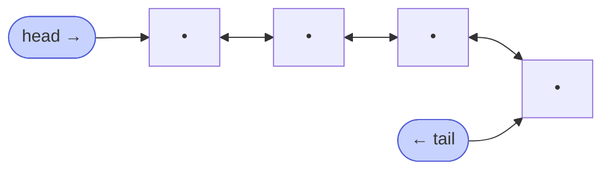

# Memorize: Two Pointers (DLL)

## In a Hurry?

- **One-Line Idea**: Walk `left` from `head` forward via `.next` and `right` from `tail` backward via `.prev`, doing `O(1)` work on each pair until the pointers meet or cross.
- **Complexities**: `O(n)` time, `O(1)` extra space — where `n` is the number of nodes in the list.
- **When to Use**: A sorted (or symmetric) doubly linked list problem that operates on a *pair* of nodes from opposite ends — palindrome check, paired-sum search, fix-one-reduce three-sum.

---

## One-Line Mnemonic

**"Walk in from both ends — the `prev` field makes the backward step free."**

The image is two readers entering a tunnel from opposite mouths, comparing the doors they meet at, advancing until they shake hands in the middle.

---

## Real-World Analogy

Picture proofreaders walking a printed list from opposite ends. One reads top-down, the other reads bottom-up; whenever they reach a row, they compare what they each see and either advance, swap, or stop. Because the printed list lets either reader look back at the previous row without restarting (the same way a DLL's `prev` field lets the right pointer step back), neither reader ever has to re-walk from the start. They meet in the middle, exactly once.

---

## Visual Summary



<p align="center"><strong>The backward links let a doubly list run the array-style converging scan directly: one pointer steps forward from the head, one steps back from the tail via prev, meeting in the middle — O(n), no indices.</strong></p>

---

## Pattern Recognition Triggers

The problem fits the DLL two-pointer pattern when **all four** of the following hold. These are the same questions the pattern's Recognition Checklist asks.

- The problem operates on **two nodes at once** — every iteration reads or compares `left` and `right` together.
- The natural starting state has **one pointer near `head` and one near `tail`**, with `left` strictly before `right` in the chain.
- Each iteration moves **both pointers strictly inward** (or one of them) — `left = left.next` and/or `right = right.prev`. Neither pointer ever reverses.
- The per-step work is **`O(1)`** — a comparison, a sum check, an append. No inner scan of the remaining nodes.

Common surface signals: "is this list a palindrome," "find a pair summing to `k` in a sorted DLL," "closest triple to `target` on a sorted DLL," "swap mirrored nodes." If the problem says *sorted DLL* + *pair* (or *triple via fix-one*), reach for two pointers first.

---

## Don't Confuse With

| | **Two Pointers (this pattern)** | **Sliding Window** |
|---|---|---|
| **Starting positions** | `left = head`, `right = tail` (opposite ends) | `left = head`, `right = head` (same end) |
| **Direction of motion** | Pointers converge inward (`left.next`, `right.prev`) | Pointers expand outward (both via `.next`) |
| **Loop invariant** | The unprocessed region is the open span `(left, right)` | The window `[left .. right]` satisfies a running condition |
| **Problem shape** | "find a pair" / "compare mirror nodes" / "fix-one-reduce" | "find a contiguous subsequence" / "longest or shortest run" |
| **When this goes wrong** | You are tracking a running sum or count over a contiguous window — wrong pattern, switch to sliding window. | You are comparing mirror-pair nodes or steering by `sum vs target` against opposite ends — wrong pattern, switch to two pointers. |

Both patterns reuse the names `left` and `right`. The decisive question is whether the *unprocessed* region shrinks from both sides (two pointers) or whether the *window* slides along the list (sliding window).

---

## Template Code

```python
# DLL two-pointer — converging-walkers skeleton.
def two_pointer(head, tail):
    # Trivial guards: empty list, single node, or adjacent pair with no inner work.
    if not head or not tail or head == tail or head.next == tail:
        return  # problem-specific default

    left = head
    right = tail

    while left != right and left.prev != right:
        # 1. Read left.val and right.val.
        # 2. Do O(1) work: compare, sum-check, append, etc.
        # 3. Decide which pointer(s) advance.

        if should_move_left:    # problem-specific predicate
            left = left.next

        if should_move_right:   # problem-specific predicate
            right = right.prev
```

Three knobs change per problem:

- **The loop body** — compare for equality (palindrome), check `sum vs target` (two-sum), or update a `closestSum` tracker (approximate three-sum).
- **The advance rule** — both pointers move on a match, or only one moves when the running sum is off-target.
- **The termination guards** — `left != right` catches odd-length meets; `left.prev != right` catches even-length crosses. Drop the second guard and an even-length list reprocesses pairs in reverse.

---

## Common Mistakes

- **Forgetting the even-length crossing guard**:
  - *What*: looping with only `while left != right` on an even-length list runs one iteration too many — after the final inward step, `left` has stepped past `right`, and the next iteration compares already-processed nodes backwards.
  - *Why*: on an even-length list, `left` and `right` never land on the *same* node; they swap past each other. Equality is never true, so the loop never exits naturally.
  - *Fix*: use `while left != right and left.prev != right` — the second guard catches the cross.
- **Calling skip-duplicate helpers in the wrong order**:
  - *What*: in Duplicate-Aware Two Sum, calling `skip_duplicates_right(old_left, right)` before `skip_duplicates_left(left, right)` uses the *pre-advance* left in the right helper's `left != right` guard, which can underrun the cursor on tight inputs like `[2, 2, 2, 2]`.
  - *Why*: the right helper needs to know where the new left sits to decide when to stop; the un-advanced left makes the guard fire too late.
  - *Fix*: call the left helper first, capture its return into `left`, then pass the new `left` into the right helper.
- **Advancing both pointers when the sum is off-target**:
  - *What*: in Two Sum or Approximate Three Sum, advancing both `left` and `right` when `sum != target` skips over a value that could still pair with a different partner.
  - *Why*: the move-decision is monotonic — only one direction can fix an off-target sum. Advancing the wrong side throws away a candidate forever.
  - *Fix*: use `if / elif / else` so each iteration advances exactly the side dictated by `sum vs target`.
- **Re-walking the list to update `right`**:
  - *What*: replacing `right = right.prev` with "scan from `head` to find the new right" — typically when the writer forgets the DLL has backward pointers.
  - *Why*: this collapses each iteration from `O(1)` to `O(n)` and the whole pattern from `O(n)` to `O(n²)`.
  - *Fix*: trust the `prev` field. `right = right.prev` is the entire backward step; no scan is needed.
- **Skipping the trivial guards**:
  - *What*: entering the main loop on an empty list, single node, or two-node list without first guarding `if not head or head == tail or head.next == tail`.
  - *Why*: the loop body assumes `left` and `right` are distinct, non-null nodes with at least one inner step available; an empty or singleton list violates that invariant on the first iteration.
  - *Fix*: return the problem-specific trivial answer (`true` for palindrome, `[]` for two-sum, the only triple for three-sum) before the loop runs.

---

## Minimum Viable Example

Two Sum on `[1, 3, 4, 6]` with `target = 7`:

```
[1, 3, 4, 6]   left=node(1), right=node(6)  → sum=7 == target  → record [1, 6], step both
[3, 4]         left=node(3), right=node(4)  → sum=7 == target  → record [3, 4], step both
               left=node(4), right=node(3)  → left.val >= right.val → loop exits

Result: [[1, 6], [3, 4]]
```

Four nodes, two iterations, both pairs found in a single inward sweep.

---

## Quick Recall

**Q: What two termination guards does the DLL converging-walkers loop use, and why both?**
A: `left != right` (odd-length lists meet) and `left.prev != right` (even-length lists cross past each other). Without the second, even-length lists reprocess pairs after the cross.

**Q: What is the time and space complexity of the DLL two-pointer pattern?**
A: `O(n)` time and `O(1)` extra space — both pointers together visit each node at most once.

**Q: Why does the pattern require the list to be sorted (or otherwise symmetric)?**
A: Sorting makes the running sum monotonic — advancing `left` strictly raises it and retreating `right` strictly lowers it — which is what lets each iteration commit to a single deterministic move.

**Q: What changes when the problem allows duplicates in the input?**
A: After a `sum == target` match, both pointers must walk past every node sharing their current value before resuming, otherwise the same value pair gets recorded multiple times.

**Q: How does the pattern scale to three-sum problems?**
A: An outer loop pins one node; the inner pass is the unchanged two-pointer scan on the remaining sublist, with the running sum gaining a third (constant per inner iteration) term. Total cost is `O(n²)` time, `O(1)` space.
