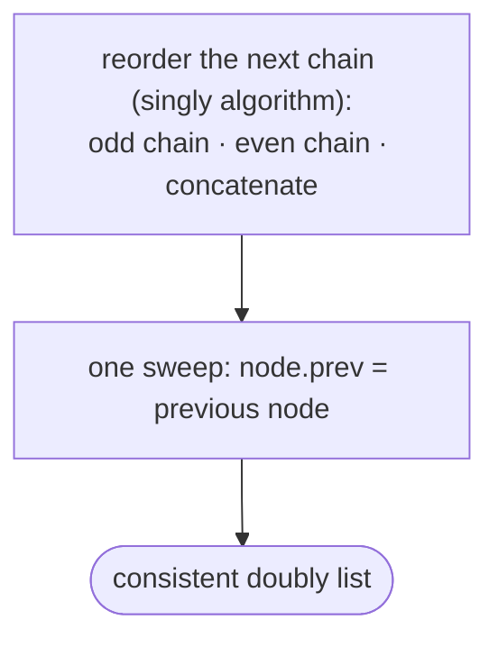

# Pattern: Reorder

## Why It Exists

Reordering — regrouping a list by a rule rather than sorting it — applies to doubly lists just as it does to singly ones: gather odd-position nodes before even, partition by value, weave the back half into the front. The technique is the same *classify each node into a chain, then concatenate*.

The doubly complication is that **every node has two pointers to keep consistent.** Juggling `prev` and `next` simultaneously through a fiddly reorder is where bugs breed — you fix the forward chain and leave stale backward links. The clean way out rests on one fact: in a doubly list, `prev` is **fully determined** by `next` — your predecessor is simply whoever's `next` points at you. So do the entire reorder on the `next` chain alone (identical to the singly algorithm), then **rebuild every `prev` in one final sweep**. Restructure once; repair the backward links once.

## See It Work

Reorder `1 ⇄ 2 ⇄ 3 ⇄ 4 ⇄ 5` so odd-*position* nodes come first: `1 ⇄ 3 ⇄ 5 ⇄ 2 ⇄ 4`. Build the two chains on `next`, then one pass fixes all `prev`. Run it, then **Visualise**.

> ▶ Run it, then click **Visualise** — two chains (odd/even positions) form on the forward links, then a final sweep repairs every backward pointer.

```python run viz=linked-list viz-root=head viz-kind=list-double
class Node:
    def __init__(self, val):
        self.val = val
        self.prev = None
        self.next = None

def odd_even(head):
    if head is None or head.next is None:
        return head
    odd = head                       # positions 1, 3, 5 …
    even = head.next                 # positions 2, 4 …
    even_head = even
    while even is not None and even.next is not None:
        odd.next = even.next         # relink forward chains only
        odd = odd.next
        even.next = odd.next
        even = even.next
    odd.next = even_head             # concatenate evens after odds
    prev = None                      # rebuild every prev from the finalized next chain
    node = head
    while node:
        node.prev = prev
        prev = node
        node = node.next
    return head

nodes = [Node(v) for v in (1, 2, 3, 4, 5)]
for i in range(4):
    nodes[i].next = nodes[i + 1]; nodes[i + 1].prev = nodes[i]
head = odd_even(nodes[0])

vals = []
node = head
while node:
    vals.append(node.val)
    node = node.next
print(vals)                          # [1, 3, 5, 2, 4]
```

## How It Works

Two phases:

1. **Reorder the `next` chain** exactly as in the singly list — grow an `odd` chain (positions 1, 3, 5, …) and an `even` chain (2, 4, …), saving `even_head`, then concatenate with `odd.next = even_head`. Ignore `prev` entirely during this phase.
2. **Rebuild `prev` in one sweep** — walk the finished forward chain and set each node's `prev` to the node before it. After this, `prev` and `next` are perfectly consistent.



<p align="center"><strong>reorder the forward chain (classify into odd/even chains, concatenate), then a single backward-repair pass sets every <code>prev</code> from the final <code>next</code> order.</strong></p>

Both phases are linear, so the whole reorder is **`O(n)` time, `O(1)` space**. The idiom generalizes: *whenever a doubly-list restructuring is intricate, manipulate `next` only, then derive `prev` in a final pass.* It removes a whole class of "forward works, backward is corrupt" bugs by construction — there's only one place `prev` is ever written.

### Key Takeaway

Reorder a doubly list by re-threading the `next` chain exactly like the singly version, then rebuild every `prev` in one final sweep. Since `prev` is determined by `next`, restructuring once and repairing backward links once is both simpler and less bug-prone than juggling both inline.

## Trace It

`1⇄2⇄3⇄4⇄5`, `odd = 1`, `even = 2`, `even_head = 2`:

| phase | result |
|---|---|
| build odd chain | `1→3→5` |
| build even chain | `2→4` |
| concatenate | `1→3→5→2→4` (forward only; `prev` still stale) |
| rebuild `prev` | `1.prev=∅, 3.prev=1, 5.prev=3, 2.prev=5, 4.prev=2` |

Before you read on: after the concatenate step, the forward order is already `1→3→5→2→4`, but the `prev` pointers still reflect the *old* arrangement. Why is it safe to leave them wrong until the very end, instead of fixing each as you go?

Because nothing in the reorder phase ever *reads* `prev` — it only follows and rewrites `next`. A stale `prev` can't affect a computation that never consults it. And once the forward chain is final, every `prev` is knowable: it's just the node you visited immediately before. So the backward links carry no information you need mid-reorder, and they're trivially reconstructible afterward — deferring them is both safe and simpler than maintaining two invariants at once.

## Your Turn

The reusable doubly odd/even-position reorder:

```python run viz=linked-list viz-root=head viz-kind=list-double
class Node:
    def __init__(self, val):
        self.val = val
        self.prev = None
        self.next = None

def odd_even(head):
    if head is None or head.next is None:
        return head
    odd, even, even_head = head, head.next, head.next
    while even is not None and even.next is not None:
        odd.next = even.next
        odd = odd.next
        even.next = odd.next
        even = even.next
    odd.next = even_head
    prev, node = None, head          # rebuild prev
    while node:
        node.prev = prev
        prev = node
        node = node.next
    return head

nodes = [Node(v) for v in (1, 2, 3, 4, 5, 6)]
for i in range(5):
    nodes[i].next = nodes[i + 1]; nodes[i + 1].prev = nodes[i]
out, node = [], odd_even(nodes[0])
while node:
    out.append(node.val); node = node.next
print(out)                           # [1, 3, 5, 2, 4, 6]
```

```java run viz=linked-list viz-root=head viz-kind=list-double
public class Main {
  static class Node { int val; Node prev, next; Node(int v){ val = v; } }

  static Node oddEven(Node head) {
    if (head == null || head.next == null) return head;
    Node odd = head, even = head.next, evenHead = even;
    while (even != null && even.next != null) {
      odd.next = even.next; odd = odd.next;
      even.next = odd.next; even = even.next;
    }
    odd.next = evenHead;
    Node prev = null, node = head;      // rebuild prev
    while (node != null) { node.prev = prev; prev = node; node = node.next; }
    return head;
  }

  public static void main(String[] args) {
    Node[] n = new Node[6];
    for (int i = 0; i < 6; i++) n[i] = new Node(i + 1);
    for (int i = 0; i < 5; i++) { n[i].next = n[i + 1]; n[i + 1].prev = n[i]; }
    StringBuilder sb = new StringBuilder("[");
    for (Node c = oddEven(n[0]); c != null; c = c.next) sb.append(c.val).append(c.next != null ? ", " : "");
    System.out.println(sb.append("]"));   // [1, 3, 5, 2, 4, 6]
  }
}
```

Drill the family in **Practice** — [Relocate Node](/cortex/data-structures-and-algorithms/linear-structures-doubly-linked-list-pattern-reorder-problems-relocate-node), [Parity Order](/cortex/data-structures-and-algorithms/linear-structures-doubly-linked-list-pattern-reorder-problems-parity-order), [Value Partition](/cortex/data-structures-and-algorithms/linear-structures-doubly-linked-list-pattern-reorder-problems-value-partition), and [Shuffle List](/cortex/data-structures-and-algorithms/linear-structures-doubly-linked-list-pattern-reorder-problems-shuffle-list).

## Reflect & Connect

Reorder on a doubly list is the singly technique plus one disciplined repair pass:

- **Classify-and-concatenate** still covers it — by index parity (above), by value (`< x` chain and `≥ x` chain), by any per-node rule. Identical to the singly version on the `next` chain.
- **The `prev`-rebuild sweep is the transferable idiom** — `prev` is a function of `next`, so for any non-trivial doubly restructuring, manipulate one pointer and derive the other last. One write-site for `prev` means one place a bug can live.
- **The doubly bonus: the fold needs no reversal** — the singly *fold* `L0→Ln→L1→Ln-1→…` required split + reverse + merge. A doubly list with a **tail** and `prev` can weave directly: take from the front via `next`, take from the back via `prev`, alternate. No reversal at all — the backward pointer that made [two-pointers](/cortex/data-structures-and-algorithms/linear-structures-doubly-linked-list-pattern-two-pointers-pattern) cheap makes the fold cheap too.

**Prerequisites:** [Reversal as a Subproblem](/cortex/data-structures-and-algorithms/linear-structures-doubly-linked-list-pattern-reversal-subproblem-pattern).

## Recall

> **Mnemonic:** *Reorder the `next` chain like a singly list, then one sweep rebuilds every `prev`. `prev = f(next)`, so fix it last.*

| | |
|---|---|
| Phase 1 | classify into chains on `next`, concatenate (ignore `prev`) |
| Phase 2 | one pass: `node.prev = previous node` |
| Why defer `prev` | nothing in phase 1 reads `prev`; it's reconstructible from the final `next` |
| Doubly bonus | the fold reorder needs no reverse — weave front (`next`) + back (`prev`) |
| Cost | `O(n)` time, `O(1)` space |

<details>
<summary><strong>Q:</strong> Why manipulate only `next` during the reorder and rebuild `prev` afterward?</summary>

**A:** `prev` is determined by `next`; deferring it gives a single write-site and avoids "forward works, backward corrupt" bugs.

</details>
<details>
<summary><strong>Q:</strong> Why is it safe to leave `prev` stale mid-reorder?</summary>

**A:** The reorder phase never reads `prev`, so stale backward links can't affect it; they're rebuilt once the forward order is final.

</details>
<details>
<summary><strong>Q:</strong> What's the unifying skeleton across reorder variants?</summary>

**A:** Classify each node into a chain by a rule, concatenate the chains — identical to the singly case.

</details>
<details>
<summary><strong>Q:</strong> How does a doubly list simplify the fold reorder?</summary>

**A:** With a tail and `prev` you weave from both ends directly (front via `next`, back via `prev`) — no split + reverse + merge needed.

</details>

## Sources & Verify

- **CLRS**, *Introduction to Algorithms*, 4th ed., §10.2 — doubly linked lists; pointer invariants.
- **Sedgewick & Wayne**, *Algorithms*, 4th ed., §1.3 — linked structures and restructuring.
- "Odd Even Linked List" generalized to a doubly list with a `prev`-rebuild pass; both runnable blocks are verified by running (`[1,3,5,2,4]` and `[1,3,5,2,4,6]`), with backward `prev` links checked consistent.
