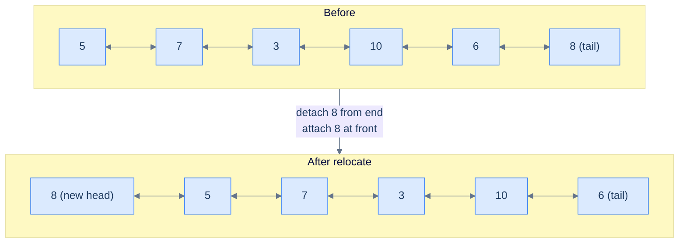

# Relocate node

## Problem Statement

Given the **head** of a doubly linked list, write a function to move the last node of the list to the start and return the head of the reordered list.

## Examples

**Example 1:**
```
Input:  head = [5, 7, 3, 10, 6, 8]
Output: [8, 5, 7, 3, 10, 6]
```

**Example 2:**
```
Input:  head = [5, 7]
Output: [7, 5]
```

**Example 3:**
```
Input:  head = [5]
Output: [5]
```

```quiz
{
  "prompt": "What is the output for head = [1, 2, 3, 4]?",
  "input": "head = [1, 2, 3, 4]",
  "options": ["[1, 2, 3, 4]", "[4, 1, 2, 3]", "[4, 3, 2, 1]", "[1, 4, 2, 3]"],
  "answer": "[4, 1, 2, 3]"
}
```

## Constraints

- `0 ≤ list length ≤ 10⁵`
- `-10⁴ ≤ node.val ≤ 10⁴`
- Move the last node **in place** — `O(1)` extra space; node values must not be copied or rewritten

```python run viz=linked-list viz-root=head
import ast

class ListNode:
    def __init__(self, val, prev=None, next=None):
        self.val = val
        self.prev = prev
        self.next = next

class Solution:
    def relocate_node(self, head):
        # Your code goes here — walk to the last node, detach it from
        # both directions, then splice it at the front with the mirror wired.
        pass

def build_list(values):              # [1, 2, 3] → 1 ⇄ 2 ⇄ 3
    head = tail = None
    for v in values:
        node = ListNode(v, prev=tail)
        if tail is not None:
            tail.next = node
        else:
            head = node
        tail = node
    return head

def print_list(head):                # 1 ⇄ 2 ⇄ 3 → [1, 2, 3]
    out = []
    while head:
        out.append(head.val)
        head = head.next
    print(out)

head = build_list(ast.literal_eval(input()))   # the test case's head
print_list(Solution().relocate_node(head))
```

```java run viz=linked-list viz-root=head
import java.util.*;

public class Main {
    static class ListNode {
        int val; ListNode prev, next;
        ListNode(int val) { this.val = val; }
    }

    static class Solution {
        ListNode relocateNode(ListNode head) {
            // Your code goes here — walk to the last node, detach it from
            // both directions, then splice it at the front with the mirror wired.
            return null;
        }
    }

    public static void main(String[] args) {
        ListNode head = buildList(parseIntArray(new Scanner(System.in).nextLine()));
        printList(new Solution().relocateNode(head));
    }

    static ListNode buildList(int[] values) {      // {1, 2, 3} → 1 ⇄ 2 ⇄ 3
        ListNode head = null, tail = null;
        for (int v : values) {
            ListNode node = new ListNode(v);
            node.prev = tail;
            if (tail != null) tail.next = node;
            else head = node;
            tail = node;
        }
        return head;
    }

    static void printList(ListNode head) {         // 1 ⇄ 2 ⇄ 3 → [1, 2, 3]
        List<Integer> out = new ArrayList<>();
        for (ListNode n = head; n != null; n = n.next) out.add(n.val);
        System.out.println(out);
    }

    // "[1, 2, 3]" → {1, 2, 3} — reads the test case's head
    static int[] parseIntArray(String line) {
        String inner = line.replaceAll("[\\[\\]\\s]", "");
        if (inner.isEmpty()) return new int[0];
        String[] parts = inner.split(",");
        int[] out = new int[parts.length];
        for (int i = 0; i < parts.length; i++) out[i] = Integer.parseInt(parts[i]);
        return out;
    }
}
```

```testcases
{
  "args": [
    { "id": "head", "label": "head", "type": "int[]", "placeholder": "[5, 7, 3, 10, 6, 8]" }
  ],
  "cases": [
    { "args": { "head": "[5, 7, 3, 10, 6, 8]" }, "expected": "[8, 5, 7, 3, 10, 6]" },
    { "args": { "head": "[5, 7]" }, "expected": "[7, 5]" },
    { "args": { "head": "[5]" }, "expected": "[5]" },
    { "args": { "head": "[]" }, "expected": "[]" },
    { "args": { "head": "[1, 2, 3]" }, "expected": "[3, 1, 2]" },
    { "args": { "head": "[1, 2, 3, 4, 5]" }, "expected": "[5, 1, 2, 3, 4]" },
    { "args": { "head": "[9, 9]" }, "expected": "[9, 9]" },
    { "args": { "head": "[1, 2, 3, 4]" }, "expected": "[4, 1, 2, 3]" }
  ]
}
```

<details>
<summary><h2>What Does "Relocate" Mean Here?</h2></summary>


Picture the list as a chain of train cars. Relocate means: detach the last car, walk it to the front, and re-attach it as the new locomotive. Two splices: one at the back (uncouple the last car) and one at the front (couple it on). In a DLL, each "splice" is a forward link plus a mirror.



<p align="center"><strong>Relocate the last node — split = (head … penultimate, last); merge = concatenate(last, head). Two pointer splices, both with mirror updates.</strong></p>

</details>
<details>
<summary><h2>Strategy</h2></summary>


Reorder skeleton: `f1` selects the last node into bucket B and everything else into bucket A. `f2` is "B then A" (concatenate, with B on the left). For DLLs the only twist is the mirror: when we make the last node the new head, its `prev` must become `null`, and the old head's `prev` must point at it.

> **Algorithm**
>
> -   **Step 1:** Walk to the end keeping a `previous` reference. After the loop, `current` is the last node and `previous` is the second-to-last.
> -   **Step 2:** Detach the last node: `previous.next = null`, `current.prev = null`.
> -   **Step 3:** Splice it at the front: `current.next = head`, `head.prev = current`.
> -   **Step 4:** Return `current` as the new head.
> -   **Edge cases:** empty list and single node — return as-is.

</details>
<details>
<summary><h2>Solution &amp; Analysis</h2></summary>

### Solution


```python solution time=O(n) space=O(1)
import ast

class ListNode:
    def __init__(self, val, prev=None, next=None):
        self.val = val
        self.prev = prev
        self.next = next


class Solution:
    def split_last_node(self, head):
        current = head
        previous = None

        # Traverse the list until the last node is reached
        while current.next is not None:

            # Keep track of the previous node
            previous = current

            # Move to the next node
            current = current.next

        # Disconnect the last node
        if previous is not None:
            previous.next = None

        # Update last node's prev pointer
        if current is not None:
            current.prev = None

        # Return {head of remaining list, last node}
        return head, current

    def merge_last_node(self, last_node, first_node):

        # If there is no last node, return the first node
        if not last_node:
            return first_node

        # Connect the last node to the first node
        last_node.next = first_node

        # Update the first node's prev pointer
        if first_node is not None:
            first_node.prev = last_node

        return last_node

    def relocate_node(self, head):

        # If the list is empty or contains only one node, no need to
        # modify it
        if not head or not head.next:
            return head

        # Split the last node from the list
        first_node, last_node = self.split_last_node(head)

        # Merge the last node at the front
        return self.merge_last_node(last_node, first_node)


def build_list(values):              # [1, 2, 3] → 1 ⇄ 2 ⇄ 3
    head = tail = None
    for v in values:
        node = ListNode(v, prev=tail)
        if tail is not None:
            tail.next = node
        else:
            head = node
        tail = node
    return head


def print_list(head):                # 1 ⇄ 2 ⇄ 3 → [1, 2, 3]
    out = []
    while head:
        out.append(head.val)
        head = head.next
    print(out)


head = build_list(ast.literal_eval(input()))   # the test case's head
print_list(Solution().relocate_node(head))
```

```java solution
import java.util.*;

public class Main {
    static class ListNode {
        int val; ListNode prev, next;
        ListNode(int val) { this.val = val; }
    }

    static class Solution {
        private List<ListNode> splitLastNode(ListNode head) {
            ListNode current = head;
            ListNode previous = null;

            // Traverse the list until the last node is reached
            while (current.next != null) {

                // Keep track of the previous node
                previous = current;

                // Move to the next node
                current = current.next;
            }

            // Disconnect the last node
            if (previous != null) {
                previous.next = null;
            }

            // Update last node's prev pointer
            if (current != null) {
                current.prev = null;
            }

            // Return {head of remaining list, last node}
            return Arrays.asList(head, current);
        }

        private ListNode mergeLastNode(ListNode lastNode, ListNode firstNode) {

            // If there is no last node, return the first node
            if (lastNode == null) {
                return firstNode;
            }

            // Connect the last node to the first node
            lastNode.next = firstNode;

            // Update the first node's prev pointer
            if (firstNode != null) {
                firstNode.prev = lastNode;
            }

            return lastNode;
        }

        public ListNode relocateNode(ListNode head) {

            // If the list is empty or contains only one node, no need to
            // modify it
            if (head == null || head.next == null) {
                return head;
            }

            // Split the last node from the list
            List<ListNode> heads = splitLastNode(head);
            ListNode firstNode = heads.get(0);
            ListNode lastNode = heads.get(1);

            // Merge the last node at the front
            return mergeLastNode(lastNode, firstNode);
        }
    }

    public static void main(String[] args) {
        ListNode head = buildList(parseIntArray(new Scanner(System.in).nextLine()));
        printList(new Solution().relocateNode(head));
    }

    static ListNode buildList(int[] values) {      // {1, 2, 3} → 1 ⇄ 2 ⇄ 3
        ListNode head = null, tail = null;
        for (int v : values) {
            ListNode node = new ListNode(v);
            node.prev = tail;
            if (tail != null) tail.next = node;
            else head = node;
            tail = node;
        }
        return head;
    }

    static void printList(ListNode head) {         // 1 ⇄ 2 ⇄ 3 → [1, 2, 3]
        List<Integer> out = new ArrayList<>();
        for (ListNode n = head; n != null; n = n.next) out.add(n.val);
        System.out.println(out);
    }

    // "[1, 2, 3]" → {1, 2, 3} — reads the test case's head
    static int[] parseIntArray(String line) {
        String inner = line.replaceAll("[\\[\\]\\s]", "");
        if (inner.isEmpty()) return new int[0];
        String[] parts = inner.split(",");
        int[] out = new int[parts.length];
        for (int i = 0; i < parts.length; i++) out[i] = Integer.parseInt(parts[i]);
        return out;
    }
}
```


<details>
<summary><strong>Trace — head = [5, 7, 3, 10, 6, 8]</strong></summary>

```
Walk to last (split_last_node):
  Step 1 │ current=5, previous=null  → advance
  Step 2 │ current=7, previous=5     → advance
  Step 3 │ current=3, previous=7     → advance
  Step 4 │ current=10, previous=3    → advance
  Step 5 │ current=6, previous=10    → advance
  Step 6 │ current=8 (next is null)  → STOP. previous=6.

Detach last (sever both directions):
  previous(6).next = null     →  5⇄7⇄3⇄10⇄6  +  8 (detached)
  current(8).prev = null      →  node 8 drops its back-link to node 6

Splice at front (merge_last_node — wire both directions):
  last_node(8).next = first_node(5)   →  8 → 5 ⇄ 7 ⇄ 3 ⇄ 10 ⇄ 6
  first_node(5).prev = last_node(8)   →  8 ⇄ 5 ⇄ 7 ⇄ 3 ⇄ 10 ⇄ 6
Result: [8, 5, 7, 3, 10, 6] ✓
```

</details>

### Complexity Analysis

| Metric | Cost | Why |
|---|---|---|
| Time  | **O(N)** | One pass to find the last node. |
| Space | **O(1)** | Two pointer variables; no allocation. |

### Edge Cases

| Case | Example | Expected | Reasoning |
|---|---|---|---|
| Empty list | `[]` | `[]` | `head == null` → return immediately. |
| Single node | `[5]` | `[5]` | `head.next == null` → already at front. |
| Two nodes | `[5, 7]` | `[7, 5]` | Just swap; `previous` stops at the first node. |

</details>
<details>
<summary><h2>Intuition</h2></summary>

The **structural property** that makes this a reorder problem is that the output reuses every input node, only with their `prev` and `next` fields rewired — and on a DLL each rewire is a *pair* of mirror writes. No values are read or compared. The split-and-merge pipeline applies in its most degenerate form, where the split sub-lists are the singleton `[last_node]` and the prefix `[head, …, second-to-last]`, and the merge step is a one-line mirrored splice. The work is purely structural: detach the last node (with both directions severed), prepend it to the head (with both directions wired).

The **pointer placement** follows directly. Walk the input with two cursors: `current` chases the tail; `previous` lags one node behind so that when `current` lands on the last node, `previous` holds the node that should become the new tail. Once the walk ends, four pointer writes finish the job — `previous.next = null` and `current.prev = null` sever both directions at the back; `current.next = head` and `head.prev = current` splice the severed node at the front with the mirror wired. The relocated last node (`current`) becomes the new head and its `prev` is already null from the sever step.

What **breaks if you reach for a naive approach**? Copying every value into an array, popping the last element, prepending it, and rebuilding a fresh DLL works in `O(n)` time but pays `O(n)` extra memory and allocates `n` new nodes — for a problem whose answer requires rewriting exactly four pointer fields. Worse, on a DLL the half-finished value-copy can silently corrupt the `prev` chain while the `next` chain still looks fine, hiding the bug behind a forward-only print. Forgetting any one of the four mirror writes silently breaks backward traversal — a class of bug that surfaces only when someone walks from the tail. The two-cursor link-level walk does the job in one pass and `O(1)` space, with both chains correct end-to-end.

</details>
<details>
<summary><h2>Applying the Diagnostic Questions</h2></summary>

| Check | Answer for Relocate Node |
|---|---|
| **Q1.** Does the problem rearrange the nodes of one input list in place? | **Yes** — the output is the same `n` nodes as the input with the last node now at the front; only four pointer fields change. |
| **Q2.** Can the target be expressed as classifier + selector? | **Yes** — `f1` walks to the tail and severs the last node from both directions; `f2 = "mirrored prepend"` joins the severed node onto the prefix with `current.next = head` and `head.prev = current`. |
| **Q3.** Are the sub-lists bounded in count and walkable in one pass? | **Yes** — exactly two sub-lists (the singleton last node and the prefix); the merge step is two paired pointer updates. |
| **Q4.** Is `O(1)` extra space sufficient? | **Yes** — two cursors (`current`, `previous`) regardless of input size. No allocation. |

</details>
<details>
<summary><h2>Approach</h2></summary>

Run the reorder pipeline with a single-node split and a mirrored prepend merge.

1. **Short-circuit trivial inputs.** If `head` is `null` or `head.next` is `null`, return `head` unchanged. A list with zero or one node already satisfies the target shape — moving the last node to the front is a no-op, and both `prev` and `next` are already correctly null on the singleton.
2. **Walk to the last node with a two-cursor pair.** Start with `current = head` and `previous = null`. Loop while `current.next` is non-`null`; each iteration sets `previous = current`, then advances `current = current.next`. When the loop exits, `current` points at the last node and `previous` at the second-to-last node. The `prev` chain is unused during the walk — `next` alone gets the cursor to the tail.
3. **Sever the last node from the prefix in both directions.** Set `previous.next = null` (the prefix's forward chain now ends at `previous`) AND `current.prev = null` (the detached singleton no longer points back at the prefix). Forgetting the second write leaves a dangling back-link from the new head into the old tail's predecessor — a silent corruption that breaks any later backward walk.
4. **Prepend the severed node onto the prefix with the mirror wired.** Set `current.next = head` (the original head) AND `head.prev = current`. The relocated last node now points forward at the original first node, and the original first node points back at the relocated node — both directions consistent.
5. **Return the relocated last node as the new head.** `current` is now the head of the output, with `current.prev = null` from step 3 and `current.next = old_head` from step 4. The output's length equals the input's length; exactly four pointer writes occurred.

</details>
<details>
<summary><h2>Dry Run — Example 1</h2></summary>

See the **Trace — head = [5, 7, 3, 10, 6, 8]** block inside *Solution & Analysis* above for the line-by-line walk. The key beats: six iterations of the two-cursor walk park `current = 8` and `previous = 6`; the sever step writes `6.next = null` AND `8.prev = null` so both directions of the cut are honest; the prepend step writes `8.next = 5` AND `5.prev = 8` so the merge is mirrored. Final list: `8 ⇄ 5 ⇄ 7 ⇄ 3 ⇄ 10 ⇄ 6`.

</details>
<details>
<summary><h2>Key Takeaway</h2></summary>

Relocate-node is the reorder pattern in its smallest form on a DLL — split into a singleton plus the prefix, then merge by mirrored prepend. The detach is two paired writes (sever `next` and `prev` at the cut); the prepend is two more (wire `next` and `prev` at the new front). Forget any one of the four and backward traversal silently breaks.

</details>
