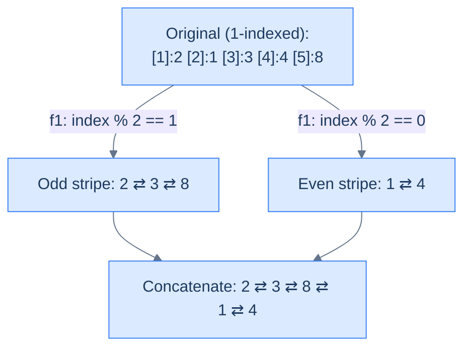

# Parity order

## Problem Statement

Given the **head** of a doubly linked list, write a function to group all the nodes that appear at odd indices together, followed by the nodes that appear at even indices, and return the head of the reordered list. **The indices start with `1`.**

## Examples

**Example 1:**
```
Input:  head = [2, 1, 3, 4, 8]
Output: [2, 3, 8, 1, 4]
```

**Example 2:**
```
Input:  head = []
Output: []
```

```quiz
{
  "prompt": "What is the output for head = [1, 2, 3, 4]?",
  "input": "head = [1, 2, 3, 4]",
  "options": ["[1, 2, 3, 4]", "[1, 3, 2, 4]", "[2, 4, 1, 3]", "[1, 4, 2, 3]"],
  "answer": "[1, 3, 2, 4]"
}
```

## Constraints

- `0 ≤ list length ≤ 10⁵`
- `-10⁴ ≤ node.val ≤ 10⁴`
- Indices are **1-based**
- Reorder **in place** — `O(1)` extra space beyond the two dummy nodes

```python run viz=linked-list viz-root=head
import ast

class ListNode:
    def __init__(self, val, prev=None, next=None):
        self.val = val
        self.prev = prev
        self.next = next

class Solution:
    def parity_order(self, head):
        # Your code goes here — split nodes into odd/even index buckets
        # (1-based), concatenate odd before even, with mirror updates on
        # every append and at the join.
        pass

def build_list(values):              # [1, 2, 3] → 1 ⇄ 2 ⇄ 3
    head = tail = None
    for v in values:
        node = ListNode(v, prev=tail)
        if tail is not None:
            tail.next = node
        else:
            head = node
        tail = node
    return head

def print_list(head):                # 1 ⇄ 2 ⇄ 3 → [1, 2, 3]
    out = []
    while head:
        out.append(head.val)
        head = head.next
    print(out)

head = build_list(ast.literal_eval(input()))   # the test case's head
print_list(Solution().parity_order(head))
```

```java run viz=linked-list viz-root=head
import java.util.*;

public class Main {
    static class ListNode {
        int val; ListNode prev, next;
        ListNode(int val) { this.val = val; }
    }

    static class Solution {
        ListNode parityOrder(ListNode head) {
            // Your code goes here — split nodes into odd/even index buckets
            // (1-based), concatenate odd before even, with mirror updates on
            // every append and at the join.
            return null;
        }
    }

    public static void main(String[] args) {
        ListNode head = buildList(parseIntArray(new Scanner(System.in).nextLine()));
        printList(new Solution().parityOrder(head));
    }

    static ListNode buildList(int[] values) {      // {1, 2, 3} → 1 ⇄ 2 ⇄ 3
        ListNode head = null, tail = null;
        for (int v : values) {
            ListNode node = new ListNode(v);
            node.prev = tail;
            if (tail != null) tail.next = node;
            else head = node;
            tail = node;
        }
        return head;
    }

    static void printList(ListNode head) {         // 1 ⇄ 2 ⇄ 3 → [1, 2, 3]
        List<Integer> out = new ArrayList<>();
        for (ListNode n = head; n != null; n = n.next) out.add(n.val);
        System.out.println(out);
    }

    // "[1, 2, 3]" → {1, 2, 3} — reads the test case's head
    static int[] parseIntArray(String line) {
        String inner = line.replaceAll("[\\[\\]\\s]", "");
        if (inner.isEmpty()) return new int[0];
        String[] parts = inner.split(",");
        int[] out = new int[parts.length];
        for (int i = 0; i < parts.length; i++) out[i] = Integer.parseInt(parts[i]);
        return out;
    }
}
```

```testcases
{
  "args": [
    { "id": "head", "label": "head", "type": "int[]", "placeholder": "[2, 1, 3, 4, 8]" }
  ],
  "cases": [
    { "args": { "head": "[2, 1, 3, 4, 8]" }, "expected": "[2, 3, 8, 1, 4]" },
    { "args": { "head": "[]" }, "expected": "[]" },
    { "args": { "head": "[1]" }, "expected": "[1]" },
    { "args": { "head": "[1, 2]" }, "expected": "[1, 2]" },
    { "args": { "head": "[1, 2, 3]" }, "expected": "[1, 3, 2]" },
    { "args": { "head": "[1, 2, 3, 4]" }, "expected": "[1, 3, 2, 4]" },
    { "args": { "head": "[5, 5, 5, 5, 5]" }, "expected": "[5, 5, 5, 5, 5]" },
    { "args": { "head": "[1, 2, 3, 4, 5, 6]" }, "expected": "[1, 3, 5, 2, 4, 6]" }
  ]
}
```

<details>
<summary><h2>What Does "Parity Order" Mean?</h2></summary>


Imagine numbering the nodes from 1 at the head. The **odd-indexed** nodes (positions 1, 3, 5, …) form one stripe; the **even-indexed** nodes (2, 4, 6, …) form the other. Parity order means: stripe-1 first, then stripe-2, in their original relative order.



<p align="center"><strong>Parity order — split by index parity, concatenate odd stripe before even stripe. The reorder skeleton with <code>f1 = counter is odd</code> and <code>f2 = simple concat</code>.</strong></p>

</details>
<details>
<summary><h2>Strategy</h2></summary>


This is the canonical reorder skeleton. `f1(node) = (counter % 2 == 1)`. `f2` is just concatenation. The only DLL-specific touch is wiring `prev` on every append and on the final concat join.

> **Algorithm**
>
> -   **Step 1:** Split — walk the list with a 1-based counter. Append each node to `oddDummy`'s tail or `evenDummy`'s tail based on `counter % 2`. Mirror `prev` on every append.
> -   **Step 2:** Terminate both sub-lists; null out the `prev` of each head.
> -   **Step 3:** Concatenate — `oddTail.next = evenHead; evenHead.prev = oddTail`.
> -   **Step 4:** Return `oddHead`.

</details>
<details>
<summary><h2>Solution &amp; Analysis</h2></summary>

### Solution


```python solution time=O(n) space=O(1)
import ast

class ListNode:
    def __init__(self, val, prev=None, next=None):
        self.val = val
        self.prev = prev
        self.next = next


class Solution:
    def split_by_parity(self, head):

        # Initialize head and tail references for the two split lists
        odd_dummy = ListNode(0)
        odd_tail = odd_dummy

        even_dummy = ListNode(0)
        even_tail = even_dummy

        # Create current reference to iterate through the list
        current = head

        # To track alternate positions
        counter = 1

        # Iterate through the list and split nodes into two lists
        while current:

            # If the counter is odd then the node goes to the odd list
            if counter % 2 == 1:

                # `current` node goes to the odd split list
                odd_tail.next = current
                current.prev = odd_tail
                odd_tail = odd_tail.next

            # Otherwise, the node goes to the even list
            else:

                # `current` node goes to the even split list
                even_tail.next = current
                current.prev = even_tail
                even_tail = even_tail.next

            # Move to the next node in the original list
            current = current.next
            counter += 1

        # Terminate the odd list from the beginning and end
        if odd_dummy.next is not None:
            odd_dummy.next.prev = None
        odd_tail.next = None

        # Terminate the even list from the beginning and end
        if even_dummy.next is not None:
            even_dummy.next.prev = None
        even_tail.next = None

        return odd_dummy.next, even_dummy.next

    def merge_odd_and_even_lists(self, odd_head, even_head):

        # If the odd list is empty return the even list
        if not odd_head:
            return even_head

        # If the even list is empty return the odd list
        if not even_head:
            return odd_head

        # Traverse to the end of the odd list
        current = odd_head
        while current.next:
            current = current.next

        # Connect the even list at the end of the odd list
        current.next = even_head
        even_head.prev = current

        return odd_head

    def parity_order(self, head):

        # If the list is empty or contains only one node, no splitting is
        # necessary
        if not head or not head.next:
            return head

        # Split the list into odd and even lists
        odd_head, even_head = self.split_by_parity(head)

        # Append the even list at the end of the odd list and
        # return the head of the merged list
        return self.merge_odd_and_even_lists(odd_head, even_head)


def build_list(values):              # [1, 2, 3] → 1 ⇄ 2 ⇄ 3
    head = tail = None
    for v in values:
        node = ListNode(v, prev=tail)
        if tail is not None:
            tail.next = node
        else:
            head = node
        tail = node
    return head


def print_list(head):                # 1 ⇄ 2 ⇄ 3 → [1, 2, 3]
    out = []
    while head:
        out.append(head.val)
        head = head.next
    print(out)


head = build_list(ast.literal_eval(input()))   # the test case's head
print_list(Solution().parity_order(head))
```

```java solution
import java.util.*;

public class Main {
    static class ListNode {
        int val; ListNode prev, next;
        ListNode(int val) { this.val = val; }
    }

    static class Solution {
        private List<ListNode> splitByParity(ListNode head) {

            // Initialize head and tail references for the two split lists
            ListNode oddDummy = new ListNode(0);
            ListNode oddTail = oddDummy;

            ListNode evenDummy = new ListNode(0);
            ListNode evenTail = evenDummy;

            // Create current reference to iterate through the list
            ListNode current = head;

            // To track alternate positions
            int counter = 1;

            // Iterate through the list and split nodes into two lists
            while (current != null) {

                // If the counter is odd then the node goes to the odd list
                if (counter % 2 == 1) {

                    // `current` node goes to the odd split list
                    oddTail.next = current;
                    current.prev = oddTail;
                    oddTail = oddTail.next;
                }

                // Otherwise, the node goes to the even list
                else {

                    // `current` node goes to the even split list
                    evenTail.next = current;
                    current.prev = evenTail;
                    evenTail = evenTail.next;
                }

                // Move to the next node in the original list
                current = current.next;
                counter++;
            }

            // Terminate the odd list from the beginning and end
            if (oddDummy.next != null) {
                oddDummy.next.prev = null;
            }
            oddTail.next = null;

            // Terminate the even list from the beginning and end
            if (evenDummy.next != null) {
                evenDummy.next.prev = null;
            }
            evenTail.next = null;

            return Arrays.asList(oddDummy.next, evenDummy.next);
        }

        private ListNode mergeOddAndEvenLists(ListNode oddHead, ListNode evenHead) {

            // If the odd list is empty return the even list
            if (oddHead == null) {
                return evenHead;
            }

            // If the even list is empty return the odd list
            if (evenHead == null) {
                return oddHead;
            }

            // Traverse to the end of the odd list
            ListNode current = oddHead;
            while (current.next != null) {
                current = current.next;
            }

            // Connect the even list at the end of the odd list
            current.next = evenHead;
            evenHead.prev = current;

            return oddHead;
        }

        public ListNode parityOrder(ListNode head) {

            // If the list is empty or contains only one node, no splitting
            // is necessary
            if (head == null || head.next == null) {
                return head;
            }

            // Split the list into odd and even lists
            List<ListNode> heads = splitByParity(head);
            ListNode oddHead = heads.get(0);
            ListNode evenHead = heads.get(1);

            // Append the even list at the end of the odd list and
            // return the head of the merged list
            return mergeOddAndEvenLists(oddHead, evenHead);
        }
    }

    public static void main(String[] args) {
        ListNode head = buildList(parseIntArray(new Scanner(System.in).nextLine()));
        printList(new Solution().parityOrder(head));
    }

    static ListNode buildList(int[] values) {      // {1, 2, 3} → 1 ⇄ 2 ⇄ 3
        ListNode head = null, tail = null;
        for (int v : values) {
            ListNode node = new ListNode(v);
            node.prev = tail;
            if (tail != null) tail.next = node;
            else head = node;
            tail = node;
        }
        return head;
    }

    static void printList(ListNode head) {         // 1 ⇄ 2 ⇄ 3 → [1, 2, 3]
        List<Integer> out = new ArrayList<>();
        for (ListNode n = head; n != null; n = n.next) out.add(n.val);
        System.out.println(out);
    }

    // "[1, 2, 3]" → {1, 2, 3} — reads the test case's head
    static int[] parseIntArray(String line) {
        String inner = line.replaceAll("[\\[\\]\\s]", "");
        if (inner.isEmpty()) return new int[0];
        String[] parts = inner.split(",");
        int[] out = new int[parts.length];
        for (int i = 0; i < parts.length; i++) out[i] = Integer.parseInt(parts[i]);
        return out;
    }
}
```


<details>
<summary><strong>Trace — head = [2, 1, 3, 4, 8]</strong></summary>

```
Split (counter starts at 1) — each append wires tail.next AND current.prev:
  Step 1 │ counter=1, val=2 │ odd_tail.next=2,  2.prev=odd_tail  │ odd:  2
  Step 2 │ counter=2, val=1 │ even_tail.next=1, 1.prev=even_tail │ even: 1
  Step 3 │ counter=3, val=3 │ odd_tail.next=3,  3.prev=odd_tail  │ odd:  2 ⇄ 3
  Step 4 │ counter=4, val=4 │ even_tail.next=4, 4.prev=even_tail │ even: 1 ⇄ 4
  Step 5 │ counter=5, val=8 │ odd_tail.next=8,  8.prev=odd_tail  │ odd:  2 ⇄ 3 ⇄ 8

Terminate lists (null the head's prev, null the tail's next):
  odd:  2 ⇄ 3 ⇄ 8   (odd_dummy.next.prev = None; odd_tail.next = None)
  even: 1 ⇄ 4       (even_dummy.next.prev = None; even_tail.next = None)

Concat (merge_odd_and_even_lists — wire both directions):
  walk odd to 8.   8.next = 1;  1.prev = 8.
Result: [2, 3, 8, 1, 4] ✓
```

</details>

### Complexity Analysis

| Metric | Cost | Why |
|---|---|---|
| Time  | **O(N)** | One split pass + one walk to concat. |
| Space | **O(1)** | Two dummies and a fixed number of pointers. |

### Edge Cases

| Case | Example | Expected | Reasoning |
|---|---|---|---|
| Empty | `[]` | `[]` | Guard at top returns immediately. |
| Single node | `[5]` | `[5]` | One node is at index 1 — already in odd stripe alone. |
| Two nodes | `[5, 7]` | `[5, 7]` | Already partitioned: 5 odd, 7 even. |
| All odd-length | `[1,2,3]` | `[1, 3, 2]` | Odd stripe gets 2 nodes, even gets 1. |

</details>
<details>
<summary><h2>Intuition</h2></summary>

The **structural property** that makes this a reorder problem is that the output reuses every input node in a different order — the work is purely structural, with no value comparison. The reorder is decided by each node's 1-based position in the input, which is an `O(1)` classifier evaluated while you walk the list. On a DLL, both directions of every splice must stay in sync, so each append wires two pointers instead of one — but the pipeline shape is identical to the singly-linked version.

The **pointer placement** follows directly. Maintain four cursors plus a counter. `odd_dummy` / `odd_tail` grow the odd-indexed sub-list; `even_dummy` / `even_tail` grow the even-indexed sub-list; `current` walks the input; `counter` (starting at `1`) tracks the current 1-based index. Each iteration evaluates `counter % 2 == 1` to choose a bucket, splices `current` onto that bucket's tail with both `tail.next = current` and `current.prev = tail`, advances `current` and increments `counter`. After the loop, terminate both buckets in both directions — null the new heads' `prev` AND the tails' `next` — then concatenate with `odd_tail.next = even_head` AND `even_head.prev = odd_tail`.

What **breaks if you reach for a naive approach**? Copying every value into two arrays, concatenating, and rebuilding a fresh DLL works in `O(n)` time but pays `O(n)` extra memory and allocates `n` new nodes. Trying to do it with in-place node swaps on a single DLL is even messier than on a singly-linked list — every swap risks corrupting either chain because there's no `O(1)` way to swap two non-adjacent DLL nodes (each swap requires patching four boundary links). The two-bucket split sidesteps the swap problem entirely: each node is appended exactly once with both directions wired on the way in.

</details>
<details>
<summary><h2>Applying the Diagnostic Questions</h2></summary>

| Check | Answer for Parity Order |
|---|---|
| **Q1.** Does the problem rearrange the nodes of one input DLL in place? | **Yes** — every input node appears in the output exactly once; only `prev` and `next` fields change. |
| **Q2.** Can the target be expressed as classifier + selector? | **Yes** — `f1(node, counter) = counter % 2` routes nodes into odd / even buckets in `O(1)` per node; `f2 = concatenate` joins the even bucket after the odd bucket with `oddTail.next = evenHead` and `evenHead.prev = oddTail`. |
| **Q3.** Are the sub-lists bounded in count and walkable in one pass? | **Yes** — exactly two buckets; the merge step is a single mirrored splice. |
| **Q4.** Is `O(1)` extra space sufficient? | **Yes** — two dummy heads plus a handful of cursors (`odd_tail`, `even_tail`, `current`, `counter`) regardless of input size. |

</details>
<details>
<summary><h2>Approach</h2></summary>

Run the reorder pipeline with `f1 = counter % 2` and `f2 = concatenate`, with both directions wired on every attach.

1. **Short-circuit trivial inputs.** If `head` is `null` or `head.next` is `null`, return `head` unchanged. A list with zero or one node already satisfies the target shape.
2. **Initialise the two bucket skeletons.** Create `odd_dummy = ListNode(0)` and `odd_tail = odd_dummy`; create `even_dummy = ListNode(0)` and `even_tail = even_dummy`. The dummies let every splice use the same shape without a special case for the first node in each bucket; the dummies' `prev` fields never get read, so they need not be initialised.
3. **Initialise the walk state.** Set `current = head` and `counter = 1`. The counter is 1-based to match the problem's "indices start at 1" rule.
4. **Loop while `current` is non-`null`.** Each iteration evaluates `counter % 2`. If the result is `1` (odd index), splice `current` onto `odd_tail` by writing both `odd_tail.next = current` and `current.prev = odd_tail`, then advance `odd_tail`. Otherwise (even index), do the mirrored splice onto `even_tail`.
5. **Advance the walk.** After the bucket splice, set `current = current.next` and `counter += 1`. The order matters: the splice rewrote `tail.next` and `current.prev`, but `current.next` still points into the input chain, so we read it one more time to advance.
6. **Terminate both buckets in both directions.** When the loop exits, set `odd_tail.next = null` and `even_tail.next = null` (forward terminators) AND `odd_dummy.next.prev = null` and `even_dummy.next.prev = null` (back-link terminators on the new heads, when the buckets are non-empty). Without the back-link nulls, the new heads' `prev` still points at the throwaway dummies — a dangling reference that breaks backward traversal.
7. **Concatenate the buckets with the mirror.** Walk `odd_head`'s suffix to its tail (the loop's `odd_tail` already holds this reference), then set `odd_tail.next = even_head` AND `even_head.prev = odd_tail`. The merged list is now bidirectionally consistent.
8. **Return the head of the merged list.** Skip the throwaway `odd_dummy` and return `odd_dummy.next`.

</details>
<details>
<summary><h2>Dry Run — Example 1</h2></summary>

See the **Trace — head = [2, 1, 3, 4, 8]** block inside *Solution & Analysis* above for the line-by-line walk. The key beats: five iterations split the list into `odd: 2 ⇄ 3 ⇄ 8` and `even: 1 ⇄ 4`; the terminate step nulls both ends of both buckets in both directions; the concatenate step writes `8.next = 1` AND `1.prev = 8` so the join is mirrored. Final list: `2 ⇄ 3 ⇄ 8 ⇄ 1 ⇄ 4`.

</details>
<details>
<summary><h2>Key Takeaway</h2></summary>

Parity-order is the canonical reorder example on a DLL — the classifier reads a counter, not a value, and the merge step is plain concatenation with two mirrored writes (`tail.next = head` AND `head.prev = tail`). Master the bucket-append-with-mirror discipline here and every other concatenate-after-split variant on a DLL is a one-line swap of the classifier.

</details>
