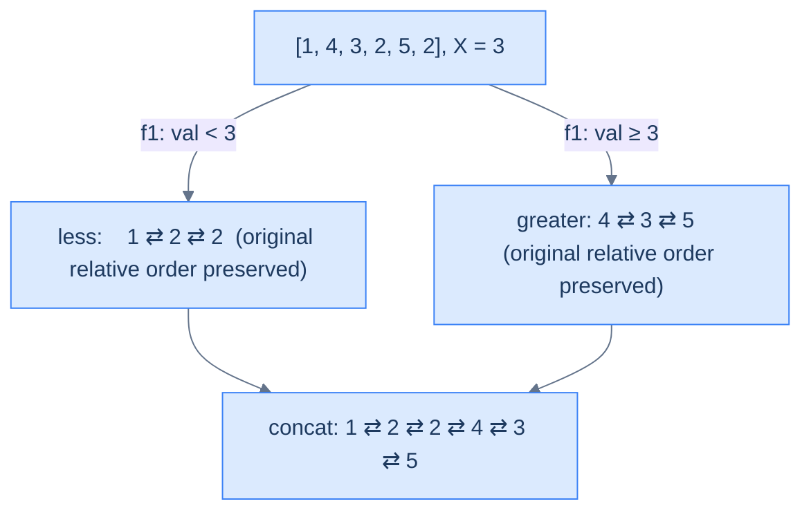

# Value partition

## The Problem

> Given the **head** of a doubly linked list and a value **X**, write a function to partition the list such that all nodes less than X come before nodes greater than or equal to X, and return the head of the reordered list. The original relative order of the nodes in each of the two partitions should be preserved.

```
Example 1
  Input:  head = [1, 4, 3, 2, 5, 2], X = 3
  Output: [1, 2, 2, 4, 3, 5]
  Reason: <3 → 1,2,2  ;  ≥3 → 4,3,5

Example 2
  Input:  head = [2, 1], X = 2
  Output: [1, 2]
  Reason: <2 → 1  ;  ≥2 → 2
```

<details>
<summary><h2>What Does "Stable Partition" Mean?</h2></summary>


Stability is the catch. Sorting would also produce a valid partition, but it would scramble the relative order inside each part. Here we must preserve order: among nodes `< X`, the one that came first stays first; same for the `>= X` group. This is exactly what the split-and-concat skeleton gives us automatically — appending to a tail keeps insertion order intact.



<p align="center"><strong>Stable value partition — appending nodes in scan order to each tail preserves the original ordering inside each bucket. Concat with mirror gives the final DLL.</strong></p>

</details>
<details>
<summary><h2>Strategy</h2></summary>


This is the same template you saw at the top of the lesson. `f1(node) = (node.val < X)`. `f2` is plain concatenation. The DLL bookkeeping is what matters: every append wires `prev`, and the join between the two stripes wires both directions.

> **Algorithm**
>
> -   **Step 1:** Split — walk the list, route each node into `lessTail` if `node.val < X` else into `greaterTail`. Mirror `prev` on every append.
> -   **Step 2:** Terminate both sub-lists; null `prev` on each head.
> -   **Step 3:** Concatenate — walk to the end of less-list (or use the saved `lessTail`), then `lessTail.next = greaterHead; greaterHead.prev = lessTail`.
> -   **Step 4:** Return `lessHead` (or `greaterHead` if less-list is empty).

</details>
<details>
<summary><h2>Solution &amp; Analysis</h2></summary>

### The Solution

This is the same code we showed in the **Identifying the reorder pattern** section earlier — re-presented here as the dedicated problem solution.


```python run viz=linked-list viz-root=head
from typing import Optional

class ListNode:
    def __init__(self, val=0, prev=None, nxt=None):
        self.val = val
        self.prev = prev
        self.next = nxt


def from_list(values):
    if not values:
        return None
    head = ListNode(values[0])
    cur = head
    for v in values[1:]:
        node = ListNode(v, prev=cur)
        cur.next = node
        cur = node
    return head


def to_list(head):
    out = []
    while head is not None:
        out.append(head.val)
        head = head.next
    return out


class Solution:
    def split_list_by_value(
        self, head: Optional[ListNode], X: int
    ) -> list:

        # Create dummy nodes to initialize the heads of two separate
        # lists. List for nodes with values less than X.
        less_dummy = ListNode(0)
        less_tail = less_dummy

        # List for nodes with values greater than or equal to X.
        greater_dummy = ListNode(0)
        greater_tail = greater_dummy

        # Start traversing the original list from the head.
        current = head

        # Traverse and split nodes based on the value of X.
        while current:

            # If the value of the current node is less than X, it should
            # be appended to the list for nodes < X.
            if current.val < X:

                # Append current node to list for nodes < X.
                less_tail.next = current

                # Set the previous pointer of the current node to
                # less_tail
                current.prev = less_tail

                # Move less_tail to the newly added node.
                less_tail = less_tail.next

            # Otherwise, the value of the current node is greater than
            # or equal to X, and it should be appended to the list for
            # nodes >= X.
            else:

                # Append current node to list for nodes >= X.
                greater_tail.next = current

                # Set the previous pointer of the current node to
                # greater_tail
                current.prev = greater_tail

                # Move greater_tail to the newly added node.
                greater_tail = greater_tail.next

            # Proceed to the next node in the original list.
            current = current.next

        # Terminate the odd list from the beginning and end
        if less_dummy.next is not None:
            less_dummy.next.prev = None
        less_tail.next = None

        # Terminate the even list from the beginning and end
        if greater_dummy.next is not None:
            greater_dummy.next.prev = None
        greater_tail.next = None

        # Return heads of both lists, excluding dummy nodes.
        return [less_dummy.next, greater_dummy.next]

    def merge_less_and_greater_lists(
        self,
        less_head: Optional[ListNode],
        greater_head: Optional[ListNode],
    ) -> Optional[ListNode]:

        # If the first list (less_head) is empty, return greater_head as
        # the concatenated list.
        if less_head is None:
            return greater_head

        # If the second list (greater_head) is empty, return less_head as
        # the concatenated list.
        if greater_head is None:
            return less_head

        # Find the end of the first list (less_head) to append
        # greater_head.
        current = less_head
        while current and current.next:
            current = current.next

        # Append greater_head to the end of less_head.
        current.next = greater_head

        # Set the previous pointer of the greater_tail node to current
        greater_head.prev = current

        return less_head

    def value_partition(
        self, head: Optional[ListNode], X: int
    ) -> Optional[ListNode]:

        # Return the head if the list is empty or has only one node.
        if head is None or head.next is None:
            return head

        # Split the original list into two lists: nodes < X and nodes >=
        # X.
        heads = self.split_list_by_value(head, X)

        # Head of list with nodes < X.
        less_head = heads[0]

        # Head of list with nodes >= X.
        greater_head = heads[1]

        # Merge both lists and return the head of the combined list.
        return self.merge_less_and_greater_lists(less_head, greater_head)


# Examples from the problem statement
head = from_list([1, 4, 3, 2, 5, 2])
print(to_list(Solution().value_partition(head, 3)))   # [1, 2, 2, 4, 3, 5]

head = from_list([2, 1])
print(to_list(Solution().value_partition(head, 2)))   # [1, 2]

# Edge cases
head = from_list([1])
print(to_list(Solution().value_partition(head, 5)))   # [1]

head = from_list([5, 6, 7])
print(to_list(Solution().value_partition(head, 3)))   # [5, 6, 7]

head = from_list([1, 2, 3])
print(to_list(Solution().value_partition(head, 10)))  # [1, 2, 3]

head = from_list([3, 1, 4, 1, 5, 9])
print(to_list(Solution().value_partition(head, 4)))   # [3, 1, 1, 4, 5, 9]

head = from_list([1, 2, 3, 4, 5])
print(to_list(Solution().value_partition(head, 3)))   # [1, 2, 3, 4, 5]

head = from_list([5, 4, 3, 2, 1])
print(to_list(Solution().value_partition(head, 3)))   # [2, 1, 5, 4, 3]
```

```java run viz=linked-list viz-root=head
import java.util.*;

public class Main {
    static class ListNode {
        int val;
        ListNode prev;
        ListNode next;
        ListNode() {}
        ListNode(int val) { this.val = val; }
    }

    static ListNode fromList(int... values) {
        if (values.length == 0) return null;
        ListNode head = new ListNode(values[0]);
        ListNode cur = head;
        for (int i = 1; i < values.length; i++) {
            ListNode node = new ListNode(values[i]);
            node.prev = cur;
            cur.next = node;
            cur = node;
        }
        return head;
    }

    static java.util.List<Integer> toList(ListNode head) {
        java.util.List<Integer> out = new java.util.ArrayList<>();
        while (head != null) { out.add(head.val); head = head.next; }
        return out;
    }

    static class Solution {
        private List<ListNode> splitListByValue(ListNode head, int X) {

            // Create dummy nodes to initialize the heads of two separate
            // lists. List for nodes with values less than X.
            ListNode lessDummy = new ListNode(0);
            ListNode lessTail = lessDummy;

            // List for nodes with values greater than or equal to X.
            ListNode greaterDummy = new ListNode(0);
            ListNode greaterTail = greaterDummy;

            // Start traversing the original list from the head.
            ListNode current = head;

            // Traverse and split nodes based on the value of X.
            while (current != null) {

                // If the value of the current node is less than X, it should
                // be appended to the list for nodes < X.
                if (current.val < X) {

                    // Append current node to list for nodes < X.
                    lessTail.next = current;

                    // Set the previous pointer of the current node to
                    // lessTail
                    current.prev = lessTail;

                    // Move lessTail to the newly added node.
                    lessTail = lessTail.next;
                }

                // Otherwise, the value of the current node is greater than
                // or equal to X, and it should be appended to the list for
                // nodes >= X.
                else {

                    // Append current node to list for nodes >= X.
                    greaterTail.next = current;

                    // Set the previous pointer of the current node to
                    // greaterTail
                    current.prev = greaterTail;

                    // Move greaterTail to the newly added node.
                    greaterTail = greaterTail.next;
                }

                // Proceed to the next node in the original list.
                current = current.next;
            }

            // Terminate the odd list from the beginning and end
            if (lessDummy.next != null) {
                lessDummy.next.prev = null;
            }
            lessTail.next = null;

            // Terminate the even list from the beginning and end
            if (greaterDummy.next != null) {
                greaterDummy.next.prev = null;
            }
            greaterTail.next = null;

            // Return heads of both lists, excluding dummy nodes.
            return Arrays.asList(lessDummy.next, greaterDummy.next);
        }

        private ListNode mergeLessAndGreaterLists(
            ListNode lessHead,
            ListNode greaterHead
        ) {

            // If the first list (lessHead) is empty, return greaterHead as
            // the concatenated list.
            if (lessHead == null) {
                return greaterHead;
            }

            // If the second list (greaterHead) is empty, return lessHead as
            // the concatenated list.
            if (greaterHead == null) {
                return lessHead;
            }

            // Find the end of the first list (lessHead) to append
            // greaterHead.
            ListNode current = lessHead;
            while (current != null && current.next != null) {
                current = current.next;
            }

            // Append greaterHead to the end of lessHead.
            current.next = greaterHead;

            // Set the previous pointer of the greaterTail node to current
            greaterHead.prev = current;

            return lessHead;
        }

        public ListNode valuePartition(ListNode head, int X) {

            // Return the head if the list is empty or has only one node.
            if (head == null || head.next == null) {
                return head;
            }

            // Split the original list into two lists: nodes < X and nodes >=
            // X.
            List<ListNode> heads = splitListByValue(head, X);

            // Head of list with nodes < X.
            ListNode lessHead = heads.get(0);

            // Head of list with nodes >= X.
            ListNode greaterHead = heads.get(1);

            // Merge both lists and return the head of the combined list.
            return mergeLessAndGreaterLists(lessHead, greaterHead);
        }
    }

    public static void main(String[] args) {
        // Examples from the problem statement
        System.out.println(toList(new Solution().valuePartition(fromList(1, 4, 3, 2, 5, 2), 3)));  // [1, 2, 2, 4, 3, 5]
        System.out.println(toList(new Solution().valuePartition(fromList(2, 1), 2)));               // [1, 2]

        // Edge cases
        System.out.println(toList(new Solution().valuePartition(fromList(1), 5)));                  // [1]
        System.out.println(toList(new Solution().valuePartition(fromList(5, 6, 7), 3)));            // [5, 6, 7]
        System.out.println(toList(new Solution().valuePartition(fromList(1, 2, 3), 10)));           // [1, 2, 3]
        System.out.println(toList(new Solution().valuePartition(fromList(3, 1, 4, 1, 5, 9), 4)));   // [3, 1, 1, 4, 5, 9]
        System.out.println(toList(new Solution().valuePartition(fromList(1, 2, 3, 4, 5), 3)));      // [1, 2, 3, 4, 5]
        System.out.println(toList(new Solution().valuePartition(fromList(5, 4, 3, 2, 1), 3)));      // [2, 1, 5, 4, 3]
    }
}
```


<details>
<summary><strong>Trace — head = [1, 4, 3, 2, 5, 2], X = 3</strong></summary>

```
Split (split_list_by_value) — each append wires tail.next AND current.prev:
  Step 1 │ val=1, 1 < 3 │ less_tail.next=1,    1.prev=less_tail    │ less:    1
  Step 2 │ val=4, 4 ≥ 3 │ greater_tail.next=4, 4.prev=greater_tail │ greater: 4
  Step 3 │ val=3, 3 ≥ 3 │ greater_tail.next=3, 3.prev=greater_tail │ greater: 4 ⇄ 3
  Step 4 │ val=2, 2 < 3 │ less_tail.next=2,    2.prev=less_tail    │ less:    1 ⇄ 2
  Step 5 │ val=5, 5 ≥ 3 │ greater_tail.next=5, 5.prev=greater_tail │ greater: 4 ⇄ 3 ⇄ 5
  Step 6 │ val=2, 2 < 3 │ less_tail.next=2,    2.prev=less_tail    │ less:    1 ⇄ 2 ⇄ 2

Concat (merge_less_and_greater_lists — wire both directions):
  walk less to 2 (last). 2.next = 4;  4.prev = 2.
Result: [1, 2, 2, 4, 3, 5] ✓
```

</details>

### Complexity Analysis

| Metric | Cost | Why |
|---|---|---|
| Time  | **O(N)** | One split pass + one walk for the join. |
| Space | **O(1)** | Two dummies, no allocations. |

### Edge Cases

| Case | Example | Expected | Reasoning |
|---|---|---|---|
| All `< X` | `[1,2], X=5` | `[1,2]` | Greater list empty; return less list directly. |
| All `≥ X` | `[5,7], X=3` | `[5,7]` | Less list empty; return greater list directly. |
| `X` not present | `[1,4], X=3` | `[1,4]` | Already partitioned — output equals input. |
| Duplicates of `X` | `[1,3,3,2], X=3` | `[1,2,3,3]` | The two 3's go to greater (since `≥`), order preserved. |

</details>
## Examples

**Example 1**
```
Input:  head = [1, 4, 3, 2, 5, 2], X = 3
Output: [1, 2, 2, 4, 3, 5]
Explanation: Less-than-X stripe (vals < 3) = 1 ⇄ 2 ⇄ 2 in input order. Greater-or-equal stripe (vals ≥ 3) = 4 ⇄ 3 ⇄ 5 in input order. Concatenate with the mirror wired: 2 (last less).next = 4 AND 4.prev = 2.
```

**Example 2**
```
Input:  head = [2, 1], X = 2
Output: [1, 2]
Explanation: Less stripe = 1; greater stripe = 2. Concatenate: 1.next = 2 AND 2.prev = 1.
```

**Example 3**
```
Input:  head = [5, 4, 3, 2, 1], X = 3
Output: [2, 1, 5, 4, 3]
Explanation: Less stripe = 2 ⇄ 1 (input order); greater stripe = 5 ⇄ 4 ⇄ 3 (input order). Concatenate gives [2, 1, 5, 4, 3].
```

**Example 4**
```
Input:  head = [5, 6, 7], X = 3
Output: [5, 6, 7]
Explanation: Every value is ≥ X, so the less stripe is empty. The merge returns the greater stripe directly — equal to the input.
```

<details>
<summary><h2>Intuition</h2></summary>

The **structural property** that makes this a reorder problem is that the output reuses every input node — only `prev` and `next` fields change — and the target order is decided by a simple `O(1)` classifier on each node's value. The split-and-merge pipeline fits cleanly: route nodes into two buckets by `val < X`, then concatenate with the mirror. The "preserve relative order within each bucket" requirement is the stability constraint, and it is satisfied automatically because each pass walks the input in forward order and appends to the bucket tail — the order in which two nodes hit the same bucket is the order they leave it.

The **pointer placement** follows directly. Maintain four cursors: `less_head` (a dummy) / `less_tail` grow the bucket of nodes with `val < X`; `greater_head` (a dummy) / `greater_tail` grow the bucket of nodes with `val >= X`. A single `current` walks the input. Each iteration reads `current.val`, evaluates the comparison against `X`, and splices `current` onto the chosen bucket's tail with both `tail.next = current` AND `current.prev = tail`. After the loop, both bucket tails terminate with `null` AND both new heads' `prev` fields are zeroed; the merge step is `less_tail.next = greater_head` AND `greater_head.prev = less_tail` — one paired splice.

What **breaks if you reach for a naive approach**? Copying every value into two arrays, concatenating, and rebuilding a fresh DLL works in `O(n)` time but pays `O(n)` extra memory and allocates `n` new nodes. Trying an in-place "swap nodes when out of order" pass like array quickselect partition is much harder on a DLL than on an array — every node swap requires patching four boundary links (two `next` and two `prev`), and on non-adjacent swaps you must locate two sets of neighbours. The two-bucket split avoids the swap problem entirely: every node is appended exactly once with both directions wired, and the chain is never partially broken.

</details>
<details>
<summary><h2>Applying the Diagnostic Questions</h2></summary>

| Check | Answer for Value Partition |
|---|---|
| **Q1.** Does the problem rearrange the nodes of one input DLL in place? | **Yes** — every input node appears in the output exactly once; only `prev` and `next` fields change. |
| **Q2.** Can the target be expressed as classifier + selector? | **Yes** — `f1(node) = node.val < X` routes nodes into less / greater-or-equal buckets in `O(1)` per node; `f2 = concatenate` joins the buckets with `lessTail.next = greaterHead` and `greaterHead.prev = lessTail`. |
| **Q3.** Are the sub-lists bounded in count and walkable in one pass? | **Yes** — exactly two buckets; the merge step is a single mirrored splice. |
| **Q4.** Is `O(1)` extra space sufficient? | **Yes** — two dummy heads plus a handful of cursors regardless of input size. The output reuses the input nodes — no fresh allocations beyond the throwaway dummies. |

</details>
<details>
<summary><h2>Approach</h2></summary>

Run the reorder pipeline with `f1 = (val < X)` and `f2 = concatenate`, with the mirror wired on every attach.

1. **Short-circuit trivial inputs.** If `head` is `null` or `head.next` is `null`, return `head` unchanged. A list with zero or one node is already trivially partitioned.
2. **Initialise the two bucket skeletons.** Create `less_dummy = ListNode(0)` and `less_tail = less_dummy`; create `greater_dummy = ListNode(0)` and `greater_tail = greater_dummy`. The dummies anchor the splices so the first node in each bucket needs no special case.
3. **Walk the input with a single cursor.** Set `current = head`. Loop while `current` is non-`null`. Each iteration evaluates `current.val < X`.
4. **Inside the loop, splice into the chosen bucket with the mirror.** If the value is less than `X`, write `less_tail.next = current` AND `current.prev = less_tail`, then advance `less_tail = less_tail.next`. Otherwise do the mirrored splice onto `greater_tail`. The append-to-tail discipline preserves the input's relative order within each bucket — *if* you append, never prepend.
5. **Advance the walk.** After the bucket splice, set `current = current.next`. The splice rewrote `tail.next` and `current.prev`; `current.next` still points into the input chain.
6. **Terminate both buckets in both directions.** When the loop exits, set `less_tail.next = null` and `greater_tail.next = null` (forward terminators) AND zero each non-empty bucket's new head's `prev`. Without the back-link nulls, both heads still point back at their throwaway dummies — a dangling reference that breaks backward traversal.
7. **Concatenate the buckets with the mirror.** Walk to the end of the less bucket (or use the saved `less_tail`), then write `less_tail.next = greater_head` AND `greater_head.prev = less_tail`. Handle the two edge cases inline: if the less bucket is empty, return the greater bucket's head; if the greater bucket is empty, return the less bucket's head — neither needs the concat step.
8. **Return the head of the merged list.** Skip the throwaway `less_dummy` and return `less_dummy.next` (or `greater_dummy.next` when the less bucket is empty).

</details>
<details>
<summary><h2>Dry Run — Example 1</h2></summary>

See the **Trace — head = [1, 4, 3, 2, 5, 2], X = 3** block inside *Solution & Analysis* above for the line-by-line walk. The key beats: six iterations split the list into `less: 1 ⇄ 2 ⇄ 2` (input order) and `greater: 4 ⇄ 3 ⇄ 5` (input order); the terminate step zeroes the `next` fields at the bucket tails AND the `prev` fields at the new heads so neither dummy survives in the chain; the concat step writes `last-less-2.next = 4` AND `4.prev = last-less-2` so the join is mirrored. Final list: `1 ⇄ 2 ⇄ 2 ⇄ 4 ⇄ 3 ⇄ 5`.

</details>
<details>
<summary><h2>Key Takeaway</h2></summary>

Value-partition is the stable-partition variant of reorder on a DLL — the classifier reads `val < X` and the merge step is plain concatenation, each splice paired with its mirror. The bucket-append discipline (append to the tail, never the head) is what guarantees the stability the problem requires; the mirror writes keep `prev` honest.

</details>
