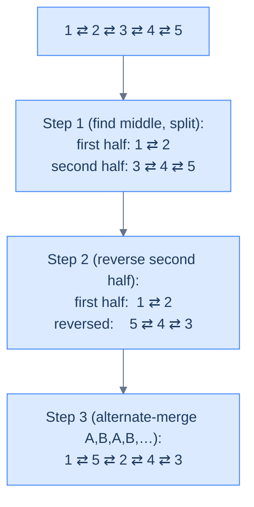

# Shuffle list

## The Problem

> Given the **head** of a doubly linked list represented as **L₀ → L₁ → … → Lₙ₋₁ → Lₙ**, reorder the list **in place** to match: **L₀ → Lₙ → L₁ → Lₙ₋₁ → L₂ → Lₙ₋₂ → …**

```
Example 1
  Input:  head = [1, 2, 3, 4]
  Output: [1, 4, 2, 3]
  Reason: Pair the front with the back, walking inward.

Example 2
  Input:  head = [1, 2, 3, 4, 5]
  Output: [1, 5, 2, 4, 3]
  Reason: Same pattern; the middle (3) lands alone at the end.
```

<details>
<summary><h2>What Makes Shuffle Tricky?</h2></summary>


The output interleaves the **first half** with the **reversed second half**. That's the whole insight — and it's the moment three primitives stack: find the middle, reverse the right half, alternate-merge.



<p align="center"><strong>Shuffle = three primitives stacked. Each is something you've already mastered; the algorithm is the choreography of stacking them in order.</strong></p>

</details>
<details>
<summary><h2>Strategy</h2></summary>


This is the *boss fight* of the lesson. The reorder skeleton handles split (via fast/slow) and merge (alternate selector). What's new is the **reverse** in the middle — a primitive from the reversal lesson, where DLL reversal is gloriously short: just `swap(prev, next)` on every node.

> **Algorithm**
>
> -   **Step 1 — find the middle (fast/slow):** advance `slow` by 1 and `fast` by 2 each iteration; when `fast` falls off the end, `slow` is the middle.
> -   **Step 2 — split into two halves:** for **even-length** lists, `secondHalf = slow`; for **odd-length** lists, `secondHalf = slow.next`. Sever the boundary in both directions.
> -   **Step 3 — reverse the second half:** for each node, swap `prev` and `next`. The old tail becomes the new head.
> -   **Step 4 — alternate-merge:** weave nodes one-from-A, one-from-B, …, with mirror updates on every attach.

> *Friction prompt — predict before reading on: why does even-length use `slow` as the start of the second half, but odd-length uses `slow.next`?*

(Answer: with even length `n=4`, after the fast/slow walk `slow` ends on index `n/2 = 2`, which is the first node of the second half — split there. With odd length `n=5`, `slow` ends on the dead-centre middle (index `2`), which we want to **keep in the first half** so the lone middle ends up last in the shuffled output; the second half therefore starts at `slow.next`.)

</details>
<details>
<summary><h2>Solution &amp; Analysis</h2></summary>

### The Solution

```python run viz=linked-list viz-root=head
from typing import Optional, List

class ListNode:
    def __init__(self, val=0, prev=None, nxt=None):
        self.val = val
        self.prev = prev
        self.next = nxt


def from_list(values):
    if not values:
        return None
    head = ListNode(values[0])
    cur = head
    for v in values[1:]:
        node = ListNode(v, prev=cur)
        cur.next = node
        cur = node
    return head


def to_list(head):
    out = []
    while head is not None:
        out.append(head.val)
        head = head.next
    return out


class Solution:
    def reverse(self, head: Optional[ListNode]) -> Optional[ListNode]:
        current = head
        previous = None

        while current is not None:
            next_node = current.next
            current.prev, current.next = current.next, current.prev
            previous = current
            current = next_node
        return previous

    def split_list_in_half(
        self, head: Optional[ListNode]
    ) -> List[Optional[ListNode]]:

        # Initialize slow and fast pointers to find the middle of the
        # list
        slow = head
        fast = head

        # Move slow by one and fast by two nodes until fast reaches the
        # end
        while fast is not None and fast.next is not None:
            slow = slow.next
            fast = fast.next.next

        second_half: Optional[ListNode] = None

        # Split for even length list
        if fast is None:
            second_half = slow
            slow.prev.next = None
            slow.prev = None

        # Split for odd length list
        else:
            second_half = slow.next
            slow.next.prev = None
            slow.next = None

        return [head, second_half]

    def merge_alternate_nodes(
        self,
        first_half: Optional[ListNode],
        second_half: Optional[ListNode],
    ) -> Optional[ListNode]:

        # Create a dummy node to form the merged list
        dummy = ListNode(0)
        tail = dummy

        # Boolean to switch between nodes from each list
        merge_first = True

        # Alternate between the nodes of each list
        while first_half is not None and second_half is not None:
            if merge_first:
                tail.next = first_half
                first_half.prev = tail
                first_half = first_half.next
                tail = tail.next
            else:
                tail.next = second_half
                second_half.prev = tail
                second_half = second_half.next
                tail = tail.next

            merge_first = not merge_first

        # Append any remaining nodes from first_half or second_half
        if first_half is not None:
            tail.next = first_half
            first_half.prev = tail
        elif second_half is not None:
            tail.next = second_half
            second_half.prev = tail

        # Disconnect the dummy node from the merged list
        dummy.next.prev = None
        return dummy.next

    def shuffle_list(self, head: Optional[ListNode]) -> None:

        # No need to reorder if the list is empty or has only one element
        if head is None or head.next is None:
            return

        # Split the list in two halves
        heads = self.split_list_in_half(head)
        first_half = heads[0]
        second_half = heads[1]

        # Reverse the second half of the list
        reversed_second_half = self.reverse(second_half)

        # Alternatively merge the first list and the reversed second list
        self.merge_alternate_nodes(first_half, reversed_second_half)


# Examples from the problem statement
head = from_list([1, 2, 3, 4])
sol = Solution()
sol.shuffle_list(head)
print(to_list(sol.merge_alternate_nodes(
    sol.split_list_in_half(from_list([1, 2, 3, 4]))[0],
    sol.reverse(sol.split_list_in_half(from_list([1, 2, 3, 4]))[1])
)))                                                              # [1, 4, 2, 3]

head = from_list([1, 2, 3, 4, 5])
sol = Solution()
halves = sol.split_list_in_half(head)
rev2 = sol.reverse(halves[1])
print(to_list(sol.merge_alternate_nodes(halves[0], rev2)))      # [1, 5, 2, 4, 3]

# Edge cases
head = from_list([1])
sol = Solution()
sol.shuffle_list(head)
print(to_list(head))                                             # [1]

head = from_list([1, 2])
sol = Solution()
halves = sol.split_list_in_half(head)
rev2 = sol.reverse(halves[1])
print(to_list(sol.merge_alternate_nodes(halves[0], rev2)))      # [1, 2]

head = from_list([1, 2, 3])
sol = Solution()
halves = sol.split_list_in_half(head)
rev2 = sol.reverse(halves[1])
print(to_list(sol.merge_alternate_nodes(halves[0], rev2)))      # [1, 3, 2]

head = from_list([1, 2, 3, 4, 5, 6])
sol = Solution()
halves = sol.split_list_in_half(head)
rev2 = sol.reverse(halves[1])
print(to_list(sol.merge_alternate_nodes(halves[0], rev2)))      # [1, 6, 2, 5, 3, 4]

head = from_list([1, 2, 3, 4, 5, 6, 7])
sol = Solution()
halves = sol.split_list_in_half(head)
rev2 = sol.reverse(halves[1])
print(to_list(sol.merge_alternate_nodes(halves[0], rev2)))      # [1, 7, 2, 6, 3, 5, 4]
```

```java run viz=linked-list viz-root=head
import java.util.*;

public class Main {
    static class ListNode {
        int val;
        ListNode prev;
        ListNode next;
        ListNode() {}
        ListNode(int val) { this.val = val; }
    }

    static ListNode fromList(int... values) {
        if (values.length == 0) return null;
        ListNode head = new ListNode(values[0]);
        ListNode cur = head;
        for (int i = 1; i < values.length; i++) {
            ListNode node = new ListNode(values[i]);
            node.prev = cur;
            cur.next = node;
            cur = node;
        }
        return head;
    }

    static java.util.List<Integer> toList(ListNode head) {
        java.util.List<Integer> out = new java.util.ArrayList<>();
        while (head != null) { out.add(head.val); head = head.next; }
        return out;
    }

    static class Solution {
        private ListNode reverse(ListNode head) {
            ListNode current = head;
            ListNode previous = null;

            while (current != null) {
                ListNode next = current.next;
                ListNode temp = current.prev;
                current.prev = current.next;
                current.next = temp;
                previous = current;
                current = next;
            }

            return previous;
        }

        private List<ListNode> splitListInHalf(ListNode head) {

            // Initialize slow and fast pointers to find the middle of the
            // list
            ListNode slow = head;
            ListNode fast = head;

            // Move slow by one and fast by two nodes until fast reaches the
            // end
            while (fast != null && fast.next != null) {
                slow = slow.next;
                fast = fast.next.next;
            }

            ListNode secondHalf;

            // Split for even length list
            if (fast == null) {
                secondHalf = slow;
                slow.prev.next = null;
                slow.prev = null;
            }

            // Split for odd length list
            else {
                secondHalf = slow.next;
                slow.next.prev = null;
                slow.next = null;
            }

            // Return both halves
            List<ListNode> result = new ArrayList<>();
            result.add(head);
            result.add(secondHalf);
            return result;
        }

        private ListNode mergeAlternateNodes(
            ListNode firstHalf,
            ListNode secondHalf
        ) {

            // Create a dummy node to form the merged list
            ListNode dummy = new ListNode(0);
            ListNode tail = dummy;
            boolean mergeFirst = true;

            // Alternate between the nodes of each list
            while (firstHalf != null && secondHalf != null) {
                if (mergeFirst) {
                    tail.next = firstHalf;
                    firstHalf.prev = tail;
                    firstHalf = firstHalf.next;
                    tail = tail.next;
                } else {
                    tail.next = secondHalf;
                    secondHalf.prev = tail;
                    secondHalf = secondHalf.next;
                    tail = tail.next;
                }

                mergeFirst = !mergeFirst;
            }

            // Append any remaining nodes from firstHalf or secondHalf
            if (firstHalf != null) {
                tail.next = firstHalf;
                firstHalf.prev = tail;
            } else if (secondHalf != null) {
                tail.next = secondHalf;
                secondHalf.prev = tail;
            }

            // Disconnect the dummy node from the merged list
            dummy.next.prev = null;
            return dummy.next;
        }

        public void shuffleList(ListNode head) {

            // No need to reorder if the list is empty or has only one
            // element
            if (head == null || head.next == null) {
                return;
            }

            // Split the list in two halves
            List<ListNode> heads = splitListInHalf(head);
            ListNode firstHalf = heads.get(0);
            ListNode secondHalf = heads.get(1);

            // Reverse the second half of the list
            ListNode reversedSecondHalf = reverse(secondHalf);

            // Alternatively merge the first list and the reversed second
            // list
            mergeAlternateNodes(firstHalf, reversedSecondHalf);
        }

        // Convenience wrapper that returns the reordered head
        public ListNode shuffleAndReturn(ListNode head) {
            if (head == null || head.next == null) return head;
            List<ListNode> halves = splitListInHalf(head);
            ListNode rev2 = reverse(halves.get(1));
            return mergeAlternateNodes(halves.get(0), rev2);
        }
    }

    public static void main(String[] args) {
        // Examples from the problem statement
        System.out.println(toList(new Solution().shuffleAndReturn(fromList(1, 2, 3, 4))));      // [1, 4, 2, 3]
        System.out.println(toList(new Solution().shuffleAndReturn(fromList(1, 2, 3, 4, 5))));   // [1, 5, 2, 4, 3]

        // Edge cases
        System.out.println(toList(new Solution().shuffleAndReturn(fromList(1))));               // [1]
        System.out.println(toList(new Solution().shuffleAndReturn(fromList(1, 2))));            // [1, 2]
        System.out.println(toList(new Solution().shuffleAndReturn(fromList(1, 2, 3))));         // [1, 3, 2]
        System.out.println(toList(new Solution().shuffleAndReturn(fromList(1, 2, 3, 4, 5, 6)))); // [1, 6, 2, 5, 3, 4]
        System.out.println(toList(new Solution().shuffleAndReturn(fromList(1, 2, 3, 4, 5, 6, 7)))); // [1, 7, 2, 6, 3, 5, 4]
    }
}
```


<details>
<summary><strong>Trace — head = [1, 2, 3, 4, 5] (odd length)</strong></summary>

```
Find middle (fast/slow):
  Iter 1 │ fast(1).next=2 not null → slow=2, fast=3
  Iter 2 │ fast(3).next=4 not null → slow=3, fast=5
  Iter 3 │ fast(5).next is null   → STOP.
  After loop: slow=3, fast=5 (non-null) → ODD case.

Split (odd path uses slow.next):
  second_half = slow.next = node(4)
  slow.next.prev = None   → node(4).prev = None   (sever the back-edge)
  slow.next = None        → node(3).next = None   (sever the forward edge)
  first half:  1 ⇄ 2 ⇄ 3
  second half: 4 ⇄ 5

Reverse second half (reverse — swap prev/next on each node):
  current=4: next_node=5, swap 4 → prev=5, next=None, previous=4, current=5
  current=5: next_node=None, swap 5 → prev=None, next=4, previous=5, current=None
  reversed: 5 ⇄ 4

Alternate-merge (1⇄2⇄3) and (5⇄4) — each attach wires tail.next AND node.prev:
  Step 1 │ merge_first → tail.next=A(1), A(1).prev=tail  │ tail=1
  Step 2 │ else        → tail.next=B(5), B(5).prev=tail  │ tail=5
  Step 3 │ merge_first → tail.next=A(2), A(2).prev=tail  │ tail=2
  Step 4 │ else        → tail.next=B(4), B(4).prev=tail  │ tail=4
  Step 5 │ B exhausted → tail.next=remaining A(3), A(3).prev=tail

Result: [1, 5, 2, 4, 3] ✓
```

</details>
<details>
<summary><strong>Trace — head = [1, 2, 3, 4] (even length)</strong></summary>

```
Find middle:
  Iter 1 │ fast(1).next=2 not null → slow=2, fast=3
  Iter 2 │ fast(3).next=4 not null → slow=3, fast=null (since 3→4→null)
  STOP. fast == null → EVEN case.

Split (even path — second half starts at slow itself):
  second_half = slow = node(3)
  slow.prev.next = None   → node(2).next = None   (sever the forward edge)
  slow.prev = None        → node(3).prev = None   (sever the back-edge)
  first half:  1 ⇄ 2
  second half: 3 ⇄ 4

Reverse second half (reverse — swap prev/next on each node):
  current=3: next_node=4, swap 3 → prev=4, next=None, previous=3, current=4
  current=4: next_node=None, swap 4 → prev=None, next=3, previous=4, current=None
  reversed: 4 ⇄ 3

Alternate-merge (1⇄2) and (4⇄3) — each attach wires tail.next AND node.prev:
  Step 1 │ merge_first → tail.next=A(1), A(1).prev=tail │ tail=1
  Step 2 │ else        → tail.next=B(4), B(4).prev=tail │ tail=4
  Step 3 │ merge_first → tail.next=A(2), A(2).prev=tail │ tail=2
  Step 4 │ else        → tail.next=B(3), B(3).prev=tail │ tail=3
  Both exhausted.

Result: [1, 4, 2, 3] ✓
```

</details>

> *Friction prompt — predict before reading on: in `merge_alternate_nodes`, what would happen if you dropped the two `if first_half / elif second_half` lines that drain the leftover tail? Trace `[1, 2, 3, 4, 5]`.*

(Answer: the alternating `while` loop exits as soon as *either* half runs out. For an odd-length input the first half is one node longer, so node `3` would never be linked in — the result would be the truncated `[1, 5, 2, 4]`. The drain step is what reattaches whichever half still has nodes left.)

### Complexity Analysis

| Metric | Cost | Why |
|---|---|---|
| Time  | **O(N)** | Find middle = N/2; reverse second half = N/2; merge = N. Sum = O(N). |
| Space | **O(1)** | All three primitives are in-place; only a fixed number of pointers. |

### Edge Cases

| Case | Example | Expected | Reasoning |
|---|---|---|---|
| Empty | `[]` | `[]` | Guard at top returns. |
| Single | `[1]` | `[1]` | `head.next == null` — already shuffled. |
| Two | `[1,2]` | `[1,2]` | Even split: first=[1], second=[2]. Reverse [2]=[2]. Alternate-merge → [1,2]. |
| Three | `[1,2,3]` | `[1,3,2]` | Odd split: first=[1,2], second=[3]. Reverse=[3]. Alt-merge → [1,3,2]. |

</details>
## Examples

**Example 1**
```
Input:  head = [1, 2, 3, 4]
Output: [1, 4, 2, 3]
Explanation: Even-length split: first half = 1 ⇄ 2; second half = 3 ⇄ 4. Reverse the second half (DLL swap(prev, next) per node): 4 ⇄ 3. Alternate-merge A, B, A, B with both directions wired on every attach: 1 ⇄ 4 ⇄ 2 ⇄ 3.
```

**Example 2**
```
Input:  head = [1, 2, 3, 4, 5]
Output: [1, 5, 2, 4, 3]
Explanation: Odd-length split keeps the middle in the first half: first = 1 ⇄ 2 ⇄ 3; second = 4 ⇄ 5. Reverse the second half: 5 ⇄ 4. Alternate-merge then drain the first half's leftover 3.
```

**Example 3**
```
Input:  head = [1]
Output: [1]
Explanation: A single-node list is already in the target shape — the reorder is a no-op.
```

**Example 4**
```
Input:  head = [1, 2, 3, 4, 5, 6]
Output: [1, 6, 2, 5, 3, 4]
Explanation: Even-length split: first = 1 ⇄ 2 ⇄ 3; second = 4 ⇄ 5 ⇄ 6. Reverse second: 6 ⇄ 5 ⇄ 4. Alternate-merge → 1 ⇄ 6 ⇄ 2 ⇄ 5 ⇄ 3 ⇄ 4.
```

<details>
<summary><h2>Intuition</h2></summary>

The **structural property** that makes this a reorder problem is that the output is a deterministic permutation of the input nodes — same nodes, new `prev` / `next` wiring. The target pattern `L0, Ln, L1, Ln-1, ...` is exactly what you get if you split at the middle, reverse the second half, and alternate-fuse the two halves. That decomposition uses three primitives you've already built on the DLL: **fast-and-slow** to find the middle, **DLL reversal** (one `swap(prev, next)` per node — the cheat code that makes the DLL flip cheaper than the singly-linked version), and the **merge pattern**'s boolean-flip selector with both directions wired on every attach. The reorder pipeline is the wrapper that names which `f1` and `f2` apply.

The **pointer placement** follows directly. `f1` is itself a small pipeline: a slow / fast pair walks the list until `fast` reaches the end, leaving `slow` at the boundary between the two halves. The DLL twist on the cut is that you no longer need a `prev_to_slow` cursor — you read `slow.prev` directly to sever the back-link on the even-length path, and on the odd-length path you sever at `slow.next` and `slow.next.prev`. Then a fresh single-cursor walk reverses the second half with the DLL idiom `current.prev, current.next = current.next, current.prev`. `f2` is the merge pattern's boolean-flip selector — a `mergeFirst` toggle flipping each tick, with the dummy-head splice loop and drain step from alternate-node-fusion, each splice paired with its mirror.

What **breaks if you reach for a naive approach**? Trying to materialise the index permutation `[L0, Ln, L1, Ln-1, ...]` directly requires random access — each lookup is `O(n)`, giving total cost `O(n²)`. Copying every value into an array and rebuilding works in `O(n)` time but spends `O(n)` extra memory and allocates `n` new nodes, and on a DLL it doubles the wiring work. Forgetting any one of the four mirror writes per merge attach silently breaks backward traversal — a class of bug that only surfaces when something walks from the tail. The split-reverse-merge pipeline does the job in `O(n)` time with `O(1)` extra space — three single-pass walks over disjoint halves, mirrors honest end-to-end.

</details>
<details>
<summary><h2>Applying the Diagnostic Questions</h2></summary>

| Check | Answer for Shuffle List |
|---|---|
| **Q1.** Does the problem rearrange the nodes of one input DLL in place? | **Yes** — every input node appears in the output exactly once; only `prev` and `next` fields change. |
| **Q2.** Can the target be expressed as classifier + selector? | **Yes** — `f1` is "split at the middle (fast-and-slow) and reverse the second half (DLL `swap(prev, next)` per node)"; `f2` is the boolean-flip alternate-fuse selector with both directions wired. |
| **Q3.** Are the sub-lists bounded in count and walkable in one pass? | **Yes** — exactly two halves; the merge pass alternates between them in one walk. |
| **Q4.** Is `O(1)` extra space sufficient? | **Yes** — a constant number of pointers (`slow`, `fast`, `current`, `previous`, `next_node`, `dummy`, `tail`, `mergeFirst`) regardless of input size. |

</details>
<details>
<summary><h2>Approach</h2></summary>

Run the reorder pipeline with a composite `f1` and a boolean-flip `f2`, with mirror updates on every attach.

1. **Short-circuit trivial inputs.** If `head` is `null` or `head.next` is `null`, return without modification. A list with zero or one node already matches the target shape.
2. **Find the middle with fast-and-slow.** Initialise `slow = head`, `fast = head`. Loop while `fast` and `fast.next` are non-`null`: advance `slow = slow.next`, advance `fast = fast.next.next`. When the loop exits, `slow` sits at the boundary between the two halves — DLL-specifically, `slow` lands on the first node of the second half on even-length inputs and on the dead-centre middle on odd-length inputs.
3. **Split into two halves with both directions severed.** On even length (`fast == null`), `secondHalf = slow`, then `slow.prev.next = null` and `slow.prev = null` sever the cut in both directions. On odd length (`fast != null`), `secondHalf = slow.next`, then `slow.next.prev = null` and `slow.next = null` sever the cut in both directions. The odd-length cut keeps the dead-centre middle node in the first half, matching the target pattern.
4. **Reverse the second half with the DLL idiom.** Run `current = secondHalf`, `previous = null`; while `current` is non-`null`, capture `next_node = current.next`, swap `current.prev` and `current.next` in one stroke, advance `previous = current`, `current = next_node`. When done, `previous` is the new head of the reversed second half — and because each node's two pointer fields swapped together, both chains flipped together in one pass.
5. **Initialise the merge skeleton.** Create `dummy = ListNode(0)`, set `tail = dummy`, and initialise `mergeFirst = true` so the first node taken is from the first half (the `L0` node).
6. **Loop while both halves are non-`null`.** Each iteration: if `mergeFirst`, splice from the first half by writing `tail.next = first_half` AND `first_half.prev = tail`, then advance `first_half`; otherwise do the mirrored splice from the reversed second half. Advance `tail = tail.next` and flip `mergeFirst`.
7. **Drain the non-empty half with the mirror.** When the alternate loop exits, at most one half still has nodes. Splice it onto the output with `tail.next = remaining` AND `remaining.prev = tail` — without the drain step the longer half loses its tail nodes; without the mirror the longer half's first remaining node still has a stale back-link.
8. **Disconnect the dummy and return the new head.** Set `dummy.next.prev = null` to sever the back-link the merge splice planted, then return `dummy.next` as the new head of the reordered list.

</details>
<details>
<summary><h2>Dry Run — Example 2</h2></summary>

See the **Trace — head = [1, 2, 3, 4, 5] (odd length)** block inside *Solution & Analysis* above for the line-by-line walk. The key beats: the fast/slow loop parks `slow = 3` and `fast = 5`, so the odd-length branch fires; the cut writes `4.prev = null` AND `3.next = null` so the boundary is severed both ways; the DLL reversal pass swaps `prev` / `next` on nodes 4 and 5 in one stroke each, giving `5 ⇄ 4`; the alternate-merge weaves first-half and reversed-second-half in lockstep with both directions wired on every attach, draining the first-half's leftover 3 at the end. Final list: `1 ⇄ 5 ⇄ 2 ⇄ 4 ⇄ 3`. (The **Trace — head = [1, 2, 3, 4] (even length)** block above walks through the symmetric even-length path.)

</details>
<details>
<summary><h2>Key Takeaway</h2></summary>

Shuffle-list is the composite reorder on a DLL — `f1` itself uses two earlier patterns (fast-and-slow to find the middle, DLL one-stroke `swap(prev, next)` reversal to flip the second half), then `f2` is the alternate-fuse selector with the mirror wired on every attach. One problem, three primitives chained, four boundary writes per attach: the payoff for learning the primitives in isolation — and the cost of the DLL upgrade.

</details>
