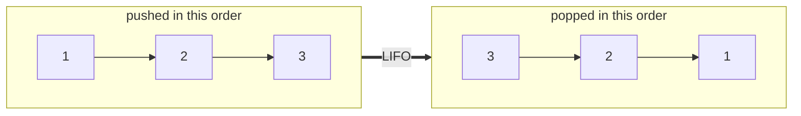

# Stacks

## Why It Exists

Press Ctrl-Z. The editor undoes your *most recent* edit — not the first one, not a random one, the last. Click the browser's Back button: you return to the page you were *just* on. Both answer the same question: "what's the most recent thing I did?" — and both need to keep answering it as you peel actions off one at a time, newest first.

An array or a linked list can hold those actions, but neither *enforces* the rule. Nothing stops you reaching into the middle. What you want is a container with a single, ruthless restriction: **you may only add or remove at one end.** Take that one freedom away and a powerful discipline falls out for free — the most recent item is always the next one you get.

That's a **stack**. It's the structure behind undo, Back, bracket-matching, and — the deepest example of all — the **call stack** that every running program leans on.

## See It Work

A stack only ever touches its **top**. Run this — push three values, then peek and pop — and click **Visualise** to watch items pile on and come off the same end.

> ▶ Run it, then click **Visualise** — watch items pile onto the top and come off the same end; the bottom never moves.

```python run viz=array viz-root=stack viz-kind=stack
stack = []
for x in [3, 5, 7]:
    stack.append(x)        # push onto the top
print(stack[-1])           # peek the top → 7 (look, don't remove)
print(stack.pop())         # pop the top → 7
print(stack.pop())         # → 5
print(stack)               # [3] — only the bottom is left
```

## How It Works

A stack is not a new way to *store* data — it's a **restriction** on an existing one. Take an array or a linked list, then allow only four operations, all at one end called the **top**:

- **push** — add an item to the top.
- **pop** — remove and return the top item.
- **peek** — read the top item without removing it.
- **size** — how many items are stored.

Every one is `O(1)`: each touches only the top, never walks the rest. That's the payoff of the restriction — there's no "find the middle," so there's nothing to make slow.

The rule this enforces is **LIFO — last in, first out**: because you can only ever take from the same end you added to, the most recent push is always the next pop. (You'll also see it called FILO, first in, last out — the same rule named from the other end.)



<p align="center"><strong>push <code>1</code>, <code>2</code>, <code>3</code> and they come back off in reverse: <code>3</code>, <code>2</code>, <code>1</code>. The most recent in is the first out.</strong></p>

A stack is an *interface*, not one fixed layout — it can sit on either structure you've already met:

- **array-backed** — the top is the last filled slot; push appends, pop drops the last. (Growth is the dynamic array's amortized `O(1)`.)
- **linked-list-backed** — the top is the `head`; push prepends a node, pop unlinks it. `O(1)` every time, no resizing.

Either way the interface is identical — which is the real lesson: a stack is defined by its *behaviour* (LIFO, one end), not its storage.

### Key Takeaway

A stack restricts a list to one end, making push/pop/peek `O(1)` and guaranteeing LIFO order — the freedom you give up (no middle access) is exactly what buys the discipline.

## Trace It

Push `1`, `2`, `3`, then pop twice:

| Step | Operation | Stack (top on the right) | Returned |
|---|---|---|---|
| 1 | push 1 | `[1]` | — |
| 2 | push 2 | `[1, 2]` | — |
| 3 | push 3 | `[1, 2, 3]` | — |
| 4 | pop | `[1, 2]` | `3` |
| 5 | pop | `[1]` | `2` |

Before you read on: `1` went in *first* — so when does it come out?

Last of all. It sits at the bottom the entire time, reachable only after everything pushed on top of it is popped. That "first in, last out" is the same rule as "last in, first out," just told from the bottom of the pile.

## Your Turn

The classic use: checking whether brackets are balanced. Every opener gets pushed; every closer must pop its matching opener. If the stack ends empty, the brackets matched.

```python run viz=array viz-kind=stack
def balanced(s):
    stack = []
    pairs = {')': '(', ']': '[', '}': '{'}
    for c in s:
        if c in '([{':
            stack.append(c)                          # push an opener
        elif c in ')]}':
            if not stack or stack.pop() != pairs[c]:  # the popped opener must match
                return False
    return not stack                                  # everything closed?

print(balanced("a(b[c]{d})"))   # True
print(balanced("(]"))           # False — '(' can't close with ']'
```

```java run viz=array viz-kind=stack
import java.util.ArrayDeque;
import java.util.Deque;
import java.util.Map;

public class Main {
  static boolean balanced(String s) {
    Deque<Character> stack = new ArrayDeque<>();     // ArrayDeque is Java's go-to stack
    Map<Character, Character> pairs = Map.of(')', '(', ']', '[', '}', '{');
    for (char c : s.toCharArray()) {
      if (c == '(' || c == '[' || c == '{') stack.push(c);
      else if (pairs.containsKey(c))
        if (stack.isEmpty() || stack.pop() != pairs.get(c)) return false;
    }
    return stack.isEmpty();
  }
  public static void main(String[] args) {
    System.out.println(balanced("a(b[c]{d})"));   // true
    System.out.println(balanced("(]"));           // false
  }
}
```

Make it your own with the section's problems, and see how a stack parses and evaluates arithmetic in [Evaluating Expressions](/cortex/data-structures-and-algorithms/linear-structures/stack/evaluating-expressions-using-stack).

## Reflect & Connect

The stack's reach is enormous precisely because LIFO is everywhere "most recent first" matters:

- **The call stack.** When `A` calls `B` calls `C`, the CPU pushes a *return address* on each call and pops it on each return — so control unwinds in reverse. Recursion, exceptions, and async unwinding all ride on this one hardware stack (x86-64 even dedicates a register, `rsp`, to its top). It's why a runaway recursion dies with "stack overflow."
- **Undo / Back.** Editor undo and browser history are LIFO stacks of past states.
- **Depth-first search.** Exploring "as deep as possible, then back up" is a stack — explicit, or borrowed from the call stack via recursion (you'll meet this in trees and graphs).

The tradeoff to carry: a stack buys `O(1)` ends and a dead-simple contract by refusing all middle access — when you need to reach arbitrary positions, you've outgrown it. And the array-vs-linked-list backing is the same choice as always: the array packs tighter and scans faster, the linked list never pauses to resize.

**Prerequisites:** [Arrays](/cortex/data-structures-and-algorithms/linear-structures/arrays/what-is-an-array), [Linked Lists](/cortex/data-structures-and-algorithms/linear-structures/singly-linked-list/what-is-a-linked-list), and [Measuring Cost](/cortex/data-structures-and-algorithms/foundations/measuring-cost).
**What's next:** flip the rule to *first in, first out* and you get a [Queue](/cortex/data-structures-and-algorithms/linear-structures/queue/what-is-a-queue).

## Recall

> **Mnemonic:** *One end only. Last in, first out. push / pop / peek, all `O(1)`.*

| Operation | Cost | Why |
|---|---|---|
| push / pop / peek | `O(1)` | touches only the top — never walks the rest |
| search / access by position | `O(n)` | you must pop everything above it; no random access |
| space | `O(n)` | one slot or node per stored item |

<details>
<summary><strong>Q:</strong> What rule does a stack enforce, and what creates it?</summary>

**A:** LIFO (last in, first out) — created by allowing add/remove at one end only.

</details>
<details>
<summary><strong>Q:</strong> Why are push and pop `O(1)`?</summary>

**A:** They touch only the top; no scanning or shifting.

</details>
<details>
<summary><strong>Q:</strong> Name the four stack operations.</summary>

**A:** push, pop, peek, size.

</details>
<details>
<summary><strong>Q:</strong> What real structure is the canonical stack?</summary>

**A:** The CPU's call stack — push a return address per call, pop per return.

</details>

## Sources & Verify

- **CLRS** (Cormen, Leiserson, Rivest, Stein), *Introduction to Algorithms*, 4th ed., **§10.1 — Stacks and Queues**: the array-backed stack and the `O(1)` push/pop proof.
- **Sedgewick & Wayne**, *Algorithms*, 4th ed., §1.3 — stacks as an abstract data type, with both resizing-array and linked-list implementations.
- **The call stack** — any systems text (e.g. *Computer Systems: A Programmer's Perspective*, §3.7) on stack frames and the `rsp` stack pointer; this is the "stack overflow" you've hit in practice.
- Both runnable blocks are verified by running; the `O(1)` push/pop and LIFO claims follow from the trace.
