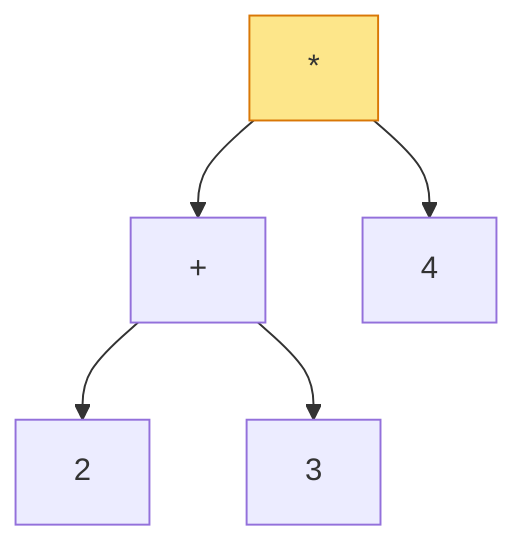

## Why It Exists

Type `2 + 3 * 4` into a calculator and you get **14**, not **20**. Somewhere between your keystrokes and the display the machine *reordered* the work — it ran the multiplication first, even though the addition appeared first. A human "just sees" the precedence, but a CPU does one binary operation at a time and has to *plan*: decide which op runs first, stash partial results, come back later. Infix notation (operator *between* its operands) forces that planning, because the written order isn't the evaluation order — you need precedence rules and parentheses to recover the intent.

What if the written order *were* the evaluation order? **Postfix** (operator *after* its operands: `2 3 + 4 *`) and **prefix** (operator *before*: `* + 2 3 4`) encode the grouping by *position alone* — no precedence, no parentheses, no ambiguity. A [stack](/cortex/data-structures-and-algorithms/linear-structures-stack-what-is-a-stack) evaluates them in one left-to-right (or right-to-left) pass, in `O(N)`. The deep reason all three exist and agree: they're the three depth-first traversals of the same **expression tree** — infix is inorder, prefix is preorder, postfix is postorder. This lesson is why calculators, compilers, and the JVM convert your infix to postfix before running it; the next two build the stack machines that [evaluate](/cortex/data-structures-and-algorithms/linear-structures-stack-evaluating-expressions-using-stack) and [convert](/cortex/data-structures-and-algorithms/linear-structures-stack-converting-expressions-using-stack) them.

## See It Work

The three notations aren't three unrelated conventions — they're one expression tree read three ways. Build the tree for `(2 + 3) * 4` and traverse it in pre-, in-, and post-order:

```python run viz=array viz-kind=stack
class Node:
    def __init__(self, val, left=None, right=None):
        self.val, self.left, self.right = val, left, right

# expression tree for (2 + 3) * 4
tree = Node("*", Node("+", Node("2"), Node("3")), Node("4"))

def preorder(n):  return [] if n is None else [n.val] + preorder(n.left) + preorder(n.right)
def inorder(n):   return [] if n is None else inorder(n.left) + [n.val] + inorder(n.right)
def postorder(n): return [] if n is None else postorder(n.left) + postorder(n.right) + [n.val]

print("prefix  (preorder): ", " ".join(preorder(tree)))
print("infix   (inorder):  ", " ".join(inorder(tree)))
print("postfix (postorder):", " ".join(postorder(tree)))
```

```java run viz=array viz-kind=stack
import java.util.*;
public class Main {
    static class Node {
        String val; Node left, right;
        Node(String v) { val = v; }
        Node(String v, Node l, Node r) { val = v; left = l; right = r; }
    }
    static void pre(Node n, List<String> o)  { if (n == null) return; o.add(n.val); pre(n.left, o); pre(n.right, o); }
    static void in(Node n, List<String> o)   { if (n == null) return; in(n.left, o); o.add(n.val); in(n.right, o); }
    static void post(Node n, List<String> o) { if (n == null) return; post(n.left, o); post(n.right, o); o.add(n.val); }
    static String go(Node n, int mode) {
        List<String> o = new ArrayList<>();
        if (mode == 0) pre(n, o); else if (mode == 1) in(n, o); else post(n, o);
        return String.join(" ", o);
    }
    public static void main(String[] x) {
        Node tree = new Node("*", new Node("+", new Node("2"), new Node("3")), new Node("4"));  // (2+3)*4
        System.out.println("prefix  (preorder):  " + go(tree, 0));
        System.out.println("infix   (inorder):   " + go(tree, 1));
        System.out.println("postfix (postorder): " + go(tree, 2));
    }
}
```

Both print `prefix: * + 2 3 4`, `infix: 2 + 3 * 4`, `postfix: 2 3 + 4 *`. The *same* tree, walked three ways, gives the three notations — operator-before (visit node first), operator-between (visit node in the middle), operator-after (visit node last). Notice the catch: the inorder string `2 + 3 * 4` is **ambiguous** — read with normal precedence it means `2 + (3 * 4) = 14`, but the tree encodes `(2 + 3) * 4 = 20`. Infix loses the grouping unless you add parentheses. Prefix and postfix never do — their position *is* the grouping.

## How It Works

One tree, three traversals, three notations:



<p align="center"><strong>The expression tree for <code>(2+3)*4</code>. Preorder (visit node, then children) → prefix <code>* + 2 3 4</code>. Inorder → infix <code>2 + 3 * 4</code>. Postorder (children, then node) → postfix <code>2 3 + 4 *</code>. The operator's <em>position</em> relative to its operands is exactly when the traversal visits it.</strong></p>

- **Infix needs precedence and parentheses; the others don't.** In infix the operator sits between operands, so the textual order doesn't determine evaluation order — you need precedence (`*` before `+`) and parentheses to override it. That's a real parsing burden: `2 + 3 * 4` and `(2 + 3) * 4` are the same tokens in the same order but different trees. Prefix and postfix put the operator adjacent to *its* operands, so the tree is recoverable from the token sequence alone — they're **unambiguous without any parentheses or precedence rules** ([Trace It](#trace-it)).
- **A stack evaluates postfix in one left-to-right pass.** Scan tokens: push operands; on an operator, pop the top two, apply, push the result. When the scan ends, the stack holds the answer — `O(N)` time, `O(N)` space, no look-ahead, no backtracking. This is why machines prefer postfix: it maps directly onto the one-operation-at-a-time hardware, with the stack holding exactly the pending partial results.
- **Prefix is the mirror image.** Postfix (Reverse Polish) is postorder, evaluated by scanning left-to-right. Prefix (Polish) is preorder, evaluated by scanning *right-to-left* with the same stack machine ([Your Turn](#your-turn)). The only subtlety is operand order for non-commutative ops (`-`, `/`): in postfix the second pop is the left operand; in prefix the first pop is the left operand.

> **Key takeaway.** Infix, prefix, and postfix are the **inorder, preorder, and postorder traversals of one expression tree** — the operator's position (between / before / after its operands) is just *when* the traversal visits it. **Infix** reads naturally but needs precedence rules and parentheses because order alone doesn't fix the grouping; **postfix** and **prefix** encode the grouping by position, so they're unambiguous and a **stack evaluates them in `O(N)`** with no precedence logic — one left-to-right pass for postfix, right-to-left for prefix. That's why calculators and compilers convert to postfix before running.

## Trace It

The claim that postfix needs no parentheses is best felt by evaluating two expressions made of the *exact same tokens* in different orders.

**Predict before you run:** here are two postfix expressions, both using the operands `2, 3, 4` and the operators `+, *`: `2 3 + 4 *` and `2 3 4 * +`. With no parentheses anywhere, do they evaluate to the same number — and if not, what does each give?

```python run viz=array viz-kind=stack
def eval_postfix(tokens):
    st = []
    for t in tokens:
        if t in "+-*/":
            b, a = st.pop(), st.pop()                      # b = right operand, a = left
            st.append({"+": a+b, "-": a-b, "*": a*b, "/": a//b}[t])
        else:
            st.append(int(t))
    return st[-1]

print("'2 3 + 4 *' =", eval_postfix("2 3 + 4 *".split()))   # (2+3)*4
print("'2 3 4 * +' =", eval_postfix("2 3 4 * +".split()))   # 2+(3*4)
```

<details>
<summary><strong>Reveal</strong></summary>

`2 3 + 4 *` evaluates to **20** and `2 3 4 * +` to **14** — same six tokens, different *order*, different answers, and *no parentheses needed to tell them apart*. The first says "add 2 and 3 (→5), then multiply by 4" = `(2+3)*4`; the second says "multiply 3 and 4 (→12), then add 2" = `2+(3*4)`. The token order alone fixes which operands each operator consumes — they're different expression trees, written without a single bracket. Compare infix: `2 + 3 * 4` is one fixed token order, yet to express *both* trees you need parentheses (`(2+3)*4` vs `2+3*4`) plus precedence rules to parse them. That's the whole payoff of postfix: the parenthesization problem disappears, and the stack evaluator never has to look ahead or remember precedence — it just pushes operands and collapses operators as it meets them. The stack at each step holds exactly the operands waiting for their operator, which is why one `O(N)` pass suffices.

</details>

## Your Turn

Postfix is postorder evaluated left-to-right. Prefix is preorder — the mirror image — evaluated **right-to-left** with the same stack trick. Let's confirm it produces the same answers as the trees from See It.

**Predict:** `* + 2 3 4` is the *preorder* (prefix) of the `(2+3)*4` tree. Scanning it right-to-left with a stack, what does it evaluate to? And `+ 2 * 3 4` (the prefix of `2+(3*4)`)?

```python run viz=array viz-kind=stack
def eval_prefix(tokens):
    st = []
    for t in reversed(tokens):                             # scan RIGHT to left
        if t in "+-*/":
            a, b = st.pop(), st.pop()                      # a = left operand (pushed last), b = right
            st.append({"+": a+b, "-": a-b, "*": a*b, "/": a//b}[t])
        else:
            st.append(int(t))
    return st[-1]

print("'* + 2 3 4' =", eval_prefix("* + 2 3 4".split()))   # preorder of (2+3)*4
print("'+ 2 * 3 4' =", eval_prefix("+ 2 * 3 4".split()))   # 2+(3*4)
```

```java run viz=array viz-kind=stack
import java.util.*;
public class Main {
    static int evalPrefix(String[] tokens) {
        Deque<Integer> st = new ArrayDeque<>();
        for (int i = tokens.length - 1; i >= 0; i--) {     // scan RIGHT to left
            String t = tokens[i];
            if (t.length() == 1 && "+-*/".contains(t)) {
                int a = st.pop(), b = st.pop();             // a = left operand, b = right
                st.push(switch (t) { case "+" -> a + b; case "-" -> a - b; case "*" -> a * b; default -> a / b; });
            } else st.push(Integer.parseInt(t));
        }
        return st.peek();
    }
    public static void main(String[] x) {
        System.out.println("'* + 2 3 4' = " + evalPrefix("* + 2 3 4".split(" ")));
        System.out.println("'+ 2 * 3 4' = " + evalPrefix("+ 2 * 3 4".split(" ")));
    }
}
```

Both print `'* + 2 3 4' = 20` and `'+ 2 * 3 4' = 14` — the same values as the matching postfix expressions, because they're the same trees, just traversed (and scanned) in the mirror direction. The one thing to get right is operand order for `-` and `/`: scanning prefix right-to-left, the operator's left operand is the one pushed *last* (so the *first* pop), the opposite of postfix where the left operand is the *second* pop. Get that backwards and `-`/`/` silently compute the wrong thing while `+`/`*` still look fine — a classic subtle bug. Postfix and prefix are duals: pick postfix and scan forward, or prefix and scan backward; either way a single stack and one pass turn a notation into a number.

## Reflect & Connect

- **One tree, three readings.** Infix/prefix/postfix are inorder/preorder/postorder of the expression tree. The operator's position is just *when* the traversal emits it — that's why all three describe the same computation.
- **Position can replace parentheses.** Infix needs precedence rules and parentheses because token order alone doesn't fix the grouping. Prefix and postfix make order *be* the grouping, so they're unambiguous with zero brackets — different trees become different token sequences.
- **Stacks make postfix/prefix `O(N)`.** Push operands, collapse on operators; the stack holds exactly the pending partial results. One forward pass for postfix, one backward pass for prefix — no look-ahead, no precedence logic. Mind the left/right operand order for non-commutative ops.
- **It's why machines convert before they compute.** Calculators, the JVM, CPython's bytecode, and Forth all run a postfix/stack form. Your infix source is parsed into a tree (or directly shunted to postfix) and then a stack machine evaluates it.
- **This is the launchpad for the next two lessons.** [Evaluating expressions](/cortex/data-structures-and-algorithms/linear-structures-stack-evaluating-expressions-using-stack) deepens the stack evaluator; [converting expressions](/cortex/data-structures-and-algorithms/linear-structures-stack-converting-expressions-using-stack) is the shunting-yard algorithm that turns infix into postfix. Both are pure [stack](/cortex/data-structures-and-algorithms/linear-structures-stack-what-is-a-stack) applications, and the [linear-evaluation pattern](/cortex/data-structures-and-algorithms/linear-structures-stack-pattern-linear-evaluation) generalizes the technique.

## Recall

<details>
<summary><strong>Q:</strong> What are infix, prefix, and postfix, and how do they relate to a tree?</summary>

**A:** Three ways to write an expression by where the operator sits: between its operands (infix), before them (prefix / Polish), after them (postfix / Reverse Polish). They are the inorder, preorder, and postorder DFS traversals of the same expression tree.

</details>
<details>
<summary><strong>Q:</strong> Why does infix need parentheses and precedence rules while postfix and prefix don't?</summary>

**A:** In infix the operator's textual order doesn't fix the grouping, so `2 + 3 * 4` needs precedence (and parentheses to override it) to know which tree it means. In postfix/prefix the operator is adjacent to its operands, so the token order alone determines the tree — different groupings are different token sequences, no brackets needed.

</details>
<details>
<summary><strong>Q:</strong> How does a stack evaluate a postfix expression?</summary>

**A:** Scan left-to-right: push each operand; on an operator, pop the top two, apply it, push the result. After the last token the stack holds the answer — `O(N)` time and space, no look-ahead or precedence logic.

</details>
<details>
<summary><strong>Q:</strong> How does prefix evaluation differ from postfix?</summary>

**A:** Prefix is preorder, evaluated by scanning right-to-left with the same push-operands / pop-two-on-operator stack machine. The operand order flips for non-commutative operators: in prefix the first pop is the left operand; in postfix the second pop is the left operand.

</details>
<details>
<summary><strong>Q:</strong> Why do calculators and compilers convert infix to postfix?</summary>

**A:** Postfix maps directly onto one-operation-at-a-time hardware with a stack holding pending results — a single `O(N)` pass with no parsing of precedence or parentheses. So the infix source is converted (parsed to a tree or shunted to postfix) once, then evaluated cheaply.

</details>

## Sources & Verify

- **CLRS** / **Sedgewick & Wayne**, *Algorithms* §1.3 — stacks, expression evaluation, and Dijkstra's shunting-yard. The notations trace to **Jan Łukasiewicz** (Polish notation, 1920s); **Reverse Polish** (postfix) powered HP calculators and the Forth language.
- **Aho, Lam, Sethi & Ullman**, *Compilers: Principles, Techniques, and Tools* — expression trees and the parse-then-traverse pipeline real compilers use.
- The three traversals of `(2+3)*4` (`* + 2 3 4` / `2 + 3 * 4` / `2 3 + 4 *`), the postfix evaluations (`20` vs `14`), and the mirror-image prefix evaluations (`20` and `14`) all come from the runnable blocks above (deterministic) — re-run to verify.
