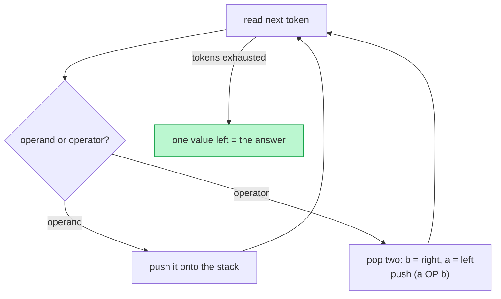

## Why It Exists

[Postfix and prefix](/cortex/data-structures-and-algorithms/linear-structures-stack-infix-postfix-and-prefix-notations) encode the order of operations *by position alone* — no parentheses, no precedence rules. That's a beautiful property, but it only pays off if you can *evaluate* such an expression cheaply. The payoff is one of the cleanest algorithms in the course: a single [stack](/cortex/data-structures-and-algorithms/linear-structures-stack-what-is-a-stack), a single left-to-right pass, no look-ahead, no backtracking, no special cases.

The whole rule is two lines. See an **operand** → push it. See an **operator** → pop the top two, apply the operator, push the result. When the tokens run out, exactly one number is left on the stack — that's your answer, in `O(N)` time and `O(N)` space. The stack at any moment holds precisely the operands still waiting for an operator, which is why no parsing of precedence is ever needed: the postfix order already told you when each operator fires. The one thing to get right is operand *order* for non-commutative operators (`-`, `/`), where swapping the two pops silently computes the wrong thing ([Trace It](#trace-it)). This is the exact loop inside every Reverse-Polish HP calculator, the inner loop of Forth, and the operand stack of the JVM — and it's the engine the [next lesson](/cortex/data-structures-and-algorithms/linear-structures-stack-converting-expressions-using-stack) feeds once it converts infix to postfix.

## See It Work

The mechanism is clearest when you watch the stack after every token. Here's the evaluator, tracing `5 1 2 + 4 * + 3 -` (which means `5 + ((1+2)*4) - 3`):

```python run viz=array viz-kind=stack
def eval_postfix_traced(expr):
    st = []
    for t in expr.split():
        if t in "+-*/":
            b, a = st.pop(), st.pop()                  # b = right operand (top), a = left
            st.append({"+": a+b, "-": a-b, "*": a*b, "/": int(a/b)}[t])
        else:
            st.append(int(t))
        print(f"  token {t} -> stack {st}")
    return st[-1]

print("evaluating postfix: 5 1 2 + 4 * + 3 -")
print("result:", eval_postfix_traced("5 1 2 + 4 * + 3 -"))
```

```java run viz=array viz-kind=stack
import java.util.*;
public class Main {
    static int evalTraced(String expr) {
        List<Integer> st = new ArrayList<>();                  // list-as-stack (end = top) for a readable trace
        for (String t : expr.split(" ")) {
            if (t.length() == 1 && "+-*/".contains(t)) {
                int b = st.remove(st.size() - 1), a = st.remove(st.size() - 1);  // b = right, a = left
                st.add(switch (t) { case "+" -> a + b; case "-" -> a - b; case "*" -> a * b; default -> (int) ((double) a / b); });
            } else st.add(Integer.parseInt(t));
            System.out.println("  token " + t + " -> stack " + st);
        }
        return st.get(st.size() - 1);
    }
    public static void main(String[] x) {
        System.out.println("evaluating postfix: 5 1 2 + 4 * + 3 -");
        System.out.println("result: " + evalTraced("5 1 2 + 4 * + 3 -"));
    }
}
```

Both trace the same nine steps and print `result: 14`. Watch the stack: operands pile up (`[5]`, `[5, 1]`, `[5, 1, 2]`) until an operator collapses the top two — `+` turns `[5, 1, 2]` into `[5, 3]`, then `4` and `*` give `[5, 12]`, the next `+` gives `[17]`, and `3 -` finishes at `[14]`. The stack never holds more than the operands awaiting their operator, and the single value left at the end is the answer. No precedence logic appears anywhere — the postfix order already encoded it.

## How It Works

The entire algorithm is one loop with a two-way branch:



<p align="center"><strong>Evaluate postfix in one pass: push operands, and on an operator pop the top two (the top is the right operand), apply, and push the result. The lone survivor is the answer.</strong></p>

- **Why one pass suffices.** Because postfix lists operands before the operator that consumes them, by the time you reach an operator its two operands are already the top two stack entries. There's nothing to look ahead for and nothing to remember about precedence — the notation did that work. Each token is touched once (push, or pop-two-push-one), so it's `O(N)` time; the stack can hold up to `~N/2` operands, so `O(N)` space.
- **Operand order is the one trap.** When you pop two values, the *first* pop is the operand that was pushed most recently — the **right** operand. For commutative operators (`+`, `*`) the order doesn't matter, but for `-` and `/` it's the difference between `8 / 2 = 4` and `2 / 8 = 0`. The fix is a fixed convention: `b = pop()` (right), `a = pop()` (left), compute `a OP b` ([Trace It](#trace-it)). (Integer division should truncate toward zero — `int(a/b)` in Python, `(int)((double)a/b)` in Java — to match calculator/JVM semantics, not Python's floor `//`.)
- **Prefix is the mirror; infix needs a conversion first.** Prefix (operator before operands) evaluates with the *same* stack machine scanned **right-to-left**, with the operand order flipped (first pop is the *left* operand). Infix — what humans write — can't be evaluated by this one-pass trick directly, because precedence and parentheses break the "operands already on the stack" guarantee; the standard route is to first convert infix to postfix (the shunting-yard algorithm, the [next lesson](/cortex/data-structures-and-algorithms/linear-structures-stack-converting-expressions-using-stack)) and then run *this* evaluator.

> **Key takeaway.** A single operand stack evaluates postfix in **one left-to-right pass, `O(N)`**: push operands; on an operator, pop the top two (top = **right** operand), apply, push the result; the final lone value is the answer. No precedence logic is needed because the postfix order already encoded it. The only correctness trap is **operand order for `-` and `/`** (first pop is the right operand). Prefix is the same machine scanned right-to-left; infix is evaluated by converting to postfix first.

## Trace It

Commutative operators forgive a sloppy pop order; `-` and `/` do not. This is the bug that passes every `+`/`*` test and then mangles a division.

**Predict before you run:** evaluating postfix `8 2 /`, the correct convention pops the top (`2`) as the *right* operand and the next (`8`) as the *left*, computing `8 / 2`. What does the correct order give, and what does *swapping* the two pops give? Same question for `10 3 -`.

```python run viz=array viz-kind=stack
def eval_postfix(expr, swap=False):
    st = []
    for t in expr.split():
        if t in "+-*/":
            x, y = st.pop(), st.pop()                  # x = top (right operand), y = next (left)
            a, b = (x, y) if swap else (y, x)          # correct: a = left = y, b = right = x
            st.append({"+": a+b, "-": a-b, "*": a*b, "/": int(a/b)}[t])
        else:
            st.append(int(t))
    return st[-1]

print("'8 2 /'  correct:", eval_postfix("8 2 /"),  "| swapped:", eval_postfix("8 2 /", swap=True))
print("'10 3 -' correct:", eval_postfix("10 3 -"), "| swapped:", eval_postfix("10 3 -", swap=True))
```

<details>
<summary><strong>Reveal</strong></summary>

`8 2 /` gives **4** correctly (`8 / 2`) but **0** swapped (`2 / 8`, which truncates to 0); `10 3 -` gives **7** correctly (`10 - 3`) but **−7** swapped (`3 - 10`). The two pops come off in *reverse* of how the operands were written: the value pushed most recently — the second operand in the source — is the *first* to pop, so it's the **right** operand. Bind it as such (`b = pop()`, `a = pop()`, compute `a − b` / `a / b`) and you're correct. The insidious part is that `+` and `*` give the same answer either way, so a unit test built only on addition and multiplication passes while the division path is quietly backwards — exactly the kind of bug a [loop-invariant or careful test](/cortex/data-structures-and-algorithms/foundations-proof-techniques) over the *non-commutative* operators would catch. Always test an expression evaluator with `-` and `/`, and with operands where order changes the result.

</details>

## Your Turn

Real expressions have multi-digit numbers and all four operators. Tokenizing on whitespace (not character-by-character) handles multi-digit operands for free — each token is a whole number or a single operator.

**Predict:** evaluate the postfix `15 7 1 1 + - / 3 *`. It encodes `(15 / (7 − (1 + 1))) * 3`. What's the result?

```python run viz=array viz-kind=stack
def eval_rpn(tokens):
    st = []
    for t in tokens:
        if t in "+-*/":
            b, a = st.pop(), st.pop()                  # b = right operand, a = left
            st.append({"+": a+b, "-": a-b, "*": a*b, "/": int(a/b)}[t])
        else:
            st.append(int(t))                          # whole token -> multi-digit operand
    return st[-1]

print("'15 7 1 1 + - / 3 *' =", eval_rpn("15 7 1 1 + - / 3 *".split()))
```

```java run viz=array viz-kind=stack
import java.util.*;
public class Main {
    static int evalRpn(String[] tokens) {
        Deque<Integer> st = new ArrayDeque<>();
        for (String t : tokens) {
            if (t.length() == 1 && "+-*/".contains(t)) {
                int b = st.pop(), a = st.pop();        // b = right operand (top), a = left
                st.push(switch (t) { case "+" -> a + b; case "-" -> a - b; case "*" -> a * b; default -> (int) ((double) a / b); });
            } else st.push(Integer.parseInt(t));        // whole token -> multi-digit operand
        }
        return st.peek();
    }
    public static void main(String[] x) {
        System.out.println("'15 7 1 1 + - / 3 *' = " + evalRpn("15 7 1 1 + - / 3 *".split(" ")));
    }
}
```

Both print `9`. Step through it: `1 1 +` makes `2`, then `7 ... -` makes `7 − 2 = 5`, then `15 ... /` makes `15 / 5 = 3`, then `... 3 *` makes `3 × 3 = 9`. The multi-digit `15` is handled with no extra work because we tokenized on whitespace — the operand is the whole string `"15"`, not the characters `'1'` and `'5'`. This is LeetCode's "Evaluate Reverse Polish Notation" exactly, and the same `O(N)` one-pass machine scales from a four-token expression to a thousand-token one. (Edge cases a production evaluator adds: division by zero, a leftover stack of size ≠ 1 meaning a malformed expression, and unary minus — but the core loop is unchanged.)

## Reflect & Connect

- **One stack, one pass, no precedence.** Postfix puts operands before their operator, so by the time you meet an operator its operands are on top. Push operands, collapse on operators, read the survivor — `O(N)`, no look-ahead, no backtracking.
- **The stack holds pending operands.** At every step the stack is exactly the operands still waiting for an operator. That invariant is why the algorithm needs no parsing state beyond the stack itself.
- **Operand order is the lone trap.** First pop = right operand. `+`/`*` hide a wrong order; `-`/`/` expose it (`8/2=4` vs `2/8=0`). Test non-commutative operators, and truncate division toward zero to match calculator/JVM semantics.
- **Prefix mirrors; infix converts.** Prefix is the same machine scanned right-to-left (with operand order flipped). Infix can't be one-passed directly — convert it to postfix with the [shunting-yard algorithm](/cortex/data-structures-and-algorithms/linear-structures-stack-converting-expressions-using-stack) (next lesson), then feed it to this evaluator.
- **It's the real engine.** RPN calculators, Forth, and the JVM's operand stack all *are* this loop. It generalizes to the [linear-evaluation pattern](/cortex/data-structures-and-algorithms/linear-structures-stack-pattern-linear-evaluation) — any left-to-right scan where a stack holds deferred work to be collapsed by a later token.

## Recall

<details>
<summary><strong>Q:</strong> What is the rule for evaluating a postfix expression with a stack?</summary>

**A:** Scan left-to-right: push each operand; on an operator, pop the top two, apply the operator, and push the result. When tokens run out, the single remaining value on the stack is the answer.

</details>
<details>
<summary><strong>Q:</strong> Why does one left-to-right pass suffice — no precedence or look-ahead?</summary>

**A:** Postfix lists each operator *after* its operands, so when you reach an operator its two operands are already the top of the stack. The notation already encoded precedence, so the evaluator never parses it. Each token is handled once → `O(N)` time, `O(N)` space.

</details>
<details>
<summary><strong>Q:</strong> When you pop two operands for an operator, which is which?</summary>

**A:** The first pop (the most recently pushed) is the *right* operand; the second pop is the *left*. So compute `a OP b` with `b = pop()`, `a = pop()`. It only matters for non-commutative operators: `8 2 /` is `8/2 = 4`, not `2/8`.

</details>
<details>
<summary><strong>Q:</strong> Why can a buggy evaluator pass tests yet still be wrong?</summary>

**A:** If it pops operands in the wrong order, `+` and `*` (commutative) still give the right answer, so tests using only those pass. The bug surfaces only on `-` and `/`. Always test an evaluator with non-commutative operators and order-sensitive operands.

</details>
<details>
<summary><strong>Q:</strong> How do you evaluate prefix and infix with this machine?</summary>

**A:** Prefix: the same stack machine scanned right-to-left (the first pop becomes the left operand). Infix: you can't one-pass it directly because of precedence/parentheses — convert it to postfix first (shunting-yard), then run this evaluator.

</details>

## Sources & Verify

- **Sedgewick & Wayne**, *Algorithms* §1.3 — stack-based expression evaluation; **Dijkstra**'s two-stack and shunting-yard algorithms. Reverse Polish notation drove HP calculators and the Forth language; the JVM specification defines an operand-stack execution model.
- **LeetCode 150**, "Evaluate Reverse Polish Notation" — the canonical practice problem (the `15 7 1 1 + - / 3 *` → 9 case here).
- The traced postfix run (snapshots ending in `14`), the operand-order trap (`8 2 /` → 4 vs 0; `10 3 -` → 7 vs −7), and the multi-digit RPN evaluation (`15 7 1 1 + - / 3 *` → 9) all come from the runnable blocks above (deterministic) — re-run to verify.
