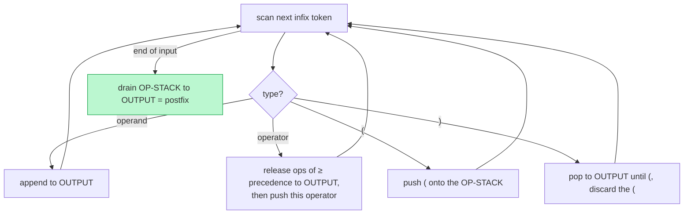

## Why It Exists

The [evaluator](/cortex/data-structures-and-algorithms/linear-structures/stack/evaluating-expressions-using-stack) turns *postfix* into a number in one clean pass — but humans don't write postfix, they write **infix** (`2 + 3 * 4`). Something has to bridge the gap: parse the infix, respecting precedence and parentheses, and emit the postfix the evaluator wants. That bridge is **Dijkstra's shunting-yard algorithm**, and it's the front-end of every calculator and the parsing core of many compilers.

The trick is one operator stack plus an output list. Scan the infix left-to-right: an **operand** flows straight to the output; an **operator** waits on the stack, but before it goes on, any stack operators of *equal or higher precedence* are popped to the output first (that's how `*` gets emitted before a lower-precedence `+`); a `(` is pushed as a barrier and a `)` pops everything back to its matching `(`. Drain the stack at the end and the output *is* the postfix — `O(N)` time, `O(N)` space, no recursion. The deep idea is that the stack *defers* each operator until you know everything that should happen before it, which is exactly what precedence and parentheses encode. Pair this with the previous lesson's evaluator and you have a complete calculator: shunting-yard converts, the stack machine computes ([Your Turn](#your-turn)).

## See It Work

Shunting-yard converting `2 + 3 * 4` — watch it respect precedence, emitting `*` before the lower-precedence `+` even though `+` was read first:

```python run viz=array viz-kind=stack
prec = {"+": 1, "-": 1, "*": 2, "/": 2}
def infix_to_postfix(tokens):                       # Dijkstra's shunting-yard
    out, ops = [], []
    for t in tokens:
        if t in prec:
            while ops and ops[-1] != "(" and prec[ops[-1]] >= prec[t]:
                out.append(ops.pop())               # release operators of >= precedence (left-associative)
            ops.append(t)
        elif t == "(":
            ops.append(t)
        elif t == ")":
            while ops and ops[-1] != "(":
                out.append(ops.pop())
            ops.pop()                                # discard the matching "("
        else:
            out.append(t)                            # operand -> straight to output
    while ops:
        out.append(ops.pop())                        # drain remaining operators
    return out

print("infix:   2 + 3 * 4")
print("postfix:", " ".join(infix_to_postfix("2 + 3 * 4".split())))
```

```java run viz=array viz-kind=stack
import java.util.*;
public class Main {
    static Map<String,Integer> prec = Map.of("+", 1, "-", 1, "*", 2, "/", 2);
    static List<String> infixToPostfix(String[] tokens) {              // shunting-yard
        List<String> out = new ArrayList<>();
        Deque<String> ops = new ArrayDeque<>();
        for (String t : tokens) {
            if (prec.containsKey(t)) {
                while (!ops.isEmpty() && !ops.peek().equals("(") && prec.get(ops.peek()) >= prec.get(t))
                    out.add(ops.pop());                                // release >= precedence
                ops.push(t);
            } else if (t.equals("(")) ops.push(t);
            else if (t.equals(")")) {
                while (!ops.isEmpty() && !ops.peek().equals("(")) out.add(ops.pop());
                ops.pop();                                             // discard "("
            } else out.add(t);
        }
        while (!ops.isEmpty()) out.add(ops.pop());
        return out;
    }
    public static void main(String[] x) {
        System.out.println("infix:   2 + 3 * 4");
        System.out.println("postfix: " + String.join(" ", infixToPostfix("2 + 3 * 4".split(" "))));
    }
}
```

Both print `postfix: 2 3 4 * +`. Trace it: `2` goes to output; `+` waits on the stack; `3` goes to output; now `*` arrives — its precedence (2) is higher than the waiting `+` (1), so `+` is *not* released yet and `*` stacks on top; `4` goes to output; at end-of-input the stack drains top-first, emitting `*` then `+`. The result `2 3 4 * +` means `2 + (3*4)` — the multiplication bound tighter, exactly as arithmetic precedence demands. The `+` had to *wait* on the stack until everything higher-priority after it was done.

## How It Works

One operator stack, one output list, four token cases:



<p align="center"><strong>Shunting-yard: operands flow to the output immediately; operators wait on the stack and are released by precedence; parentheses force grouping. Drain at the end and the output is the postfix.</strong></p>

- **The stack defers operators until their operands are settled.** An operand can be emitted at once — nothing changes its value. An operator can't: a higher-precedence operator might appear right after it. So it waits on the stack, and is only released when the next operator's precedence is *lower* (or input ends). This is why `+` in `2 + 3 * 4` waits while `*` does its work — the algorithm holds the `+` until it's sure nothing tighter-binding is still pending.
- **Precedence comparison + associativity.** Before pushing an operator, pop all stacked operators with **≥** precedence (for left-associative `+ - * /`). Using `≥` (not `>`) makes `a - b - c` parse as `(a-b)-c`, the correct left-to-right grouping; right-associative operators (like exponent `^`) would use `>` instead. The `(` is a barrier with the lowest "precedence" — nothing pops past it until its `)` arrives.
- **Parentheses override precedence by forcing a sub-conversion.** A `(` pushes a barrier; a `)` pops operators to the output until the matching `(`, then discards both brackets. That brackets off a sub-expression and emits it fully before the surrounding operators see it — which is how `( 2 + 3 ) * 4` makes the `+` happen first ([Trace It](#trace-it)). The whole scan is `O(N)`: each token is pushed and popped at most once. (The same machine does all six conversions — postfix/prefix→anything just pushes *operand strings* and glues two with the operator on each operator token; only infix→postfix needs the precedence logic.)

> **Key takeaway.** **Shunting-yard** converts infix to postfix with one operator stack + an output list: operands flow to the output; an operator first **releases stacked operators of ≥ precedence**, then waits on the stack; `(` is a barrier and `)` pops back to it. Draining the stack yields the postfix, in `O(N)`. The stack's job is to **defer** each operator until precedence and parentheses say its turn has come — and combined with the [postfix evaluator](/cortex/data-structures-and-algorithms/linear-structures/stack/evaluating-expressions-using-stack), it's a complete calculator: convert, then compute.

## Trace It

Precedence handles the default grouping; parentheses exist to *override* it. The clearest way to see that is to convert the same operands and operators with and without brackets.

**Predict before you run:** `2 + 3 * 4` converts to `2 3 4 * +` (multiplication binds tighter). What does `( 2 + 3 ) * 4` convert to — the same postfix, or something different?

```python run viz=array viz-kind=stack
prec = {"+": 1, "-": 1, "*": 2, "/": 2}
def infix_to_postfix(tokens):
    out, ops = [], []
    for t in tokens:
        if t in prec:
            while ops and ops[-1] != "(" and prec[ops[-1]] >= prec[t]: out.append(ops.pop())
            ops.append(t)
        elif t == "(": ops.append(t)
        elif t == ")":
            while ops and ops[-1] != "(": out.append(ops.pop())
            ops.pop()
        else: out.append(t)
    while ops: out.append(ops.pop())
    return out

print("'2 + 3 * 4'     ->", " ".join(infix_to_postfix("2 + 3 * 4".split())))
print("'( 2 + 3 ) * 4' ->", " ".join(infix_to_postfix("( 2 + 3 ) * 4".split())))
```

<details>
<summary><strong>Reveal</strong></summary>

`2 + 3 * 4` → `2 3 4 * +`, but `( 2 + 3 ) * 4` → `2 3 + 4 *` — a *different* postfix, with the `+` emitted before the `*`. The parentheses changed everything. Without them, when `*` arrives the `+` is left waiting (lower precedence), so `*` and its operands resolve first. *With* them, the `(` pushes a barrier; when `)` arrives it forces the `+` out to the output immediately — `2 3 +` — *before* the `*` is ever read. So the postfix puts the addition first, and evaluating it gives `(2+3)*4 = 20` instead of `2+(3*4) = 14`. This is exactly the job parentheses do in arithmetic, now visible as a mechanical operation on the stack: a `(` says "defer the outside operators, finish what's in here first," and the matching `)` cashes that in. The postfix output is the unambiguous record of the grouping the parentheses (and precedence) dictated — which is why the [evaluator](/cortex/data-structures-and-algorithms/linear-structures/stack/evaluating-expressions-using-stack) downstream never needs to see a parenthesis at all.

</details>

## Your Turn

Convert plus evaluate is a complete calculator: shunting-yard parses the human-friendly infix into postfix, then the [previous lesson's](/cortex/data-structures-and-algorithms/linear-structures/stack/evaluating-expressions-using-stack) stack machine computes the number. Compose them.

**Predict:** running both `2 + 3 * 4` and `( 2 + 3 ) * 4` through *convert-then-evaluate*, what two values come out?

```python run viz=array viz-kind=stack
prec = {"+": 1, "-": 1, "*": 2, "/": 2}
def infix_to_postfix(tokens):
    out, ops = [], []
    for t in tokens:
        if t in prec:
            while ops and ops[-1] != "(" and prec[ops[-1]] >= prec[t]: out.append(ops.pop())
            ops.append(t)
        elif t == "(": ops.append(t)
        elif t == ")":
            while ops and ops[-1] != "(": out.append(ops.pop())
            ops.pop()
        else: out.append(t)
    while ops: out.append(ops.pop())
    return out

def eval_postfix(tokens):                            # the stack evaluator from the previous lesson
    st = []
    for t in tokens:
        if t in "+-*/":
            b, a = st.pop(), st.pop()
            st.append({"+": a+b, "-": a-b, "*": a*b, "/": int(a/b)}[t])
        else: st.append(int(t))
    return st[-1]

for infix in ["2 + 3 * 4", "( 2 + 3 ) * 4"]:
    post = infix_to_postfix(infix.split())
    print(f"{infix:>15}  ->  {' '.join(post):>9}  =  {eval_postfix(post)}")
```

```java run viz=array viz-kind=stack
import java.util.*;
public class Main {
    static Map<String,Integer> prec = Map.of("+", 1, "-", 1, "*", 2, "/", 2);
    static List<String> infixToPostfix(String[] tokens) {
        List<String> out = new ArrayList<>(); Deque<String> ops = new ArrayDeque<>();
        for (String t : tokens) {
            if (prec.containsKey(t)) {
                while (!ops.isEmpty() && !ops.peek().equals("(") && prec.get(ops.peek()) >= prec.get(t)) out.add(ops.pop());
                ops.push(t);
            } else if (t.equals("(")) ops.push(t);
            else if (t.equals(")")) { while (!ops.isEmpty() && !ops.peek().equals("(")) out.add(ops.pop()); ops.pop(); }
            else out.add(t);
        }
        while (!ops.isEmpty()) out.add(ops.pop());
        return out;
    }
    static int evalPostfix(List<String> tokens) {    // the stack evaluator from the previous lesson
        Deque<Integer> st = new ArrayDeque<>();
        for (String t : tokens) {
            if (t.length() == 1 && "+-*/".contains(t)) {
                int b = st.pop(), a = st.pop();
                st.push(switch (t) { case "+" -> a + b; case "-" -> a - b; case "*" -> a * b; default -> (int) ((double) a / b); });
            } else st.push(Integer.parseInt(t));
        }
        return st.peek();
    }
    public static void main(String[] x) {
        for (String infix : new String[]{"2 + 3 * 4", "( 2 + 3 ) * 4"}) {
            List<String> post = infixToPostfix(infix.split(" "));
            System.out.printf("%15s  ->  %9s  =  %d%n", infix, String.join(" ", post), evalPostfix(post));
        }
    }
}
```

Both print `2 + 3 * 4 → 2 3 4 * + = 14` and `( 2 + 3 ) * 4 → 2 3 + 4 * = 20`. Two `O(N)` passes — shunting-yard to convert, the stack machine to evaluate — and you've built the core of a four-function calculator. The first expression honours precedence (multiply first → 14); the second honours the parentheses the user typed (add first → 20). The conversion is where all the precedence and parenthesis logic lives; the evaluator stays blissfully simple because postfix has already encoded every decision. Real calculators and language interpreters split the work exactly this way: a parser produces an unambiguous intermediate form (postfix, or an [expression tree](/cortex/data-structures-and-algorithms/linear-structures/stack/infix-postfix-and-prefix-notations)), and a separate, trivial evaluator runs it.

## Reflect & Connect

- **Shunting-yard defers operators.** Operands emit immediately; operators wait on a stack until precedence or a closing paren says their turn has come. Releasing ops of ≥ precedence before pushing is what makes `*` beat `+`.
- **`≥` vs `>` encodes associativity.** Popping equal-precedence operators (`≥`) gives left-to-right grouping (`a - b - c = (a-b)-c`); right-associative operators (exponent) use `>`. A `(` is a barrier nothing pops past until its `)`.
- **Parentheses are a forced sub-conversion.** `(` defers the surrounding operators; `)` flushes the bracketed sub-expression to the output first. That's how `( 2 + 3 ) * 4` reorders to `2 3 + 4 *` and evaluates to 20 instead of 14.
- **It's the front-end the evaluator was missing.** Convert (this lesson) + evaluate (the [previous one](/cortex/data-structures-and-algorithms/linear-structures/stack/evaluating-expressions-using-stack)) = a complete calculator, two `O(N)` passes. All the hard logic lives in the conversion; postfix evaluation stays trivial.
- **Six conversions, two ideas, one stack.** Postfix/prefix → anything just glues operand-strings with the operator (no precedence needed); only infix→postfix (and →prefix, by reverse-and-flip) needs shunting-yard. This closes the stack-expression arc — the [linear-evaluation pattern](/cortex/data-structures-and-algorithms/linear-structures-stack-pattern-linear-evaluation) generalizes the "stack holds deferred work" idea to many problems.

## Recall

<details>
<summary><strong>Q:</strong> What does the shunting-yard algorithm do, and with what data structures?</summary>

**A:** It converts infix to postfix using one operator stack plus an output list. Operands go straight to the output; operators wait on the stack and are released by precedence; parentheses force grouping. Draining the stack at the end yields the postfix — `O(N)` time and space.

</details>
<details>
<summary><strong>Q:</strong> When an operator arrives, what happens before it's pushed onto the stack?</summary>

**A:** All operators currently on top of the stack with precedence ≥ the incoming operator's are popped to the output first (for left-associative operators), then the new operator is pushed. That's what makes a `*` emit before a waiting lower-precedence `+`.

</details>
<details>
<summary><strong>Q:</strong> How do parentheses work in shunting-yard?</summary>

**A:** `(` is pushed as a barrier that nothing pops past. `)` pops operators to the output until the matching `(`, then discards both brackets. This flushes the bracketed sub-expression to the output before any surrounding operator, overriding precedence.

</details>
<details>
<summary><strong>Q:</strong> Why does `≥` (not `>`) precedence comparison matter?</summary>

**A:** Popping equal-precedence operators gives left-associative grouping: `a - b - c` becomes `(a-b)-c`, the correct arithmetic reading. Right-associative operators (like exponentiation) use `>` so they group right-to-left instead.

</details>
<details>
<summary><strong>Q:</strong> How do you build a full calculator from this lesson and the previous one?</summary>

**A:** Two `O(N)` passes: shunting-yard converts the user's infix to postfix (handling precedence and parentheses), then the stack evaluator computes the postfix. The conversion holds all the parsing logic; the evaluator stays trivial because postfix is unambiguous.

</details>

## Sources & Verify

- **Edsger Dijkstra** — the shunting-yard algorithm (1961); **Sedgewick & Wayne**, *Algorithms* §1.3 — Dijkstra's two-stack expression evaluation and infix-to-postfix conversion.
- **Aho, Lam, Sethi & Ullman**, *Compilers* — operator-precedence parsing, of which shunting-yard is the classic stack form.
- The conversion (`2 + 3 * 4` → `2 3 4 * +`), the parenthesis effect (`( 2 + 3 ) * 4` → `2 3 + 4 *`), and the full convert-then-evaluate pipeline (→ 14 and 20) all come from the runnable blocks above (deterministic) — re-run to verify.
