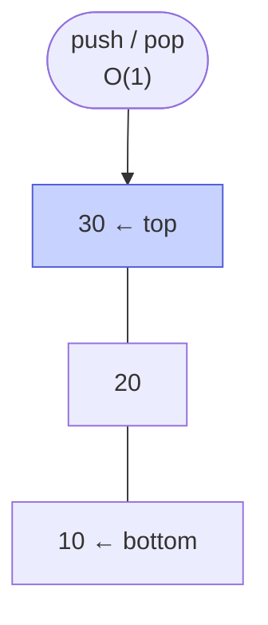

# Memorize: Stack

## In a Hurry?

- **Core Operations**: `push` (add to top), `pop` (remove and return the top), `peek`/`top` (read the top without removing), `isEmpty`/`empty`, and `size`. Every operation acts on one end — the top — and there is no indexed access, no search, and no middle insertion.
- **Complexities**: `push` `O(1)`, `pop` `O(1)`, `peek`/`top` `O(1)`, `isEmpty` `O(1)`, `size` `O(1)`, and space `O(n)` for `n` items. The one subtlety: a dynamic-array-backed `push` is *amortised* `O(1)` (an occasional resize copies all `n` elements, an `O(n)` spike), while a linked-list-backed `push` is *true worst-case* `O(1)` with no spike. Searching for a value the interface does not expose is `O(n)`.
- **One Use-Case**: arithmetic expression evaluation — a postfix or prefix expression evaluates in one left-to-right (or right-to-left) scan over a single operand stack, and an infix expression converts to postfix with the shunting-yard operator stack, both in `O(n)` time.

---

## One-Line Mnemonic

A stack is a spring-loaded plate dispenser: you only ever touch the top plate, and the last one you set down is the first one you take back.

---

## Real-World Analogy

Picture a stack of clean plates on a kitchen counter. You add a washed plate by setting it on top, and you take a plate by lifting the top one — never the one buried at the bottom. To reach a plate in the middle you would have to lift every plate above it first, which is exactly the access the structure refuses to give you. The plate you placed most recently is the one in your hand next, and the very first plate of the day waits at the bottom until everything stacked on top of it is gone. That physical "last in, first out" rule is the whole contract: gravity enforces it for plates, and a single top index or head pointer enforces it for the data structure.

---

## Visual Summary

<strong>A stack only ever touches its top — push and pop are O(1) at one end. Last in, first out; the bottom never moves.</strong>

---

## Key Operations

| Operation | Time | Space | Key Insight |
|---|---|---|---|
| `push(x)` | `O(1)`* | `O(1)` | Adds `x` as the new top. *Amortised `O(1)` on a growable array (an occasional resize copies all `n` items, an `O(n)` spike); true worst-case `O(1)` on a linked list, which allocates one node and rewires `head`. A bounded array rejects the push when full (`topIndex == capacity - 1`). |
| `pop()` | `O(1)` | `O(1)` | Removes and returns the top, shrinking the stack by one. Array: read `arr[topIndex]`, then decrement. Linked list: read `head.val`, then advance `head` to `head.next`. Both error on an empty stack — guard first. |
| `peek` / `top()` | `O(1)` | `O(1)` | Reads the top without removing it; the stack is unchanged after the call. It is `pop` minus the removal — array reads `arr[topIndex]`, linked list reads `head.val`. |
| `isEmpty` / `empty()` | `O(1)` | `O(1)` | True when there is no top. Array: `topIndex == -1`. Linked list: `currentSize == 0` (equivalently `head == null`). This is the guard you run before every `pop` and `peek`. |
| `size()` | `O(1)` | `O(1)` | Count of stored items. Array derives it for free as `topIndex + 1` — no separate field. Linked list cannot count without an `O(n)` walk, so it maintains a `currentSize` counter bumped on push and dropped on pop. |

---

## Common Mistakes

- **Popping or peeking an empty stack**:
  - *What*: calling `pop()` or `peek()` when the stack has no items, getting a crash, a wrong sentinel, or garbage.
  - *Why*: forgetting that the top is the *only* legal point of access and that it may not exist — reading `arr[topIndex]` indexes `arr[-1]`, and dereferencing a `null` `head` faults.
  - *Fix*: guard every `pop`/`peek` with an `isEmpty()` check (`topIndex == -1` for an array, `head == null` for a linked list) before touching the top.
- **Overflowing a bounded stack**:
  - *What*: pushing onto a fixed-capacity array stack that is already full, writing one slot past the buffer.
  - *Why*: assuming a stack always grows — a bounded stack is full at `topIndex == capacity - 1`, not `capacity`, and the off-by-one writes out of bounds (`IndexError`, `ArrayIndexOutOfBoundsException`, or silent corruption).
  - *Fix*: check fullness before every push and honour the `false` return, or use a growable/linked stack that expands instead of rejecting.
- **Assuming a popped value is erased**:
  - *What*: trusting that `pop` clears the slot, when an array-backed `pop` only decrements `topIndex` and leaves the value physically in the buffer.
  - *Why*: confusing "logically gone" with "physically gone" — the stack is defined as indices `0..topIndex`, so the stale value is invisible but still resident, pinning any large object or secret it references.
  - *Fix*: null the slot explicitly (`arr[topIndex--] = null`) when the stack holds object references or sensitive data, so the value can be garbage-collected.
- **Reaching for the bottom or the middle**:
  - *What*: wanting "the element under the top" or "the third item down" and faking it by popping into a buffer and pushing back.
  - *Why*: treating a stack as a list — the interface exposes only the top *by design*, and that desire is the signal you picked the wrong structure.
  - *Fix*: when you need indexed or middle access, reach for an array or a deque; forcing it through a stack is `O(n)` and abuses the abstraction.
- **Forgetting that LIFO reverses order**:
  - *What*: pushing a sequence and expecting the pops to come back in the same order, when they come back reversed.
  - *Why*: confusing a stack with a queue — last-in-first-out returns the most recent item first, so the input order is flipped.
  - *Fix*: if you need first-in-first-out, use a queue; reach for a stack only when the reversal is the feature (string reversal, backtracking, undo).
- **Rewiring `head` before the new node's `next` (linked-list build)**:
  - *What*: on a linked-list push, setting `head = newNode` first and then `newNode.next = head`, which points the node at itself.
  - *Why*: the assignment order is load-bearing — once `head` moves, the old top is lost, so wiring `next` afterward creates a one-element cycle that strands the rest of the list.
  - *Fix*: always set `newNode.next = head` first, then `head = newNode`; on pop, symmetrically save the old head before advancing `head`.

---

## Quick Recall

**Q: What does LIFO stand for, and what does it mean for a stack?**
Last In, First Out — the item pushed most recently is the first one popped.

**Q: At which end of a stack do `push` and `pop` operate?**
Both operate at the same single end, called the top.

**Q: What is the time complexity of `push`, `pop`, and `peek` on a stack?**
All three are `O(1)`.

**Q: How is `push` `O(1)` on a dynamic array if a resize copies every element?**
The push is *amortised* `O(1)` — the rare `O(n)` resize is spread across the many cheap pushes between resizes.

**Q: When does a linked-list-backed stack beat an array-backed one on push cost?**
When you need worst-case `O(1)` push with no resize spike — the linked list allocates one node and never copies a buffer.

**Q: In an array-backed stack, what value does `topIndex` hold when the stack is empty?**
`-1`, so the size is `topIndex + 1 = 0`.

**Q: How do you compute the size of an array-backed stack?**
`topIndex + 1` — no separate counter is needed.

**Q: Why does a linked-list-backed stack keep a `currentSize` counter?**
Because a linked list has no length field, so counting nodes on demand would be `O(n)`; the counter keeps `size()` and `empty()` at `O(1)`.

**Q: Where does a linked-list-backed stack keep its top?**
At the `head` of the list, so push prepends a node and pop unlinks the head — both `O(1)` with no traversal.

**Q: What is the trade-off between an array-backed and a linked-list-backed stack?**
The array gives cache locality and no per-item allocation but pays an occasional `O(n)` resize (or caps capacity); the linked list gives unbounded, spike-free growth but loses cache locality and allocates one node per push.

**Q: Why does a stack deliberately refuse to expose its bottom or middle?**
Because exposing any element other than the top would break the LIFO guarantee every algorithm built on the stack relies on — the restriction is the feature.

**Q: What is the maximum capacity of a bounded stack, and what happens when you push past it?**
It is the fixed capacity set at construction; a push when `topIndex == capacity - 1` is rejected (returns `false` or throws).

**Q: Which data structure naturally evaluates a postfix expression, and at what cost?**
A single operand stack, scanned left-to-right — push operands, pop two and push the result on each operator — in `O(n)` time and `O(n)` space.

**Q: How is an infix expression evaluated using stacks?**
Convert it to postfix first with the shunting-yard operator stack, then evaluate the postfix with an operand stack — two `O(n)` passes.

**Q: What real system is the canonical example of a stack in hardware?**
The CPU call stack — each function call pushes a return address and each return pops one, addressed by the stack-pointer register.
