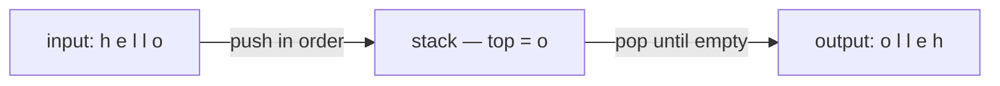

# Pattern: Reversal

## Why It Exists

You need a sequence in reverse: a string, the words in a sentence, the items in a queue. For an array you could swap from both ends inward in place — but that needs random access, and it doesn't help when you can only read elements *in order* (a stream, a queue, one-pass input).

A stack solves it without any index arithmetic. Its defining rule is **last-in, first-out** — the most recently pushed item is the first one popped. So if you push elements in order and then pop them all, they come out **in the exact reverse order**. Reversal isn't something you compute on a stack; it's what the stack *is*. Push everything, pop everything, done.

## See It Work

Reverse a string by pushing each character, then popping them all. Pick a test case below, **Run** it, then **Visualise** the stack fill up and drain.

> ▶ Run it, then click **Visualise** — characters push on in order; popping them off top-first yields the reverse.

```python run viz=array viz-root=stack viz-kind=stack
import ast

text = input()                 # the test case's text
stack = []
for ch in text:                # push every character — last char ends up on top
    stack.append(ch)
out = []
while stack:                   # pop them off: top (last pushed) comes first
    out.append(stack.pop())
print("".join(out))
```

```java run viz=array viz-root=stack viz-kind=stack
import java.util.*;

public class Main {
  public static void main(String[] args) {
    String text = new Scanner(System.in).nextLine();  // the test case's text

    List<Character> stack = new ArrayList<>();
    for (char ch : text.toCharArray()) stack.add(ch);   // push every character
    StringBuilder out = new StringBuilder();
    while (!stack.isEmpty())
      out.append(stack.remove(stack.size() - 1));        // pop top-first
    System.out.println(out);
  }
}
```

```testcases
{
  "args": [
    { "id": "text", "label": "text", "type": "string", "placeholder": "hello" }
  ],
  "cases": [
    { "args": { "text": "hello" }, "expected": "olleh" },
    { "args": { "text": "abcde" }, "expected": "edcba" },
    { "args": { "text": "racecar" }, "expected": "racecar" }
  ]
}
```

## How It Works

Two passes over a stack:

1. **Push** every element in order. After this, the *first* element is at the bottom and the *last* element is on top.
2. **Pop** until empty. Each pop returns the current top — so the last-pushed element comes out first, the first-pushed comes out last.

The output order is the input order flipped. That's a direct consequence of LIFO; there's no comparison or swapping involved.



<p align="center"><strong>push in order so the last element lands on top, then pop from the top: the pop sequence is the input reversed.</strong></p>

It costs **`O(n)` time** (each element pushed once, popped once) and **`O(n)` space** for the stack. That space is the trade-off: reversing an array *in place* with two pointers is `O(1)` space, so reach for the stack specifically when you **don't** have random access — a queue, a stream, or a structure you can only consume sequentially — or when a stack is already the data you're holding.

### Key Takeaway

A stack reverses a sequence by construction: push all, pop all, and LIFO hands you the reverse order. `O(n)` time and `O(n)` space — the right tool for sequential-only input, the wrong one when an in-place two-pointer swap would do.

## Trace It

Reversing `"hello"`:

| action | stack (bottom → top) | output |
|---|---|---|
| push `h,e,l,l,o` | `h e l l o` | — |
| pop | `h e l l` | `o` |
| pop | `h e l` | `o l` |
| pop | `h e` | `o l l` |
| pop | `h` | `o l l e` |
| pop | (empty) | `o l l e h` |

Before you read on: the two `l`s are at positions 3 and 4 of `"hello"`. In the output `"olleh"` they sit at positions 2 and 3 — but is the *original third* `l` now before or after the original fourth `l`?

The original fourth `l` (pushed later, higher on the stack) pops out *first*, so it lands earlier in the output than the third `l`. Reversal flips relative order for *every* pair, including equal-looking elements — the later-pushed always precedes the earlier-pushed in the result. With identical characters you can't see it, but if those nodes carried identity (objects, indices) the order swap would be real and observable. LIFO reverses positions, not just values.

## Your Turn

The reusable stack reversal applied to an integer array — push all elements, pop them back:

```python run viz=array viz-kind=stack
import ast

def reverse(seq):
    stack = []
    for x in seq:
        stack.append(x)       # push
    out = []
    while stack:
        out.append(stack.pop())  # pop — LIFO reverses
    return out

arr = ast.literal_eval(input())     # the test case's arr
print(reverse(arr))
```

```java run viz=array viz-kind=stack
import java.util.*;

public class Main {
  static List<Integer> reverse(int[] arr) {
    List<Integer> stack = new ArrayList<>();
    for (int x : arr) stack.add(x);                       // push
    List<Integer> out = new ArrayList<>();
    while (!stack.isEmpty())
      out.add(stack.remove(stack.size() - 1));             // pop — LIFO reverses
    return out;
  }

  public static void main(String[] args) {
    int[] arr = parseIntArray(new Scanner(System.in).nextLine());
    System.out.println(reverse(arr));
  }

  // "[1, 2, 3]" → {1, 2, 3} — reads the test case's arr
  static int[] parseIntArray(String line) {
    String inner = line.replaceAll("[\\[\\]\\s]", "");
    if (inner.isEmpty()) return new int[0];
    String[] parts = inner.split(",");
    int[] out = new int[parts.length];
    for (int i = 0; i < parts.length; i++) out[i] = Integer.parseInt(parts[i]);
    return out;
  }
}
```

```testcases
{
  "args": [
    { "id": "arr", "label": "arr", "type": "int[]", "placeholder": "[1, 2, 3, 4, 5]" }
  ],
  "cases": [
    { "args": { "arr": "[1, 2, 3, 4, 5]" }, "expected": "[5, 4, 3, 2, 1]" },
    { "args": { "arr": "[1, 2, 3, 4]" }, "expected": "[4, 3, 2, 1]" },
    { "args": { "arr": "[]" }, "expected": "[]" },
    { "args": { "arr": "[7]" }, "expected": "[7]" }
  ]
}
```

<details>
<summary>Editorial</summary>

The load-then-unload shape: push every element in order (last element lands on top), then pop until empty (top-first pop = last-in-first-out = reversed order). No comparisons, no index arithmetic — LIFO does all the work. `O(n)` time (each element pushed once, popped once), `O(n)` space for the stack.

```python solution time=O(n) space=O(n)
import ast

def reverse(seq):
    stack = []
    for x in seq:
        stack.append(x)       # push
    out = []
    while stack:
        out.append(stack.pop())  # pop — LIFO reverses
    return out

arr = ast.literal_eval(input())
print(reverse(arr))
```

```java solution
import java.util.*;

public class Main {
  static List<Integer> reverse(int[] arr) {
    List<Integer> stack = new ArrayList<>();
    for (int x : arr) stack.add(x);                       // push
    List<Integer> out = new ArrayList<>();
    while (!stack.isEmpty())
      out.add(stack.remove(stack.size() - 1));             // pop — LIFO reverses
    return out;
  }

  public static void main(String[] args) {
    int[] arr = parseIntArray(new Scanner(System.in).nextLine());
    System.out.println(reverse(arr));
  }

  static int[] parseIntArray(String line) {
    String inner = line.replaceAll("[\\[\\]\\s]", "");
    if (inner.isEmpty()) return new int[0];
    String[] parts = inner.split(",");
    int[] out = new int[parts.length];
    for (int i = 0; i < parts.length; i++) out[i] = Integer.parseInt(parts[i]);
    return out;
  }
}
```

</details>

## Reflect & Connect

Stack-reversal is the simplest stack pattern, and it clarifies *when* a stack earns its space:

- **The family** — reverse a string, an array, the words of a sentence (push whole words), or invert another stack/queue. All are "push in, pop out."
- **The space trade-off is the real decision** — for an array you own, two-pointer in-place reversal is `O(1)` space and beats this. Choose the stack when access is sequential-only (a queue, a stream), when you're already holding a stack, or when reversal is a *step* inside a larger stack algorithm.
- **It's the same idea as recursion** — the call stack reverses naturally: recurse to the end, then act on the way back up, and you process elements last-to-first. "Reverse by recursion" and "reverse with an explicit stack" are the same mechanism, one implicit and one explicit. The next patterns keep the stack but make the *pop condition* smarter.

**Prerequisites:** [What Is a Stack?](/cortex/data-structures-and-algorithms/linear-structures/stack/what-is-a-stack).
**What's next:** keep a stack, but pop based on a comparison — [Previous Closest Occurrence](/cortex/data-structures-and-algorithms/linear-structures/stack/pattern-previous-closest-occurrence/pattern).

## Recall

> **Mnemonic:** *Push all, pop all. LIFO ⇒ the pop order is the input reversed. `O(n)` time, `O(n)` space.*

| | |
|---|---|
| Push phase | every element in order → last element on top |
| Pop phase | top-first until empty → reverse order out |
| Cost | `O(n)` time, `O(n)` space (the stack) |
| Use when | sequential-only access, a stream/queue, or a step in a bigger stack algorithm |
| Don't use when | you can two-pointer an array in place (`O(1)` space) |

<details>
<summary><strong>Q:</strong> Why does popping a stack yield reverse order?</summary>

**A:** LIFO — the last element pushed is the first popped, so the pop sequence is the input flipped.

</details>
<details>
<summary><strong>Q:</strong> What's the cost, and what's the catch?</summary>

**A:** `O(n)` time and `O(n)` space; the space is wasted if an in-place two-pointer swap on an array would work.

</details>
<details>
<summary><strong>Q:</strong> When is the stack the *right* choice for reversal?</summary>

**A:** Sequential-only access (stream/queue), or when reversal is a sub-step of a larger stack algorithm.

</details>
<details>
<summary><strong>Q:</strong> How does stack reversal relate to recursion?</summary>

**A:** The call stack reverses naturally — acting on the way back up processes elements last-to-first, the same mechanism as an explicit stack.

</details>

## Sources & Verify

- **CLRS**, *Introduction to Algorithms*, 4th ed., §10.1 — stacks and the LIFO discipline.
- **Sedgewick & Wayne**, *Algorithms*, 4th ed., §1.3 — stacks; reversing with a stack and the link to recursion.
- "A stack reverses a sequence" is the defining LIFO consequence; both runnable blocks are verified by running (`olleh` and `[5,4,3,2,1]`).
