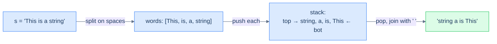

# Reverse word order

## Problem Statement

Given a string `s` containing multiple space-separated words, reverse the **order of words** without reversing the letters within each word.

## Examples

**Example 1:**
```
Input:  s = "This is a string"
Output: "string a is This"
```

**Example 2:**
```
Input:  s = "abc"
Output: "abc"
```

**Example 3:**
```
Input:  s = "hello world"
Output: "world hello"
```

```quiz
{
  "prompt": "For s = \"a b c\", what does reverse_word_order return?",
  "input": "s = \"a b c\"",
  "options": ["a b c", "c b a", "c a b", "b a c"],
  "answer": "c b a"
}
```

## Constraints

- `1 ≤ s.length ≤ 10⁴`
- `s` contains at least one word; words are separated by single spaces

```python run viz=array viz-root=stack viz-kind=stack
class Solution:
    def reverse_word_order(self, s: str) -> str:
        # Your code goes here — tokenise s into words, push each word
        # onto a stack, then pop and join with single spaces.
        return s

s = input()                          # the test case's s
print(Solution().reverse_word_order(s))
```

```java run viz=array viz-root=stack viz-kind=stack
import java.util.*;

public class Main {
    static class Solution {
        public String reverseWordOrder(String s) {
            // Your code goes here — tokenise s into words, push each word
            // onto a stack, then pop and join with single spaces.
            return s;
        }
    }

    public static void main(String[] args) {
        String s = new Scanner(System.in).nextLine();
        System.out.println(new Solution().reverseWordOrder(s));
    }
}
```

```testcases
{
  "args": [
    { "id": "s", "label": "s", "type": "string", "placeholder": "This is a string" }
  ],
  "cases": [
    { "args": { "s": "This is a string" }, "expected": "string a is This" },
    { "args": { "s": "abc" }, "expected": "abc" },
    { "args": { "s": "hello world" }, "expected": "world hello" },
    { "args": { "s": "a b c" }, "expected": "c b a" },
    { "args": { "s": "one" }, "expected": "one" },
    { "args": { "s": "x y" }, "expected": "y x" }
  ]
}
```

<details>
<summary><h2>Intuition</h2></summary>


The **structural property** that makes this a reversal problem is hidden behind a tokenisation step. The raw input is a flat character sequence, but the task reverses *words*, not characters. Once you split `"This is a string"` into the list `[This, is, a, string]`, it becomes an ordinary reverse-the-sequence problem — and a stack reverses any sequence by load-then-unload.

The **placement** of the data shifts the unit from a character to a whole word. The build step scans the string and accumulates characters into a `word` buffer; on each space it pushes the completed word onto the stack and clears the buffer, and after the scan it pushes the final word. The stack now holds `[This, is, a, string]` with `string` on top. The unload pass pops words and joins them with single spaces, so the word order flips while each word's internal letters stay exactly as they were — the letters never enter the stack individually.

What **breaks if you reach for a naive approach**? Two traps appear. First, pushing characters instead of words would reverse the letters too, producing `"gnirts a si sihT"` — wrong unit. Second, the join introduces a trailing space: appending `word + " "` after every pop leaves one space dangling at the end, so the result needs an `rstrip` (or a length trim) before returning. Forgetting that cleanup is the only real bug surface in an otherwise textbook reversal.

</details>
<details>
<summary><h2>Applying the Diagnostic Questions</h2></summary>


| Check | Answer for Reverse Word Order |
|---|---|
| **Q1.** Does the problem ask for the sequence in opposite order? | **Yes** — the order of words is reversed (the letters within each word are not). |
| **Q2.** Is the input read through one end only (or its unit coarser than an index)? | **Yes** — the reversal unit is a whole *word*, coarser than a character index. |
| **Q3.** Are two linear passes (load, unload) enough with no comparison? | **Yes** — tokenise-and-push, then pop-and-join; words are never compared. |
| **Q4.** Is `O(N)` auxiliary space acceptable? | **Yes** — the stack holds every word and the result string grows to length `N`; `O(N)` time, `O(N)` space. |

</details>
<details>
<summary><h2>Approach</h2></summary>


Same reversal pattern, **but the unit is a word, not a character**. Tokenise on spaces, push each word, pop into a result with single-space separators. The trailing-space cleanup at the end is the only fiddly part.

1. **Build the stack of words.** Scan `s` character by character into a `word` buffer; on each space, push the buffered word (if non-empty) and reset the buffer. After the scan, push the final buffered word if it is non-empty.
2. **Unload pass.** While the word stack is not empty, pop a word and append it to the result, followed by a single space.
3. **Trim the trailing space.** The append-with-space loop leaves one extra space at the end; strip it.
4. **Return the result string** — the words now appear in reversed order, each with its letters intact.



<p align="center"><strong>Reverse word order — push <em>whole words</em>, not characters; the stack reverses their order, while each word's internal letters are untouched. The unit of reversal is whatever you push.</strong></p>

</details>
<details>
<summary><h2>Solution &amp; Analysis</h2></summary>

```python solution time=O(n) space=O(n)
class Solution:
    def build_stack_of_words(self, s: str):
        stack = []
        word = ""
        for ch in s:
            if ch != " ":
                word += ch
            elif word:
                stack.append(word)
                word = ""
        if word:
            stack.append(word)
        return stack

    def reverse_word_order(self, s: str) -> str:
        stack_of_words = self.build_stack_of_words(s)
        reversed_string = ""
        while stack_of_words:
            reversed_string += stack_of_words.pop() + " "
        if reversed_string:
            reversed_string = reversed_string.rstrip()
        return reversed_string

s = input()
print(Solution().reverse_word_order(s))
```

```java solution
import java.util.*;

public class Main {
    static class Solution {
        private List<String> buildStackOfWords(String s) {
            List<String> stack = new ArrayList<>();
            StringBuilder word = new StringBuilder();
            for (char ch : s.toCharArray()) {
                if (ch != ' ') {
                    word.append(ch);
                } else if (word.length() > 0) {
                    stack.add(word.toString());
                    word.setLength(0);
                }
            }
            if (word.length() > 0) stack.add(word.toString());
            return stack;
        }

        public String reverseWordOrder(String s) {
            List<String> stackOfWords = buildStackOfWords(s);
            StringBuilder reversedString = new StringBuilder();
            while (!stackOfWords.isEmpty()) {
                reversedString.append(stackOfWords.remove(stackOfWords.size() - 1)).append(" ");
            }
            if (reversedString.length() > 0)
                reversedString.setLength(reversedString.length() - 1);
            return reversedString.toString();
        }
    }

    public static void main(String[] args) {
        String s = new Scanner(System.in).nextLine();
        System.out.println(new Solution().reverseWordOrder(s));
    }
}
```

### Dry Run

Trace Example 1 with `s = "This is a string"`.

```
Build the stack of words:
  read "This" → space → push "This"        stack: [This]
  read "is"   → space → push "is"           stack: [This, is]
  read "a"    → space → push "a"            stack: [This, is, a]
  read "string" → end → push "string"       stack: [This, is, a, string]  (top is "string")

Unload pass:
  pop "string" → result = "string "
  pop "a"      → result = "string a "
  pop "is"     → result = "string a is "
  pop "This"   → result = "string a is This "

Trim trailing space → "string a is This" ✓
```

### Complexity Analysis

| | Complexity | Reason |
|---|---|---|
| **Time** | `O(N)` | The build scan reads each of the `N` characters once; the unload pass touches each word once. |
| **Space** | `O(N)` | The word stack and the result string each hold up to `N` characters. |

### Edge Cases

| Case | What happens |
|---|---|
| Single word (`"abc"`) | One word is pushed and popped; the result is `"abc"`. |
| Two words (`"x y"`) | Push `x, y`; pop `y, x`; result `"y x"`. |
| Letters never reversed | The letters enter the buffer in order and the whole word is pushed as one unit, so internal letter order is preserved. |

</details>
<details>
<summary><h2>Key Takeaway</h2></summary>


Three lessons:

1. **A stack is a free reverser.** Push N items in, pop N items out, and the order is inverted with no extra logic — it's the LIFO contract doing the work.
2. **The unit of reversal is whatever you push.** Push characters → reverses characters. Push words → reverses word order without disturbing letters. Push entire sub-arrays → reverses chunk order. The same algorithm reshapes itself by changing what counts as one item.
3. **Reversal alone is rarely the *whole* problem.** It's almost always a sub-step inside something bigger: reverse the operator part of a string, reverse a path in a tree, reverse the order in which items get processed. Recognise reversal as a *building block*, not an answer.

</details>
