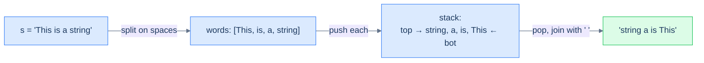

# Reverse word order

## Problem Statement

Given a string `s` containing multiple space-separated words, reverse the **order of words** without reversing the letters within each word.

## Examples

**Example 1:**
```
Input:  s = "This is a string"
Output: "string a is This"
```

**Example 2:**
```
Input:  s = "abc"
Output: "abc"
```

**Example 3:**
```
Input:  s = "hello world"
Output: "world hello"
```


---

<details>
<summary><h2>Intuition</h2></summary>


The **structural property** that makes this a reversal problem is hidden behind a tokenisation step. The raw input is a flat character sequence, but the task reverses *words*, not characters. Once you split `"This is a string"` into the list `[This, is, a, string]`, it becomes an ordinary reverse-the-sequence problem — and a stack reverses any sequence by load-then-unload.

The **placement** of the data shifts the unit from a character to a whole word. The build step scans the string and accumulates characters into a `word` buffer; on each space it pushes the completed word onto the stack and clears the buffer, and after the scan it pushes the final word. The stack now holds `[This, is, a, string]` with `string` on top. The unload pass pops words and joins them with single spaces, so the word order flips while each word's internal letters stay exactly as they were — the letters never enter the stack individually.

What **breaks if you reach for a naive approach**? Two traps appear. First, pushing characters instead of words would reverse the letters too, producing `"gnirts a si sihT"` — wrong unit. Second, the join introduces a trailing space: appending `word + " "` after every pop leaves one space dangling at the end, so the result needs an `rstrip` (or a length trim) before returning. Forgetting that cleanup is the only real bug surface in an otherwise textbook reversal.

</details>
<details>
<summary><h2>Applying the Diagnostic Questions</h2></summary>


| Check | Answer for Reverse Word Order |
|---|---|
| **Q1.** Does the problem ask for the sequence in opposite order? | **Yes** — the order of words is reversed (the letters within each word are not). |
| **Q2.** Is the input read through one end only (or its unit coarser than an index)? | **Yes** — the reversal unit is a whole *word*, coarser than a character index. |
| **Q3.** Are two linear passes (load, unload) enough with no comparison? | **Yes** — tokenise-and-push, then pop-and-join; words are never compared. |
| **Q4.** Is `O(N)` auxiliary space acceptable? | **Yes** — the stack holds every word and the result string grows to length `N`; `O(N)` time, `O(N)` space. |

</details>
<details>
<summary><h2>Approach</h2></summary>


Same reversal pattern, **but the unit is a word, not a character**. Tokenise on spaces, push each word, pop into a result with single-space separators. The trailing-space cleanup at the end is the only fiddly part.

1. **Build the stack of words.** Scan `s` character by character into a `word` buffer; on each space, push the buffered word (if non-empty) and reset the buffer. After the scan, push the final buffered word if it is non-empty.
2. **Unload pass.** While the word stack is not empty, pop a word and append it to the result, followed by a single space.
3. **Trim the trailing space.** The append-with-space loop leaves one extra space at the end; strip it.
4. **Return the result string** — the words now appear in reversed order, each with its letters intact.



<p align="center"><strong>Reverse word order — push <em>whole words</em>, not characters; the stack reverses their order, while each word's internal letters are untouched. The unit of reversal is whatever you push.</strong></p>

</details>
<details>
<summary><h2>Solution</h2></summary>


```python run viz=array viz-root=stack viz-kind=stack
from typing import List

class Solution:
    def build_stack_of_words(self, s: str) -> List[str]:

        # Create a stack to store words
        stack: List[str] = []

        # Variable to store each word
        word = ""

        # Iterate through each character in the input string
        for ch in s:

            # If the character is not a space, add it to the word
            if ch != " ":
                word += ch

            # If a space is encountered and the word is not empty
            # Push the word onto the stack
            elif word:
                stack.append(word)

                # Reset the word
                word = ""

        # Push the last word onto the stack if it's not empty
        if word:
            stack.append(word)

        return stack

    def reverse_word_order(self, s: str) -> str:
        stack_of_words = self.build_stack_of_words(s)

        # Variable to store the reversed string
        reversed_string = ""

        # Pop words from the stack and append them to the reversed_string
        while stack_of_words:
            reversed_string += stack_of_words.pop() + " "

        # Remove the trailing space at the end
        if reversed_string:
            reversed_string = reversed_string.rstrip()

        # Return the reversed string without reversing the words
        return reversed_string


# Examples from the problem statement
print(Solution().reverse_word_order("This is a string"))   # string a is This
print(Solution().reverse_word_order("abc"))                # abc

# Edge cases
print(Solution().reverse_word_order(""))                   # "" — empty string
print(Solution().reverse_word_order("hello world"))        # world hello
print(Solution().reverse_word_order("a b c"))              # c b a
print(Solution().reverse_word_order("one"))                # one — single word
print(Solution().reverse_word_order("x y"))                # y x — two words
```

```java run viz=array viz-root=stack viz-kind=stack
import java.util.*;

public class Main {
    static class Solution {
        private Stack<String> buildStackOfWords(String s) {

            // Create a stack to store words
            Stack<String> stack = new Stack<>();

            // Variable to store each word
            StringBuilder word = new StringBuilder();

            // Iterate through each character in the input string
            for (char ch : s.toCharArray()) {

                // If the character is not a space, add it to the word
                if (ch != ' ') {
                    word.append(ch);
                }

                // If a space is encountered and the word is not empty
                // Push the word onto the stack
                else if (word.length() > 0) {
                    stack.push(word.toString());

                    // Reset the word
                    word.setLength(0);
                }
            }

            // Push the last word onto the stack if it's not empty
            if (word.length() > 0) {
                stack.push(word.toString());
            }

            return stack;
        }

        public String reverseWordOrder(String s) {
            Stack<String> stackOfWords = buildStackOfWords(s);

            // Variable to store the reversed string
            StringBuilder reversedString = new StringBuilder();

            // Pop words from the stack and append them to the reversedString
            while (!stackOfWords.isEmpty()) {
                reversedString.append(stackOfWords.pop()).append(" ");
            }

            // Remove the trailing space at the end
            if (reversedString.length() > 0) {
                reversedString.setLength(reversedString.length() - 1);
            }

            // Return the reversed string without reversing the words
            return reversedString.toString();
        }
    }

    public static void main(String[] args) {
        // Examples from the problem statement
        System.out.println(new Solution().reverseWordOrder("This is a string"));  // string a is This
        System.out.println(new Solution().reverseWordOrder("abc"));               // abc

        // Edge cases
        System.out.println(new Solution().reverseWordOrder(""));                  // ""
        System.out.println(new Solution().reverseWordOrder("hello world"));       // world hello
        System.out.println(new Solution().reverseWordOrder("a b c"));             // c b a
        System.out.println(new Solution().reverseWordOrder("one"));               // one
        System.out.println(new Solution().reverseWordOrder("x y"));               // y x
    }
}
```

### Dry Run

Trace Example 1 with `s = "This is a string"`.

```
Build the stack of words (scan into a buffer, push on each space):
  read "This" → space → push "This"        stack: This
  read "is"   → space → push "is"           stack: This is
  read "a"    → space → push "a"            stack: This is a
  read "string" → end → push "string"       stack: This is a string   (top is "string")

Unload pass (pop + append + single space):
  pop "string" → result = "string "
  pop "a"      → result = "string a "
  pop "is"     → result = "string a is "
  pop "This"   → result = "string a is This "

Trim trailing space → "string a is This" ✓
```

Each word is pushed whole, so the stack reverses word order while every word's letters stay in place. The unload loop appends a space after each word, leaving one trailing space that the final trim removes.

### Complexity Analysis

| | Complexity | Reason |
|---|---|---|
| **Time** | `O(N)` | The build scan reads each of the `N` characters once; the unload pass touches each word once. Both are linear in the input length. |
| **Space** | `O(N)` | The word stack and the result string each hold up to `N` characters' worth of data. |

### Edge Cases

| Case | What happens |
|---|---|
| Empty string (`""`) | No word is ever buffered; nothing is pushed; the trim guard sees an empty result and returns `""`. |
| Single word (`"abc"`) | One word is pushed and popped; the result is `"abc"` (its own reverse at the word level). |
| Two words (`"x y"`) | Push `x, y`; pop `y, x`; result `"y x"`. |
| Spaces between words only | The build step pushes a word only when the buffer is non-empty, so single internal spaces tokenise cleanly into words. |
| Trailing/leading space handling | A space with an empty buffer pushes nothing; the final `rstrip` removes the one trailing separator the join adds. |
| Letters never reversed | The letters enter the buffer in order and the whole word is pushed as one unit, so internal letter order is preserved. |

</details>
<details>
<summary><h2>Key Takeaway</h2></summary>


Three lessons:

1. **A stack is a free reverser.** Push N items in, pop N items out, and the order is inverted with no extra logic — it's the LIFO contract doing the work.
2. **The unit of reversal is whatever you push.** Push characters → reverses characters. Push words → reverses word order without disturbing letters. Push entire sub-arrays → reverses chunk order. The same algorithm reshapes itself by changing what counts as one item.
3. **Reversal alone is rarely the *whole* problem.** It's almost always a sub-step inside something bigger: reverse the operator part of a string, reverse a path in a tree, reverse the order in which items get processed. Recognise reversal as a *building block*, not an answer.

> *Coming up — the reversal pattern was the gentlest stack pattern. The next four progressively get harder by combining "remember the most recent thing not yet resolved" with one or two extra constraints. Lesson 8 — **previous closest occurrence** — uses a stack to find, for each element, the nearest earlier element that satisfies some condition (e.g. the previous greater element). It's the canonical "monotonic stack" problem and powers stock-span calculations, histogram problems, and a hundred interview questions.*

</details>
<details>
<summary><h2>Key Takeaway</h2></summary>


This is the word-unit instance of the pattern: tokenise first, then reverse the *words* with the same load-then-unload loop. The two new ideas versus the earlier problems are that the reversal unit is coarser than a character and the join needs a trailing-space trim.

</details>